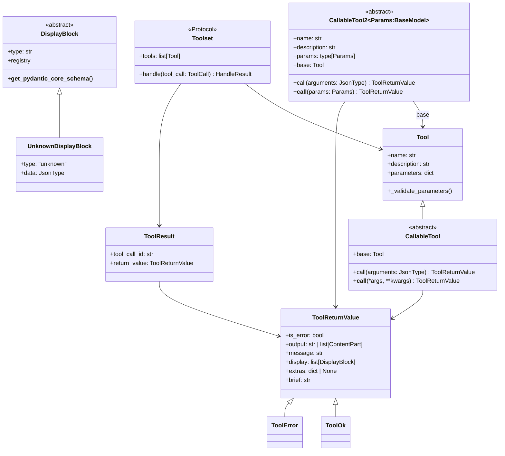
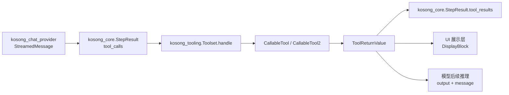
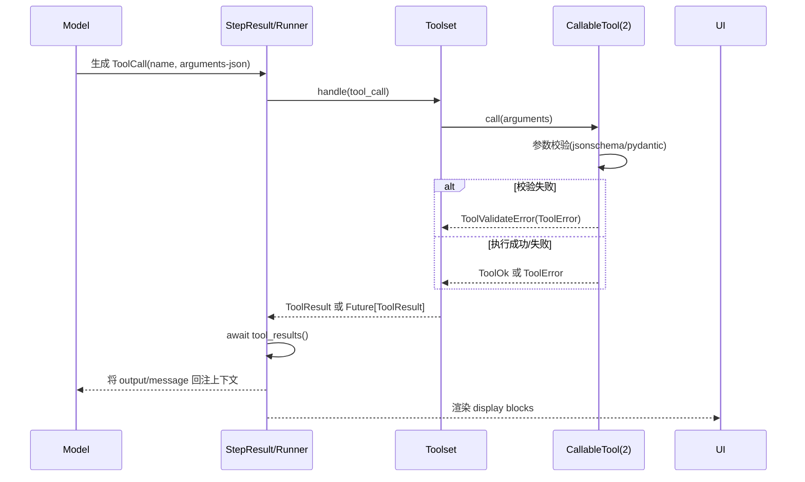

# kosong_tooling 模块文档

## 概述

`kosong_tooling` 是 Kosong 生态中“工具调用（tool calling）能力”的核心抽象层。它的职责不是执行某个具体工具（例如文件读写、Shell 或 Web 检索），而是定义一套统一的数据模型、参数校验机制、结果回传格式，以及工具集合的运行时协议，让上层代理/引擎可以稳定地把模型输出的 `ToolCall` 转换为真实执行动作。

从系统设计角度看，这个模块解决了三个关键问题。第一，模型生成的参数是 JSON 字符串且不可靠，必须经过严格验证；第二，不同工具实现风格不同（动态参数 vs 强类型参数），需要统一抽象；第三，工具结果既要反馈给模型（继续推理），又要反馈给用户界面（可视化展示），两条通路必须同时支持。`kosong_tooling` 通过 `Tool`/`CallableTool`/`CallableTool2`/`ToolReturnValue`/`DisplayBlock`/`Toolset` 这组类型完成了这一层“协议标准化”。

在整体系统中，它与 `kosong_core`（尤其是 `StepResult` 中的 `tool_calls` 与 `tool_results`）、`kosong_chat_provider`（模型流式输出工具调用）、以及上层具体工具模块（如 `tools_file`、`tools_shell` 等）形成衔接关系。你可以把它理解为工具生态的“中间层契约”。

---

## 模块定位与设计目标

`kosong_tooling` 的目标不是“功能多”，而是“边界清晰、错误可控、可扩展”。模块内部几乎不包含业务逻辑，核心是协议与校验：

- 使用 JSON Schema/Pydantic 做输入约束，尽量把不确定性前置到验证阶段。
- 通过 `ToolReturnValue` 强制统一输出结构，避免工具返回任意对象导致调度器崩溃。
- 用 `DisplayBlock` 把“给模型看的输出”与“给用户看的显示”分离，保证人机双通道可演进。
- 用 `Toolset` `Protocol` 规定并发与异常语义：`handle` 不能阻塞，不应抛异常（除 `CancelledError`），而应返回错误型结果。

这种设计使上层引擎可在不关心具体工具实现细节的前提下，实现稳定的工具调用循环。

---

## 核心架构



这张图展示了两层抽象。第一层是**工具定义与调用**（`Tool` + `CallableTool`/`CallableTool2`）；第二层是**结果协议**（`ToolReturnValue` + `DisplayBlock` + `ToolResult`）。`Toolset` 作为运行时调度接口连接两层，并与上游 `ToolCall` 事件对接。

---

## 与系统其他模块的关系



在一次 agent step 中，模型先产生 `ToolCall`，`Toolset.handle` 接住调用并转发到具体工具，返回 `ToolReturnValue`（或 `Future[ToolResult]`）。随后 `StepResult.tool_results()` 统一等待并收集结果；结果中的 `output/message` 会进入模型上下文，`display` 则进入前端/终端展示链路。

可参考：

- `kosong_core.md`：`StepResult` 如何管理 `tool_calls` 与并发 future。
- `kosong_chat_provider.md`：`StreamedMessage` 如何在流中产生工具调用片段。

---

## 组件详解

## `Tool`

`Tool` 是一个 Pydantic 模型，表示“可被模型识别的工具声明”。它包含 `name`、`description`、`parameters` 三个字段，其中 `parameters` 必须是合法 JSON Schema。通过 `@model_validator(mode="after")`，构造时就会用 `jsonschema.Draft202012Validator.META_SCHEMA` 校验 schema 本身是否合法。

这意味着工具参数 schema 错误会在**注册阶段**暴露，而不是在运行时才失败。这是一个非常重要的稳定性设计：错误尽量提前。

## `CallableTool`

`CallableTool` 适合“参数结构动态/不想引入强类型 Params 模型”的场景。它继承 `Tool` 并增加可执行能力：

- `call(arguments: JsonType)`：统一入口。
- `__call__(*args, **kwargs)`：子类实现真实逻辑。

`call` 的内部行为有三步：先用 `self.parameters` 校验 `arguments`；再按参数类型做调用分发（`list` -> 位置参数，`dict` -> 关键字参数，其他 -> 单参数）；最后兜底验证返回值类型，如果不是 `ToolReturnValue` 就自动转换为 `ToolError`。

因此，即使工具作者实现失误返回了普通 `dict`，系统也不会直接崩，而是返回结构化错误。

## `CallableTool2[Params]`

`CallableTool2` 是更推荐的现代接口，适合长期维护和复杂工具。它采用“强类型参数模型”：

- `params` 必须是 `pydantic.BaseModel` 子类。
- `call(arguments)` 内部使用 `params.model_validate(arguments)` 做参数反序列化。
- 子类只实现 `__call__(params: Params)`，逻辑更清晰。

构造时，`CallableTool2` 会自动生成 `base: Tool`：

1. 从 `params.model_json_schema()` 生成 schema；
2. 使用 `_GenerateJsonSchemaNoTitles` 去掉标题噪音；
3. 使用 `deref_json_schema()` 展开本地 `$ref` 并删除 `$defs/definitions`。

这样导出的 `Tool.parameters` 更扁平，便于直接暴露给 LLM API（部分模型对深层 `$ref` 支持并不稳定）。

## `_GenerateJsonSchemaNoTitles`

这是对 Pydantic `GenerateJsonSchema` 的小型定制：

- `field_title_should_be_set -> False`
- `_update_class_schema` 后移除顶层 `title`

目的很务实：减少 schema token 体积和无用字段，避免模型看到过多自然语言标题造成歧义。

## `DisplayBlock` 与 `UnknownDisplayBlock`

`DisplayBlock` 是给用户界面的内容块抽象，与 `ContentPart` 类似但用途不同：`ContentPart` 面向模型上下文，`DisplayBlock` 面向人类 UI 呈现。该类通过 `__init_subclass__` 自动注册子类（按 `type` 字段），并在 Pydantic 验证时根据 `type` 做动态派发。

当收到未知 `type` 时，框架不会报错中断，而是降级为 `UnknownDisplayBlock(type=<原始类型>, data=<其余字段>)`。这是前后端版本不一致时非常关键的兼容策略。

## `ToolReturnValue` / `ToolOk` / `ToolError`

`ToolReturnValue` 统一了所有工具调用结果，字段语义如下：

- `is_error`：是否失败。
- `output`：给模型的输出，可是字符串或 `ContentPart` 列表。
- `message`：给模型的解释性文本。
- `display`：给用户展示的 `DisplayBlock` 列表。
- `extras`：调试/测试扩展字段。

`brief` 属性会提取第一个 `BriefDisplayBlock` 文本，便于 CLI 简洁展示。

`ToolOk` 和 `ToolError` 是两个便捷子类，自动填充 `is_error` 与简要展示块，降低工具实现样板代码。

## `Toolset`（核心协议）

`Toolset` 是 `Protocol`，定义了工具管理器的最小能力：

- `tools`：当前注册工具的声明列表（供模型看到）
- `handle(tool_call)`：处理一次调用，返回 `ToolResult` 或 `Future[ToolResult]`

文档注释明确了关键运行时约束：`handle` 不能阻塞；不应抛出异常（除取消）；所有错误应转换成 `ToolReturnValue(is_error=True)` 返回。这直接关系到流式推理循环是否会卡死。

## `ToolResult` / `ToolResultFuture` / `HandleResult`

`ToolResult` 绑定 `tool_call_id` 与对应 `return_value`。`HandleResult` 是联合类型，允许同步完成或异步 future。这个设计允许不同工具策略：轻量工具可立刻返回，重型工具可异步执行后回填。

---

## 调用流程（端到端）



这个流程里最重要的是“失败也是结果”。调用失败、参数非法、返回值类型错误都应被包装为 `ToolError`，而不是抛异常打断主循环。

---

## 典型用法

## 用 `CallableTool2` 定义强类型工具（推荐）

```python
from pydantic import BaseModel, Field
from kosong.tooling import CallableTool2, ToolOk, ToolError, ToolReturnValue

class AddParams(BaseModel):
    a: int = Field(ge=0)
    b: int = Field(ge=0)

class AddTool(CallableTool2[AddParams]):
    name = "add"
    description = "Add two non-negative integers"
    params = AddParams

    async def __call__(self, params: AddParams) -> ToolReturnValue:
        try:
            result = params.a + params.b
            return ToolOk(output=str(result), message="done", brief=f"结果: {result}")
        except Exception as e:
            return ToolError(message=str(e), brief="计算失败")
```

该工具会自动导出 `base: Tool`，可直接放入 `Toolset.tools` 给模型使用。

## 用 `CallableTool` 定义动态参数工具

```python
from kosong.tooling import CallableTool, ToolOk

class EchoTool(CallableTool):
    name = "echo"
    description = "Echo input"
    parameters = {
        "type": "object",
        "properties": {"text": {"type": "string"}},
        "required": ["text"],
        "additionalProperties": False,
    }

    async def __call__(self, **kwargs):
        return ToolOk(output=kwargs["text"], brief=kwargs["text"])
```

这个方式灵活但类型安全较弱，适合原型或简单场景。

---

## 扩展与定制

## 自定义 `DisplayBlock`

你可以直接继承 `DisplayBlock`，只要声明静态 `type: str`，就会被自动注册并参与反序列化。

```python
from kosong.tooling import DisplayBlock

class TableDisplayBlock(DisplayBlock):
    type = "table"
    headers: list[str]
    rows: list[list[str]]
```

当 UI 端尚未支持 `table` 类型时，老版本仍可通过 `UnknownDisplayBlock` 保留原始数据，避免信息丢失。

## 定制 Toolset

实现 `Toolset` 时建议把“工具查找、参数解析、异常包装、future 生命周期管理”都放在一层，确保上游 `StepResult.tool_results()` 可稳定 await。可参考 `kosong_core.md` 中的结果回收机制设计。

---

## 错误处理、边界条件与限制

`kosong_tooling` 的错误模型相对严格，但有几个容易踩坑的点。

第一，`CallableTool.call` 支持 list/dict/单值三种参数分发，而 `CallableTool2.call` 语义上要求对象型参数（由 Pydantic 决定是否接受其他输入）。如果模型输出了数组参数，`CallableTool2` 往往会校验失败并返回 `ToolValidateError`。

第二，`Toolset.handle` 的“禁止阻塞”不是建议而是契约。若在 `handle` 内直接执行长耗时同步 I/O，会拖慢或阻塞流式消息消费，造成 UI 卡顿甚至推理中断。

第三，`ToolReturnValue.output` 同时支持 `str` 与 `list[ContentPart]`，但工具作者必须确认下游模型/provider 是否支持复杂 `ContentPart`。若只需文本反馈，优先使用字符串可减少兼容性问题。

第四，`DisplayBlock` 依赖 `type` 字段做动态分发，若子类忘记设置字符串 `type`，类定义阶段就会抛错；这属于“早失败”机制。

第五，`CallableTool2` 为了展开 `$ref` 会调用 `deref_json_schema`。该函数只展开本地引用（`#...`），远程引用不会处理；如果参数 schema 依赖外部 URL `$ref`，导出结果可能不完整。

第六，框架会校验返回值是否为 `ToolReturnValue`，但不会校验你填入的业务语义是否合理（例如 `is_error=False` 却给出失败文案）。语义一致性仍由工具实现者保证。

---

## 实践建议

在生产代码中，优先选择 `CallableTool2` 并为参数模型写清字段约束（`min_length`、`pattern`、`ge/le`、`Literal` 等），把输入不确定性尽量收敛在验证层。其次，为所有异常路径返回 `ToolError`，并提供可读 `brief`，这样 CLI/UI 能更好展示失败原因。最后，只有在确有需求时才使用复杂 `DisplayBlock` 与 `ContentPart` 输出，避免引入不必要的前后端耦合。

如果你正在实现完整工具生态（注册、调度、并发回收），建议结合阅读：

- [kosong_core.md](kosong_core.md)
- [kosong_chat_provider.md](kosong_chat_provider.md)
- [tools_file.md](tools_file.md)
- [tools_shell.md](tools_shell.md)

这些模块分别覆盖执行循环、模型流式协议和具体工具实现，可与本模块形成完整认知闭环。
