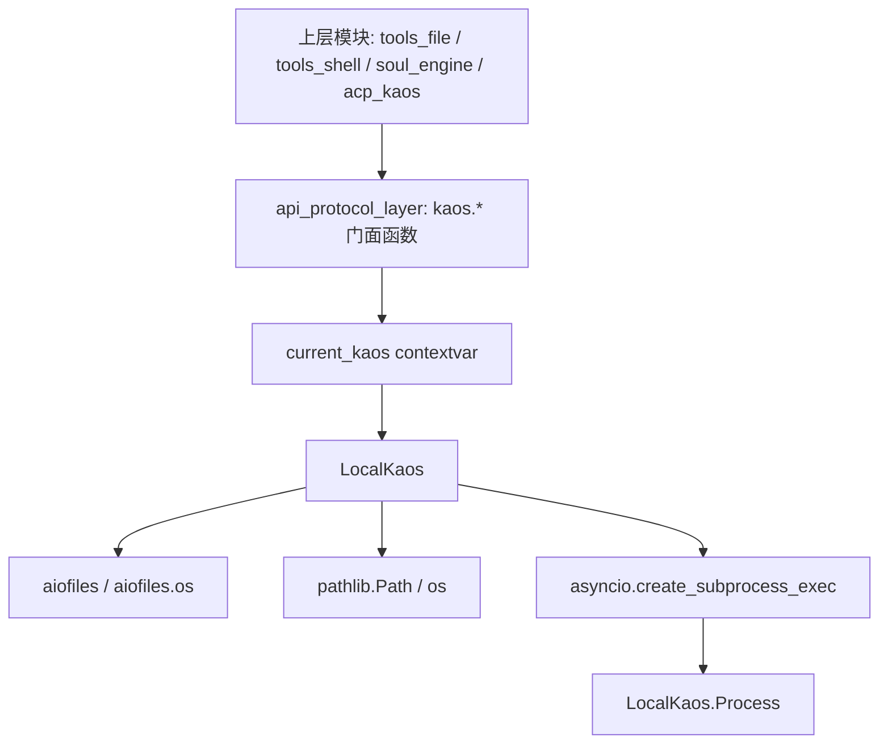
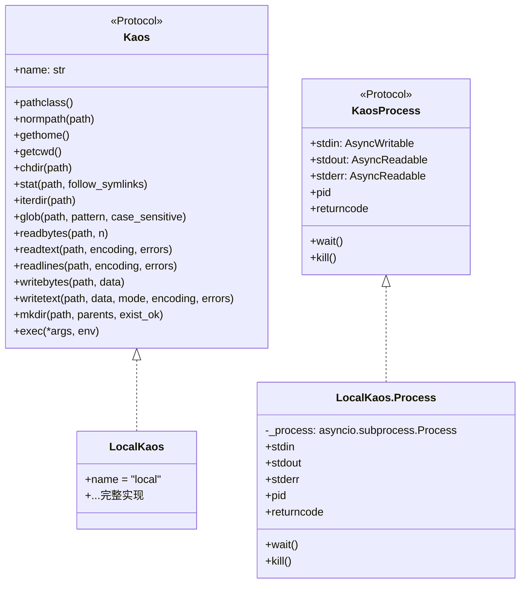
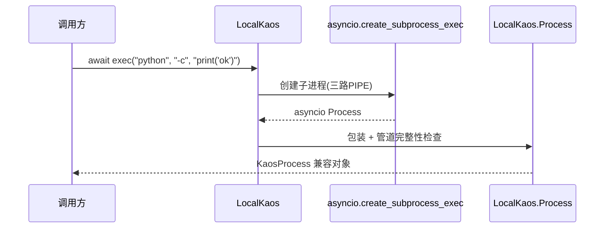
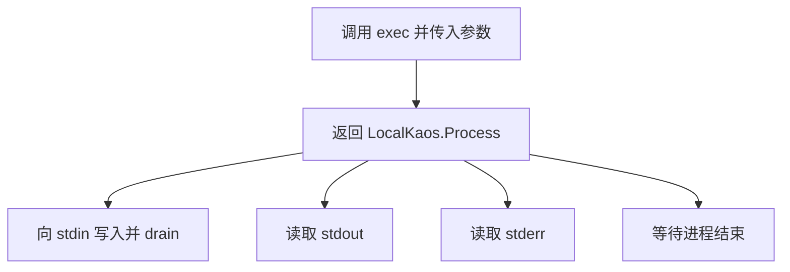

# local_backend 模块文档

## 模块简介：`local_backend` 是什么，为什么存在

`local_backend` 对应 `packages/kaos/src/kaos/local.py`，核心是 `LocalKaos` 及其进程包装器 `LocalKaos.Process`（在组件索引中可能记作 `packages.kaos.src.kaos.local.Process`）。这个模块的职责是把 KAOS 协议层定义的统一能力，直接映射到**当前机器**的文件系统和进程执行环境。换句话说，它不是一个“额外的文件工具库”，而是 KAOS 抽象在本地运行面上的标准实现。

这个模块存在的根本原因，是为了让上层代码以统一接口工作，而不必关心自己操作的是本地还是远程环境。上层只需调用 `kaos.readtext()`、`kaos.exec()` 这一类协议入口，底层则由当前绑定的后端实例决定具体执行路径。`local_backend` 提供了最常见、最直接的执行路径，也通常是默认路径（`local_kaos = LocalKaos()`）。

从设计理念上看，`local_backend` 追求的是“薄实现、强一致”。它尽量不引入复杂策略，仅将 `Kaos` 协议逐项落地，并把平台差异（Windows/POSIX）、异步 I/O 细节、子进程流处理封装在后端内部，保证调用方看到的是稳定语义。

---

## 在系统中的位置与协作关系

`local_backend` 位于 `kaos_core` 的后端实现层，向上服务 `api_protocol_layer` 的门面分发，向下依赖 `aiofiles`、`asyncio.subprocess`、`pathlib/os` 完成实际系统调用。



这意味着 `local_backend` 本身并不负责“选择后端”，它只负责“当被选择时如何正确执行”。后端切换机制、协议约束和统一 API 入口请参考 [kaos_protocols.md](kaos_protocols.md) 与 [kaos_core.md](kaos_core.md)。如果你需要理解远程等价实现，可对照 [ssh_kaos.md](ssh_kaos.md)。

---

## 核心组件总览

`local_backend` 的公开核心能力集中在一个类与一个默认实例：

- `LocalKaos`：本地后端实现，结构化匹配 `Kaos` 协议。
- `LocalKaos.Process`：`asyncio.subprocess.Process` 的协议适配包装器。
- `local_kaos`：模块级默认实例。



---

## `LocalKaos` 详解

### 1) 标识与路径 flavor

`LocalKaos.name` 固定为 `"local"`，用于日志、调试和跨后端行为识别。`pathclass()` 根据平台返回不同 `PurePath` 类型：Windows 返回 `PureWindowsPath`，其他系统返回 `PurePosixPath`。这使 `KaosPath` 在不同平台上保持与底层一致的路径语义。

`normpath(path)` 通过 `ntpath.normpath` 或 `posixpath.normpath` 做纯字符串级归一化，然后封装为 `KaosPath` 返回。它不会访问文件系统，也不会解析符号链接；主要用于消除冗余分隔符与 `.`/`..` 片段。

### 2) 工作目录与 home

`gethome()` 与 `getcwd()` 分别读取 `Path.home()`、`Path.cwd()`，再用 `KaosPath.unsafe_from_local_path()` 封装为 `KaosPath`。这些方法是 `KaosPath.home()/cwd()` 的底层支撑。

`chdir(path)` 接口是异步的，但内部调用同步 `os.chdir()`。这有一个容易被忽略的性质：它修改的是**进程级全局状态**。如果同一进程内多个协程并发调用 `chdir`，会互相影响相对路径解析结果。对于并发工具执行场景，优先使用绝对路径，或把任务隔离到独立进程。

### 3) 文件元信息与目录操作

`stat(path, follow_symlinks=True)` 使用 `aiofiles.os.stat`，并将结果映射到统一 `StatResult`。其中 `st_ctime` 做了平台差异处理：

- 非 Windows：使用 `st.st_ctime`
- Windows：使用 `st.st_birthtime`

这个处理提升了跨平台可用性，但不应误解为“跨平台严格等价创建时间”。在 Unix 语义里，`ctime` 通常表示 inode 元数据变更时间。

`iterdir(path)` 基于 `aiofiles.os.listdir`，先获得目录项列表，再逐项 `yield` 成 `KaosPath`。`glob(path, pattern, case_sensitive=True)` 通过 `asyncio.to_thread` 调用 `Path.glob()`，避免阻塞事件循环，然后把匹配结果转为 `KaosPath` 异步产出。

这里有一个共同点：二者都不是严格流式目录扫描，都会先在内存中形成结果列表，再迭代输出。大目录场景下会体现为“首包延迟 + 内存峰值偏高”。

### 4) 文件读写方法

`readbytes(path, n=None)` 以二进制方式读取文件。`n=None` 时读取全量，否则读取前 `n` 字节。`readtext(path, encoding='utf-8', errors='strict')` 读取完整文本；`readlines(...)` 以异步生成器逐行返回。

`writebytes(path, data)` 与 `writetext(path, data, mode='w'|'a', ...)` 分别处理二进制与文本写入，返回值是底层 `write()` 写入长度（字节或字符，取决于模式）。这两个接口不会自动创建父目录，缺失父目录会抛 `FileNotFoundError`。

### 5) 目录创建

`mkdir(path, parents=False, exist_ok=False)` 通过 `asyncio.to_thread(local_path.mkdir, ...)` 执行，行为与标准库 `Path.mkdir` 一致：

- `parents=False` 且父级不存在会失败。
- `exist_ok=False` 且目标已存在会抛 `FileExistsError`。

### 6) 子进程执行

`exec(*args, env=None)` 是本模块最关键能力之一。它要求 `args` 至少包含一个元素（可执行文件），否则抛 `ValueError`。内部调用：

```python
await asyncio.create_subprocess_exec(
    *args,
    stdin=asyncio.subprocess.PIPE,
    stdout=asyncio.subprocess.PIPE,
    stderr=asyncio.subprocess.PIPE,
    env=env,
)
```

然后将 `asyncio` 原生进程对象包装为 `LocalKaos.Process` 返回。

这里要强调两点语义：第一，它是 **exec argv 语义**，不是 shell 语义，不会解释管道、重定向、通配符扩展。第二，`env` 直接透传子进程创建逻辑；传 `None` 表示继承父环境，传入映射则由调用方自行确保需要的变量（如 `PATH`）存在。

---

## `LocalKaos.Process` 详解

`LocalKaos.Process` 是 `KaosProcess` 协议的本地适配器，底层持有一个 `asyncio.subprocess.Process`。

初始化时它强制校验 `stdin/stdout/stderr` 全部存在；如果创建时没有管道会抛 `ValueError`。由于 `LocalKaos.exec()` 已固定三路 `PIPE`，正常路径下这个检查用于保障契约，不会频繁触发。



属性与方法行为很直接：

- `pid`：返回底层 PID。
- `returncode`：未结束为 `None`，结束后为退出码。
- `wait()`：等待进程结束并返回退出码。
- `kill()`：调用底层 `kill()` 终止进程。

在上层实践中，通常应并行消费 `stdout/stderr`，避免某一路缓冲阻塞影响进程退出时机。

---

## 关键流程说明

### 流程 A：文本读取


这个流程体现了本模块的典型模式：输入先统一到本地路径对象，再以异步 I/O 形式执行实际读操作。

### 流程 B：执行命令并交互



该流程保证调用方始终可获得标准输入输出三路异步流，适合构建 shell 工具、交互式命令包装和日志收集。

---

## 使用示例

### 示例 1：基础文件读写

```python
from kaos.local import local_kaos

async def basic_io():
    await local_kaos.writetext("demo.txt", "hello\n")
    text = await local_kaos.readtext("demo.txt")
    return text
```

### 示例 2：逐行读取大文件

```python
async def stream_lines(path: str):
    async for line in local_kaos.readlines(path, errors="replace"):
        print(line.rstrip())
```

### 示例 3：执行子进程并读取输出

```python
proc = await local_kaos.exec("python", "-c", "print('ok')")
out = await proc.stdout.read()
err = await proc.stderr.read()
code = await proc.wait()
print(code, out.decode(), err.decode())
```

### 示例 4：向子进程输入并结束 stdin

```python
proc = await local_kaos.exec("python", "-c", "print(input())")
proc.stdin.write(b"ping\n")
await proc.stdin.drain()
if proc.stdin.can_write_eof():
    proc.stdin.write_eof()
print((await proc.stdout.read()).decode())
await proc.wait()
```

---

## 配置与可扩展性

`LocalKaos` 本身没有构造参数，属于零配置实现。可调行为主要来自方法参数，包括编码策略、错误处理策略、`mkdir` 语义、`glob` 匹配大小写、以及 `exec` 的环境变量映射。

如果你计划扩展本模块，建议遵循“协议不变、行为对齐”的原则。典型扩展方向包括：

- 为 `exec` 提供调用层超时与取消包装（优先放调用层而非破坏协议）。
- 增加审计日志（记录路径访问与命令执行）。
- 在写操作前加沙箱路径校验（限制目录边界）。

扩展后应与 `SSHKaos` 做契约对照测试，避免后端切换时出现不可预期行为差异。

---

## 边界条件、错误行为与已知限制

`local_backend` 的复杂度不高，但有几个在生产中非常关键的边界：

首先，`chdir` 是进程级全局副作用，不适合在共享事件循环中被并发任务随意调用。并发场景建议避免依赖全局 cwd。

其次，`exec` 不是 shell 执行。像 `"echo a | grep a"` 这样的字符串不会自动解析为管道命令。如确需 shell，请显式执行 `bash -lc` 并自行承担注入风险控制。

第三，`iterdir`/`glob` 先聚合再迭代。面对超大目录时，可能出现延迟和内存开销上升。

第四，文本读写默认 `utf-8` + `strict`。处理未知编码文件时，如果不指定 `errors='replace'` 或正确编码，可能触发 `UnicodeDecodeError`。

第五，`KaosPath.unsafe_to_local_path()` 与 `unsafe_from_local_path()` 带有强前提：仅在确认当前语义是本地后端时安全。将远程语义路径误当本地路径使用，可能导致行为错误甚至安全边界误判。

第六，`glob(..., case_sensitive=...)` 依赖运行时 Python 对 `Path.glob` 参数支持；跨版本部署时需通过测试确认兼容性。

---

## 与相关文档的阅读关系

为了避免重复，建议按以下顺序阅读：先看 [kaos_core.md](kaos_core.md) 理解 KAOS 总体架构，再看 [kaos_protocols.md](kaos_protocols.md) 理解契约与分发，最后结合本文掌握本地实现细节。若需要后端行为对照，请继续阅读 [ssh_kaos.md](ssh_kaos.md)。
