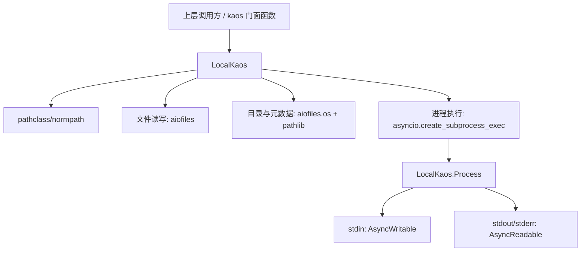
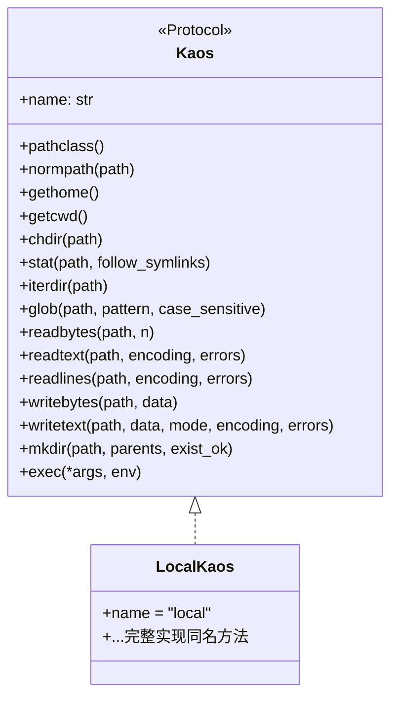
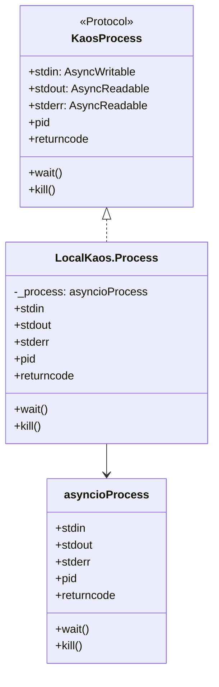
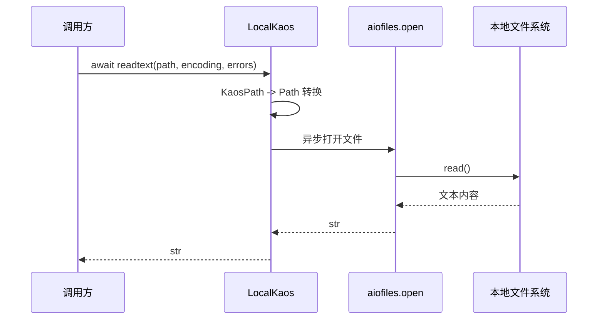
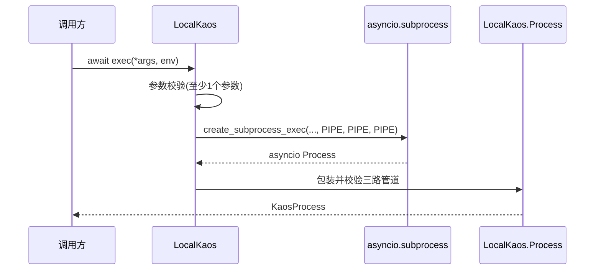

# local_kaos 模块文档

## 1. 模块定位：为什么需要 `local_kaos`

`local_kaos` 是 KAOS（Kimi Agent Operating System）体系里的“本地执行后端”。它把统一的 `Kaos` 协议落地到当前 Python 进程所在机器，提供异步文件系统操作、目录遍历、路径规范化、以及子进程执行能力。对上层调用者来说（例如文件工具、shell 工具、agent 执行链路），它的意义并不是“又封装了一层 `pathlib`”，而是保证调用路径在本地与远程（SSH）之间可以无缝切换，而业务代码几乎不需要改动。

从设计上看，`local_kaos` 的存在是为了和协议层解耦。协议层（见 [kaos_protocols.md](kaos_protocols.md)）定义“应该有什么能力”，而 `LocalKaos` 负责“这些能力在本机如何实现”。这样可以把跨后端的一致性约束放在协议层，把性能、平台差异、I/O 细节放在实现层，最终形成可扩展的后端架构（本地/SSH/未来其他后端）。

在整个 `kaos_core`（见 [kaos_core.md](kaos_core.md)）中，`local_kaos` 通常也是默认后端：`local_kaos = LocalKaos()`。这意味着如果调用方没有显式切换到其他后端，绝大多数操作会落到当前机器文件系统与进程环境上。

---

## 2. 架构总览与组件关系

`local_kaos` 的核心非常集中：一个 `LocalKaos` 类 + 一个进程包装器 `LocalKaos.Process`，以及模块级默认实例 `local_kaos`。它通过 `aiofiles` 提供异步文件 I/O，通过 `asyncio.create_subprocess_exec` 提供异步进程执行，通过 `pathlib` 与 `os` 处理路径和工作目录。



这个结构体现了一个关键原则：`LocalKaos` 方法直接对齐 `Kaos` 协议，不增加额外业务语义。也就是说，它是一个“薄实现层（thin backend）”，重点在一致性与可预期行为，而不是复杂策略逻辑。

---

## 3. 与 KAOS 协议层的契约关系

`LocalKaos` 没有显式继承 `Kaos`，但通过“结构化类型（Protocol）”完成契约匹配。代码里 `TYPE_CHECKING` 的 `type_check` 函数就是静态类型层面的保障：如果 `LocalKaos` 缺少协议方法，类型检查器会报错。



这层关系很重要，因为它直接决定了 `kaos.__init__` 中那些模块级函数（如 `kaos.readtext()`）能否在不关心后端类型的前提下稳定运行。

---

## 4. 核心组件详解

## 4.1 `LocalKaos`

`LocalKaos` 是对本地 OS 能力的异步适配器。它的 `name` 固定为 `"local"`，上层可用此字段做日志、调试与能力分支判断。类的大多数方法都支持 `StrOrKaosPath`（`str` 或 `KaosPath`）作为输入，并在内部将 `KaosPath` 转回 `Path` 来执行真实系统调用。

### 4.1.1 路径与环境方法

`pathclass()` 返回当前平台对应的 `PurePath` 类型：Windows 返回 `PureWindowsPath`，其他系统返回 `PurePosixPath`。这件事看起来细小，但它保证了 `KaosPath` 的语义与底层平台一致，避免 Windows 上路径分隔符和驱动器语义错乱。

`normpath(path)` 使用 `ntpath.normpath` 或 `posixpath.normpath` 做平台化归一化，返回 `KaosPath`。它会消除冗余分隔符和 `.`、`..` 片段（按 `normpath` 规则），但不会访问文件系统，也不会解析符号链接。

`gethome()` 与 `getcwd()` 分别从 `Path.home()` 和 `Path.cwd()` 读取，再通过 `KaosPath.unsafe_from_local_path()` 包装为 `KaosPath`。注意这里使用了 `unsafe_*` 命名，强调这是“仅在确定后端是本地时安全”的转换。

`chdir(path)` 是异步签名但内部调用同步 `os.chdir()`。它的副作用非常强：改变的是**整个进程级工作目录**，不是协程局部状态。也就是说，若多个并发任务共享同一进程，`chdir` 会互相影响。

### 4.1.2 文件与目录操作方法

`stat(path, follow_symlinks=True)` 通过 `aiofiles.os.stat` 获取信息，并映射到统一 `StatResult`。一个关键细节是 `st_ctime`：在 Windows 上返回 `st_birthtime`，在非 Windows 上返回 `st_ctime`。这使得跨平台语义更接近“可用创建时间”，但调用方仍应谨慎：`ctime` 在 Unix 上不是创建时间，而是 inode change time。

`iterdir(path)` 基于 `aiofiles.os.listdir` 返回异步生成器。它一次性拿到目录项列表，然后逐项 `yield` 为 `KaosPath`，因此不是严格意义上的流式目录扫描。对超大目录，内存峰值由 `listdir` 结果决定。

`glob(path, pattern, case_sensitive=True)` 通过 `asyncio.to_thread` 包装 `Path.glob(...)`，避免阻塞事件循环。它同样先构造完整列表再逐项产出。`case_sensitive` 参数直接下传给 `Path.glob`，这要求运行环境 Python 版本支持该参数；在较老 Python 版本上可能产生兼容性问题。

`readbytes(path, n=None)` 与 `readtext(path, encoding='utf-8', errors='strict')` 是典型异步文件读取接口。前者支持可选前缀读取（`n` 字节）；后者读取完整文本。`readlines(...)` 返回异步生成器，内部 `async for line in f` 逐行产出，适合流式处理大文本。

`writebytes(path, data)` 与 `writetext(path, data, mode='w'|'a', ...)` 分别写入二进制和文本。返回值是底层 `write` 返回的写入长度（字节或字符数，取决于模式）。它们不会自动创建父目录；若目录不存在会抛出 `FileNotFoundError`。

`mkdir(path, parents=False, exist_ok=False)` 用 `asyncio.to_thread` 调用 `Path.mkdir`。这意味着目录创建逻辑和标准库行为一致：

- `parents=False` 且父目录不存在会失败。
- `exist_ok=False` 且目录已存在会抛 `FileExistsError`。

### 4.1.3 进程执行方法

`exec(*args, env=None)` 是本模块最关键的方法之一。它要求至少传入一个参数（可执行程序名），否则抛 `ValueError`。内部调用 `asyncio.create_subprocess_exec`，并强制将 `stdin/stdout/stderr` 都设为 `PIPE`，随后把结果封装为 `LocalKaos.Process` 返回。

这里有两个行为点需要特别注意。第一，它不是 shell 模式，不会进行 shell 展开、管道解释、重定向解析；你传的参数会原样作为 argv。第二，`env` 直接传给 subprocess：若传 `None` 则继承父进程环境；若传字典则以该字典为子进程环境基线（是否包含 PATH 由调用方控制）。

---

## 4.2 `LocalKaos.Process`

`LocalKaos.Process` 是对 `asyncio.subprocess.Process` 的轻量包装，使其满足 `KaosProcess` 协议。



初始化时它会校验 `stdin/stdout/stderr` 是否都存在，不存在则抛 `ValueError`。这保证了上层不需要写“如果 stdout 为 None 就跳过”的分支，简化了调用语义。

`pid` 与 `returncode` 是透传属性。`wait()` 直接等待进程结束并返回退出码。`kill()` 调用底层 `kill` 发送强制终止信号（具体信号语义由平台决定）。

---

## 5. 关键流程说明

## 5.1 文件读取流程（`readtext`）



该流程的重点是“接口异步 + 文件访问本地”。调用方可以在协程中无阻塞等待结果，但实际磁盘访问仍受本机 I/O 性能影响。

## 5.2 进程执行流程（`exec`）



这个流程保证返回对象始终具备三路流，便于上层统一处理交互、输出与错误流收集。

---

## 6. 使用方式与实践示例

下面示例默认你已经在外层通过 `kaos.set_current_kaos(local_kaos)` 设置了当前后端；若没有，也可直接实例化并调用 `LocalKaos` 方法。

```python
import kaos
from kaos.local import local_kaos

async def demo() -> None:
    token = kaos.set_current_kaos(local_kaos)
    try:
        await kaos.writetext("tmp.txt", "hello\n")
        text = await kaos.readtext("tmp.txt")
        print(text)
    finally:
        kaos.reset_current_kaos(token)
```

如果需要执行命令并读取输出，可以这样写：

```python
proc = await local_kaos.exec("python", "-c", "print('ok')")
stdout = await proc.stdout.read()
stderr = await proc.stderr.read()
code = await proc.wait()
print(code, stdout.decode(), stderr.decode())
```

如果需要向子进程写入 stdin，应记得 `drain()` 与 EOF：

```python
proc = await local_kaos.exec("python", "-c", "print(input())")
proc.stdin.write(b"ping\n")
await proc.stdin.drain()
if proc.stdin.can_write_eof():
    proc.stdin.write_eof()
print((await proc.stdout.read()).decode())
await proc.wait()
```

---

## 7. 配置点与可扩展方向

`LocalKaos` 本身几乎无构造参数，属于“零配置后端”。其可配置行为主要体现于方法参数，例如 `readtext` 的编码与错误策略、`glob` 的大小写敏感选项、`mkdir` 的 `parents/exist_ok`、`exec` 的环境变量覆盖等。

如果要扩展该模块，常见方向不是改协议，而是在保持 `Kaos` 契约不变的前提下增加实现能力，例如：为 `exec` 增加超时封装（由调用层包装更推荐）、为读写增加审计日志、或提供受限目录沙箱检查。扩展时应优先保证和 `SSHKaos` 的行为对齐，避免上层在后端切换时出现不可预测差异。

---

## 8. 边界条件、错误行为与已知限制

`local_kaos` 的稳定性总体较高，但在实际使用中有一些非常关键的行为边界。

首先，`chdir` 是进程级全局副作用。并发任务若交替调用 `chdir`，会导致命令执行目录与文件相对路径解析互相干扰。这不是 bug，而是 `os.chdir` 的天然属性；高并发场景建议尽量使用绝对路径，或把目录状态封装在任务隔离进程中。

其次，`exec` 不是 shell。像 `"echo a | grep a"` 这种字符串不会自动被管道解释；应改成 `exec("bash", "-lc", "echo a | grep a")`（这时你显式选择 shell 语义，并承担 shell 注入风险控制责任）。

再次，`iterdir` 与 `glob` 当前都是“先收集列表再 yield”。这对多数目录没问题，但在百万级目录下会产生明显内存与延迟压力。如果你的场景极端大规模，建议在调用层分页、缩小匹配范围，或后续演进为真正流式枚举实现。

此外，`glob(case_sensitive=...)` 依赖底层 Python 的 `Path.glob` 参数支持。若运行时 Python 版本不支持该参数，调用会失败；部署时应保证版本一致性并补充兼容测试。

在编码层面，`readtext`/`writetext` 默认 `utf-8 + strict`。读取非 UTF-8 文件可能抛 `UnicodeDecodeError`。如果处理日志或历史数据文件，通常应显式传 `errors='replace'` 或正确编码。

最后，`KaosPath` 与本地 `Path` 的互转使用 `unsafe_*` 接口，语义前提是“当前后端确实是本地”。如果把来自 SSH 后端语义的路径误用于本地 unsafe 转换，可能导致路径解释错误或安全边界误判。

---

## 9. 与其他模块的协作文档索引

为了避免重复阅读，建议按下面顺序串联文档：先读 [kaos_core.md](kaos_core.md) 理解整体架构，再读 [kaos_protocols.md](kaos_protocols.md) 理解协议契约，最后回到本文看本地实现细节。若你需要远程语义对照，再阅读对应 SSH 文档（若当前文档目录中存在）。

这一阅读顺序能帮助你区分“规范层行为”与“本地实现细节”，在排查 bug 或扩展后端时尤其高效。
