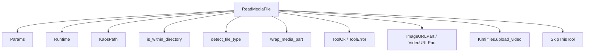
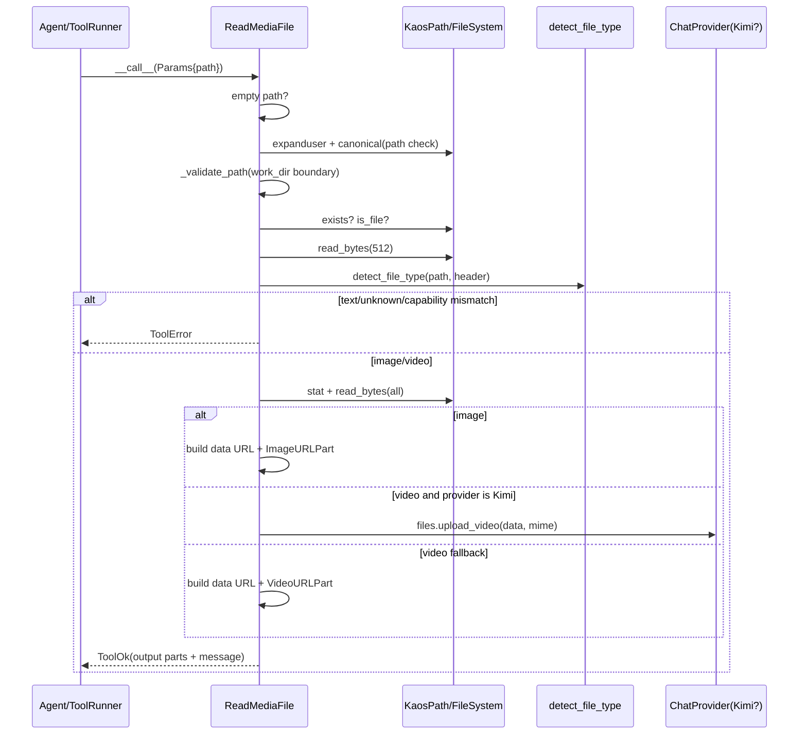
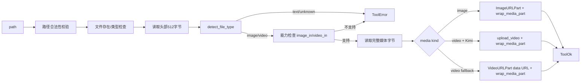
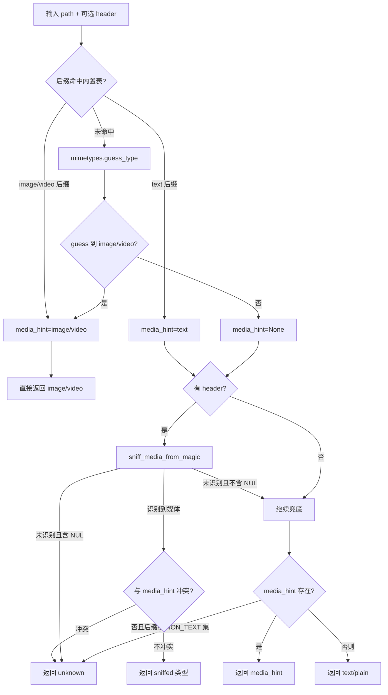

# media_reading 模块文档

## 模块概述

`media_reading` 模块对应实现文件 `src/kimi_cli/tools/file/read_media.py`，核心目标是为 agent 提供一个“可控、可解释、可与多模态模型能力对齐”的媒体读取工具。它的职责不是做通用媒体处理，也不是做复杂解码与分析，而是把本地图片/视频文件转换为模型可消费的 `ContentPart` 结构，并以统一的 `ToolOk` / `ToolError` 协议返回给上层运行时。

这个模块存在的工程价值在于：在 agent 工作流中，读取媒体文件比读取文本文件有更高风险与更高成本。风险来自于文件体积、类型误判、路径越界、模型能力不匹配；成本来自于数据编码、上下文体积膨胀、视频上传等附加步骤。`ReadMediaFile` 通过路径校验、类型判定、模型能力门禁、体积上限和结构化错误返回，把这些问题前置到工具边界，避免无效调用进入模型推理阶段。

从 `tools_file` 子系统视角看，`media_reading` 与 [text_reading.md](text_reading.md) 互为分流器：文本走 `ReadFile`，图片/视频走 `ReadMediaFile`。二者共享同一类路径安全理念，但在输出结构和模型兼容性上采用了不同策略。若你先阅读过 [file_module_entrypoint.md](file_module_entrypoint.md)，可以把 `ReadMediaFile` 理解为文件工具入口导出的多模态读取分支。

---

## 代码位置与核心组件

- 文件：`src/kimi_cli/tools/file/read_media.py`
- 核心组件：
  - `Params`
  - `ReadMediaFile`
- 关键常量：
  - `MAX_MEDIA_MEGABYTES = 100`
- 关键辅助函数：
  - `_to_data_url(mime_type: str, data: bytes) -> str`
  - `_extract_image_size(data: bytes) -> tuple[int, int] | None`

---

## 设计动机与总体策略

`ReadMediaFile` 的设计很“agent runtime 导向”：它不是单纯调用 `open()` 读二进制，而是围绕“是否该读、能否读、读完如何安全交付给模型”构建。具体来说，模块遵循以下思路。

首先，它在工具加载阶段就做能力裁剪。若当前模型既不支持 `image_in` 也不支持 `video_in`，构造函数直接抛出 `SkipThisTool`，把工具从可用列表剔除。这样做可以减少模型无意义地尝试调用一个必然失败的工具。

其次，它把路径与类型判断放在真正读取前。路径规则依旧延续文件工具的安全边界：工作目录外允许访问，但必须显式使用绝对路径。类型识别依赖 `detect_file_type` 与头部 sniff 字节，不允许把文本文件误送进媒体读取流程。

最后，它根据媒体种类和 provider 能力决定内容封装方式。图片统一转 `data:` URL；视频在 Kimi provider 下走远程上传分支（`upload_video`），其他 provider 回退为 `data:` URL。这样既兼容不同 provider，又尽可能利用原生能力降低上下文压力。

---

## 组件详解

## `Params`

`Params` 是一个非常精简的 `pydantic.BaseModel`，只有一个字段：`path: str`。虽然参数面看起来很薄，但该字段承载了完整的媒体读取定位语义。

### 字段说明

- `path: str`
  - 含义：要读取的目标文件路径。
  - 规则提示：描述中明确指出，如果访问工作目录外文件，应使用绝对路径。

`Params` 本身没有复杂的数值范围校验；路径存在性、文件类型、是否为普通文件等都在 `ReadMediaFile.__call__` 中做运行时验证。这是典型的“参数结构校验与业务安全校验分层”设计。

---

## `ReadMediaFile`

`ReadMediaFile` 继承自 `CallableTool2[Params]`，是标准工具协议中的异步可调用实现。它的返回类型是 `ToolReturnValue`，通常为成功时 `ToolOk`，失败时 `ToolError`。

### 构造过程：`__init__(self, runtime: Runtime)`

构造函数分三步完成初始化。

第一步是能力探测：从 `runtime.llm.capabilities` 提取模型能力集合。如果 `runtime.llm` 为空，则能力集合为空。若既无 `image_in` 也无 `video_in`，立即 `raise SkipThisTool()`。

第二步是工具描述加载：调用 `load_desc(read_media.md, {...})`，将 `MAX_MEDIA_MEGABYTES` 与当前 `capabilities` 注入模板说明，再交给 `CallableTool2` 基类构建对外工具元信息。

第三步是缓存运行时上下文：保存 `runtime`、`runtime.builtin_args.KIMI_WORK_DIR`、`capabilities`。其中工作目录用于路径边界判断，capabilities 用于调用时二次门禁。

这里有个值得注意的点：构造阶段的“是否注册工具”与调用阶段的“是否允许当前媒体类型”是两层不同防线。前者是粗粒度（工具级），后者是细粒度（图片/视频级）。

### 路径校验：`_validate_path(self, path: KaosPath) -> ToolError | None`

该方法只负责安全边界，不做存在性判断。它先获取 `resolved_path = path.canonical()`，然后判断该路径是否位于工作目录内。若不在工作目录内且传入路径不是绝对路径，则返回 `ToolError(brief="Invalid path")`。

这意味着：

- 工作目录内：相对路径可用。
- 工作目录外：必须绝对路径。

这种规则兼顾了安全性与可用性。它并不完全禁止外部文件读取，但要求调用者显式表达意图，减少相对路径造成的歧义与越界风险。

### 核心读取：`_read_media(self, path: KaosPath, file_type: FileType) -> ToolReturnValue`

这个私有方法负责“已确认是 image/video 后”的实际读取与封装。

它先做体积与空文件检查：

- `size == 0` 返回 `Empty file`。
- `size > 100MB` 返回 `File too large`。

然后按 `file_type.kind` 分支。

对于 `image`：读取全量字节，转 `data:{mime};base64,...`，包装为 `ImageURLPart`，再通过 `wrap_media_part` 加上 `<image path="..."> ... </image>` 文本标签。它还会尝试调用 `_extract_image_size` 提取原始像素尺寸，用于在 `message` 中追加 `original size WxHpx`。

对于 `video`：同样读取全量字节，但封装策略分 provider。

- 若当前 `runtime.llm.chat_provider` 是 `Kimi`，调用 `llm.chat_provider.files.upload_video(data, mime_type)`，返回 provider 侧视频部件。
- 否则回退为 `VideoURLPart(video_url=data_url)`，即本地编码 data URL 方式。

最后统一返回 `ToolOk`，`message` 中会包含媒体类型、mime、字节大小，以及一段固定提示：若需坐标输出，先给相对坐标再结合原图尺寸换算；若脚本生成/编辑媒体，应立即重新读取结果再继续。

### 调用入口：`__call__(self, params: Params) -> ToolReturnValue`

这是完整控制流程入口，可分为七个阶段。

1) 输入空值检查：`params.path` 为空时返回 `Empty file path`。

2) 路径预处理：`KaosPath(params.path).expanduser()` 展开 `~`。

3) 安全边界校验：调用 `_validate_path`。

4) 规范化与文件属性检查：`canonical()` 后判断 `exists()` 与 `is_file()`。

5) 文件类型判定：读取 `MEDIA_SNIFF_BYTES`（当前为 512）作为头部，调用 `detect_file_type(path, header)`。

6) 类型与能力门禁：

- `text`：提示改用 `ReadFile`。
- `unknown`：提示可用 shell / Python / MCP，并强调第三方依赖需在 venv。
- `image` 但无 `image_in`：返回 `Unsupported media type`。
- `video` 但无 `video_in`：返回 `Unsupported media type`。

7) 进入 `_read_media` 完成读取与封装。

整个 `__call__` 被 `try/except` 包裹，任何非预期异常都会变成 `ToolError(brief="Failed to read file")`，保证协议层始终拿到结构化返回。

---

## 辅助函数详解

## `_to_data_url(mime_type, data)`

这个函数把原始字节做 Base64 编码并拼成 `data:` URL。它简单直接，但要认识其代价：Base64 通常会带来约 33% 的体积膨胀，因此在大媒体文件场景下会显著增加传输与上下文负担。

## `_extract_image_size(data)`

该函数是“尽力而为”的增强路径。它尝试导入 `PIL.Image` 读取尺寸；若 Pillow 不可用或解析失败，返回 `None` 而不抛错。也就是说，图片尺寸提示是可选能力，不影响主流程成功与否。

---

## 架构依赖关系



这张图体现的是运行时协作职责。`ReadMediaFile` 本身像一个编排器：路径安全交给路径工具，类型判断交给文件工具 utils，返回协议交给 tooling 基础层，媒体消息结构交给 wire/message 类型，provider 特化能力由 Kimi 分支承载。

---

## 调用时序图



该时序强调一个关键事实：头部 sniff 与能力门禁发生在全量读取之前。这是该模块控制成本与失败快速返回的主要手段。

---

## 数据流与输出结构



`ToolOk.output` 实际是 `list[ContentPart]`，由三段组成：开始标签文本、媒体 part、结束标签文本。标签通常包含 `path` 属性，有利于模型在多媒体上下文中保留来源信息。

---

## 类型识别策略（依赖 `file.utils`）

`ReadMediaFile` 自身并不实现媒体格式识别，而是依赖 `src/kimi_cli/tools/file/utils.py` 的 `detect_file_type()`。这层依赖非常关键，因为它直接决定工具后续走 `ReadFile`、`ReadMediaFile` 还是错误分支。理解该策略有助于解释“为什么某些文件会被识别成 unknown 或 text”。

`detect_file_type()` 的判定顺序可以概括为：先看后缀与 `mimetypes` 提示，再在必要时看 magic bytes，最后才走保守兜底。一个很重要的实现细节是：当后缀已经明确指向 image/video 时，函数会直接返回，不再继续进行 header 纠偏。这也是为什么后缀伪装在某些情况下会绕过 magic 检测（该模块当前已知限制之一）。



这条流程与 `ReadMediaFile.__call__` 结合后，形成了稳定行为：

- 若识别为 `text`，`ReadMediaFile` 不会尝试读取媒体，而会明确引导使用 [text_reading.md](text_reading.md)；
- 若识别为 `unknown`，工具不会盲目二进制加载并塞给模型，而是返回操作建议（shell / Python / MCP）；
- 若识别为 `image`/`video`，才会进入能力检查与内容封装流程。

这也是该模块“风险前置”的核心体现：把错误尽量留在工具边界，而不是推迟到模型处理阶段。

---


## 与系统其他模块的关系

`media_reading` 处于文件工具子系统内部，但其行为受到多个上游模块影响。

它通过 `Runtime` 获取当前会话的工作目录和 LLM 能力，因此和 agent 执行上下文紧密耦合。运行时模型能力由 `soul_engine` 初始化链路提供；工具接口、参数 schema、返回对象来自 `kosong_tooling`；媒体 part 类型沿用了 wire/message 类型体系。

在横向协作上，`ReadMediaFile` 与文本读取工具是互斥分流关系：遇到文本文件会明确报错并引导至 `ReadFile`。因此，开发者在排障时要先确认“工具选型是否正确”，再排查 IO 或 provider 问题。

建议结合以下文档阅读以获取更完整上下文：

- [file_module_entrypoint.md](file_module_entrypoint.md)
- [text_reading.md](text_reading.md)
- [tools_file.md](tools_file.md)
- [soul_engine.md](soul_engine.md)
- [kosong_tooling.md](kosong_tooling.md)
- [kimi_provider.md](kimi_provider.md)

---

## 使用方式与示例

在框架内部，通常由工具运行器调用 `call(arguments)`，并由 `CallableTool2` 自动完成参数验证。下面给出接近真实调用的示例。

```python
from kimi_cli.tools.file.read_media import ReadMediaFile

tool = ReadMediaFile(runtime)
ret = await tool.call({"path": "./assets/screenshot.png"})

if ret.is_error:
    print(ret.message)
else:
    print(ret.message)
    # ret.output 是 list[ContentPart]，可直接进入多模态消息历史
```

读取工作目录外文件时，请使用绝对路径：

```python
ret = await tool.call({"path": "/tmp/demo/video.mp4"})
```

如果模型不支持对应媒体输入，返回会是 `Unsupported media type`。这时应在会话层切换到支持能力的模型，而不是重试同一工具调用。

---

## 配置点与行为参数

该模块没有独立配置文件，但存在若干“隐式配置点”，会直接影响行为。

- `MAX_MEDIA_MEGABYTES`：媒体体积上限（当前 100MB）。
- `MEDIA_SNIFF_BYTES`：类型探测读取头部字节数（当前 512）。
- `runtime.builtin_args.KIMI_WORK_DIR`：路径边界判断基准目录。
- `runtime.llm.capabilities`：决定工具注册与媒体类型可用性。
- `runtime.llm.chat_provider` 类型：决定视频走上传还是 data URL 回退。

调整这些参数时要同时评估：模型上下文成本、网络上传开销、错误率、用户体验一致性。

---

## 边界情况、错误条件与限制

该模块有几个高频且容易忽略的行为约束。

第一，工具可能“消失”。如果模型无 `image_in/video_in` 能力，`ReadMediaFile` 在初始化时直接抛 `SkipThisTool`，通常不会出现在可调用工具列表中。这不是故障，而是能力门禁生效。

第二，视频与图片都采用“全量读取字节”策略。即使先读了 512 字节做 sniff，后续仍会一次性读入整个文件内容；对于接近上限的大文件，这会带来明显内存压力。

第三，视频在非 Kimi provider 下会回退为 data URL，这可能导致 payload 极大，某些上下文或传输链路可能不友好。Kimi 分支通过 `upload_video` 可降低这类压力，但依赖 provider 能力与网络稳定性。

第四，类型检测对后缀有优先路径。`detect_file_type` 对明显图片/视频后缀会直接返回，不一定继续利用 magic bytes 纠偏。因此“后缀伪装文件”可能导致判定偏差，这是当前实现的已知局限。

第五，图片尺寸提取依赖 Pillow。未安装或解析失败不会报错，只是丢失 `original size` 提示。不要把尺寸提示缺失误判为读取失败。

第六，错误信息包含可操作建议，特别是 `unknown` 类型会引导到 shell/Python/MCP，并强调 venv。对于自动化 agent 编排，这些 message 可作为后续工具选择的决策信号。

---

## 扩展建议

如果你要扩展 `media_reading`，建议优先保持“先判定后全读”的结构，不要直接跳过类型和能力门禁。可考虑的扩展方向包括：引入流式读取/分块上传以降低峰值内存；在 `ToolOk` 中补充结构化元数据字段（例如 duration、fps、codec）；增加更严格的 MIME 一致性检查以缓解后缀伪装问题；为未知二进制类型提供可选外部解码器钩子。

扩展后请同步检查入口导出与跨工具一致性，确保 [file_module_entrypoint.md](file_module_entrypoint.md) 和 [tools_file.md](tools_file.md) 中的行为描述不会失真。

---

## 小结

`media_reading` 的核心价值不是“把媒体读出来”这么简单，而是把媒体读取纳入 agent 工具协议中的可治理流程：能力先验、路径约束、类型分流、体积上限、provider 自适应封装、结构化错误返回。对于初次接手该模块的开发者，最重要的理解是：`ReadMediaFile` 是一个面向多模态推理链路的安全编排工具，而不是通用媒体处理库。
