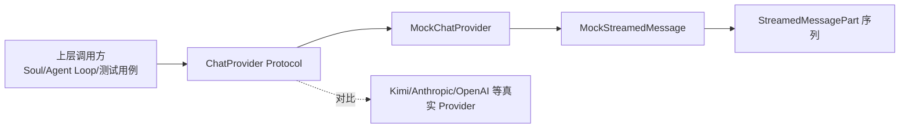
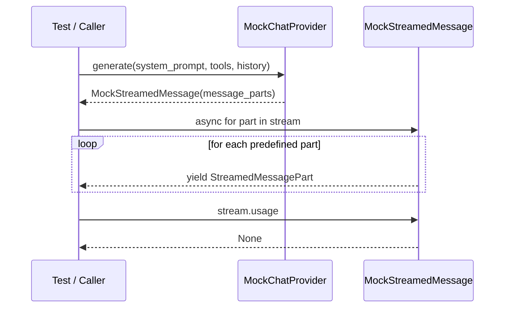
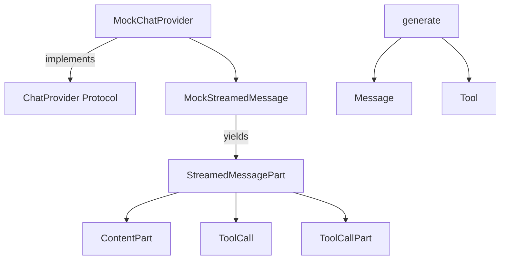

# mock_provider 模块文档

## 模块概述

`mock_provider` 是 `kosong_chat_provider` 体系中的测试型 Provider 模块，对应实现文件为 `packages/kosong/src/kosong/chat_provider/mock.py`。它的核心目标不是连接真实 LLM 服务，而是提供一个**可预测、无网络依赖、零外部状态**的 `ChatProvider` 实现，供单元测试、集成测试、回归测试以及本地调试使用。

从设计上看，`MockChatProvider` 把“模型输出”简化为一组预先给定的 `StreamedMessagePart`。每次调用 `generate()`，它都会返回一个可异步迭代的 `MockStreamedMessage`，并按顺序吐出这些分片。也就是说，调用方可以在不接入任何真实 API 的情况下，完整演练上层逻辑：消息流消费、工具调用分片处理、最终拼装、状态流转等。

如果你先前已经阅读过协议层，请结合 [provider_protocols.md](provider_protocols.md) 一起理解；`mock_provider` 本质上是该协议的最小可用实现。若你关注真实线上行为（鉴权、网络错误、usage 统计、重试恢复），请参考 [kimi_provider.md](kimi_provider.md)。

---

## 为什么需要这个模块

在 Agent/CLI 系统中，真实模型调用通常涉及网络波动、速率限制、鉴权、模型随机性和成本开销。这些因素会让测试变慢、变脆弱，也更难稳定复现问题。`mock_provider` 的存在就是为了把这些不确定性从测试中剥离出来。你可以将特定的输出分片“写死”，然后验证上层编排逻辑是否正确处理流式文本、`ToolCall` 与 `ToolCallPart`。

这类设计也非常适合做故障回归：当某个历史 bug 与“消息分片顺序”相关时，你可以通过固定 `message_parts` 精准复现，而不必依赖真实模型是否会再次生成同样的 token 序列。

---

## 在系统中的位置



这张图说明：`MockChatProvider` 与真实 Provider 在调用接口上保持一致（都实现 `ChatProvider`），但内部不发起任何远程请求，直接返回预定义流。这样上层可以无缝替换 provider，实现“同一套业务逻辑 + 不同执行后端”的测试策略。

---

## 核心组件详解

## `MockChatProvider`

`MockChatProvider` 是 `ChatProvider` 协议的轻量实现。它通过构造函数接收一个 `list[StreamedMessagePart]`，并在后续 `generate()` 中反复使用该列表来构建流式响应对象。

### 类定义要点

- `name = "mock"`：Provider 逻辑名称固定为 `mock`。
- `model_name` 属性返回 `"mock"`：模型名也固定。
- `thinking_effort` 属性固定返回 `None`：表示未实现 thinking 配置语义。

### `__init__(message_parts)`

签名：

```python
def __init__(self, message_parts: list[StreamedMessagePart]):
```

该方法保存调用方传入的分片列表到 `self._message_parts`。没有类型转换、深拷贝或合法性增强校验，因此它假定传入数据已经符合 `StreamedMessagePart` 联合类型约束（`ContentPart | ToolCall | ToolCallPart`）。

### `generate(system_prompt, tools, history)`

签名：

```python
async def generate(
    self,
    system_prompt: str,
    tools: Sequence[Tool],
    history: Sequence[Message],
) -> MockStreamedMessage:
```

虽然签名与真实 Provider 一致，但该实现**不会使用** `system_prompt`、`tools`、`history` 三个参数。它始终返回：

```python
MockStreamedMessage(self._message_parts)
```

也就是说，输出只由初始化时提供的 `message_parts` 决定。这是它成为“确定性测试替身”的关键。

### `with_thinking(effort)`

签名：

```python
def with_thinking(self, effort: ThinkingEffort) -> Self:
```

该方法返回 `copy.copy(self)`。它符合协议对“返回副本”的要求，但不会真正保存或反映 `effort`。因此不论传入 `"off"/"low"/"medium"/"high"`，行为都不变。

这表示 `mock_provider` 的 thinking 语义是“接口兼容但能力空实现”。

---

## `MockStreamedMessage`

`MockStreamedMessage` 实现了 `StreamedMessage` 协议，负责把预定义分片转换为可 `async for` 消费的异步流。

### 初始化与迭代机制

构造函数：

```python
def __init__(self, message_parts: list[StreamedMessagePart]):
    self._iter = self._to_stream(message_parts)
```

内部通过 `_to_stream()` 创建异步生成器，并把生成器保存在 `self._iter`。之后：

- `__aiter__()` 返回 `self`
- `__anext__()` 代理到 `self._iter.__anext__()`

这是一种非常直接的“对象即迭代器”实现。

### `_to_stream(message_parts)`

该私有方法逐项 `yield` 列表里的分片：

```python
for part in message_parts:
    yield part
```

没有人为延迟、没有并发调度、没有异常注入、没有 token 粒度拆分。因此它更像“静态回放器”，而不是“时序仿真器”。

### 元信息属性

- `id` 固定返回 `"mock"`
- `usage` 固定返回 `None`

这意味着调用方若依赖 message id 唯一性或 token 使用统计，需在测试中自行补桩或在断言中放宽约束。

---

## 组件关系与调用流程



这个流程强调两个点：第一，`generate()` 不触发外部 I/O；第二，所有输出是“预定义分片的顺序回放”。

---

## 依赖关系与类型协作



这个依赖图展示了一个关键事实：`mock_provider` 只“依赖类型协议”，而不依赖任何远程 SDK。`generate()` 的入参沿用统一接口（`Message`、`Tool`），从而保证上层调用代码不需要因为 mock/real provider 切换而改变。输出端通过 `StreamedMessagePart` 联合类型承载文本、完整工具调用和工具调用增量三类场景，因此它能覆盖大部分 Agent 编排层最关心的分支逻辑。

从可维护性角度看，这种实现把“协议一致性”与“实现复杂度”分离开了：协议保持完整，行为保持极简。测试里若只想验证状态机和分发逻辑，这是非常高性价比的选择。

---


## 与协议层的契合度

`mock_provider` 覆盖了 `ChatProvider` 和 `StreamedMessage` 的关键最小接口，因此可以用于任何依赖协议而非具体实现的上层代码。它在接口兼容性方面表现完整，但在行为语义方面是“刻意简化”：

- 不产生 `ChatProviderError` 族异常
- 不提供 `TokenUsage`
- 不实现可重试恢复（未实现 `RetryableChatProvider`）
- 不处理 thinking effort

这种“最小语义实现”非常适合测试纯编排逻辑，但不能替代真实 provider 行为验证。

---

## 使用示例

## 示例 1：回放纯文本分片

```python
from kosong.chat_provider.mock import MockChatProvider
from kosong.message import TextPart

provider = MockChatProvider([
    TextPart(text="Hello"),
    TextPart(text=", world"),
])

stream = await provider.generate(system_prompt="ignored", tools=[], history=[])
chunks = []
async for part in stream:
    chunks.append(part)

# 断言上层聚合逻辑
assert "".join(p.text for p in chunks) == "Hello, world"
```

## 示例 2：模拟工具调用增量

```python
from kosong.chat_provider.mock import MockChatProvider
from kosong.message import ToolCallPart, ToolCall

provider = MockChatProvider([
    ToolCallPart(arguments_part='{"path": "a'),
    ToolCallPart(arguments_part='.txt"}'),
    ToolCall(
        id="call_1",
        function=ToolCall.FunctionBody(name="read_file", arguments='{"path":"a.txt"}')
    ),
])
```

该示例常用于验证“增量参数拼接 + 完整工具调用分派”的上层状态机。

---

## 可扩展性与二次开发建议

如果你希望把它从“静态回放”升级为“更逼真的测试后端”，可以考虑以下方向：

- 在 `_to_stream()` 中注入 `asyncio.sleep()`，模拟 token 到达延迟。
- 增加可选异常注入参数，在第 N 个分片抛出特定异常，用于测试重试和中断处理。
- 支持可配置 `usage`，便于覆盖计费与统计链路。
- 让 `with_thinking()` 真正记录状态，帮助测试 thinking 参数透传逻辑。

通常建议通过新增参数或子类实现，避免破坏当前“简单、稳定、可预测”的默认行为。

---

## 边界条件、限制与注意事项

`mock_provider` 非常小，但有几个容易踩坑的点。

首先，`generate()` 完全忽略输入参数。如果你的测试目标是“不同 prompt/history 导致不同输出”，这个模块无法直接满足；你需要在测试层自行构造不同 provider 实例，或扩展该类实现条件分支。

其次，`with_thinking()` 只是浅拷贝，不会保存 effort。任何依赖 `thinking_effort` 状态变化的断言都会失败，因为该属性永远是 `None`。

再次，`MockStreamedMessage` 是单次消费语义。由于内部保存的是一个已经创建好的异步生成器，流被完整遍历后，再次迭代同一对象通常不会重新产出内容。若需要重复消费，应重新调用 `generate()` 生成新流对象。

另外，`MockChatProvider` 在构造时不复制 `message_parts`。如果外部代码后续原地修改该列表，新的 `generate()` 结果会受到影响。为了测试稳定，建议传入不可变副本，或在初始化前手动 `list(...)` 复制。

最后，`id` 固定为 `"mock"` 且 `usage is None`。这会与真实 provider 的可观测行为存在差距，做端到端监控断言时要区分“接口正确性测试”和“线上语义测试”。

---

## 错误行为说明

此模块自身几乎不主动抛出 provider 级异常。只有在你传入非法 `message_parts` 元素并由上层消费逻辑触发类型相关错误时，才会在外部链路中出现异常。它不模拟网络异常、状态码异常、超时异常，因此不适合直接测试 `ChatProviderError` 分类处理逻辑。

若要测试错误恢复链路，建议：

1. 使用真实 provider 的可控故障环境；或
2. 扩展 mock 版本，在流中按条件抛 `APIConnectionError` / `APITimeoutError`。

---

## 与其他文档的关系

- 协议与错误语义请参考 [provider_protocols.md](provider_protocols.md)
- 真实生产 Provider 设计请参考 [kimi_provider.md](kimi_provider.md)
- 工具模型（`Tool`）可参考 [kosong_tooling.md](kosong_tooling.md)

本文件聚焦 `mock_provider` 的行为与测试用途，不重复展开协议层通用概念。
