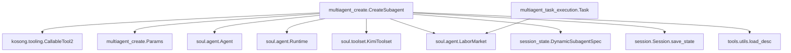
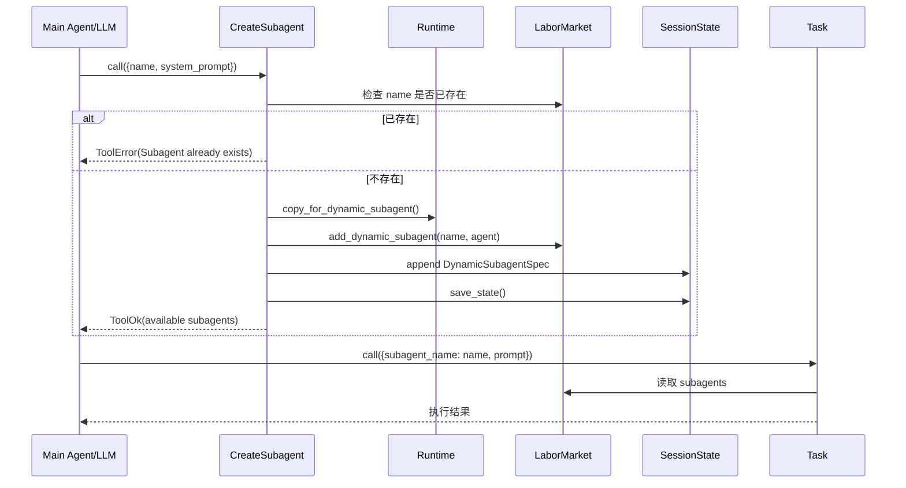
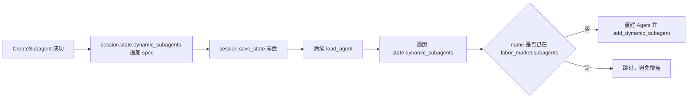

# multiagent_create 模块文档

## 1. 模块简介

`multiagent_create` 模块（`src/kimi_cli/tools/multiagent/create.py`）提供了一个面向运行时的“动态子代理创建工具”，核心能力是让当前主代理在对话过程中即时定义新的子代理配置（名称 + system prompt），并将该配置立即注册到可调度子代理池中，随后由 `Task` 工具执行。这个模块存在的意义，不是替代固定 agent spec（静态配置），而是补上“运行中按需创建专家角色”的能力缺口：当用户任务出现临时、细粒度、强上下文隔离需求时，主代理可以即时构造一个专用角色并委派任务，而不需要重启会话或改动磁盘上的主 agent 配置文件。

从系统设计上看，`multiagent_create` 是多代理工具链里“定义阶段”的入口，而 `multiagent_task_execution`（`Task` 工具）是“执行阶段”的入口。二者形成“先定义、后调用”的工作流。该模块还负责把动态子代理定义持久化到会话状态中，这使得子代理不仅在当前回合可用，而且在同一 session 重载后仍可恢复。换句话说，它连接了短期运行时（`LaborMarket`）和长期会话状态（`session.state.dynamic_subagents`）两层状态面。

---

## 2. 模块定位与设计动机

在 kimi-cli 的代理架构中，固定子代理来自 agent spec，在 `load_agent(...)` 阶段一次性加载；但真实任务常常有临时角色需求，例如“只做 API 兼容性审查的 reviewer”或“专注给出极短摘要的 summarizer”。如果每次都修改 agents 文件，成本高且破坏对话连续性。`CreateSubagent` 通过工具调用把“创建角色”转成标准化、可验证、可持久化的运行时动作，降低了动态协作门槛。

该模块的设计还体现了两个明确取舍。第一，它不复制一套工具体系，而是让动态子代理共享主代理 `KimiToolset`，确保能力一致、行为可预期。第二，它为动态子代理复制 `Runtime` 时采用 `copy_for_dynamic_subagent()`，共享 `LaborMarket`，从而让新创建子代理能被同一个任务调度平面立即发现。这种“共享劳动市场、独立部分运行时状态”的策略，是多代理协同可用性的关键。

---

## 3. 核心组件详解

本模块仅包含两个核心组件：`Params` 和 `CreateSubagent`。组件数量虽少，但承担了参数契约、冲突检测、对象装配、注册、持久化、返回协议封装这条完整链路。

### 3.1 `Params`（Pydantic 输入模型）

`Params` 继承 `BaseModel`，定义了 `CreateSubagent` 的工具入参结构。字段如下：

```python
class Params(BaseModel):
    name: str
    system_prompt: str
```

`name` 用于指定子代理的唯一标识，后续会被 `Task.params.subagent_name` 引用。`system_prompt` 用于定义子代理职责、边界与输出风格。该模型本身没有额外的长度、字符集或空串约束，因此语义质量主要依赖调用方（通常是上层 LLM）和后续任务执行结果。

从继承链角度，`Params` 的校验由 `CallableTool2.call()` 触发；当工具调用参数 JSON 无法通过 `model_validate` 时，系统返回 `ToolValidateError`，不会进入 `CreateSubagent.__call__` 的业务逻辑。关于统一工具参数校验机制，可参考 [kosong_tooling.md](kosong_tooling.md)。

### 3.2 `CreateSubagent`（动态创建工具）

`CreateSubagent` 继承 `CallableTool2[Params]`，对外暴露名称 `CreateSubagent`，描述文案来自 `create.md`，参数类型为 `Params`。

#### `__init__(toolset: KimiToolset, runtime: Runtime)`

构造函数保存两个关键依赖：

- `toolset`：当前主代理使用的工具集。新子代理会共享它。
- `runtime`：当前运行时对象，包含 `labor_market`、`session` 等状态容器。

这里没有额外副作用；它只做依赖注入和内部引用保存。该依赖注入来源于 `KimiToolset.load_tools(...)` 的构造参数注入机制（按类型匹配），详见 [soul_engine.md](soul_engine.md) 与 [kosong_tooling.md](kosong_tooling.md)。

#### `__call__(params: Params) -> ToolReturnValue`

这是模块核心执行路径，流程如下。

1. **名称冲突检查**：若 `params.name` 已存在于 `runtime.labor_market.subagents`（固定 + 动态联合视图），立即返回 `ToolError`。
2. **创建 Agent 对象**：构造 `Agent(name, system_prompt, toolset, runtime.copy_for_dynamic_subagent())`。
3. **注册到动态市场**：调用 `runtime.labor_market.add_dynamic_subagent(...)`。
4. **持久化定义**：向 `runtime.session.state.dynamic_subagents` 追加 `DynamicSubagentSpec`，然后 `runtime.session.save_state()`。
5. **返回成功**：返回 `ToolOk`，`output` 包含当前可用子代理名称列表，`message` 给出成功提示。

这意味着该调用包含**明确副作用**：它会改动内存中的 labor market，也会落盘更新 session state。工具返回结构遵循 `ToolReturnValue` 协议（`ToolOk` / `ToolError`），不会抛业务异常给上层。

---

## 4. 架构关系与依赖协作

### 4.1 组件依赖图



这张图强调：`CreateSubagent` 不是孤立工具，它的产物（动态子代理）是写入 `LaborMarket` 的共享状态，随后被 `Task` 读取并执行。它同时把定义落盘，以便 `load_agent(...)` 在后续会话恢复阶段重建动态子代理。

### 4.2 运行时时序图（创建到可调用）



创建完成即刻可调用，不需要额外刷新或重载步骤；这是因为 `Task` 读取的是同一 `LaborMarket` 的联合视图。

### 4.3 会话重载与恢复流程



恢复逻辑由 `soul.agent.load_agent(...)` 完成，不在本模块内实现，但这是 `multiagent_create` 的关键系统语义：创建结果在同一 session 生命周期内可延续。

---

## 5. 内部行为细节与设计要点

`CreateSubagent` 使用 `runtime.labor_market.subagents` 做重名检查。这个属性是 `{**fixed, **dynamic}` 的合并结果，因此动态创建会与固定子代理同名冲突。这是正确且必要的，因为 `Task` 按名称路由，重名将导致歧义。

动态子代理创建时复用同一 `toolset`，意味着子代理可以访问与主代理一致的工具能力（包括已加载的本地工具和 MCP 工具）。这使行为一致，但也意味着安全边界不会因为“动态创建”自动收窄；若希望子代理最小权限运行，需要在更高层引入独立 toolset 策略，而不是依赖本模块。

`runtime.copy_for_dynamic_subagent()` 会创建新的 `DenwaRenji` 与共享的 `Approval` 句柄（`approval.share()`），并共享 `LaborMarket`。因此动态子代理在消息通道/内部协作上可保持独立事件链路，但在审批策略与子代理目录上仍与主代理同域。这是“协同一致性优先”的架构选择。

持久化采用 append 方式：每次成功创建都会追加一个 `DynamicSubagentSpec`。模块本身没有删除、更新、重命名能力，也没有垃圾回收逻辑；生命周期管理要靠外部机制（当前代码树中尚无对应工具）。

---

## 6. 参数、返回值与副作用清单

### 6.1 输入参数

推荐调用 JSON 形态：

```json
{
  "name": "code_reviewer",
  "system_prompt": "You are a strict code reviewer. Focus on correctness, security, and maintainability."
}
```

`name` 应稳定、可读、易路由，建议使用小写 + 下划线。`system_prompt` 建议明确三类信息：职责范围、禁止事项、输出格式。

### 6.2 返回值

成功时返回 `ToolOk`：

- `is_error = false`
- `output`：字符串，格式类似 `Available subagents: a, b, c`
- `message`：`Subagent 'xxx' created successfully.`

失败时返回 `ToolError`：

- `is_error = true`
- `message`：冲突说明，如 `Subagent with name 'xxx' already exists.`
- `brief`：`Subagent already exists`

### 6.3 副作用

- 内存副作用：`runtime.labor_market.dynamic_subagents` 新增条目。
- 持久化副作用：`session.state.dynamic_subagents` 追加并保存到磁盘。
- 无网络副作用、无外部进程副作用（本模块本身）。

---

## 7. 实际使用模式

典型模式是两步式：先创建，再委派执行。

```text
1) CreateSubagent(name="code_reviewer", system_prompt="...")
2) Task(subagent_name="code_reviewer", prompt="Review module X and return risk-ranked issues")
```

如果你需要并行处理不同子问题，可以创建多个专用动态子代理，再在一次模型响应中并行发起多个 `Task` 调用。关于执行阶段的上下文隔离、结果回传与继续生成逻辑，请参考 [multiagent_task_execution.md](multiagent_task_execution.md)。

---

## 8. 配置与扩展建议

该模块本身没有显式配置项（如超时、开关、阈值），其行为主要受以下外部配置面影响：

- 会话状态存储路径与生命周期，见 [config_and_session.md](config_and_session.md)。
- 运行时工具加载策略（决定子代理可用工具集合），见 [soul_engine.md](soul_engine.md)。
- Tool 协议与参数校验机制，见 [kosong_tooling.md](kosong_tooling.md)。

扩展该模块时，最常见方向包括：

- 增加 `DeleteSubagent` / `UpdateSubagentPrompt` 工具，补齐生命周期管理。
- 为 `Params` 增加命名规则与 prompt 长度约束，提升可维护性。
- 在创建时支持可选“tool visibility profile”，实现动态子代理最小权限。
- 引入审计字段（创建者、时间、用途）写入 `DynamicSubagentSpec`，便于回放和治理。

---

## 9. 边界条件、错误场景与已知限制

### 9.1 重名冲突

任何与现有固定或动态子代理同名的创建请求都会失败。这避免了 `Task` 路由歧义，但也意味着你无法“覆盖更新”已有定义，只能换名。

### 9.2 空字符串与低质量 prompt

当前 `Params` 未禁止空字符串；理论上可创建 `name=""` 或空 `system_prompt`（只要上游未拦截）。这会显著降低可用性，且可能导致后续任务行为不可预测。实践中应在调用侧增加约束。

### 9.3 持久化失败传播

`session.save_state()` 若抛异常，当前 `__call__` 未显式捕获，会由上层工具调度层转换为 `ToolRuntimeError`。因此在 IO 异常场景下，可能出现“内存已注册但持久化失败”的部分成功状态，需通过后续恢复逻辑和运维监控处理。

### 9.4 无删除/更新能力

模块只支持新增，不支持删除、重命名、修改 prompt。长会话下动态子代理列表可能膨胀，管理成本上升。

### 9.5 工具权限继承

动态子代理共享主代理 `toolset`，不会自动降权。若 system prompt 设计不严谨，子代理可能执行超出预期范围的工具动作。

---

## 10. 与相邻模块的关系

`multiagent_create` 主要负责“定义子代理”；执行由 `Task` 承担，运行容器由 `Soul/Runtime` 承担，协议由 tooling 层统一。建议按以下顺序阅读相关文档：

1. [soul_engine.md](soul_engine.md)：理解 `Agent` / `Runtime` / `LaborMarket` 的运行时语义。
2. [multiagent_task_execution.md](multiagent_task_execution.md)：理解子代理任务执行、上下文隔离与回传。
3. [config_and_session.md](config_and_session.md)：理解 `SessionState` 持久化与恢复。
4. [kosong_tooling.md](kosong_tooling.md)：理解 `CallableTool2`、`ToolReturnValue`、错误返回协议。

通过这些模块的配合，`multiagent_create` 实现了从“临时角色定义”到“可持续协作执行”的关键连接层。
