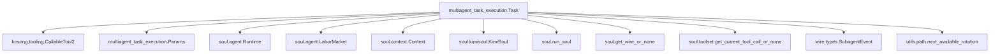
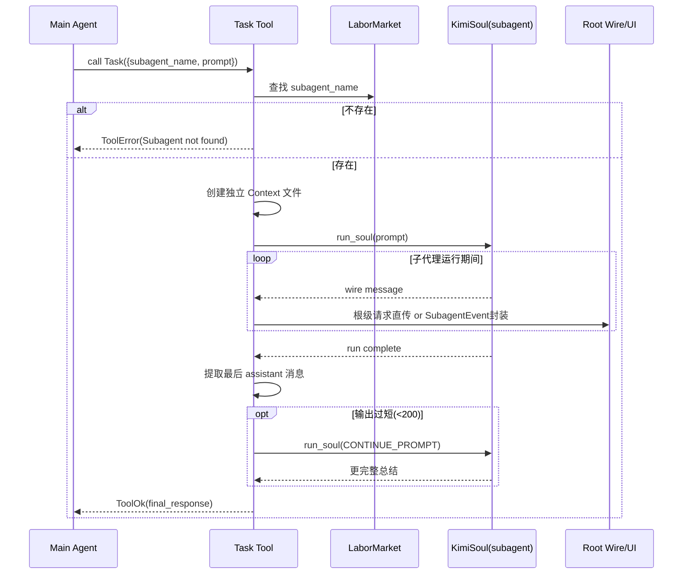
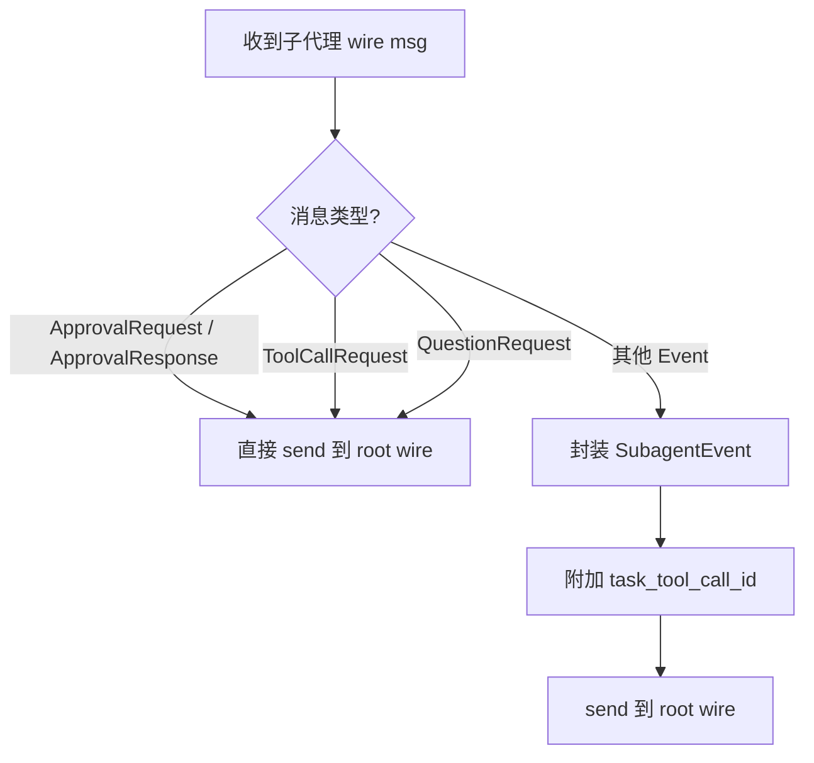

# multiagent_task_execution 模块文档

## 1. 模块简介

`multiagent_task_execution` 模块对应实现文件 `src/kimi_cli/tools/multiagent/task.py`，核心提供一个名为 `Task` 的工具，用于把某个“已存在的子代理（subagent）”拉起执行具体任务，并将结果回传给当前主代理。这个模块存在的根本原因是：在复杂任务中，主代理往往既要保持主线推理上下文干净，又要处理大量局部且细粒度的问题；如果所有推理和探索都堆在主会话里，容易造成上下文污染、信息噪声上升和 token 浪费。`Task` 通过“独立上下文 + 子代理执行 + 结果汇总回传”的机制，把这类工作隔离出去。

从系统角色看，`multiagent_task_execution` 不是负责“创建子代理”的模块，而是负责“调度并运行子代理”的模块。也就是说，它与 [multiagent_create.md](multiagent_create.md) 构成“定义-执行”双阶段：`CreateSubagent` 负责向 `LaborMarket` 注册可用角色，`Task` 负责按名称选择一个角色并让它在独立上下文里完成指定 prompt。

---

## 2. 设计目标与核心价值

这个模块的设计体现了三类目标。第一类是上下文隔离：子代理运行时不读取主代理上下文历史，避免主线会话被探索细节淹没。第二类是事件可观测：虽然子代理有自己的 `Wire`，但它的执行事件会被包装并转发到根级 wire，使 UI 和上层调度仍可感知子代理过程。第三类是可恢复与安全边界：审批请求、工具调用请求和问答请求这类“必须在根会话处理”的消息不会被包裹成普通子代理事件，而是直接上抛到根 wire，保证交互语义正确。

此外，模块内还实现了一个轻量“续写补全”策略：如果子代理最后回答太短（<200 字符），工具会追加一次 continuation prompt 请求更完整总结。这一策略让主代理在大多数情况下得到更可用的结果，减少“子代理只回一句话”的低质量输出。

---

## 3. 核心组件详解

本模块核心组件只有两个：`Params` 与 `Task`。尽管表面简单，但 `Task` 内部串联了运行时查找、上下文文件轮转、子代理 soul 启动、wire 事件桥接、错误处理和结果质量兜底等完整执行链路。

### 3.1 `Params`：工具参数契约

`Params` 继承 `pydantic.BaseModel`，定义了 `Task` 的调用参数：

```python
class Params(BaseModel):
    description: str
    subagent_name: str
    prompt: str
```

其中 `description` 是 3-5 词任务短描述，主要用于工具调用可读性；`subagent_name` 指向 `Runtime.labor_market.subagents` 中的某个代理名；`prompt` 是真正要给子代理执行的任务指令。代码注释明确要求 `prompt` 必须包含充分背景，因为子代理看不到主代理上下文。

参数校验由 `CallableTool2` 体系统一触发，若 JSON 入参不符合 `Params` 结构，会在工具层返回校验错误而不会进入业务逻辑。关于工具参数校验机制与 `ToolReturnValue` 协议，参见 [kosong_tooling.md](kosong_tooling.md)。

### 3.2 `Task`：子代理任务执行工具

`Task` 继承 `CallableTool2[Params]`，对外名称为 `Task`。它在初始化时动态加载描述模板 `task.md`，并把当前可用固定子代理列表注入 `${SUBAGENTS_MD}` 占位符，让模型在调用时知道可选目标代理。

#### `__init__(runtime: Runtime)`

构造函数依赖 `Runtime`，并保存两个关键引用：

- `self._labor_market = runtime.labor_market`：用于按名称检索子代理。
- `self._session = runtime.session`：用于生成子代理独立上下文文件。

这里的设计让 `Task` 与运行时状态强绑定，而不是静态配置驱动；因此它能感知固定 + 动态子代理全集。

#### `_get_subagent_context_file() -> Path`

该私有方法负责生成子代理上下文文件路径。实现步骤是：

1. 取主会话 `context_file`；
2. 构造子代理基础名 `"{main_stem}_sub"`；
3. 确保父目录存在；
4. 调用 `next_available_rotation(...)` 申请一个唯一轮转文件路径。

`next_available_rotation` 会在目标目录创建占位文件以“保留”唯一编号，因此返回值应立即使用。这里使用它创建子代理 context 文件非常合适，因为上下文日志就是典型轮转文件场景。

#### `__call__(params: Params) -> ToolReturnValue`

这是工具入口。执行逻辑分三层：

第一层是子代理存在性检查：若 `params.subagent_name` 不在 `labor_market.subagents`，直接返回 `ToolError("Subagent not found")`。

第二层是执行委派：存在时取出 `Agent`，调用 `_run_subagent(agent, params.prompt)`。

第三层是异常兜底：`_run_subagent` 抛任意异常都会被捕获并包装为 `ToolError("Failed to run subagent")`，防止异常泄漏到上层回路。

#### `_run_subagent(agent: Agent, prompt: str) -> ToolReturnValue`

这是模块最关键的方法，负责真实子代理运行。其内部可拆为以下阶段。

**阶段 A：运行上下文与当前工具调用绑定**

方法通过 `get_wire_or_none()` 获取当前根 wire，通过 `get_current_tool_call_or_none()` 获取当前工具调用 ID。两者都使用 `assert`，意味着该方法默认只在 agent 工具调用上下文内执行；脱离此上下文直接调用将触发断言失败。

**阶段 B：消息桥接策略定义**

内部定义 `_super_wire_send(msg)`，用于把子代理 wire 消息转发到根 wire。这里有一个重要分流规则：

- `ApprovalRequest`、`ApprovalResponse`、`ToolCallRequest`、`QuestionRequest`：直接发送到根 wire（不封装）；
- 其他消息：封装成 `SubagentEvent(task_tool_call_id, event=msg)` 再发送。

这条规则保证了“需要根级决策/执行的请求”不会丢失语义，同时普通子代理事件仍可被 UI 标记为某次 `Task` 工具调用的子事件。

**阶段 C：子代理 UI loop 与 soul 启动**

`_ui_loop_fn(wire)` 从 `wire.ui_side(merge=True)` 持续读取消息并转发。随后：

1. 生成子代理 context 文件；
2. 构造独立 `Context(file_backend=...)`；
3. 构造 `KimiSoul(agent, context=context)`；
4. 调用 `run_soul(soul, prompt, _ui_loop_fn, asyncio.Event())` 启动执行。

这里 `cancel_event` 传入一个新建但永不 set 的 `Event`，表示 `Task` 内部默认不主动取消子代理执行。

**阶段 D：运行异常处理与结果抽取**

若 `run_soul` 抛出 `MaxStepsReached`，返回 `ToolError("Max steps reached")` 并建议拆分任务。其他异常在 `__call__` 层统一处理。

执行成功后，方法验证 `context.history` 末条消息必须是 `assistant`；否则视为失败。通过 `extract_text(sep="\n")` 提取最终文本结果。

**阶段 E：过短响应续写**

若最终文本长度 `< 200`，且 `MAX_CONTINUE_ATTEMPTS > 0`，再调用一次 `run_soul`，输入固定 `CONTINUE_PROMPT`，要求更全面总结。完成后再次校验并抽取末条 assistant 内容作为最终输出。

最后返回 `ToolOk(output=final_response)`。

---

## 4. 关键常量与行为开关

模块定义了两个显式常量：

- `MAX_CONTINUE_ATTEMPTS = 1`：最多追加一次补全执行。
- `CONTINUE_PROMPT`：当首轮输出过短时发送给子代理的补充指令模板。

需要注意的是，目前代码里 `n_attempts_remaining` 只是局部变量初始化，并未在多轮循环中递减；由于逻辑仅执行单次 `if`，实际效果等同“固定最多一次续写”，与常量语义一致，但不支持将来扩展为多轮自动重试。

---

## 5. 架构关系与依赖协作

### 5.1 依赖结构图



这个依赖图反映了一个事实：`Task` 本身不是 LLM 推理引擎，它是 orchestration 层。真正的多轮推理和工具循环在 `KimiSoul.run()` 内部执行，`Task` 负责“为子代理执行准备隔离环境并桥接事件”。

### 5.2 执行时序图



这个时序强调：`Task` 不直接处理每个工具调用结果，而是通过 wire 转发机制把子代理执行过程并入根会话的事件流。

### 5.3 事件路由决策图



这条分支逻辑是本模块最核心的“协议粘合层”。如果没有它，子代理审批和提问可能在错误层级被消费，造成交互死锁或 UI 不可见。

---

## 6. 与系统其他模块的协同位置

在全系统中，`multiagent_task_execution` 位于工具层（`tools_multiagent`）与 soul runtime 之间。它调用 `run_soul` 创建一个新的执行回路，但复用目标 `Agent` 自身绑定的 `Runtime`。这意味着子代理会沿用其 runtime 中配置的 LLM、审批策略、技能与环境信息。

若要理解子代理 runtime 如何形成（固定子代理 vs 动态子代理），应结合阅读 [soul_engine.md](soul_engine.md) 和 [multiagent_create.md](multiagent_create.md)。前者解释 `Runtime.copy_for_fixed_subagent()` 与 `copy_for_dynamic_subagent()` 的差异，后者解释动态子代理如何注册与持久化。

---

## 7. 使用方式与调用示例

典型工具调用示例：

```json
{
  "description": "review auth flow",
  "subagent_name": "security_reviewer",
  "prompt": "Analyze the OAuth callback validation path in src/kimi_cli/auth. Focus on state validation, token storage, and replay risks. Return concrete findings with file-level references."
}
```

在主代理编排中，建议把 `prompt` 写成“可直接执行的独立任务说明”，至少包含：目标范围、输出格式、约束条件、成功标准。不要假设子代理“知道你刚才聊了什么”。

并行模式下，主代理可以在同一轮里多次调用 `Task`，让多个子代理分别处理独立子任务。并行能力来自上层工具执行模型，不由 `Task` 自身显式管理线程池。

---

## 8. 配置、可调项与扩展点

本模块直接可调项很少，主要是源码常量：

- 调整 `MAX_CONTINUE_ATTEMPTS` 可改变“短答补全”尝试次数；
- 调整短答判定阈值（当前硬编码 200 字符）可改变触发敏感度；
- 修改 `CONTINUE_PROMPT` 可改变补全风格。

工程化扩展常见方向包括：

1. 把 `200` 与 continuation 策略外置到配置（例如 `LoopControl` 或 tool-level config）；
2. 在 `_run_subagent` 引入超时与取消控制，避免子代理长时间阻塞；
3. 为 `description` 增加实际用途（比如写入 `SubagentEvent` 元数据或日志索引）；
4. 将“过短判断”从字符数升级为结构化质量判断（例如必须包含“结论+证据+风险”段落）。

---

## 9. 错误处理、边界条件与已知限制

### 9.1 子代理不存在

当 `subagent_name` 未注册时立即失败，返回 `ToolError`。这通常意味着调用方忘记先创建动态子代理，或名称拼写不一致。

### 9.2 运行上下文断言依赖

`_run_subagent` 使用 `assert` 保证 `wire` 与 `current_tool_call` 存在。如果在非标准工具执行上下文中重用该方法（如单元测试直接调用），会触发断言错误。生产场景一般不会出现，但测试或重构时要特别注意。

### 9.3 MaxStepsReached

当子代理在 `KimiSoul` 内部超过 `max_steps_per_turn`，`Task` 返回明确错误并建议拆分任务。这不是子代理崩溃，而是循环控制策略触发。

### 9.4 最终消息假设

代码假设子代理执行完成后，`context.history[-1]` 是 `assistant` 消息。如果最后一条是其他角色（理论上可能由异常中断、特殊工具流程或协议变化引起），就会返回失败。该假设简单有效，但对未来消息协议演化较敏感。

### 9.5 continuation 可能失败但未单独捕获

首轮过短时，第二次 `run_soul` 调用没有独立 `try/except`；若此时抛异常，会被上层 `__call__` 捕获并统一报“Failed to run subagent”。这让错误信息更简洁，但会丢失“首轮成功、续写失败”的细节区分。

### 9.6 文件轮转前提

`next_available_rotation` 要求父目录存在。当前实现先 `mkdir(parents=True, exist_ok=True)`，理论上已满足；但若底层文件系统权限异常，仍可能在轮转或写入阶段失败并冒泡为工具错误。

---

## 10. 维护与扩展建议

维护这个模块时，建议优先保护三条不变式。第一，根级交互请求必须保持直传，不能错误封装为 `SubagentEvent`；否则审批/问答/工具调用可能失效。第二，子代理上下文应持续隔离，避免误复用主 context 文件导致历史串扰。第三，返回结果应保证“最终可读文本”语义，避免把中间事件或结构化对象直接暴露给主代理。

如果后续计划增强多代理编排，可考虑在 `Task` 上增加结构化返回（例如附带执行统计、步骤数、子代理模型名），并保留当前 `output` 文本字段以兼容既有调用方。

---

## 11. 推荐延伸阅读

为了避免在本文重复基础机制，建议结合以下文档：

1. [multiagent_create.md](multiagent_create.md)：动态子代理定义与持久化。
2. [soul_engine.md](soul_engine.md)：`KimiSoul` 主循环、`run_soul` 生命周期、重试与审批管道。
3. [wire_protocol.md](wire_protocol.md)（若已提供）：Wire 消息模型与事件语义。
4. [config_and_session.md](config_and_session.md)：会话状态与上下文文件管理。

这几份文档结合起来，可以完整覆盖“子代理从创建到执行再到事件回传”的全链路。