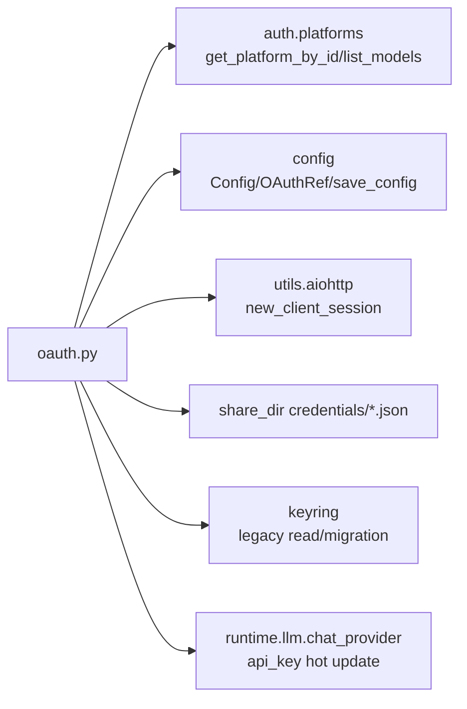
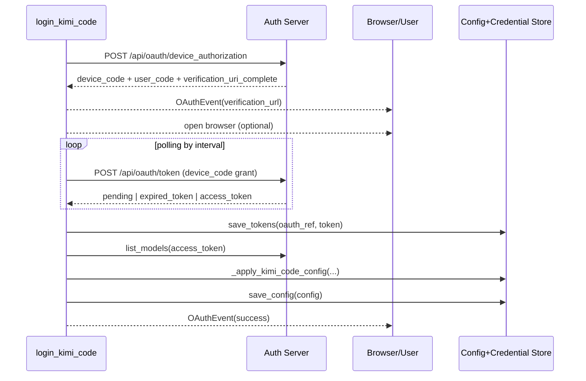
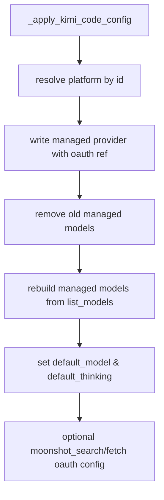
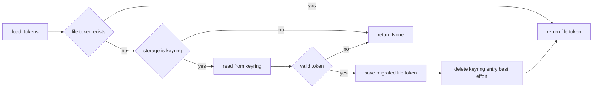
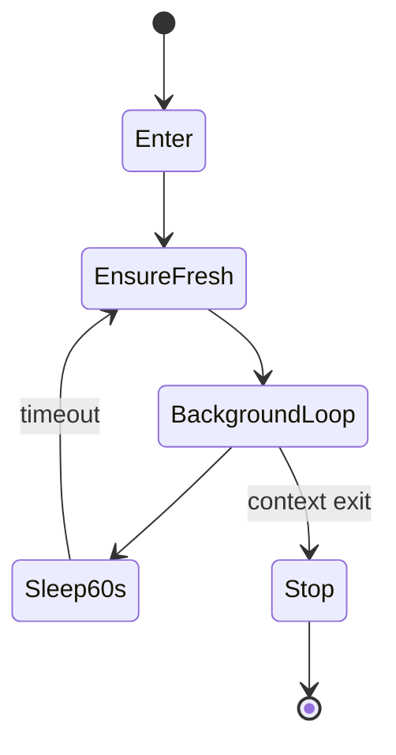

# oauth_flow_and_token_lifecycle

`oauth_flow_and_token_lifecycle` 模块（代码位于 `src/kimi_cli/auth/oauth.py`）是 Kimi CLI 在认证域中的“执行层”，负责把 OAuth Device Authorization（设备码授权）从一次性登录动作扩展为完整的令牌生命周期管理能力。它不仅做“登录拿 token”，还覆盖了令牌持久化、旧存储迁移、后台自动刷新、并发会话冲突处理、登出回收配置，以及运行时 API 凭据热更新。对维护者来说，这个模块的价值在于：它把认证协议细节与业务状态一致性问题集中到一个边界清晰的实现中，避免上层 Runtime、Provider、Config 层重复处理认证复杂度。

从系统关系上看，本模块处于 `auth` 子系统与 `config_and_session`、`platform_registry_and_model_sync`、`kosong_chat_provider` 的交叉点。平台元信息和可用模型来自平台注册层；配置持久化由配置模块完成；实际 token 请求和轮询由本模块发起；最终 access token 则注入到运行时 LLM provider 客户端。也就是说，它是认证状态在“远端 OAuth 服务 ↔ 本地配置 ↔ 运行时调用”之间流动的中枢。

---

## 设计目标与职责边界

该模块的设计目标可以概括为三点。第一，提供面向 CLI 的可恢复设备码登录体验：即使 device code 过期也能自动重启流程。第二，保证令牌在长会话中的持续可用，且在多会话并发刷新时不误删有效凭据。第三，确保登录与登出不仅改变 token 文件，还能同步更新托管 provider/model/service 配置，维持系统可解释性。

职责边界上，本模块不定义平台注册规则、不定义 provider 协议抽象，也不主导 UI 交互细节。它通过 `OAuthEvent` 事件流向上层报告状态，把显示与交互交给 shell/web 端；通过 `Config` 和 `save_config` 操作配置结构，而不重建配置系统；通过 `list_models()` 拉取模型列表，但不负责平台元信息来源。

---

## 模块架构与依赖关系



上图展示了 `oauth.py` 的外围依赖。它通过 `new_client_session()` 与 OAuth 服务通信，通过 `share_dir` 保存凭据，通过 `OAuthRef` 把 provider/service 指向 OAuth token 位置，并在运行时将 access token 写入 Kimi provider 客户端。

如果你想了解平台实体 `Platform/ModelInfo` 的来源和托管键（`managed_provider_key`、`managed_model_key`）约定，请参考 [platform_registry_and_model_sync.md](platform_registry_and_model_sync.md)。如果你想了解 `Config` 的结构与保存行为，请参考 [config_and_session.md](config_and_session.md)。

---

## 核心数据结构

## `OAuthToken`

`OAuthToken` 是该模块在模块树中标注的核心组件，也是令牌生命周期管理的基础载体。它包含 `access_token`、`refresh_token`、`expires_at`、`scope`、`token_type`。其中 `expires_at` 采用绝对时间戳而非原始 `expires_in`，这是刷新判定的关键：任意时刻都可以用 `expires_at - now` 直接计算是否需要刷新。

`from_response(payload)` 负责把 token endpoint 返回值转换成对象，并将 `expires_in` 映射为绝对过期时间。`to_dict()` 与 `from_dict()` 用于持久化读写。`from_dict()` 采用宽容解析策略：字段缺失时给空值或 `0.0`，避免历史文件或损坏数据在反序列化阶段引发崩溃。这种容错会把错误延后到“无法刷新/无法认证”分支处理，从而提高 CLI 可恢复性。

## `OAuthEvent`

`OAuthEvent` 提供统一事件流结构，类型包括 `info`、`error`、`waiting`、`verification_url`、`success`。`login_kimi_code()` 和 `logout_kimi_code()` 均返回 `AsyncIterator[OAuthEvent]`，因此 UI 层可以边消费边渲染，而不是等待函数结束后一次性拿结果。`json` 属性则支持机器通道（例如 web bridge 或测试 harness）直接解析。

## `DeviceAuthorization`

`DeviceAuthorization` 对应设备码申请接口返回内容，保存了轮询必须字段：`device_code`、`user_code`、`verification_uri`、`verification_uri_complete`、`expires_in`、`interval`。登录循环以它为输入，直到成功拿到 token 或判断需要重启流程。

---

## 认证流程详解（登录）



`login_kimi_code(config, open_browser=True)` 的第一道保护是配置路径检查。仅当 `config.is_from_default_location` 为真时才允许登录，这是为了防止 token 与托管 provider 被写入临时配置文件，造成后续行为不可预测。

然后函数会请求设备授权码（`request_device_authorization()`），向上层发送链接事件，并按需调用 `webbrowser.open()`。轮询阶段调用 `_request_device_token()`：当状态是授权等待时发出一次 `waiting` 事件并持续 sleep；当错误码为 `expired_token` 时抛 `OAuthDeviceExpired`，外层捕获后自动重新申请 device code 并继续流程；当返回 `200 + access_token` 时构建 `OAuthToken`。

拿到 token 后，函数调用 `list_models(platform, access_token)` 获取账号可用模型，再通过 `_apply_kimi_code_config()` 重建该平台的托管 provider 与模型映射，设置默认模型/thinking 开关，并根据平台能力写入 `moonshot_search` 与 `moonshot_fetch` 服务 OAuth 配置。最后 `save_config(config)` 持久化并返回成功事件。

---

## 配置更新策略与模型同步逻辑



`_apply_kimi_code_config()` 采用“托管覆盖”策略而不是增量合并。它会先删除所有同 provider 的旧模型，再按最新模型列表重建，这保证了重复登录的幂等性，也保证平台侧模型变化能完整反映到本地配置，不会残留脏数据。

默认模型通过 `_select_default_model_and_thinking(models)` 选择列表第一个模型，并根据 capability（`thinking` 或 `always_thinking`）决定 `default_thinking`。这是一种简洁但有偏好的策略：若平台返回模型排序发生变化，默认模型也会随之改变，因此在产品层应明确“平台返回顺序即默认候选顺序”。

---

## 令牌存储、读取与迁移机制



存储层目前以文件为主，keyring 仅保留向后兼容。`save_tokens()` 看到 `storage="keyring"` 时会打印弃用告警并强制转为文件引用返回。`load_tokens()` 则优先读文件，若文件缺失且 ref 指向 keyring 才尝试读取 keyring，并在读取成功后进行“惰性迁移”。

凭据文件位置为 `get_share_dir()/credentials/<name>.json`，其中 `<name>` 由 `OAuthRef.key` 派生。写入后会尝试 `chmod 0o600`（`_ensure_private_file`），但若系统不支持或失败会静默忽略，以保持跨平台运行。

同一目录下还会维护 `device_id` 文件，用于构造请求头 `X-Msh-Device-Id`。该 ID 首次生成后复用，可在服务端用于设备识别与风控关联。

---

## `OAuthManager`：长会话生命周期控制器

`OAuthManager` 的职责是“把一次登录得到的 token 变成长期稳定的运行时凭据”。它在初始化时会做两件关键工作：迁移配置中仍引用 keyring 的 OAuthRef（并可选保存配置），以及预加载已存在 access token 到内存缓存。

### 内部状态与关键约束

`_access_tokens` 只缓存 access token，不缓存 refresh token；refresh token 每次刷新前都优先从持久化重新读取。这是本模块处理多会话并发刷新的核心设计：任何会话都不应长期相信内存中的 refresh token，因为它可能已被其他会话轮换。

`_refresh_lock` 用于串行化刷新过程，防止同进程内多个协程同时刷新导致覆盖写。

### 核心方法行为

`resolve_api_key(api_key, oauth)` 会优先返回 OAuth access token（缓存或持久化读取），否则回退静态 API key。这样上层调用链可以统一“拿一个最终可用 key”，无需了解认证来源。

`ensure_fresh(runtime)` 会定位 Kimi Code 的 OAuthRef，读取并应用 access token 到运行时，再调用 `_refresh_tokens()` 进行阈值刷新判断。刷新阈值由 `REFRESH_THRESHOLD_SECONDS=300` 定义，即距离过期少于 5 分钟时才刷新。

`refreshing(runtime)` 是 async context manager。进入时立即 `ensure_fresh()`；上下文期间每 `REFRESH_INTERVAL_SECONDS=60` 秒轮询一次刷新；退出时通过 `stop_event + cancel task` 方式优雅收敛后台任务，避免任务泄漏。



### 并发冲突与失败处理

`_refresh_tokens()` 的关键路径是“锁内二次读取 + 过期阈值判断 + 异常分类”。如果刷新返回 `OAuthUnauthorized`，它不会立刻删 token，而是先再次读取持久化凭据；若发现 refresh token 已被其他会话更新，则只同步内存和 runtime，不做删除。只有在确认没有新 token 的情况下才清理存储并清空 runtime key。这个分支直接避免了多终端同时运行时的误删风险。

其他刷新错误（网络异常、服务异常）通常只记 warning 并返回，不中断主任务执行。该策略强调“认证刷新失败不应立刻拖垮正在运行的对话流程”，但代价是如果持续失败，最终会在 token 真正失效后暴露调用错误。

### 运行时注入细节

`_apply_access_token(runtime, access_token)` 仅在当前 `runtime.llm.model_config.provider` 对应 Kimi Code 托管 provider 时生效，并断言 chat provider 是 `kosong.chat_provider.kimi.Kimi`。随后直接写 `runtime.llm.chat_provider.client.api_key = access_token`。这是一种热替换机制，避免重建 provider 实例。

---

## 登出流程与回收语义

`logout_kimi_code(config)` 与登录一样要求默认配置路径。执行时会同时删除 keyring 和文件端 `KIMI_CODE_OAUTH_KEY`，然后从配置中移除托管 provider、删除其模型、必要时清空 `default_model`，并将 `moonshot_search`、`moonshot_fetch` 设为 `None` 后保存。

该行为体现了强回收语义：登出不仅是“删 token”，也是撤销登录期间自动注入的托管能力，确保系统回到显式未认证状态，避免后续请求误用残留模型配置。

---

## 关键函数速查（参数、返回、副作用）

下面给出维护时最常查的函数语义摘要：

- `request_device_authorization() -> DeviceAuthorization`：向 `/api/oauth/device_authorization` 请求设备码。副作用是发起网络请求；失败抛 `OAuthError`。
- `_request_device_token(auth) -> tuple[int, dict[str, Any]]`：轮询 token endpoint。对网络错误、5xx、非 dict 响应抛 `OAuthError`。
- `refresh_token(refresh_token: str) -> OAuthToken`：用 refresh token 换新 token。401/403 抛 `OAuthUnauthorized`，其余失败抛 `OAuthError`。
- `load_tokens(ref) -> OAuthToken | None`：从文件/旧 keyring 读取，可能触发 keyring→file 迁移。
- `save_tokens(ref, token) -> OAuthRef`：保存 token（实际写文件），必要时修正 `OAuthRef.storage`。
- `delete_tokens(ref) -> None`：删除 token；对 keyring 删除失败采取 best-effort。
- `login_kimi_code(config, open_browser=True) -> AsyncIterator[OAuthEvent]`：完整登录流程，含设备码轮询、模型同步、配置落盘。
- `logout_kimi_code(config) -> AsyncIterator[OAuthEvent]`：完整登出流程，含 token 清理与托管配置移除。

---

## 使用示例

```python
from kimi_cli.auth.oauth import OAuthManager, login_kimi_code

# 登录：逐事件消费，适合 CLI UI/WebSocket 转发
async for ev in login_kimi_code(config, open_browser=True):
    print(ev.type, ev.message)
    if ev.type == "verification_url":
        print(ev.data["verification_url"])

# 运行时：把自动刷新生命周期绑定到一次 run
manager = OAuthManager(config)
async with manager.refreshing(runtime):
    await runtime.run()
```

如果你在 provider 初始化阶段只想拿一个可用凭据值，可直接：

```python
resolved_key = manager.resolve_api_key(provider.api_key, provider.oauth)
```

---

## 边界条件、错误语义与运维注意事项

首先，配置来源限制是最常见“看似失败”的原因。只要不是默认配置路径，登录和登出都会发出 `error` 事件并退出。这不是 bug，而是故意保护策略。

其次，凭据文件损坏时（JSON 非法或结构异常）读取会返回 `None`，系统通常表现为“像未登录一样继续”。运维排障时应优先检查 `share_dir/credentials/*.json` 完整性与文件权限。

再次，`_common_headers()` 会把 header 值强制 ASCII 化，非 ASCII 字符会被剥离。这有助于兼容严格代理/网关，但可能导致设备名显示与本机实际名称不完全一致。

另外需要注意的是，刷新失败大多只记录 warning 并不中断业务；因此日志中连续出现 `Failed to refresh OAuth token` 往往是“提前预警”，若不处理，稍后可能演化为请求认证失败。

安全方面，token 文件是明文 JSON，只通过目录位置与文件权限控制暴露面。对于多用户共享主机，建议配合账户隔离和磁盘加密，不要把 share 目录放在弱权限网络盘。

---

## 扩展建议

如果未来要支持其他 OAuth 平台，可以沿用本模块的三层抽象：令牌模型（`OAuthToken`）+ 流程函数（device auth / refresh）+ 生命周期管理器（`OAuthManager`）。新增平台时建议把“平台元信息与模型发现”继续放在平台注册模块，认证模块只处理令牌流转、存储和运行时注入，从而保持边界稳定。

若要提升通用性，可以进一步把 `_apply_access_token()` 的 Kimi 特化逻辑抽象为 provider 适配接口，减少对 `Kimi` 类型断言的耦合。

---

## 参考文档

- [auth.md](auth.md)
- [platform_registry_and_model_sync.md](platform_registry_and_model_sync.md)
- [config_and_session.md](config_and_session.md)
- [kimi_provider.md](kimi_provider.md)
- [kosong_chat_provider.md](kosong_chat_provider.md)
