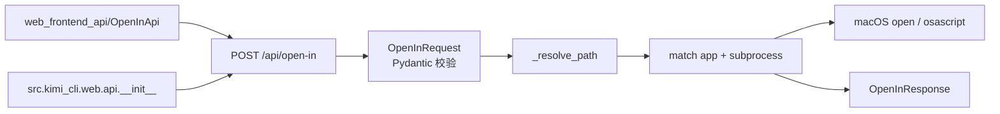
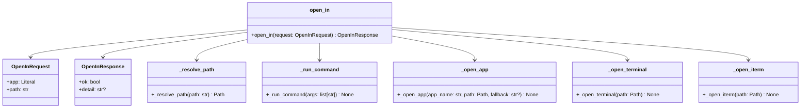
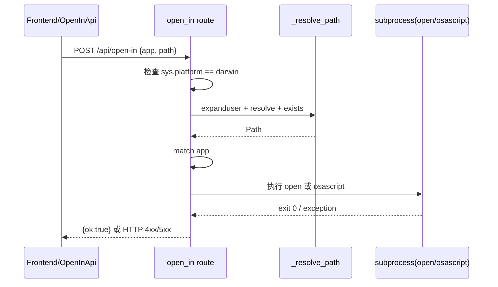
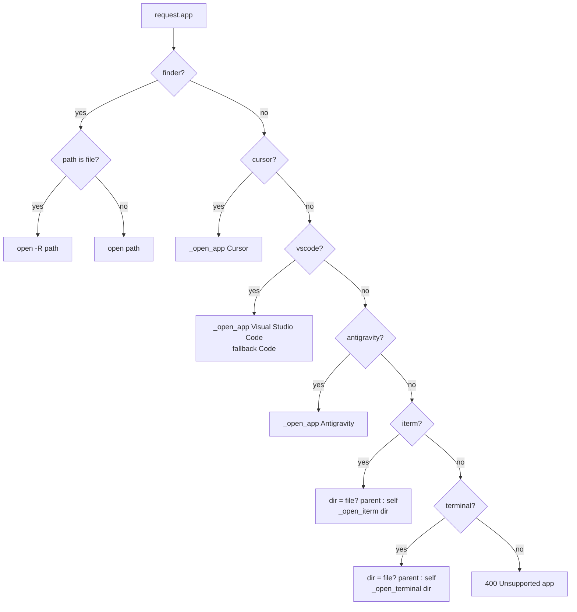

# open_in_api 模块文档

`open_in_api` 对应后端实现 `src/kimi_cli/web/api/open_in.py`，是 `web_api` 子系统中的一个“宿主机集成型”接口模块。它的职责非常聚焦：接收前端请求后，在**运行 Web 服务的本机（host machine）**上调用系统命令，把某个文件或目录在指定本地应用中打开，例如 Finder、VS Code、Cursor、Terminal、iTerm 等。

这个模块存在的意义，是把“用户在 Web 界面里点击‘在本地打开’”这种高频交互，从前端无法直接完成的动作（浏览器不能直接启动本地 App）转化为后端可控的系统调用。与 `sessions_api` 负责会话生命周期、`config_api` 负责配置管理不同，`open_in_api` 主要解决的是**体验链路最后一跳**：让 Web UI 和本地开发工具形成无缝跳转。

从设计取舍上看，该模块采用了最小接口面：一个 POST 路由、一个请求模型、一个响应模型，再配合少量私有辅助函数完成路径解析和命令执行。这样可以保持行为可预测、故障边界清晰，也便于后续扩展更多应用适配。

---

## 1. 模块定位与系统关系

在 `web_api` 分层中，`open_in_api` 是一个轻量但偏“系统边界”的模块。它不维护业务状态、不读写会话存储，也不参与模型推理；它直接与操作系统能力交互（`open`、`osascript`）。



这张图表达了 `open_in_api` 的核心事实：它是一个“输入校验 + 路由分发 + 命令执行”的薄层。路由通过 `src/kimi_cli/web/api/__init__.py` 导出为 `open_in_router`，从而被整个 Web 服务挂载并对前端开放。

如果你想了解会话、配置等其他 Web API 语义，建议参考 [sessions_api.md](sessions_api.md)、[config_api.md](config_api.md) 和 [data_models.md](data_models.md)。本文只聚焦 open-in 能力本身。

---

## 2. 对外契约（API Contract）

## 2.1 路由

模块暴露单一端点：

- `POST /api/open-in`

路由定义位于 `router = APIRouter(prefix="/api/open-in", tags=["open-in"])`，因此路径固定、语义明确。

## 2.2 请求模型：`OpenInRequest`

`OpenInRequest` 是本模块在模块树中声明的核心组件，定义如下：

- `app: Literal["finder", "cursor", "vscode", "iterm", "terminal", "antigravity"]`
- `path: str`

`app` 使用 `Literal` 而非自由字符串，意味着 Pydantic 会在路由执行前做强约束校验。非法值会触发 FastAPI 标准 422（验证失败），不会进入后续命令执行逻辑。

`path` 接受字符串路径，后续由 `_resolve_path` 做 `expanduser + resolve + exists` 校验。

## 2.3 响应模型：`OpenInResponse`

返回模型：

- `ok: bool`
- `detail: str | None = None`

当前成功路径返回 `{"ok": true}`。`detail` 字段主要用于兼容可能的扩展；实际错误信息目前通过 `HTTPException` 的 `detail` 字段返回，而不是返回 `ok=false` 结构。

---

## 3. 内部组件与执行机制

虽然模块树只标注了 `OpenInRequest`，但要理解行为必须一起看几个关键私有函数。



## 3.1 `_resolve_path(path: str) -> Path`

这个函数负责路径标准化与存在性校验，行为顺序是：

1. `Path(path).expanduser()`：支持 `~`。
2. `resolve()`：得到绝对路径并尝试解析。
3. 若 `resolve()` 抛 `FileNotFoundError`，返回 `400 Path does not exist`。
4. 再次显式 `exists()` 检查，不存在也返回 `400`。

这里的双重检查虽然看起来有些冗余，但能把“解析阶段异常”和“最终存在性失败”统一为可理解的 400 错误语义。

## 3.2 `_run_command(args: list[str]) -> None`

统一封装子进程调用：

- `subprocess.run(..., check=True, capture_output=True, text=True)`

`check=True` 让非零退出码直接抛 `subprocess.CalledProcessError`，供上层集中处理。`capture_output=True` 使 stderr 可用于 HTTP 500 错误详情回传（`exc.stderr`）。

## 3.3 `_open_app(app_name, path, fallback=None)`

这是通用“按 App 名称打开路径”的封装，执行：

- 主命令：`open -a <app_name> <path>`
- 若失败且提供 `fallback`，记录 warning 后尝试 fallback。

当前典型用法是 VS Code：先尝试 `Visual Studio Code`，失败后回退 `Code`，兼容不同安装命名。

## 3.4 `_open_terminal(path)` 与 `_open_iterm(path)`

这两个函数使用 AppleScript（`osascript -e ...`）而不是 `open -a`，目的是在终端中直接执行 `cd` 到目标目录，而不是仅打开 App。

- `_open_terminal`：给系统 Terminal 发送 `do script "cd ..."`。
- `_open_iterm`：给 iTerm 发送“创建窗口 + 当前 session 写入 `cd ...`”脚本；若 `iTerm` 名称失败，会自动替换为 `iTerm2` 再试一次。

这个设计体现了“功能语义优先”：对终端类应用，用户期望的是进入目录，而不是仅启动程序。

## 3.5 路由处理函数：`open_in(request)`

该函数是完整流程编排器：

1. 平台检查：`sys.platform != "darwin"` 则直接 `400`（仅支持 macOS）。
2. 路径解析：调用 `_resolve_path`。
3. 判断 `is_file = path.is_file()`。
4. 按 `request.app` 分支执行命令。
5. 捕获 `CalledProcessError`，写日志并转换为 `500`。
6. 成功返回 `OpenInResponse(ok=True)`。

其中 `finder`、`iterm`、`terminal` 对“文件 vs 目录”有专门分支逻辑，见下一节流程图。

---

## 4. 详细流程与数据流

## 4.1 请求到系统调用的主流程



这个流程中最重要的边界是：路径存在性错误在 400 层返回；系统命令失败在 500 层返回。也就是说，调用方可以大致通过状态码区分“请求错误”和“执行失败”。

## 4.2 应用分支决策



这个决策树体现了一个关键产品细节：`iterm`/`terminal` 永远使用目录。如果用户传的是文件，模块会自动切换到其父目录，以保证 `cd` 命令语义成立。

---

## 5. 错误语义、边界条件与限制

`open_in_api` 的错误处理较为直接，但有几个实际开发中常见的“坑”需要注意。

首先，平台限制是硬编码在路由中的。只要不是 macOS（`darwin`），接口必然返回 400。这并不是“当前机器没装某个 App”的问题，而是模块设计层面不支持 Linux/Windows。

其次，路径必须在后端机器上真实存在。前端传入的是字符串，但真正解析发生在服务进程宿主机上。如果你是远程部署 Web 服务，`/Users/alice/project` 这类本地路径对服务器未必存在，会直接报 400。

再次，系统命令失败会被映射为 500，并尽量返回 stderr。常见触发条件包括：

- 目标应用未安装或命名不匹配。
- `osascript` 调用受系统权限策略限制。
- 终端应用脚本接口不可用（例如 iTerm 自动化被禁用）。

另外，`OpenInRequest.app` 已做 Literal 校验，理论上“Unsupported app”分支通常不会由正常请求触发；该分支更多是防御性代码，避免未来改动或绕过校验时出现未定义行为。

最后，模块当前没有额外的“敏感 API 开关”（不同于 `config_api` 的 `restrict_sensitive_apis` 守卫模式），因此其可用性主要依赖整体 Web 鉴权与部署边界控制（参考 [auth.md](auth.md) 以及 `auth_and_security` 文档）。

---

## 6. 使用方式与示例

## 6.1 直接调用 HTTP API

```bash
curl -X POST http://localhost:8000/api/open-in \
  -H "Content-Type: application/json" \
  -d '{
    "app": "finder",
    "path": "~/projects/my-repo"
  }'
```

成功响应：

```json
{
  "ok": true,
  "detail": null
}
```

失败示例（非 macOS）：

```json
{
  "detail": "Open-in is only supported on macOS."
}
```

## 6.2 前端 SDK 调用（`web_frontend_api/OpenInApi`）

前端已通过 OpenAPI 生成 `web/src/lib/api/apis/OpenInApi.ts`，核心调用方法为 `openInApiOpenInPost`。

```ts
import { OpenInApi } from "../lib/api/apis/OpenInApi";

const api = new OpenInApi({ basePath: "http://localhost:8000" });

await api.openInApiOpenInPost({
  openInRequest: {
    app: "vscode",
    path: "/Users/me/work/project/src/main.py",
  },
});
```

如果请求体缺失，生成 SDK 会在前端侧先抛 `RequiredError`，避免发出无效请求。

---

## 7. 可扩展性与二次开发建议

如果你要新增一个可打开的应用（比如 `sublime`），建议沿着现有模式扩展：先更新 `OpenInRequest.app` 的 `Literal`，再在 `match` 中新增 `case` 分支，并明确文件/目录语义。

一个推荐的演进方式是把“应用 -> 执行策略”抽成可配置映射，而不是继续增长 `match` 分支。当前实现在应用数量少时可读性很好，但当支持平台和应用增多后，策略映射更利于维护和测试。

扩展时还应明确三个维度：

- 平台行为：是仅 macOS，还是为 Linux/Windows 增加分支。
- 路径语义：文件直接打开、目录打开，还是“文件转父目录”。
- 失败降级：是否支持 fallback（类似 VS Code 与 iTerm2）。

---

## 8. 测试与运维关注点

建议至少覆盖以下测试场景：

- `app` 非法值（应 422）。
- 非 macOS 平台调用（应 400）。
- 路径不存在（应 400）。
- `finder` 文件路径应使用 `open -R`。
- `terminal`/`iterm` 文件路径应转父目录。
- 子进程失败应回 500，且 detail 含 stderr（若有）。

运维层面，日志中会记录 warning（`Open-in failed...`、fallback 失败信息）。若线上用户反馈“点击无反应”，应先检查服务所在机器是否确实是预期宿主、目标应用是否安装，以及自动化权限是否允许 `osascript` 控制终端应用。

---

## 9. 与其他模块的关系索引

- Web API 总体数据契约：见 [data_models.md](data_models.md)
- 会话管理主接口：见 [sessions_api.md](sessions_api.md)
- 配置管理接口：见 [config_api.md](config_api.md)
- 鉴权与安全中间件：见 [auth.md](auth.md)
- 前端 OpenAPI 客户端封装：见 [frontend_open_in_api_client.md](frontend_open_in_api_client.md)

`open_in_api` 本身保持了最小耦合：它几乎不依赖业务域对象，因此易于单独维护；但也正因如此，它对部署环境（平台、应用安装、系统权限）的依赖比普通 CRUD API 更强，使用时需要把“代码正确性”和“环境可执行性”同时纳入排障思路。对于部署在远程主机或容器中的场景，建议在产品层明确提示“Open In 将作用于服务端宿主机”这一行为边界，避免用户误解为“打开调用方本机应用”。