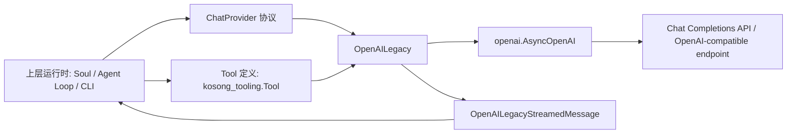
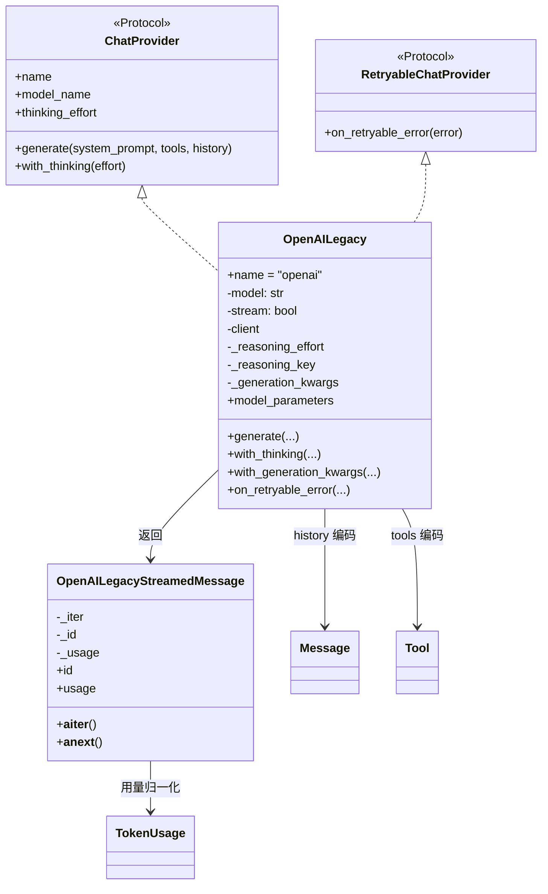
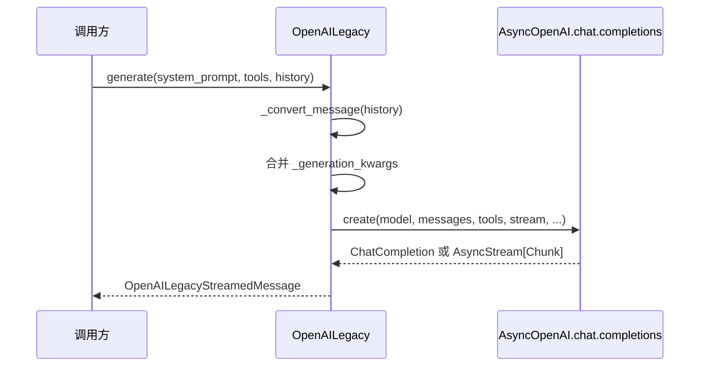
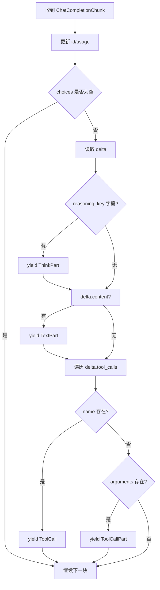
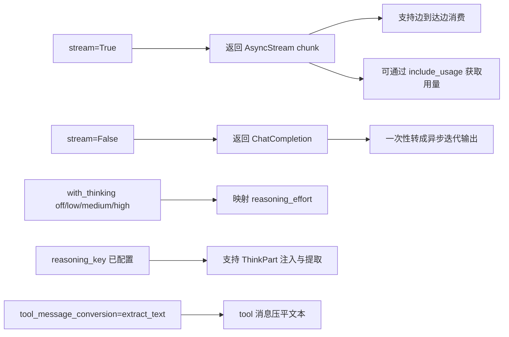

# openai_legacy_provider 模块文档

## 模块概述

`openai_legacy_provider` 对应实现文件 `packages/kosong/src/kosong/contrib/chat_provider/openai_legacy.py`，是 `kosong_contrib_chat_providers` 中面向 **OpenAI Chat Completions API**（以及兼容该 API 的服务）的适配层。它的目标不是简单把 SDK 包一层，而是把 `kosong` 内部统一消息协议（`Message`、`Tool`、`StreamedMessagePart`、`TokenUsage`、统一异常语义）稳定映射到旧版 Chat Completions 接口，确保上层 Agent/循环逻辑可以在多家 provider 之间切换而不重写业务代码。

这个模块被称为“legacy”，核心原因是 `openai` 生态里同时存在 Chat Completions 与 Responses 两套接口范式。`openai_legacy_provider` 专注兼容 Chat Completions 风格，包括其 `messages`、`tool_calls`、`stream chunk` 等数据模型；如果你的系统迁移到新的 Responses 语义，应参考 `openai_responses_provider` 对应文档（见 [openai_responses_provider.md](./openai_responses_provider.md)）。

在工程实践中，该模块的价值主要体现在三点：第一，它提供统一的流式消费接口，把流式与非流式结果都变成同一异步迭代模型；第二，它支持 thinking/reasoning 参数桥接，使上层可以继续使用 `with_thinking("low"|"medium"|"high"|"off")`；第三，它对 OpenAI SDK 与 `httpx` 错误做统一映射，配合 `RetryableChatProvider` 的恢复钩子，使上层重试策略保持一致。

---

## 在系统中的位置与边界



`OpenAILegacy` 的职责是“请求侧协议适配 + 响应侧分片解码入口”。它不负责工具实际执行、不负责历史持久化、不负责会话压缩，也不负责重试调度策略本身；这些职责在上层模块中实现。关于通用 provider 协议、错误层次和 `TokenUsage`，请参考 [provider_protocols.md](./provider_protocols.md) 与 [kosong_chat_provider.md](./kosong_chat_provider.md)。

---

## 组件总览

虽然模块树把 `GenerationKwargs` 标为核心组件，但从可维护角度必须同时理解以下实现：

- `OpenAILegacy`
- `OpenAILegacy.GenerationKwargs`
- `OpenAILegacyStreamedMessage`
- `_convert_message()`（`OpenAILegacy` 私有方法）
- `_convert_non_stream_response()` 与 `_convert_stream_response()`（`OpenAILegacyStreamedMessage` 私有方法）
- 依赖函数（来自 `openai_common`）：
  - `create_openai_client`
  - `convert_error`
  - `tool_to_openai`
  - `thinking_effort_to_reasoning_effort`
  - `reasoning_effort_to_thinking_effort`
  - `close_replaced_openai_client`

---

## 架构与交互关系



该结构体现出一个清晰设计：`OpenAILegacy` 专注构建 API 请求和配置组合，`OpenAILegacyStreamedMessage` 专注把 API 响应转换成 `StreamedMessagePart`。这让请求编码与响应解码可以独立演进，也降低了未来迁移到其它 OpenAI API 形态时的耦合度。

---

## `GenerationKwargs`（核心组件）详解

`OpenAILegacy.GenerationKwargs` 是 `TypedDict(total=False, extra_items=Any)`。这是一种“强约束字段 + 允许额外键”的折中设计：常见字段有类型提示，同时允许接入 OpenAI-compatible 平台的自定义参数而不被类型系统阻止。

当前显式声明字段包括：

- `max_tokens: int | None`
- `temperature: float | None`
- `top_p: float | None`
- `n: int | None`
- `presence_penalty: float | None`
- `frequency_penalty: float | None`
- `stop: str | list[str] | None`
- `prompt_cache_key: str | None`

由于 `extra_items=Any`，你还可以传递未列出的参数（例如某些兼容网关扩展字段）。这提升了兼容性，但也意味着参数拼写错误可能静默透传到底层 API，直到请求时报错，维护时应配合日志与测试审查。

---

## `OpenAILegacy`：请求构建、配置管理与恢复语义

## 初始化行为

构造函数（简化）如下：

```python
OpenAILegacy(
    model: str,
    api_key: str | None = None,
    base_url: str | None = None,
    stream: bool = True,
    reasoning_key: str | None = None,
    tool_message_conversion: ToolMessageConversion | None = None,
    **client_kwargs: Any,
)
```

初始化时会持久化模型名、流式开关、认证与网关参数，并通过 `create_openai_client()` 创建 `AsyncOpenAI` 客户端。`reasoning_key` 用来兼容一类“把推理文本放在 message 额外字段”的 OpenAI-compatible 接口；`tool_message_conversion` 用于调整 tool 角色消息的编码策略（见后文 `_convert_message`）。

内部重要状态含义：

- `_reasoning_effort`：默认 `omit`（不是 `None`），表示“不向 API 显式发送 reasoning_effort 字段”。
- `_generation_kwargs`：默认空字典，可通过 `with_generation_kwargs()` 叠加。
- `client`：底层 `AsyncOpenAI` 实例。

## `model_name` 与 `thinking_effort`

`model_name` 直接返回 `self.model`。

`thinking_effort` 会把 `_reasoning_effort` 映射到统一语义：当 `_reasoning_effort` 是 `omit` 时返回 `None`（未显式设置）；否则通过 `reasoning_effort_to_thinking_effort()` 转成 `off/low/medium/high`。这保持了与 `provider_protocols` 中三态语义一致（未设置 ≠ 显式关闭）。

## `generate(system_prompt, tools, history)`

这是主入口方法，流程如下：



实现细节值得关注：

1. 若 `system_prompt` 非空，会先插入 `{"role": "system", "content": ...}`。注释中明确说明：尽管 OpenAI 推荐 `developer` 角色，但很多“兼容模型”不接受 `developer`，因此 legacy provider 固定使用 `system`。
2. `history` 中每条 `Message` 都经过 `_convert_message()`，会处理 `ThinkPart`、tool 消息特殊策略和 `reasoning_key` 注入。
3. 工具通过 `tool_to_openai(tool)` 转为 `ChatCompletionToolParam`。
4. 当 `stream=True`，额外发送 `stream_options={"include_usage": True}`，使流中可回传 usage；非流模式则传 `omit`。
5. 捕获 `OpenAIError` 和 `httpx.HTTPError`，统一通过 `convert_error()` 转为 `ChatProviderError` 体系。

返回值是 `OpenAILegacyStreamedMessage`，即使是非流请求也统一成可异步迭代对象。

## `on_retryable_error(error)`

该方法实现了 `RetryableChatProvider` 钩子。当前策略是**总是重建 client 并返回 `True`**：

1. 保存旧 client。
2. 使用原参数创建新 client。
3. 调用 `close_replaced_openai_client(old_client, client_kwargs=...)` 关闭旧客户端（内部会避免误关共享 `http_client`）。

这是一种“传输层重置”语义，适合连接破损、DNS/网络短故障后的恢复。调用方仍需自己决定是否重试。

## `with_thinking(effort)`

该方法返回浅拷贝实例，并把 `_reasoning_effort` 设为映射值：

- `off -> None`
- `low -> "low"`
- `medium -> "medium"`
- `high -> "high"`

注意：`with_thinking("off")` 与“从未设置 thinking”不同。前者会显式把 `reasoning_effort=None` 发送给 API；后者是 `omit`，不发送该字段。

## `with_generation_kwargs(**kwargs)`

该方法采用不可变风格：复制 provider、深拷贝旧 kwargs、再 `update()` 新值并返回。这样在并发场景中可以把 provider 当模板安全复用，避免多个请求互相污染配置。

## `model_parameters`

该属性用于 tracing/logging，至少包含：

- `base_url`
- `reasoning_effort`（仅当不是 `omit` 时）

它不会返回全部 request 参数，仅反映模型级关键上下文。

## `_convert_message(message)`

这是请求侧最关键的转换函数。它的行为分三层：

第一层是 `ThinkPart` 剥离。函数会把消息中的 `ThinkPart` 聚合成字符串 `reasoning_content`，其他 part 保留在 `content` 列表中。

第二层是 tool 消息特殊处理：当 `message.role == "tool"` 且 `tool_message_conversion == "extract_text"` 时，会把所有文本合并为一个 `TextPart(text=message.extract_text(sep="\n"))`，目的是利用 `Message` 的序列化逻辑输出字符串内容，提升对某些兼容后端的适配性。

第三层是序列化与 reasoning 注入。`message.model_dump(exclude_none=True)` 后，如果存在 `reasoning_content`，会把它塞入 `dumped_message[self._reasoning_key]`。若有 thinking 内容但 `reasoning_key` 未设置，会触发断言失败。

这意味着：一旦上游 history 包含 `ThinkPart`，调用方必须确保 provider 初始化时传了 `reasoning_key`，否则请求阶段会直接报错。

---

## `OpenAILegacyStreamedMessage`：流/非流统一解码

`OpenAILegacyStreamedMessage` 构造时可接收两种响应：

- `ChatCompletion`（非流）
- `AsyncStream[ChatCompletionChunk]`（流）

内部选择不同转换器生成 `_iter`，对外统一暴露 `__aiter__` / `__anext__`，因此上层消费代码不需要区分模式。

## `id` 与 `usage`

- `id`：在流/非流解析过程中从响应对象更新。
- `usage`：把 OpenAI `CompletionUsage` 映射为统一 `TokenUsage`。

映射规则是：

1. `input_other` 初始取 `prompt_tokens`。
2. 若 `prompt_tokens_details.cached_tokens` 存在，则
   - `input_cache_read = cached_tokens`
   - `input_other -= cached_tokens`
3. `output = completion_tokens`

因此该 provider 能体现 prompt cache 命中消耗，但不区分 cache creation（保持默认 0）。

## `_convert_non_stream_response(response)`

非流模式下会一次性处理 `choices[0].message`：

1. 设置 `_id`、`_usage`。
2. 若配置了 `reasoning_key` 且 message 上有对应字段，产出 `ThinkPart`。
3. 若 `message.content` 非空，产出 `TextPart`。
4. 若有 `message.tool_calls`，逐个转成 `ToolCall`（缺失 ID 时自动生成 UUID）。

这里会忽略非 `ChatCompletionMessageFunctionToolCall` 的工具调用类型，避免把未知结构错误映射为 `ToolCall`。

## `_convert_stream_response(response)`

流模式下逐 chunk 转换，关键逻辑包括：

1. 持续更新 `_id` 与 `_usage`（usage 往往在末尾 chunk 到达）。
2. 只处理 `choices[0].delta`。
3. 若 `delta` 中含 reasoning 字段，产出 `ThinkPart`。
4. 若 `delta.content` 存在，产出 `TextPart`。
5. 工具调用增量处理：
   - 当 `tool_call.function.name` 存在：产出完整 `ToolCall`（包含当前 arguments 片段）。
   - 当只有 `tool_call.function.arguments`：产出 `ToolCallPart(arguments_part=...)`。
   - 空调用片段跳过。

异常同样捕获 `OpenAIError` 与 `httpx.HTTPError` 并映射为统一错误。



---

## 与其它模块的协作关系

该模块是 contrib provider 之一，协议层与基础能力复用关系如下：

- 协议契约与错误体系：见 [provider_protocols.md](./provider_protocols.md)
- provider 总览与扩展模式：见 [kosong_chat_provider.md](./kosong_chat_provider.md)
- 其它厂商对照：
  - [anthropic_provider.md](./anthropic_provider.md)
  - [google_genai_provider.md](./google_genai_provider.md)
  - [openai_responses_provider.md](./openai_responses_provider.md)

建议不要在上层业务直接依赖 `OpenAILegacyStreamedMessage` 内部细节，而应始终面向 `StreamedMessagePart` 联合类型消费。

---

## 典型使用方式

## 基础调用

```python
from kosong.contrib.chat_provider.openai_legacy import OpenAILegacy
from kosong.message import Message

provider = OpenAILegacy(
    model="gpt-4o",
    api_key="YOUR_API_KEY",
    stream=True,
)

stream = await provider.generate(
    system_prompt="你是一个严谨的代码助手",
    tools=[],
    history=[Message(role="user", content="解释一下 async generator")],
)

async for part in stream:
    print(part)

print("id:", stream.id)
print("usage:", stream.usage)
```

## 叠加 generation 参数

```python
p2 = provider.with_generation_kwargs(
    temperature=0.2,
    top_p=0.95,
    max_tokens=2048,
    prompt_cache_key="session-42",
)
```

## 开启 thinking 映射

```python
p3 = provider.with_thinking("medium")
# 返回新实例，不修改 provider 本体
```

## 兼容 reasoning 字段注入/提取

```python
p4 = OpenAILegacy(
    model="some-compatible-model",
    reasoning_key="reasoning",  # 例如接口使用额外字段承载推理文本
)
```

---

## 边界条件、错误场景与已知限制

这个模块在兼容性上很实用，但也有若干需要明确的操作约束。

首先，`ThinkPart` 与 `reasoning_key` 是强耦合的。如果 history 中出现了 `ThinkPart`，但 provider 未配置 `reasoning_key`，`_convert_message` 会断言失败。这不是可恢复网络错误，而是调用参数/数据模型不一致，应在业务层提前规避。

其次，工具调用流式分片存在“完整调用 + 参数增量”混合输出：当 chunk 先给出 name，再多次补 arguments 时，上层需要正确 merge `ToolCall` 与后续 `ToolCallPart`。如果消费端只处理 `ToolCall` 而忽略 `ToolCallPart`，会拿到不完整参数。

第三，`with_thinking("off")` 与默认未设置不是同一语义。默认状态是 `omit`，不会发送字段；`off` 则发送 `reasoning_effort=None`。某些兼容后端可能对两者行为不同。

第四，`on_retryable_error()` 当前不区分错误类型、总是重建 client 并返回 `True`。如果上层把不可重试错误也喂给该钩子，虽然不会立即失败，但可能造成无意义重建。建议调用方只在传输类异常（连接中断、超时等）时使用。

第五，`GenerationKwargs` 允许 extra items，这提高了兼容性，也增加了配置拼写错误风险。建议在生产中结合请求日志、参数白名单或集成测试做校验。

第六，非流模式下仅消费 `choices[0]`，若 API 返回多候选（例如 `n>1`），当前实现不会暴露其它候选。上层若有多候选需求，需要扩展此逻辑。

---

## 可扩展与维护建议

如果你计划扩展该模块，建议保持以下方向：请求侧继续通过 `with_generation_kwargs` 承载供应商差异字段，避免在 `generate()` 内散落大量特判；响应侧新增字段时优先做向后兼容（未知分片跳过或降级），避免因为单一字段变动导致整个流崩溃；对于 `tool_calls` 解析，务必保留“完整调用 + 增量调用”的双通道语义。

如果你的系统正在从 Chat Completions 迁移到 Responses API，可以把 `OpenAILegacy` 当作兼容层逐步替换：先确保上层只依赖 `ChatProvider` 协议，再切换 provider 实现并比较 `StreamedMessagePart` 行为差异，这样迁移风险最低。

---

## 关键 API 参考（按调用顺序）

下面给出一个更贴近源码的“调用期”视角，帮助你在调试时快速定位行为。

### `OpenAILegacy.__init__(...)`

该构造函数除了保存传入配置，还会立即调用 `create_openai_client(...)` 创建底层 `AsyncOpenAI`。这意味着实例化阶段就会固定 `api_key`、`base_url` 与 `client_kwargs` 的初始值。后续即便发生 `on_retryable_error()` 重建客户端，也会使用这组初始参数。

一个容易忽略的副作用是：`client_kwargs` 如果包含共享 `http_client`，provider 的生命周期就与外部连接池策略产生耦合。模块通过 `close_replaced_openai_client()` 显式规避“重建时误关共享连接池”的问题。

### `OpenAILegacy.generate(system_prompt, tools, history)`

这个方法的输入输出契约如下：

- 输入 `system_prompt`：`str`，空字符串时不会生成 system message。
- 输入 `tools`：`Sequence[Tool]`，会被惰性转换为 OpenAI `tools` 参数。
- 输入 `history`：`Sequence[Message]`，逐条经过 `_convert_message`。
- 输出：`OpenAILegacyStreamedMessage`，统一异步迭代接口。

它的关键副作用是对远端服务发起一次 completion 请求，并可能在流式过程中逐步更新 `stream.id` / `stream.usage`。注意 `usage` 在流式场景通常不是第一时间可用，很多情况下要等到尾部 chunk 才完整。

### `OpenAILegacy.on_retryable_error(error)`

虽然参数名是 `error`，但当前实现并不按错误类型分支。它始终执行“替换 client”动作并返回 `True`。如果你的重试框架会在指数退避期间多次调用该钩子，要意识到这会反复创建包装客户端对象；通常影响不大，但在高频故障风暴时会增加对象抖动。

### `OpenAILegacy.with_thinking(effort)` / `with_generation_kwargs(**kwargs)`

两者都返回“复制后的新 provider”，不会原地修改对象，因此非常适合把基础 provider 当模板复用。在多协程并发场景里，这是避免共享可变状态污染的关键设计。

### `OpenAILegacyStreamedMessage.usage`

`usage` 属性读取的是当前缓存到 `_usage` 的值，并即时转换为 `TokenUsage`。在流尚未结束时读取，可能得到 `None` 或不完整值；建议在消费完迭代器后再读取最终统计。

---

## 配置与行为矩阵



这个矩阵体现了几个组合效应：`stream` 影响的是“传输与解码模式”；`with_thinking` 和 `reasoning_key` 影响的是“推理内容字段映射”；`tool_message_conversion` 影响的是“tool 角色消息编码方式”。它们互相独立，但会在同一次 `generate()` 中叠加生效。

---

## 扩展示例：实现一个定制化 Provider 工厂

如果你的工程需要按环境动态注入 base URL、统一温度参数、并为某些模型开启 reasoning 字段，可以封装一个小工厂函数，而不是在业务代码到处散落配置：

```python
from kosong.contrib.chat_provider.openai_legacy import OpenAILegacy


def build_provider(env: str) -> OpenAILegacy:
    if env == "prod":
        p = OpenAILegacy(
            model="gpt-4o",
            base_url="https://api.openai.com/v1",
            stream=True,
            reasoning_key="reasoning",
        )
    else:
        p = OpenAILegacy(
            model="gpt-4o-mini",
            base_url="https://your-compatible-gateway.example/v1",
            stream=True,
        )

    return p.with_generation_kwargs(
        temperature=0.2,
        top_p=0.95,
    )
```

这种封装让你在后续从 `openai_legacy_provider` 迁移到 `openai_responses_provider` 时，只需要替换工厂内部实现，对调用方几乎透明。

---

## 故障排查建议

当你遇到“为什么模型没按预期返回”的问题，可以按下面顺序检查：

1. 先看请求参数是否被覆盖：特别是 `with_generation_kwargs()` 多次链式调用后是否引入了冲突键。
2. 再看 history 里是否混入 `ThinkPart` 但未配置 `reasoning_key`，这会在请求转换阶段触发断言。
3. 检查工具调用拼接逻辑是否正确处理了 `ToolCallPart`，否则常见现象是 JSON 参数截断。
4. 如果是偶发连接问题，确认上层是否在重试前调用了 `on_retryable_error()`，并且没有把业务错误误判为可重试传输错误。
5. 对 OpenAI-compatible 网关，优先记录 `model_parameters` 和实际发送的 generation kwargs，排查兼容方言差异。

这些检查步骤可以与 [provider_protocols.md](./provider_protocols.md) 中的统一错误分类一起使用，能明显缩短定位时间。

---

## 小结


`openai_legacy_provider` 的本质是一个针对 Chat Completions 生态的稳定适配器：它把 `kosong` 统一对话协议映射到 OpenAI/兼容接口，并把流式与非流式输出统一为可迭代分片模型。对开发者而言，它降低了多 provider 切换成本；对维护者而言，重点关注 message 转换规则、thinking 与 reasoning 映射、工具调用增量拼接、以及重试恢复语义，即可高效排障与演进。
