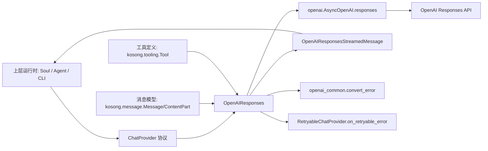
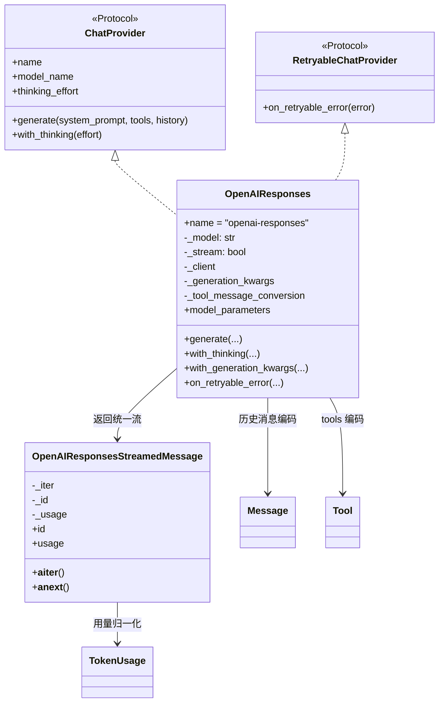
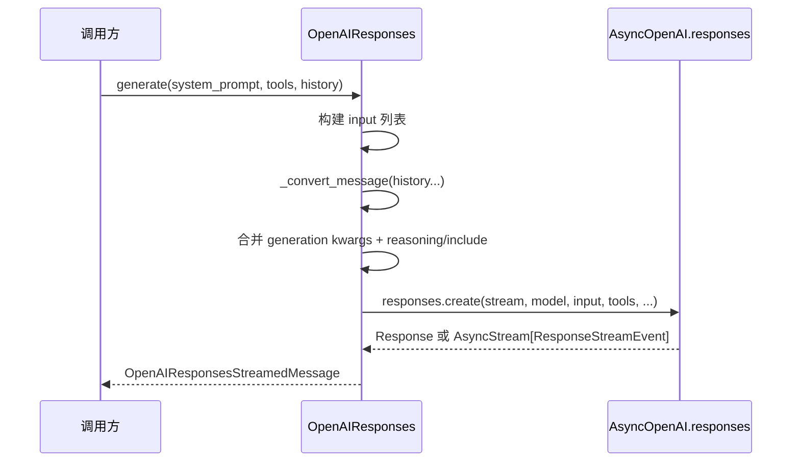
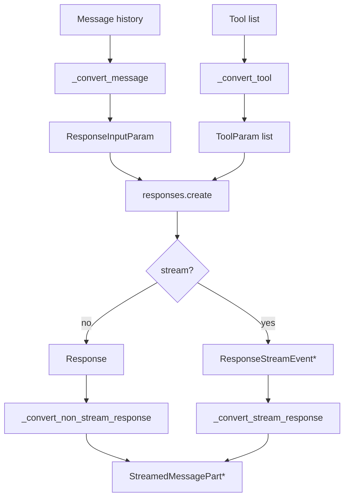
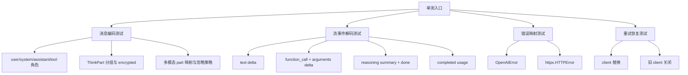

# openai_responses_provider 模块文档

## 模块简介与设计目标

`openai_responses_provider` 对应实现文件 `packages/kosong/src/kosong/contrib/chat_provider/openai_responses.py`，是 `kosong_contrib_chat_providers` 中面向 **OpenAI Responses API** 的适配实现。它的核心职责是把 `kosong` 的统一会话模型（`Message`、`ContentPart`、`Tool`、`StreamedMessagePart`、`TokenUsage`）映射到 Responses API 的 `input/output/events` 语义，并把流式与非流式返回统一封装为可异步迭代对象。

这个模块存在的意义，不只是“能调用 OpenAI”，而是解决协议分歧带来的工程问题。`kosong` 上层（如 Agent Loop、CLI、上下文压缩、工具编排）依赖稳定的 provider 协议，不希望感知不同厂商或不同 API 代际差异。`OpenAIResponses` 因而承担了三层翻译工作：第一层是请求翻译（消息、工具、thinking 参数）；第二层是事件翻译（delta 文本、函数参数片段、reasoning 摘要）；第三层是错误与 token usage 归一化（映射到 `ChatProviderError`/`TokenUsage`）。

与 [openai_legacy_provider.md](./openai_legacy_provider.md) 的关键区别在于：本模块直接使用 `client.responses.create(...)`，并默认启用 Responses 的 reasoning 通道（`reasoning.summary="auto"` 且 `include=["reasoning.encrypted_content"]`）。如果你的目标模型或网关仍主要支持 Chat Completions 语义，优先参考 legacy 版本；如果需要 Responses API 的更细粒度事件和推理结构，本模块是首选。

---

## 在系统中的位置



`OpenAIResponses` 是 provider 层的“协议边界组件”。它不执行工具、不持久化历史、不做重试策略决策，仅提供“可重试恢复钩子”。关于协议本身可参考 [provider_protocols.md](./provider_protocols.md)；关于通用 provider 抽象可参考 [kosong_chat_provider.md](./kosong_chat_provider.md)；关于工具定义可参考 [kosong_tooling.md](./kosong_tooling.md)。

---

## 核心组件总览

虽然模块树把 `GenerationKwargs` 标注为核心组件，但从维护角度应将以下对象视为一个整体：

- `OpenAIResponses`
- `OpenAIResponses.GenerationKwargs`
- `OpenAIResponsesStreamedMessage`
- `is_openai_model()` / `get_openai_models_set()`
- `_convert_message()` 及其下游内容转换函数
- 音频映射函数：`_map_audio_url_to_input_item()` / `_map_audio_url_to_file_content()`

这套设计把“入站编码”和“出站解码”分离：`OpenAIResponses` 负责生成 API 请求；`OpenAIResponsesStreamedMessage` 负责把 `Response` 或 `ResponseStreamEvent` 转成统一分片流。

---

## 类型与类关系



这张图反映了一个重要实现哲学：`generate()` 不直接返回最终 `Message`，而是返回惰性异步流对象。这样上层可在“边接收边渲染”和“一次性收敛结果”之间复用同一接口。

---

## `GenerationKwargs`（核心组件）详解

`OpenAIResponses.GenerationKwargs` 是 `TypedDict(total=False)`，表示所有字段可选，并可通过 `with_generation_kwargs()` 叠加。当前显式支持：

- `max_output_tokens: int | None`
- `max_tool_calls: int | None`
- `reasoning_effort: ReasoningEffort | None`
- `temperature: float | None`
- `top_logprobs: float | None`
- `top_p: float | None`
- `user: str | None`

调用 `generate()` 时，这些参数会先复制到局部字典，再被注入为：

```python
generation_kwargs["reasoning"] = Reasoning(
    effort=generation_kwargs.pop("reasoning_effort", None),
    summary="auto",
)
generation_kwargs["include"] = ["reasoning.encrypted_content"]
```

这意味着 `reasoning_effort` 不会以“平铺字段”发送，而会被重写到 `reasoning` 对象内。维护时需要意识到：即便你没有显式设置 `reasoning_effort`，模块也会发送 `reasoning.summary="auto"`，表现出“默认启用 reasoning 通道”的策略。

---

## OpenAI 模型识别机制

### `get_openai_models_set()`

该函数通过 `typing.get_args(ResponsesModel)` 反射提取 OpenAI SDK 内置模型 literal，合并 ChatModel 与 responses 专属模型集合，构建 `_openai_models` 缓存。它的目的不是做强校验，而是为角色映射提供依据。

### `is_openai_model(model_name: str) -> bool`

当模型名命中 `_openai_models` 时，系统会把 `system` 角色转换成 `developer`。这符合 OpenAI 新接口对开发者提示词角色的推荐。若你使用第三方兼容网关且模型名不在该集合，则保持 `system` 不变，以降低兼容风险。

---

## `OpenAIResponses` 详细行为

## 初始化

构造参数如下：

```python
OpenAIResponses(
    model: str,
    api_key: str | None = None,
    base_url: str | None = None,
    stream: bool = True,
    tool_message_conversion: ToolMessageConversion | None = None,
    **client_kwargs: Any,
)
```

初始化会保存连接参数，并通过 `create_openai_client()` 构建 `AsyncOpenAI` 客户端。`tool_message_conversion` 用于控制 tool 消息内容在 function output 中是“结构化内容列表”还是“纯文本提取”。

## `thinking_effort` 与 `with_thinking`

- `thinking_effort`：读取 `_generation_kwargs["reasoning_effort"]`，并调用 `reasoning_effort_to_thinking_effort()` 映射为统一枚举（如 `low/medium/high/off`）。
- `with_thinking(effort)`：调用 `thinking_effort_to_reasoning_effort()` 后复用 `with_generation_kwargs(...)`，返回一个浅拷贝配置实例。

此设计保证 provider 实例可按“不可变配置对象”使用，便于并发复用。

## `with_generation_kwargs(**kwargs)`

该方法通过 `copy.copy(self)` + `copy.deepcopy(self._generation_kwargs)` 实现“复制后更新”，避免原对象被污染。它是模块配置扩展的主入口，推荐所有运行时参数都通过该方法设置，而不是直接改私有属性。

## `model_parameters`

返回用于日志/追踪的模型参数字典，至少包含：

- `base_url`
- 当前 `_generation_kwargs` 中的全部键值

该属性不包含 `api_key`，可安全用于观测和调试输出。

## `on_retryable_error(error)`

实现 `RetryableChatProvider` 协议：重建一个新 client 替换旧 client，并调用 `close_replaced_openai_client()` 清理旧连接，然后返回 `True`。

这个方法本身不判断错误类型是否可重试；它只负责“传输层状态重置”。是否真正发起重试由上层策略控制。

---

## `generate()` 请求生命周期



关键步骤说明如下。

首先，若 `system_prompt` 非空，构造一条系统消息。当 `is_openai_model(self.model_name)` 为真时，角色会改写为 `developer`。随后遍历历史消息并调用 `_convert_message()`，把内部 `Message` 转成 Responses API 的 `input` item 列表。

然后，模块组装 `generation_kwargs`。它会把 `reasoning_effort` 挪入 `Reasoning` 对象，并固定开启 `include=["reasoning.encrypted_content"]`，确保后续可返回 `ThinkPart(encrypted=...)`。

最后调用 `self._client.responses.create(...)`。无论 stream 开关如何，返回值都包装为 `OpenAIResponsesStreamedMessage`，供上层以统一异步迭代方式消费。

异常路径中捕获 `OpenAIError` 与 `httpx.HTTPError`，统一交给 `convert_error()` 映射为 `ChatProviderError` 体系，避免上层依赖 SDK 细节。

---

## `_convert_message()`：消息编码核心

`_convert_message(message: Message) -> list[ResponseInputItemParam]` 是本模块最关键的转换器，其策略可分四类。

### 1) 角色处理

普通角色 `user/assistant/system` 映射为 Responses 的 message item。若目标为 OpenAI 原生模型，`system` 会被改写成 `developer`。

### 2) tool 角色特殊映射

当 `message.role == "tool"` 时，不再输出普通 message，而是输出：

```python
{
  "type": "function_call_output",
  "call_id": message.tool_call_id or "",
  "output": ...
}
```

`output` 由 `_message_content_to_function_output_items()` 生成；如果 `tool_message_conversion == "extract_text"`，则先 `message.extract_text(sep="\n")`，把复杂内容压平成字符串。

### 3) ThinkPart 分组策略

对于 `user/system/assistant` 消息内容，函数会扫描 `message.content`，把连续的 `ThinkPart` 按 `encrypted` 值聚合成一条 `reasoning` item；非 `ThinkPart` 段则累积到 `pending_parts`，统一 flush 成普通 message。

这带来两个效果：

1. 保留 reasoning 的结构和加密标识，不与普通文本混写。
2. 避免把大量碎片化 think 段逐条发送，减少 item 噪声。

### 4) tool_calls 回放

若消息包含 `message.tool_calls`，会附加 `function_call` item：

```python
{
  "type": "function_call",
  "call_id": tool_call.id,
  "name": tool_call.function.name,
  "arguments": tool_call.function.arguments or "{}"
}
```

这使历史中的工具调用请求能在多轮对话中被完整重放。

---

## 内容转换函数

### `_content_parts_to_input_items(parts)`

用于 `user/system` 等输入消息：

- `TextPart` → `{"type": "input_text", "text": ...}`
- `ImageURLPart` → `{"type": "input_image", "image_url": ..., "detail": "auto"}`
- `AudioURLPart` → `_map_audio_url_to_input_item(...)`
- 其他未知 part：忽略

### `_content_parts_to_output_items(parts)`

用于 assistant message 的输出块重建，仅保留 `TextPart`，映射为 `output_text`；非文本内容被忽略。

### `_message_content_to_function_output_items(content)`

用于 tool 返回值。

- 若入参已是 `str`：直接作为 output 字符串。
- 若是 `list[ContentPart]`：构建 `input_text/input_image/input_file` 列表。

该函数是 tool 结果多模态支持的关键路径。

---

## 音频 URL 映射策略

Responses message content 不再接受 `input_audio`，因此模块统一把音频转成 `input_file`。

### `_map_audio_url_to_input_item(url)`

- `data:audio/...;base64,...`：尝试解析 subtype，仅支持 `mp3/mpeg/wav`，成功时返回 `input_file(file_data=..., filename=inline.xxx)`。
- `http(s)://...`：返回 `input_file(file_url=...)`。
- 其他格式或解析失败：返回 `None`（即静默丢弃）。

### `_map_audio_url_to_file_content(url)`

用于 `function_call_output`：

- `http(s)` → `input_file(file_url)`
- `data:audio` → `input_file(file_data)`
- 其余无效格式 → `None`

这里不强制 filename，依赖 Responses API 对 `file_data` 的宽容处理。

---

## `OpenAIResponsesStreamedMessage`：响应解码与事件归一化

`OpenAIResponsesStreamedMessage` 同时支持两类输入：

- 非流式：`Response`
- 流式：`AsyncStream[ResponseStreamEvent]`

构造时根据类型选择 `_convert_non_stream_response()` 或 `_convert_stream_response()` 作为内部迭代器，从而对上层暴露统一 `__aiter__/__anext__`。

## 非流式转换

`_convert_non_stream_response(response)` 遍历 `response.output`：

- `message.output_text` → `TextPart`
- `function_call` → `ToolCall`（无 `call_id` 时用 `uuid4` 兜底）
- `reasoning.summary` → `ThinkPart(think=..., encrypted=...)`

并在开始阶段缓存 `self._id = response.id` 与 `self._usage = response.usage`。

## 流式转换

`_convert_stream_response(response_stream)` 处理关键事件：

- `response.output_text.delta` → `TextPart(delta)`
- `response.function_call_arguments.delta` → `ToolCallPart(arguments_part=delta)`
- `response.output_item.added` 且 item 为 `function_call` → `ToolCall`
- `response.reasoning_summary_part.added` → `ThinkPart(think="")`
- `response.reasoning_summary_text.delta` → `ThinkPart(think=delta)`
- `response.output_item.done` 且 item 为 `reasoning` → `ThinkPart(think="", encrypted=...)`
- `response.completed` → 更新 `self._usage`

这套映射让上层可以边消费边 merge，最终形成完整 message/tool-call/thinking 结构。

## `usage` 属性归一化

`ResponseUsage` 会被转换为 `TokenUsage`：

- `input_other = input_tokens - cached_tokens`
- `input_cache_read = cached_tokens`
- `output = output_tokens`

仅在 `_usage` 已拿到时返回值，否则为 `None`。在流式场景通常要等到 `response.completed` 之后 usage 才可用。

---

## 组件交互与数据流



从工程角度看，最容易出问题的环节就是 A→B（内部消息转 API 输入）和 J→L（事件类型覆盖）。当 OpenAI SDK 升级新增事件时，若这里未处理，通常不会抛错，而是“被忽略”，可能导致功能缺失但不易察觉。

---

## 使用示例

### 基础调用

```python
from kosong.contrib.chat_provider.openai_responses import OpenAIResponses
from kosong.message import Message
from kosong import generate

chat = OpenAIResponses(model="gpt-5-codex", api_key="sk-...")
result = await generate(
    chat,
    system_prompt="You are a helpful assistant.",
    tools=[],
    history=[Message(role="user", content="你好")],
)
print(result.message)
print(result.usage)
```

### 配置 thinking 与生成参数

```python
chat2 = (
    chat
    .with_thinking("medium")
    .with_generation_kwargs(max_output_tokens=2048, temperature=0.2, top_p=0.95)
)
```

### 工具调用轮次

```python
from kosong.tooling import Tool
from kosong.message import Message

tools = [
    Tool(
        name="get_weather",
        description="Get the weather",
        parameters={
            "type": "object",
            "properties": {"city": {"type": "string"}},
            "required": ["city"],
        },
    )
]

history = [Message(role="user", content="北京天气如何？")]
first = await generate(chat, "You are a helpful assistant.", tools, history)
history.append(first.message)

for tc in first.message.tool_calls or []:
    history.append(Message(role="tool", tool_call_id=tc.id, content="Sunny"))

second = await generate(chat, "You are a helpful assistant.", tools, history)
print(second.message)
```

---

## 扩展与定制建议

如果你要扩展本模块，建议优先在以下边界点做修改。

首先是 `_convert_message()`。这是一切请求语义的入口，新增内容类型（例如视频、文件引用）应从这里挂接，并同步补齐 `_content_parts_to_input_items()` 与 `_message_content_to_function_output_items()`。

其次是 `_convert_stream_response()`。若 OpenAI 新增事件类型，需要显式分支处理；否则事件会被跳过。扩展时建议写“事件覆盖测试”，确保 tool/function/reasoning 三条链路都可闭环。

最后是 `GenerationKwargs`。若你要支持新增 generation 参数，除了 TypedDict 字段外，还要确认与 `reasoning` 重写逻辑是否冲突，避免用户传入字段被静默覆盖。

---

## 边界条件、错误与限制

### 1) 模型名识别是静态集合

`is_openai_model()` 依赖 SDK 类型 literal。对于新发布模型或第三方别名，可能识别失败，进而不触发 `system -> developer`。这通常不会导致崩溃，但会改变提示词角色语义。

### 2) tool 消息 `call_id` 可能为空

当 `message.role="tool"` 且 `tool_call_id` 缺失时，模块会发送空字符串作为 `call_id`。某些后端可能拒绝该请求。实践中应确保 tool 回包始终保留原始调用 ID。

### 3) 非文本 assistant 内容会被忽略

`_content_parts_to_output_items()` 仅处理 `TextPart`。如果 assistant 历史中包含图像或音频 part，重放到 Responses input 时可能丢失。

### 4) 音频 data URI 支持有限

`_map_audio_url_to_input_item()` 仅支持 `mp3/mpeg/wav`。其他 subtype（如 `aac/ogg/flac`）会返回 `None` 并被静默丢弃。

### 5) reasoning 事件顺序依赖 SDK 行为

流式推理摘要通过多个事件拼接（`summary_part.added`、`summary_text.delta`、`output_item.done`）。若上游事件顺序变化，上层 merge 逻辑可能出现空 think 块或加密字段晚到现象。

### 6) 重试恢复不做错误分类

`on_retryable_error()` 总是重建连接并返回 `True`。调用方不应将其视为“请求一定可重试成功”的保证，只能视为一次 transport reset。

### 7) include 字段被强制设置

`generate()` 会覆盖/注入 `include=["reasoning.encrypted_content"]`。如果你希望完全自定义 include，需要修改实现，而不是仅靠 `with_generation_kwargs()`。

---

## 运行与排障建议

在实际接入中，建议优先记录 `model_parameters`、`model_name`、最终拼装后的 `history` 角色分布（尤其是 system/developer 转换）以及流事件类型统计。这样当出现“模型不出 tool call”“thinking 丢失”“usage 为空”等问题时，可以快速定位是请求编码问题还是响应事件覆盖问题。

当你注入自定义 `http_client` 时，要结合 `on_retryable_error()` 的 client 替换逻辑验证生命周期。模块已经通过 `close_replaced_openai_client()` 避免误关共享客户端，但仍建议在应用层统一管理 httpx client 的创建和关闭时机。

---

## 与其他文档的关系

- Provider 协议与统一接口：见 [provider_protocols.md](./provider_protocols.md)
- 聊天 provider 总体设计：见 [kosong_chat_provider.md](./kosong_chat_provider.md)
- 旧版 OpenAI Chat Completions 适配：见 [openai_legacy_provider.md](./openai_legacy_provider.md)
- 工具对象与 JSON Schema 约束：见 [kosong_tooling.md](./kosong_tooling.md)

本篇专注 `openai_responses_provider` 的实现细节，不重复上述模块中的通用概念。


---

## 函数级 API 速查（补充）

本节补充“逐函数”视角，方便在阅读源码时快速定位参数、返回值与副作用。若你在做重构或回归测试，这一节可以当成 checklist。

### `get_openai_models_set() -> set[str]`

该函数在模块加载时执行一次，用于构建 `_openai_models`。它通过 `get_args(ResponsesModel)` 从 OpenAI SDK 的类型别名中提取 literal 模型名集合，并将 chat models 与 responses-only models 合并。返回值是一个静态集合，后续仅用于角色映射判断。副作用是：当 SDK 升级时，这个集合会随类型定义变化而变化，可能影响 `system -> developer` 的自动转换行为。

### `is_openai_model(model_name: str) -> bool`

该函数只做集合成员判断，不访问网络、不中断流程。返回 `True` 时，`OpenAIResponses.generate()` 与 `_convert_message()` 在遇到 system 角色时会做 developer 改写。它的行为高度可预测，但并不适合作为“模型可用性探测”，因为它并不校验 API 端是否真实支持该模型。

### `OpenAIResponses.__init__(...)`

初始化时立即创建 OpenAI client，并缓存 `api_key/base_url/client_kwargs` 以便后续重建连接。该构造器没有网络 I/O，但会创建底层客户端对象。关键副作用是：实例一经创建就持有可复用 client，适合多轮对话复用，而不是每次请求都新建实例。

### `OpenAIResponses.generate(system_prompt, tools, history)`

这是主要入口。参数语义如下：`system_prompt` 作为首条 system/developer 指令；`tools` 是当前可调用函数集合；`history` 是完整多轮消息序列。返回值是 `OpenAIResponsesStreamedMessage`，而不是聚合后的单条消息。主要副作用是触发一次远端推理请求；异常会被映射并抛出 provider 统一错误。

### `OpenAIResponses.with_generation_kwargs(**kwargs) -> Self`

该方法返回新实例（浅拷贝 self + 深拷贝 kwargs 字典）。参数是 `GenerationKwargs` 的任意子集。返回值与原实例共享底层 client 引用，但拥有独立 generation 配置。副作用是无外部 I/O；注意它是“配置复制”，不是“连接复制”。

### `OpenAIResponses.on_retryable_error(error) -> bool`

该方法忽略 `error` 具体类型，直接执行 client 热替换与旧 client 清理，返回 `True`。语义是“我已做连接层恢复动作，可允许上层继续重试策略判断”。它不会吞掉原始异常，也不保证下一次请求一定成功。

### `_convert_tool(tool: Tool) -> ToolParam`

把 `kosong.tooling.Tool` 映射成 Responses function tool 定义。当前固定 `strict=False`，意味着参数校验交由模型与上层共同兜底；如果你需要强 schema 约束，可在扩展时把它改成可配置项。

### `_content_parts_to_input_items(parts)` / `_content_parts_to_output_items(parts)`

前者面向请求输入，支持文本、图片、音频（音频经 `input_file` 路径）；后者面向 assistant 历史回放，仅输出文本块。二者都会静默忽略未知 part 类型，优点是兼容扩展对象，缺点是调试时不易察觉“内容被丢弃”。

### `_map_audio_url_to_input_item(url)` / `_map_audio_url_to_file_content(url)`

这两个函数都做“音频 -> 文件输入”转换。前者用于普通 message content，后者用于 function call output 内容。共同限制是：URL/数据 URI 不合法时直接返回 `None`，调用方不会抛错而是跳过该 part。

### `OpenAIResponsesStreamedMessage.usage -> TokenUsage | None`

该属性是懒读取形式，直到 `_usage` 被写入才有值。流式场景下通常在 `response.completed` 后才稳定可读。内部会把 cached tokens 从 `input_tokens` 中拆分出来，避免把缓存命中成本误算到 `input_other`。

---

## 最小测试矩阵建议（维护者视角）



如果你准备升级 OpenAI SDK 版本，建议先跑这组最小矩阵，尤其关注“事件类型枚举变化”和“ResponseUsage 字段形态变化”。这两类变化最容易导致“看起来能跑，但消息内容残缺”的隐性回归。
