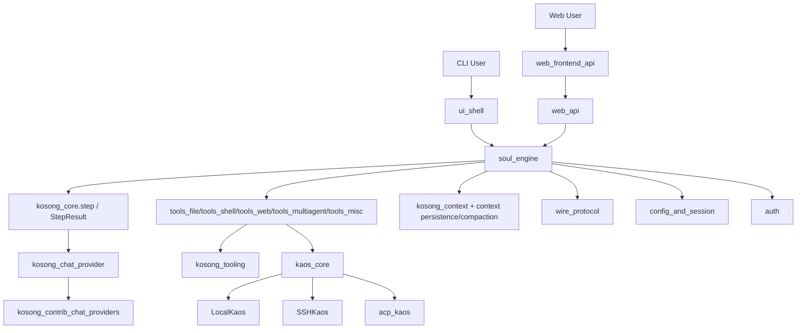
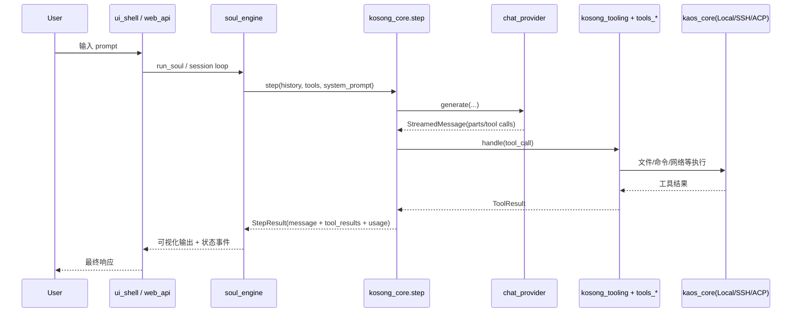
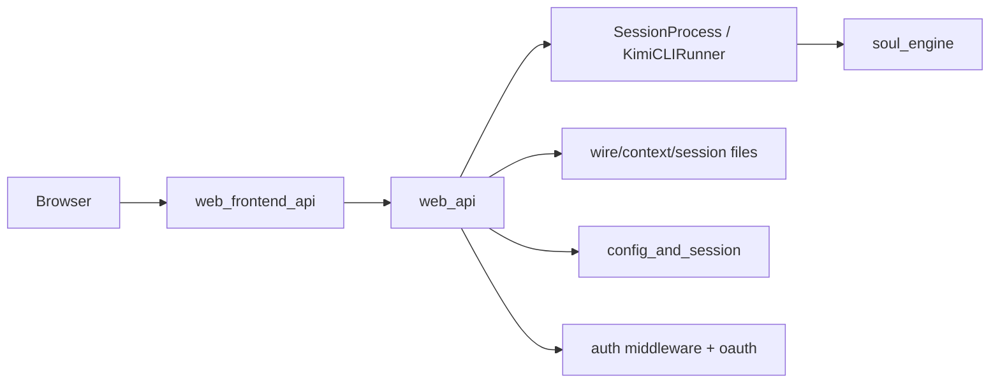

# kimi-cli 仓库总览

## 1. 仓库目的（Purpose）

`kimi-cli` 是一个**面向 AI Agent 的命令行与 Web 双端运行框架**，核心目标是：

1. 提供统一的 Agent 运行时（`soul_engine`）  
2. 提供统一的模型调用抽象（`kosong_chat_provider` / `kosong_contrib_chat_providers`）  
3. 提供统一的工具调用协议与工具集（`kosong_tooling` + `tools_*`）  
4. 提供统一的执行环境抽象（`kaos_core`，本地/SSH/ACP）  
5. 提供完整的配置、会话、鉴权、Wire 协议、Web API 能力（`config_and_session`、`auth`、`wire_protocol`、`web_api`、`web_frontend_api`）

一句话：它把“模型 + 工具 + 会话 + 执行环境 + 前后端交互”整合成了一个可运行、可扩展、可审计的 Agent 系统。

---

## 2. 仓库高层结构（Repo Structure）

```text
kimi-cli
├─ packages/kaos/src/kaos                     # kaos_core: 统一异步执行抽象（Local/SSH）
├─ packages/kosong/src/kosong                 # kosong_core + provider + tooling + context
│  ├─ chat_provider                           # kosong_chat_provider
│  ├─ contrib/chat_provider                   # kosong_contrib_chat_providers
│  ├─ tooling                                 # kosong_tooling
│  └─ contrib/context                         # kosong_context
├─ src/kimi_cli
│  ├─ soul                                    # soul_engine
│  ├─ auth                                    # auth
│  ├─ config.py / session_state.py / agentspec.py  # config_and_session
│  ├─ tools
│  │  ├─ file                                 # tools_file
│  │  ├─ shell                                # tools_shell
│  │  ├─ web                                  # tools_web
│  │  ├─ multiagent                           # tools_multiagent
│  │  └─ misc                                 # tools_misc
│  ├─ wire                                    # wire_protocol
│  ├─ web                                     # web_api
│  ├─ ui/shell                                # ui_shell
│  ├─ utils                                   # utils
│  └─ acp                                     # acp_kaos
└─ web/src/lib/api                            # web_frontend_api（OpenAPI TS 客户端）
```

---

## 3. 端到端架构（End-to-End Architecture）

### 3.1 系统分层图



### 3.2 单轮执行时序（Prompt -> Tool -> Result）



### 3.3 Web 路径（前后端 API）



---

## 4. 核心模块导航（Core Modules Documentation References）

下面是核心模块的职责与文档索引：

| 模块 | 作用 | 关键组件 | 文档 |
|---|---|---|---|
| `kaos_core` | 本地/SSH 执行环境统一抽象 | `Kaos`, `KaosProcess`, `LocalKaos`, `SSHKaos` | `kaos_core.md`, `kaos_protocols.md`, `local_kaos.md`, `ssh_kaos.md` |
| `kosong_core` | 单步推理与工具结果收敛 | `StepResult` | `kosong_core.md`, `step_runtime.md`, `cli_entrypoint.md` |
| `kosong_chat_provider` | 模型 Provider 协议与实现（Kimi/Mock） | `ChatProvider`, `StreamedMessage`, `TokenUsage` | `kosong_chat_provider.md`, `provider_protocols.md`, `kimi_provider.md`, `mock_provider.md` |
| `kosong_contrib_chat_providers` | 第三方模型适配 | Anthropic / Google / OpenAI 变体 `GenerationKwargs` | `kosong_contrib_chat_providers.md` + 各 provider 子文档 |
| `kosong_tooling` | 工具协议、参数校验、返回结构 | `Toolset`, `CallableTool2`, `ToolReturnValue` | `kosong_tooling.md` |
| `kosong_context` | 线性会话上下文与 JSONL 持久化 | `LinearContext`, `JsonlLinearStorage` | `kosong_context.md` |
| `soul_engine` | Agent 主循环与会话编排核心 | `Soul`, `Context`, `Compaction`, `DMail` | `soul_engine.md`, `soul_runtime.md`, `context_persistence.md`, `conversation_compaction.md`, `time_travel_messaging.md` |
| `config_and_session` | 配置加载、会话状态、AgentSpec 解析 | `LoopControl`, `ApprovalStateData`, `SubagentSpec` | `config_and_session.md` + 3 个子文档 |
| `auth` | OAuth 登录、token 生命周期、平台模型同步 | `OAuthToken`, `Platform` | `auth.md`, `oauth_flow_and_token_lifecycle.md`, `platform_registry_and_model_sync.md` |
| `tools_file` | 文件读取/写入/替换/检索/媒体读取 | `ReadFile`, `WriteFile`, `StrReplaceFile`, `Glob`, `Grep`, `ReadMediaFile` | `tools_file.md` + 子文档 |
| `tools_shell` | shell 命令执行（审批+超时） | `Shell`, `Params` | `tools_shell.md` |
| `tools_web` | 联网搜索与网页抓取 | `SearchWeb`, `FetchURL` | `tools_web.md`, `web_search.md`, `web_fetch.md` |
| `tools_multiagent` | 动态子代理创建与任务委派 | `CreateSubagent`, `Task` | `tools_multiagent.md`, `multiagent_create.md`, `multiagent_task_execution.md` |
| `tools_misc` | 用户提问/思考/todo/D-Mail 信号 | `AskUserQuestion`, `Think`, `SetTodoList`, `SendDMail` | `tools_misc.md` + 子文档 |
| `wire_protocol` | 运行时消息协议（JSON-RPC + 域类型 + 持久化） | `JSONRPCMessage`, `WireMessageEnvelope` | `wire_protocol.md` + 子文档 |
| `ui_shell` | 终端交互层（输入、快捷键、更新） | `PromptMode`, `KeyEvent`, `UpdateResult` | `ui_shell.md` + 子文档 |
| `web_api` | 后端 Web API（session/config/open-in/auth） | `Session`, `AuthMiddleware` 等 | `web_api.md` + 子文档 |
| `web_frontend_api` | 前端 OpenAPI TypeScript 客户端 | `SessionsApi`, `ConfigApi`, `BaseAPI` | `web_frontend_api.md` + 子文档 |
| `utils` | 基础并发与命令注册工具 | `BroadcastQueue`, `QueueShutDown`, `SlashCommandRegistry` | `utils.md` + 子文档 |
| `acp_kaos` | ACP 到 KAOS 的执行桥接 | `ACPProcess` | `acp_kaos.md` |

---

## 5. 你可以如何理解这个仓库

建议用这条主线理解 `kimi-cli`：

1. **入口层**：`ui_shell` / `web_api` 接收用户输入  
2. **编排层**：`soul_engine` 维护会话、回合、状态  
3. **推理层**：`kosong_core` + `chat_provider` 完成模型调用  
4. **执行层**：`tools_*` 按协议执行能力  
5. **环境层**：`kaos_core` 屏蔽本地/SSH/ACP差异  
6. **基础层**：`config/auth/wire/utils/context` 提供可运行基础设施  

这使得仓库具备较强的可替换性：可替换模型、可替换执行后端、可替换 UI 入口，同时复用统一的 Agent 核心逻辑。