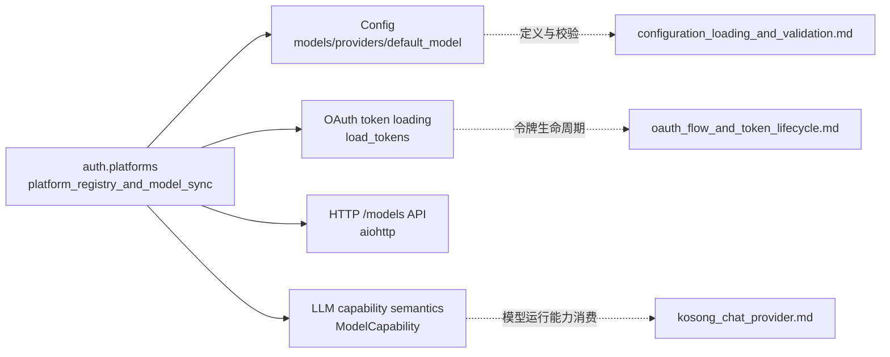
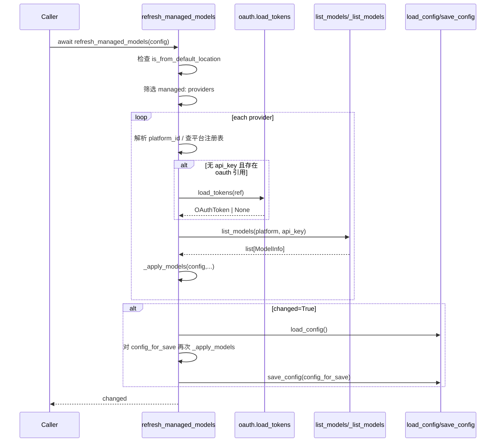
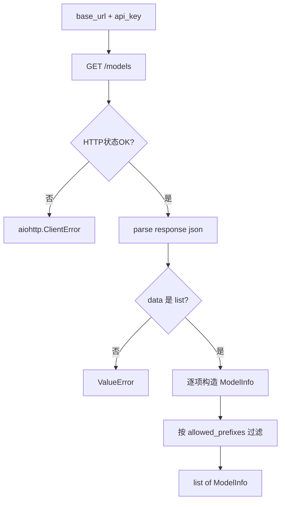
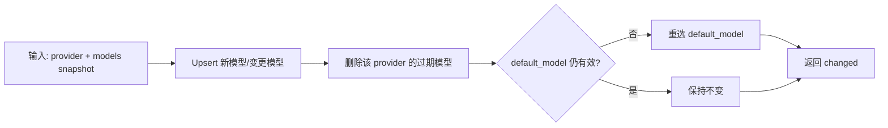

# platform_registry_and_model_sync 模块文档

## 模块介绍与存在意义

`platform_registry_and_model_sync` 对应实现文件 `src/kimi_cli/auth/platforms.py`，位于 `auth` 领域中，但它并不是传统意义上“只做鉴权”的代码。这个模块承担的是一层非常关键的“平台目录 + 模型目录同步”职责：一方面，它内置了系统认可的 LLM 平台注册表（如 Kimi Code、moonshot.cn、moonshot.ai）；另一方面，它把这些平台上的远端模型清单自动同步到本地 `Config.models`，并在必要时修复 `default_model`，确保配置始终可用。

从系统演进角度看，这个模块解决了一个典型问题：模型列表变化频繁，而本地配置是静态文件。没有自动同步时，用户会面临“模型已下线但默认模型仍指向旧 key”“新模型能力（如 image_in）无法自动反映”的问题。该模块把这些风险收敛为可控的同步流程，让调用方只需要在合适时机调用 `refresh_managed_models(config)` 即可。

它与 `oauth_flow_and_token_lifecycle.md`、`configuration_loading_and_validation.md`、`auth.md` 构成协作关系：OAuth 模块负责令牌生命周期，本模块只消费 token；配置模块负责加载与校验，本模块负责把远端模型映射到配置结构。

---

## 核心设计思路

该模块的设计偏向“受控自动化”而非“完全动态化”。平台集合由代码内 `PLATFORMS` 静态声明，避免运行时注入未知平台造成不可审计行为；模型同步流程则是动态的，会按 provider 凭据实时拉取 `/models` 并增量更新本地配置。

另一个关键设计是“仅对默认配置位置执行持久化更新”。`refresh_managed_models` 会检查 `config.is_from_default_location`，当配置来自临时路径或显式自定义路径时，不触发自动写盘。这保证了自动同步不会悄悄覆盖用户的实验配置。

同时，模块采用“先改调用方传入的 `config`，再 `load_config()` 二次应用并 `save_config()`”的策略。它并非严格事务，但比“直接把调用方对象序列化落盘”更安全，可降低并发修改时覆盖他人更改的风险。

---

## 组件与职责详解

## `ModelInfo`（Pydantic BaseModel）

`ModelInfo` 是远程 `/models` 返回项的本地抽象，字段包括 `id`、`context_length` 与三类能力布尔值。它最重要的行为是 `capabilities` 属性：将上游返回的布尔字段和命名规则，归一为系统内部的 `set[ModelCapability]`。

能力推断包含显式规则与兼容性规则。显式规则来自 API 字段：`supports_reasoning` 映射到 `"thinking"`，图像/视频输入能力分别映射到 `"image_in"` 与 `"video_in"`。兼容性规则用于补齐历史命名差异：模型名包含 `thinking` 时强制加上 `"always_thinking"`；模型名包含 `kimi-k2.5` 时强制补全三项能力。这意味着模块不仅“存储元数据”，还在做平台语义归一化。

## `Platform`（NamedTuple）

`Platform` 是平台注册项，字段为：`id`、`name`、`base_url`、`search_url`、`fetch_url`、`allowed_prefixes`。其中 `base_url` 是模型发现的核心地址，`allowed_prefixes` 是模型过滤器，用来限制只同步某些前缀的模型。

当前 moonshot 平台使用 `allowed_prefixes=["kimi-k"]`，体现了“平台级别可控白名单”的设计：即便上游 `/models` 返回大量模型，本地只收录符合产品策略的子集。

## 平台索引函数

`get_platform_by_id` 与 `get_platform_by_name` 是只读检索入口。模块在导入时构建 `_PLATFORM_BY_ID` 与 `_PLATFORM_BY_NAME` 两个字典索引，因此查找复杂度为 O(1)，并且避免了业务层反复遍历 `PLATFORMS`。

## Managed Key 协议函数

模块通过字符串协议区分“系统托管 provider”与普通 provider：

- provider key 格式：`managed:<platform_id>`（`managed_provider_key`）
- model key 格式：`<platform_id>/<model_id>`（`managed_model_key`）
- 解析与判定：`parse_managed_provider_key`、`is_managed_provider_key`
- 展示辅助：`get_platform_name_for_provider`

这个协议是 `_apply_models` 能安全增删模型的基础，因为它让模型 key 的归属关系可逆、稳定、可推断。

---

## 运行架构与模块关系



这个架构图强调了它在系统中的“胶水层”定位：它不拥有配置 schema，也不实现 OAuth 刷新，更不直接发起推理请求；它负责把认证信息换成模型目录，再把模型目录写入配置语义。

---

## 主流程：`refresh_managed_models(config)`

`refresh_managed_models` 是对外主入口，签名为异步函数并返回 `bool`，表示是否发生配置变化。它的完整流程可以理解为“前置门禁 → provider 迭代 → 拉取模型 → 应用变更 → 条件落盘”。



值得注意的内部约束有三点。第一，只处理 `managed:` 前缀 provider，普通 provider 不受影响。第二，单 provider 失败不会中断全局同步，函数会记录日志并继续。第三，只有实际发生变更才会触发读盘与写盘，避免无意义 IO。

---

## 网络模型发现流程：`list_models` 与 `_list_models`

`list_models(platform, api_key)` 是面向平台语义的封装。它通过 `new_client_session()` 创建 `aiohttp.ClientSession`，调用 `_list_models` 拉取原始数据，然后根据 `platform.allowed_prefixes` 做二次过滤。

`_list_models(session, base_url, api_key)` 则负责协议细节：

1. 拼接 URL：`{base_url.rstrip('/')}/models`
2. 发送 `GET`，Header 为 `Authorization: Bearer <api_key>`
3. `raise_for_status=True`，确保 4xx/5xx 变成异常
4. 解析 JSON，要求 `data` 为列表，否则抛 `ValueError`
5. 将每项映射为 `ModelInfo`



字段级解析相对宽松：缺失 `id` 的项直接跳过，`context_length` 缺失降为 `0`，能力布尔字段默认 `False`。结构级错误（`data` 不是 list）则视为不可恢复错误。

---

## 配置收敛算法：`_apply_models(...)`

`_apply_models` 是整个模块最关键的状态变换函数。它把某个平台的一次模型快照映射到 `Config.models`，并维护 `Config.default_model` 的有效性。函数返回 `changed`，表示是否发生任何写入或删除。

其内部包含三个阶段。

第一阶段是 upsert。对每个 `ModelInfo` 生成稳定 key（`<platform_id>/<model_id>`），若模型不存在则创建 `LLMModel`；若已存在则逐字段比对更新 `provider`、`model`、`max_context_size`、`capabilities`。这里 `capabilities` 会做一次归一：空集合写为 `None`，避免在序列化层出现“空集合”和“未声明能力”的双重语义噪声。

第二阶段是清理。函数会扫描所有 `config.models`，仅针对当前 `provider_key` 归属的模型执行删除，删除条件是“不在本次远端快照集合中”。这种“按 provider 边界清理”的设计可以保证不同 provider 之间互不污染。

第三阶段是默认模型修复。如果被删除条目恰好是 `config.default_model`，函数会优先回退到当前 provider 的第一个新模型；如果当前 provider 没有模型，则回退到全局 `config.models` 的第一个 key；若全局为空，则设置为空字符串。最后还有一次兜底检查，确保 `default_model` 一定存在于 `models` 或为空。



这套算法与 `Config` 的校验规则完全对齐（`default_model` 必须存在于 `models`，且 `model.provider` 必须存在于 `providers`），因此是保证配置可序列化、可校验的关键环节。

---

## 关键函数速查（参数、返回值、副作用）

### `get_platform_by_id(platform_id: str) -> Platform | None`
按平台注册 `id` 查询。无副作用。

### `get_platform_by_name(name: str) -> Platform | None`
按展示名查询。无副作用。

### `managed_provider_key(platform_id: str) -> str`
生成 `managed:` provider key。无副作用。

### `managed_model_key(platform_id: str, model_id: str) -> str`
生成模型 key。无副作用。

### `refresh_managed_models(config: Config) -> bool`
入口函数。副作用包括：修改传入 `config`；在条件满足且有变更时写入默认配置文件。

### `list_models(platform: Platform, api_key: str) -> list[ModelInfo]`
发起平台模型拉取并按前缀过滤。主要副作用为网络 IO。

### `_list_models(session, *, base_url, api_key) -> list[ModelInfo]`
执行底层 HTTP 请求与解析。错误通过异常传播。

### `_apply_models(config, provider_key, platform_id, models) -> bool`
对配置进行增量收敛。副作用为原地修改 `config.models/default_model`。

---

## 使用示例与调用建议

最常见调用时机是：配置加载后、会话启动前。

```python
from kimi_cli.config import load_config
from kimi_cli.auth.platforms import refresh_managed_models

config = load_config()
changed = await refresh_managed_models(config)
if changed:
    print("managed models updated")
```

如果要在 UI 或日志中展示 provider 所属平台名称，可以使用：

```python
from kimi_cli.auth.platforms import get_platform_name_for_provider

provider_key = "managed:moonshot-ai"
platform_name = get_platform_name_for_provider(provider_key)
# "Moonshot AI Open Platform (moonshot.ai)"
```

当你需要新接入一个平台时，通常只需扩展 `PLATFORMS`：

```python
Platform(
    id="example-platform",
    name="Example Platform",
    base_url="https://api.example.com/v1",
    allowed_prefixes=["example-"],
)
```

如果上游 `/models` 字段不兼容（例如能力字段命名不同），需要同时调整 `_list_models` 的字段映射，或在 `ModelInfo.capabilities` 中增加推断规则。

---

## 边界条件、错误处理与限制

该模块采用“局部失败不扩散”策略。一个 provider 拉取失败（网络错误、鉴权错误、响应结构异常）不会终止其它 provider 同步。日志级别上，缺少凭据与平台缺失通常是 `warning`，拉取失败是 `error`。

需要特别关注以下边界行为。其一，`context_length` 缺失会写成 `0`，上游调用若把它当作真实上下文窗口，可能导致不合理的 token 预算。其二，`capabilities` 空集合会归一为 `None`，调用方应把 `None` 理解为“未声明/未知”，而不是“绝对不支持任何能力”。其三，默认模型回退使用字典迭代首项，在 Python 3.7+ 中具备插入序语义，但仍不应把它当作业务优先级策略。

当前限制包括：未做多 provider 并发拉取；未使用 ETag 或版本戳进行增量同步；落盘不是事务提交；能力推断包含硬编码命名规则（如 `thinking`、`kimi-k2.5`），需要随平台演进持续维护。

---

## 扩展与维护建议

维护这个模块时，建议始终验证三条不变量：

1. `Config.models[*].provider` 必须指向 `Config.providers` 中存在的 key。
2. `Config.default_model` 必须为空或存在于 `Config.models`。
3. managed key 协议（`managed:<platform_id>` 与 `<platform_id>/<model_id>`）必须保持兼容，避免历史配置无法清理或无法命中。

如果你在修改 `_apply_models`，建议重点回归以下场景：模型下线导致 default_model 被删、provider 从有模型变为空、不同 provider 同时更新。若你在修改 `_list_models`，则应覆盖响应结构异常、字段缺失、布尔值类型漂移等情况。

---

## 相关文档

- 认证与 OAuth 生命周期：[`oauth_flow_and_token_lifecycle.md`](./oauth_flow_and_token_lifecycle.md)
- 配置加载、校验与保存：[`configuration_loading_and_validation.md`](./configuration_loading_and_validation.md)
- 认证模块总览：[`auth.md`](./auth.md)
- 会话与配置总览：[`config_and_session.md`](./config_and_session.md)
