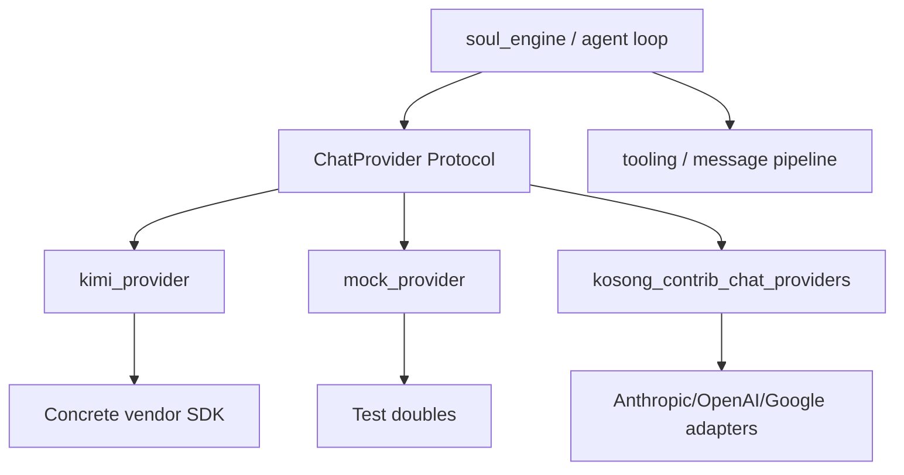
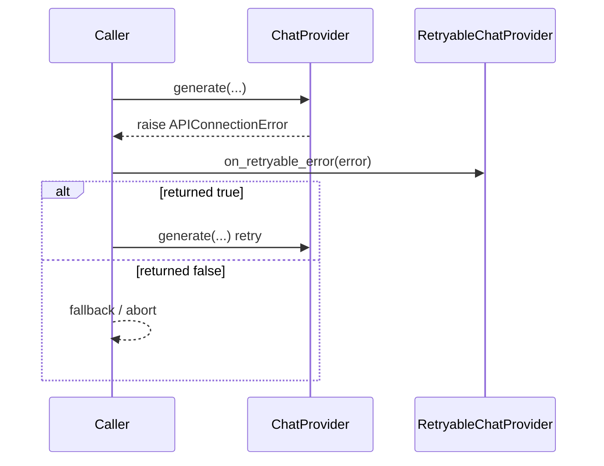
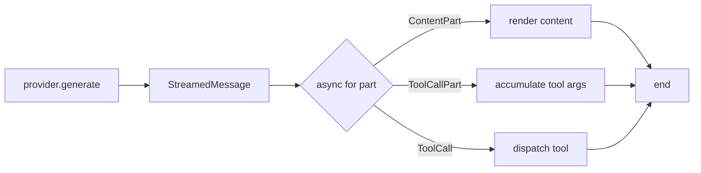
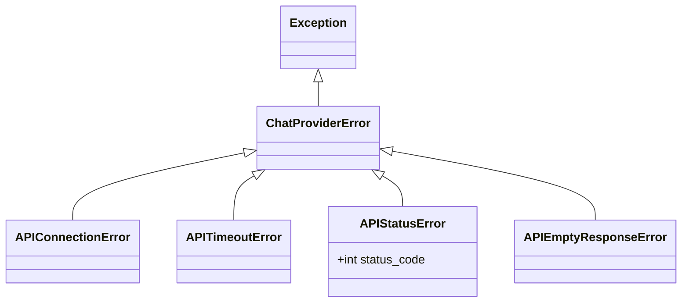
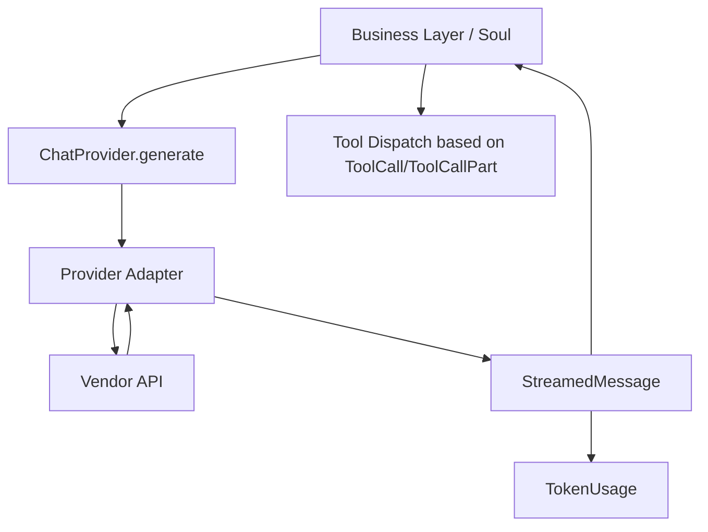
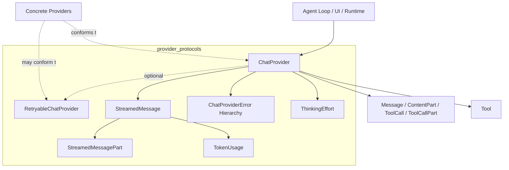
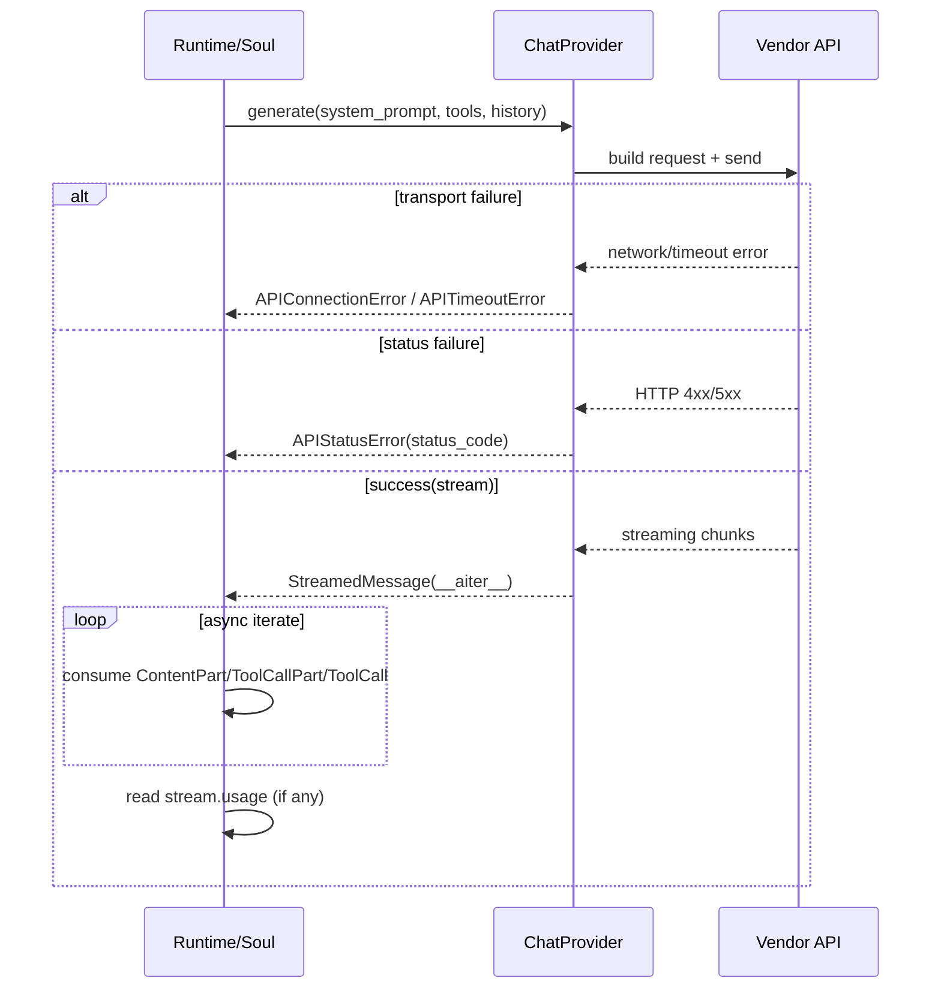

# provider_protocols 模块文档

## 模块概述

`provider_protocols` 是 `kosong_chat_provider` 子域中的协议层模块，对应代码位于 `packages/kosong/src/kosong/chat_provider/__init__.py`。这个模块的职责不是“实现某个具体模型服务”，而是定义**所有聊天模型提供方（provider）必须遵守的统一契约**，并提供一组跨 provider 的通用数据结构与错误语义。

从架构角度看，它解决的是“上层业务希望面向统一接口编程，而底层 provider（如 Kimi、Mock、Anthropic、OpenAI 等）能力各异”的问题。通过 `Protocol`、统一异常类型、流式消息抽象和 token 统计模型，这个模块把 provider 的差异压缩在实现层，让调用方可以稳定地依赖：

- 如何发起一次生成（`generate`）
- 如何消费流式输出（`StreamedMessage`）
- 如何读取 token 用量（`TokenUsage`）
- 如何处理标准化错误（`ChatProviderError` 及其子类）
- 如何可选地处理重试恢复（`RetryableChatProvider`）

换句话说，`provider_protocols` 是整个聊天能力生态的“协议地基”。如果没有它，`soul_engine`、工具调用编排和多 provider 扩展都将被迫依赖具体 SDK 细节，导致高耦合和难维护。

---

## 设计目标与存在意义

这个模块的设计可以概括为三个核心目标：**可替换性**、**流式优先**、**错误可判定性**。

首先是可替换性。`ChatProvider` 使用 `typing.Protocol`，调用方只依赖行为签名，不依赖继承树。任何对象只要“形状符合”协议即可被视为 provider。这使得内置 provider 与第三方 provider 都能无缝注入系统。

其次是流式优先。`generate` 返回的不是一次性字符串，而是 `StreamedMessage`。这保证 UI、CLI、代理循环可以边生成边处理内容（例如实时显示、边产出边解析工具调用）。

最后是错误可判定性。该模块将常见 API 失败场景分层为连接失败、超时、状态码失败、空响应等明确类型，从而支持调用方做有针对性的退避、重试和用户提示，而不是仅靠字符串匹配异常信息。

---

## 模块在系统中的位置



上图表示：`provider_protocols` 位于“调用方”和“具体 provider 实现”之间。上层（如 `soul_engine`）通过协议调用，下层实现适配不同厂商 API。这样即使切换模型平台，上层流程通常无需改动。

若你需要了解具体实现细节，请参考：

- `[kimi_provider.md](kimi_provider.md)`：Kimi 相关 provider 参数模型与扩展字段
- `[mock_provider.md](mock_provider.md)`：测试与本地开发用的 Mock provider
- `[kosong_contrib_chat_providers.md](kosong_contrib_chat_providers.md)`：社区扩展 provider 的 GenerationKwargs 体系

---

## 核心组件详解

## `ChatProvider` 协议

`ChatProvider` 是最重要的协议，定义了一个聊天模型提供方至少应暴露的状态与行为。

```python
@runtime_checkable
class ChatProvider(Protocol):
    name: str

    @property
    def model_name(self) -> str: ...

    @property
    def thinking_effort(self) -> ThinkingEffort | None: ...

    async def generate(
        self,
        system_prompt: str,
        tools: Sequence[Tool],
        history: Sequence[Message],
    ) -> StreamedMessage: ...

    def with_thinking(self, effort: ThinkingEffort) -> Self: ...
```

### `name`

`name` 表示 provider 的逻辑名称（例如实现方自定义的 `"kimi"`、`"mock"` 等）。它常用于日志打点、遥测标签、调试输出以及配置映射。该字段应保持稳定，避免在同一实现中随运行时状态变化。

### `model_name`

`model_name` 是当前 provider 实际使用的模型标识。与 `name` 不同，`name` 通常表示“提供方实现名”，而 `model_name` 表示“具体模型实例/版本”。在多模型切换或降级场景下，这个字段是排障和计费核对的关键上下文。

### `thinking_effort`

`thinking_effort` 暴露当前推理强度设置，类型为 `ThinkingEffort | None`。当返回 `None` 时表示“未显式设置”，而不是等价于 `"off"`。调用方应保留这种三态语义：未设置、显式关闭、不同强度级别。

### `generate(system_prompt, tools, history) -> StreamedMessage`

这是统一生成入口，采用异步接口，返回流式消息对象而非一次性结果。

参数语义如下：

- `system_prompt`：系统级行为约束字符串。
- `tools`：可被模型调用的工具定义序列，类型为 `Sequence[Tool]`（来自 `kosong_tooling`）。
- `history`：历史消息序列，类型为 `Sequence[Message]`（来自消息模型层）。

返回值 `StreamedMessage` 是一个可异步迭代对象，迭代项可能是内容分片，也可能是工具调用分片。

副作用上，`generate` 往往会触发网络请求、连接池使用、认证校验、远端计费，以及本地 provider 状态更新（如会话上下文、重试计数等，取决于具体实现）。

异常契约非常关键：

- 连接层失败应抛 `APIConnectionError`
- 请求超时应抛 `APITimeoutError`
- 服务端返回 4xx/5xx 应抛 `APIStatusError`
- 其他可识别 provider 错误应抛 `ChatProviderError` 子类

这使上层可实现一致的错误恢复策略。

### `with_thinking(effort) -> Self`

`with_thinking` 返回“配置了指定 thinking effort 的 provider 副本”。它的语义是**不可变风格配置**：优先返回新对象而非原地修改，避免共享 provider 在并发场景下相互污染。对于不支持 thinking 的 provider，约定是返回副本但忽略该设置，而不是抛错。

---

## `RetryableChatProvider` 协议

`RetryableChatProvider` 是可选协议，用于那些在“可重试传输错误”后可以执行内部恢复动作的 provider。

```python
@runtime_checkable
class RetryableChatProvider(Protocol):
    def on_retryable_error(self, error: BaseException) -> bool: ...
```

`on_retryable_error` 典型用途包括重建底层连接、刷新短期 token、重置流对象、清理损坏状态。返回值 `bool` 表示是否实际执行了恢复动作，而非“错误是否已彻底解决”。调用方可据此决定是否立即重试、退避后重试或直接失败。

在重试链路中，推荐的调用流程是：捕获异常 → 判断是否可重试 → 若 provider 兼容 `RetryableChatProvider` 则调用恢复 → 按策略重试。



该机制把“重试控制权”仍保留在调用方，同时允许 provider 在最了解底层传输状态的位置做最小修复。

---

## `StreamedMessage` 与流式分片模型

`StreamedMessage` 抽象了一次生成的流式输出会话：

```python
type StreamedMessagePart = ContentPart | ToolCall | ToolCallPart

@runtime_checkable
class StreamedMessage(Protocol):
    def __aiter__(self) -> AsyncIterator[StreamedMessagePart]: ...

    @property
    def id(self) -> str | None: ...

    @property
    def usage(self) -> TokenUsage | None: ...
```

其核心点在于“分片类型是联合类型”，不仅有文本/多模态内容（`ContentPart`），还覆盖完整工具调用对象（`ToolCall`）和工具调用增量分片（`ToolCallPart`）。这支持两类 provider：

1. 只在末尾给出完整工具调用；
2. 在流中逐步发出工具调用参数。

### `id`

`id` 是本次流式响应的标识，可能为空（`None`）。为空通常意味着底层 API 没有提供消息 ID，调用方不应强依赖该字段做幂等主键。

### `usage`

`usage` 是 token 用量信息，可能在流结束后才可用，也可能全程不可用（取决于厂商能力）。调用方需容忍 `None`，并避免在尚未消费完成时过早读取。

### 消费模式示例

```python
async def consume(provider: ChatProvider, system_prompt: str, tools, history):
    stream = await provider.generate(system_prompt=system_prompt, tools=tools, history=history)

    async for part in stream:
        # part: ContentPart | ToolCall | ToolCallPart
        handle_part(part)

    # 流结束后再读 usage 更安全
    if stream.usage is not None:
        print("total tokens:", stream.usage.total)
```



该流程强调：流式输出与工具调用可以在同一数据通道内交错到达。

---

## `TokenUsage` 数据模型

`TokenUsage` 继承 `pydantic.BaseModel`，用于统一 token 统计口径。

```python
class TokenUsage(BaseModel):
    input_other: int
    output: int
    input_cache_read: int = 0
    input_cache_creation: int = 0

    @property
    def total(self) -> int:
        return self.input + self.output

    @property
    def input(self) -> int:
        return self.input_other + self.input_cache_read + self.input_cache_creation
```

字段说明：

- `input_other`：非缓存相关输入 token。
- `output`：输出 token。
- `input_cache_read`：命中缓存读取的输入 token。
- `input_cache_creation`：用于建立缓存的输入 token（目前注释指出 Anthropic 支持）。

该模型的关键价值是把“缓存命中”与“普通输入”分离，既支持精细计费分析，也支持 prompt 缓存效果评估。

### 计算语义

- `input` = `input_other + input_cache_read + input_cache_creation`
- `total` = `input + output`

### 注意事项

提供方上报口径可能不一致，尤其是缓存相关字段。跨 provider 做成本对比时，应先确认口径是否可比。

---

## ThinkingEffort 与能力降级

`ThinkingEffort` 是字面量联合类型：

```python
type ThinkingEffort = Literal["off", "low", "medium", "high"]
```

这表示协议层只约束可选值，不保证所有 provider 都支持全部等级。实践中常见策略是：

- 支持：映射到厂商参数。
- 部分支持：做离散映射（例如 `medium/high` 合并）。
- 不支持：`with_thinking` 返回副本但忽略设置。

调用方若对思考强度有强依赖，应在业务层显式做能力探测或回退策略。

---

## 错误体系与处理建议

模块定义了分层异常：

- `ChatProviderError`：所有 provider 规范错误的基类。
- `APIConnectionError`：连接失败。
- `APITimeoutError`：请求超时。
- `APIStatusError`：HTTP 4xx/5xx，包含 `status_code`。
- `APIEmptyResponseError`：响应为空。



`APIStatusError` 的 `status_code` 为调用方提供了策略分流依据，例如 429 退避重试、401 触发认证刷新、5xx 做短期重试。

示例：

```python
try:
    stream = await provider.generate(system_prompt, tools, history)
except APIStatusError as e:
    if e.status_code == 429:
        await backoff_then_retry()
    elif e.status_code == 401:
        refresh_auth()
        raise
    else:
        raise
except (APIConnectionError, APITimeoutError):
    await transient_retry()
except ChatProviderError:
    raise
```

---

## 组件关系与调用流程



在该关系中，`provider_protocols` 关注的是 B/E/G 三个“稳定接口面”，而 C/D 的厂商差异都被封装在适配器内部。这种边界划分使得工具系统、上下文压缩、会话存储等上层模块都可复用。

---

## 使用与扩展示例

### 实现一个最小 provider（示意）

```python
from collections.abc import AsyncIterator
from dataclasses import dataclass

class SimpleStream:
    def __init__(self, parts, usage=None, mid=None):
        self._parts = parts
        self._usage = usage
        self._id = mid

    def __aiter__(self) -> AsyncIterator:
        async def gen():
            for p in self._parts:
                yield p
        return gen()

    @property
    def id(self):
        return self._id

    @property
    def usage(self):
        return self._usage

@dataclass
class SimpleProvider:
    name: str = "simple"
    _model_name: str = "demo-model"
    _thinking_effort: str | None = None

    @property
    def model_name(self) -> str:
        return self._model_name

    @property
    def thinking_effort(self):
        return self._thinking_effort

    async def generate(self, system_prompt, tools, history):
        # 实际实现中应调用远端 API，并转换为 StreamedMessagePart
        return SimpleStream(parts=[])

    def with_thinking(self, effort):
        cp = SimpleProvider(name=self.name, _model_name=self._model_name)
        cp._thinking_effort = effort
        return cp
```

这个示例体现了协议最小闭环：可生成、可流式迭代、可暴露 usage/id、可复制配置。

### 运行时兼容性检查

由于使用了 `@runtime_checkable`，可以在运行时做协议判定：

```python
if isinstance(provider, ChatProvider):
    ...

if isinstance(provider, RetryableChatProvider):
    provider.on_retryable_error(err)
```

（实际代码中直接用内置 `isinstance` 即可。）

---

## 行为约束、边界情况与常见陷阱

实现和调用时应特别关注以下问题：

- `thinking_effort is None` 与 `"off"` 语义不同，前者是“未设置”，后者是“显式关闭”。
- `usage` 可能为空或延迟可用，不要在流中途假设其存在。
- `StreamedMessagePart` 是联合类型，消费端必须做类型分派，不能只按文本处理。
- `with_thinking` 建议保持不可变语义，避免共享对象状态污染。
- 不是所有传输错误都可通过 `on_retryable_error` 修复；返回 `False` 时应尽快走上层失败路径。
- `APIEmptyResponseError` 常见于上游异常响应被 SDK 吞掉内容后，只剩空体；应记录原始请求上下文以便排障。

---

## 与其他模块的协作边界

`provider_protocols` 不负责以下内容：

- 具体厂商参数映射与请求组装（见 `kimi_provider.md` 与 `kosong_contrib_chat_providers.md`）
- 测试替身行为细节（见 `mock_provider.md`）
- 工具 schema 构造与执行（见 `tooling.md`）
- 会话状态、上下文裁剪、代理循环控制（见 `soul_engine.md`、`kosong_context.md`）

这种职责分离让协议层保持稳定，而实现层可快速演进。

---

## 总结

`provider_protocols` 是聊天系统中最基础、最关键的抽象层之一。它以 `ChatProvider` 为核心，配合 `StreamedMessage`、`TokenUsage`、`ThinkingEffort` 与标准化错误体系，建立了一套跨厂商、跨实现的一致接口。

对开发者而言，理解这个模块的价值在于：你可以把注意力放在“业务如何消费生成能力”，而不是每接一个新 provider 就重写一套调用范式。对维护者而言，这个模块是稳定性与可扩展性的关键杠杆，任何协议变更都应谨慎评估其对上层与生态实现的连锁影响。


---

## 类型依赖与语义边界（补充）

为了避免在阅读实现代码时把“协议层”和“实现层”混在一起，建议把本模块理解为四类对象：输入协议、输出协议、统计模型、错误模型。输入协议由 `ChatProvider` 约束，输出协议由 `StreamedMessage` 与 `StreamedMessagePart` 约束，统计模型由 `TokenUsage` 提供统一口径，错误模型由 `ChatProviderError` 及子类提供分层信号。这四类对象共同构成了 provider 适配的稳定边界。



上图的关键点是：`Message`、`Tool`、`ContentPart` 等数据类型本身并不属于本模块，它们来自消息和工具子系统；`provider_protocols` 只定义“这些类型如何被 provider 使用”。因此当你扩展新 provider 时，通常不需要更改该模块，而是在适配层完成对象映射。

---

## 端到端生命周期（从请求到流结束）

`generate` 的语义在接口上很短，但在运行时通常跨越多个阶段。把这个生命周期拆开，有助于定位“到底是哪一段出了问题”。



在真实系统中，`StreamedMessage` 可能是对底层 SDK stream 的轻量封装，也可能是“先缓冲再转发”的适配对象。只要实现满足 `__aiter__`、`id`、`usage` 三个契约，上层都不应感知其内部差异。

---

## 扩展新 Provider 的实现建议

新增 provider 时，推荐先实现一个最小可用版本，再逐步补齐高级能力。最小版本只需满足 `ChatProvider`；需要更稳健的线上行为时再实现 `RetryableChatProvider`。这种分层可以降低初次接入复杂度，同时不破坏统一调用语义。

一个实用的实现顺序是：先打通 `generate` 到 `StreamedMessagePart` 的映射，再补齐 `usage` 映射，最后处理 `thinking_effort` 和重试恢复。因为前三者直接影响主流程可用性，而 thinking 与恢复通常是增量优化能力。

```python
class MyProvider:
    name = "my_provider"

    @property
    def model_name(self) -> str:
        return self._model

    @property
    def thinking_effort(self):
        return self._thinking

    async def generate(self, system_prompt, tools, history):
        try:
            # 1) 将 history/tools 转成厂商请求体
            # 2) 调用厂商流式 API
            # 3) 把厂商 chunk 转成 ContentPart / ToolCallPart / ToolCall
            return MyStreamedMessage(...)
        except TimeoutError as e:
            raise APITimeoutError(str(e)) from e
        except OSError as e:
            raise APIConnectionError(str(e)) from e

    def with_thinking(self, effort):
        cp = self._copy()
        cp._thinking = effort
        return cp

    # 可选：如果要支持恢复
    def on_retryable_error(self, error: BaseException) -> bool:
        # reset connection/session
        return True
```

上面的关键并不是代码细节，而是“异常翻译”和“类型翻译”两个动作必须稳定：底层错误要翻译成标准异常，底层输出要翻译成标准分片类型。做到这两点，上层才能实现统一运维和统一交互。

---

## 运行与维护中的高频问题

在生产环境里，provider 问题往往不是“接口不通”，而是“语义漂移”。例如同样是 `usage`，不同厂商可能一个在流末尾返回，一个在响应头返回，另一个根本不返回。协议允许 `usage is None`，正是为了避免把厂商差异硬编码进上层逻辑。维护时应把 `usage` 视作“可选观测数据”，而不是强依赖字段。

另一个高频问题是 `with_thinking` 的误用。若实现选择原地修改并复用同一个 provider 对象，在并发请求中会出现串扰：A 请求设置 `high` 后，B 请求意外继承该值。协议文档虽未强制不可变实现，但推荐“返回副本”就是为了规避这一类并发状态污染。

对于 `APIEmptyResponseError`，实践中建议记录请求 ID、模型名、上游 trace 信息和重试次数。因为空响应往往发生在网关层、流中断、SDK 反序列化边界等“跨层问题”上，仅靠最终异常文本通常难以定位。

---

## 与相关文档的阅读路径

如果你正在从零接手这块代码，建议按以下顺序阅读：先看本文件理解协议，再看具体 provider 文档，最后看运行时模块如何消费这些协议。这样可以先建立“稳定接口心智模型”，再进入厂商实现差异。

- 协议之后看实现：[`kimi_provider.md`](kimi_provider.md)、[`mock_provider.md`](mock_provider.md)、[`kosong_contrib_chat_providers.md`](kosong_contrib_chat_providers.md)
- 协议之后看工具与消息协作：[`kosong_tooling.md`](kosong_tooling.md)、[`kosong_chat_provider.md`](kosong_chat_provider.md)
- 协议之后看调用方运行时：[`soul_engine.md`](soul_engine.md)

通过这条路径，你可以避免在阅读具体实现时被厂商细节干扰，先掌握真正稳定且可复用的系统边界。
