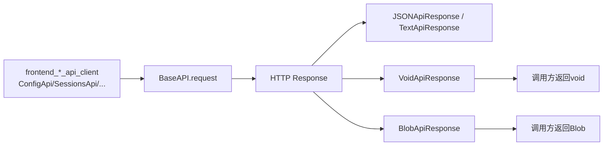
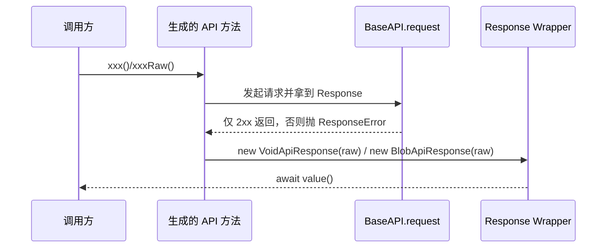
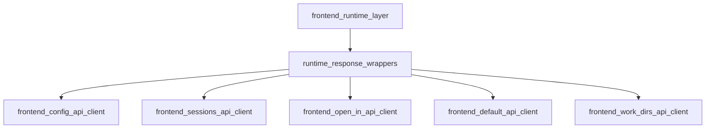

# runtime_response_wrappers

## 模块简介

`runtime_response_wrappers` 是 `web_frontend_api` 里专门负责“响应值解包（response unwrapping）”的轻量层，核心组件是 `VoidApiResponse` 与 `BlobApiResponse`，定义于 `web/src/lib/api/runtime.ts`。它们本身代码很短，但在生成式 API Client 的调用语义中非常关键：前者明确表示“该接口成功即可，不需要响应体”，后者明确表示“该接口返回二进制内容，应以 `Blob` 读取”。

这个模块存在的根本原因，是让前端调用方在**类型层**就能区分不同响应形态，避免所有接口都退化成“手动操作 `Response`”。在 OpenAPI 生成客户端中，业务 API 方法通常会返回某种 `ApiResponse<T>` 风格对象，而 `runtime_response_wrappers` 提供了其中两种常见但语义完全不同的特化实现。这样做可以把“HTTP 成功判定”与“响应体消费方式”解耦：状态码验证由 runtime 执行流程负责，具体怎么读取 body 由 wrapper 负责。

如果你需要完整的 runtime 机制（`Configuration`、`BaseAPI`、middleware、错误模型）请参考 [frontend_runtime_layer.md](frontend_runtime_layer.md)。本文重点讲解这两个响应包装器的职责、行为细节、扩展方式与常见陷阱。

---

## 在系统中的位置



上图说明 `VoidApiResponse` 与 `BlobApiResponse` 不参与请求发送，它们位于请求成功后的“响应消费阶段”。也就是说，它们不是 transport 组件，而是 result-decoding 组件。这个分层的好处是：请求链路（鉴权、重试、日志、错误拦截）保持统一；业务 API 只需在最后一步选择正确的 wrapper。

---

## 核心组件详解

## `VoidApiResponse`

`VoidApiResponse` 的语义是“保留原始响应对象，但值层面不提供内容”。它的构造函数接收一个 `raw: Response`，并通过 `value(): Promise<void>` 统一输出 `undefined`。

```ts
export class VoidApiResponse {
    constructor(public raw: Response) {}

    async value(): Promise<void> {
        return undefined;
    }
}
```

在接口语义上，它适用于以下场景：后端返回 `204 No Content`；接口虽可能有 body，但前端业务不依赖 body，仅依赖请求是否成功（例如触发动作、删除、重置、确认类操作）。

### 参数、返回值与副作用

- 参数：`raw: Response`，原始 HTTP 响应对象。
- 返回值：`value()` 返回 `Promise<void>`，解析结果恒为 `undefined`。
- 副作用：`value()` 不读取 body stream，因此不会消费响应体。

### 设计价值

这个类避免了“空响应也去 `json()` 导致异常”的问题，并在类型层向调用者传达：这里没有可消费业务数据。调用链仍可通过 `raw.status`、`raw.headers` 做审计、追踪或诊断。

---

## `BlobApiResponse`

`BlobApiResponse` 用于二进制数据读取，构造函数同样只接收 `raw: Response`，但 `value()` 调用 `raw.blob()`。

```ts
export class BlobApiResponse {
    constructor(public raw: Response) {}

    async value(): Promise<Blob> {
        return await this.raw.blob();
    }
}
```

它通常用于文件下载、二进制导出、媒体内容获取等场景。与 `TextApiResponse`、`JSONApiResponse` 的核心差异在于：结果解码为 `Blob`，后续一般结合 `URL.createObjectURL`、`File`、`ArrayBuffer` 或上传/保存流程处理。

### 参数、返回值与副作用

- 参数：`raw: Response`。
- 返回值：`value()` 返回 `Promise<Blob>`。
- 副作用：会消费 body stream；同一响应体默认只能读取一次。

### 典型使用示例

```ts
const resp = await api.exportReportRaw({ sessionId: 's-1' });
const blob = await resp.value();

const link = document.createElement('a');
link.href = URL.createObjectURL(blob);
link.download = 'report.zip';
link.click();
URL.revokeObjectURL(link.href);
```

---

## 组件交互与执行流程



流程上最关键的一点是：wrapper 假设传入的 `raw` 已经是“成功路径响应”。如果请求失败（非 2xx），通常在更上游就抛 `ResponseError`，不会进入 wrapper 的 `value()`。

---

## 与其他模块的依赖关系



`runtime_response_wrappers` 依赖 `frontend_runtime_layer` 提供的统一类型与请求上下文；同时被各 API Client 在 endpoint 方法末端使用。换句话说，它是 runtime 的子能力，而非独立网络层。

关于各业务 API 的入参/出参语义，请分别参考：

- [frontend_config_api_client.md](frontend_config_api_client.md)
- [frontend_sessions_api_client.md](frontend_sessions_api_client.md)
- [frontend_open_in_api_client.md](frontend_open_in_api_client.md)
- [frontend_default_api_client.md](frontend_default_api_client.md)
- [frontend_work_dirs_api_client.md](frontend_work_dirs_api_client.md)

---

## 使用与配置建议

尽管这两个类本身无需配置，但它们的正确行为依赖“上游 endpoint 选择正确的 wrapper”。实践中建议遵循以下策略：

1. 当 OpenAPI 响应是 `204` 或语义上无需 body 时，明确映射到 `VoidApiResponse`。
2. 当响应 `content-type` 为二进制（如 `application/octet-stream`、`application/zip`）时，映射到 `BlobApiResponse`。
3. 不要把二进制接口误映射为 `JSONApiResponse`，否则 `raw.json()` 会在运行时失败。

一个常见模式是同时提供 `xxxRaw()` 与 `xxx()`：前者返回 wrapper，后者直接返回 `await wrapper.value()`。这样既保留底层可观测性，也给业务层提供简化调用。

```ts
async function downloadArtifactRaw(...): Promise<BlobApiResponse> {
  const response = await this.request(...);
  return new BlobApiResponse(response);
}

async function downloadArtifact(...): Promise<Blob> {
  const raw = await this.downloadArtifactRaw(...);
  return await raw.value();
}
```

---

## 边界条件、错误与限制

`runtime_response_wrappers` 的实现很薄，但仍有几个高频误区需要注意。

首先，`VoidApiResponse.value()` 始终返回 `undefined`，它不会检查响应是否真的无 body。如果后端错误地返回了你其实需要的数据，这个 wrapper 会“静默丢弃”数据，因此必须在 API 设计阶段确认语义一致。

其次，`BlobApiResponse.value()` 会消费 stream。若你还想并行提取文本日志或调试信息，应使用 `raw.clone()` 读取副本，而不是重复读取同一个 `Response`。

再次，这两个 wrapper 不负责状态码判断。非 2xx 场景的处理应在 `BaseAPI.request` 及调用方异常分支完成，不能指望 wrapper 吞掉错误。

最后，浏览器环境中大文件下载会带来内存压力。`Blob` 本质上把内容缓存在内存或浏览器管理区，超大文件应考虑服务端分片或流式方案；当前 wrapper 仅提供“一次性读完”的模型。

---

## 扩展指南

如果你需要新增响应包装器（例如 `ArrayBufferApiResponse`、`ReadableStreamApiResponse`），建议保持与现有接口一致：

- 仍然持有 `raw: Response`；
- 提供 `value(): Promise<T>`；
- 不在 wrapper 内做状态码兜底；
- 把内容协商逻辑放在 API 方法选择阶段，而不是 wrapper 内部猜测。

示例：

```ts
export class ArrayBufferApiResponse {
  constructor(public raw: Response) {}

  async value(): Promise<ArrayBuffer> {
    return await this.raw.arrayBuffer();
  }
}
```

这样可以与现有调用模式保持一致，降低迁移成本。

---

## 总结

`runtime_response_wrappers` 虽然只包含 `VoidApiResponse` 与 `BlobApiResponse` 两个核心类，但它承担了生成式前端 API 中“返回值语义明确化”的关键职责。`VoidApiResponse` 让“成功但无业务载荷”的接口具备清晰类型边界，`BlobApiResponse` 让二进制返回进入标准化消费路径。二者与 `BaseAPI` 形成分工明确的组合：前者负责“怎么读结果”，后者负责“怎么拿到结果”。这套设计使 `web_frontend_api` 既保持自动生成代码的简洁，也保留了足够稳定的运行时语义。