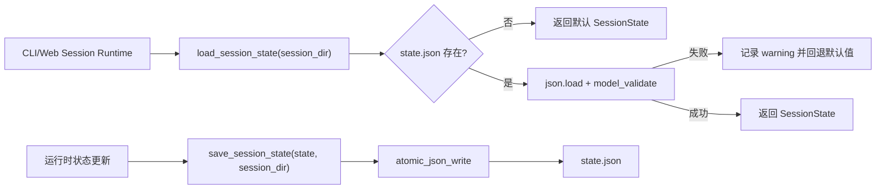
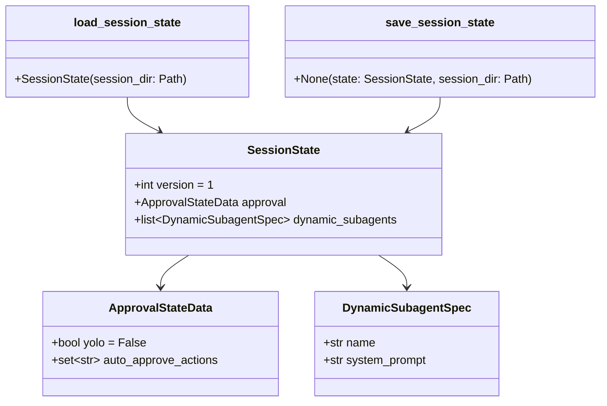
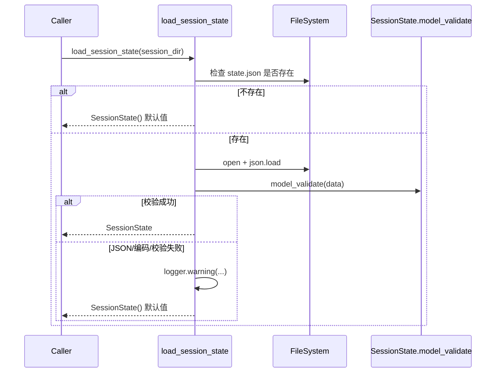
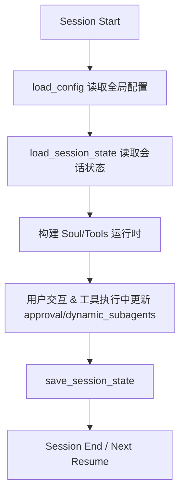

# session_state_management 模块文档

`session_state_management` 对应实现文件 `src/kimi_cli/session_state.py`，是 `config_and_session` 领域中负责“会话级运行状态持久化”的子模块。它解决的并不是全局配置问题，而是**单次会话在运行过程中产生的临时状态如何被安全保存、下次恢复时如何被稳健读取**。在当前实现中，这些状态主要包括审批策略（`ApprovalStateData`）和会话期动态子代理（`dynamic_subagents`）。

从系统分工看，它与 [config_management.md](config_management.md) 形成互补：`config_management` 管长期、全局、静态配置；`session_state_management` 管短期、会话、动态状态。它也与 [agent_spec_resolution.md](agent_spec_resolution.md) 构成“动态/静态子代理双通道”：后者处理 `agent.yaml` 中的静态子代理声明，本模块处理运行期新增子代理的落盘恢复。

---

## 1. 模块存在的原因与设计目标

在 CLI/Web 混合运行环境中，会话经常被中断、重启、fork，若没有会话状态持久化，用户体验会出现明显断层：例如上轮已经设置过自动审批，重启后又要重复确认；或者运行中临时创建的子代理在恢复后丢失。`session_state_management` 用极小的数据模型和两个函数（加载/保存）提供了一个“低复杂度、高容错”的状态层。

这个模块的核心设计目标有三个。第一，读取路径强调可用性：即使状态文件损坏，也要返回可用默认值而不是阻断启动。第二，写入路径强调一致性：通过原子写入降低半写文件风险。第三，模型层强调类型安全：借助 Pydantic 保证状态结构可校验、可演进。



这张图体现了该模块的工程取舍：**读失败可降级，写入尽量原子化**。这对交互式产品尤其关键，因为“可继续使用”往往比“严格失败”更符合用户预期。

---

## 2. 代码结构与组件关系

虽然模块树把 `ApprovalStateData` 标注为核心组件，但该文件实际由常量、3 个模型和 2 个 I/O 函数组成一个完整闭环。



组件间关系非常直接：`SessionState` 是聚合根，`ApprovalStateData` 与 `DynamicSubagentSpec` 是子结构；加载函数负责从磁盘恢复聚合根，保存函数负责将聚合根完整写回。

---

## 3. 核心数据模型详解

## 3.1 `ApprovalStateData`

`ApprovalStateData` 是会话审批状态的数据容器，定义如下：

```python
class ApprovalStateData(BaseModel):
    yolo: bool = False
    auto_approve_actions: set[str] = Field(default_factory=set)
```

`yolo` 表示会话是否处于“尽量自动放行”的模式，默认 `False`。`auto_approve_actions` 是动作白名单集合，用于记录用户已授权自动通过的 action 名称。这里使用 `Field(default_factory=set)` 而不是 `set()` 作为默认值，避免多个模型实例共享同一可变对象。

在行为上，这个模型本身无副作用；其主要价值是提供强类型约束。若输入 JSON 中字段类型不符（例如把 `auto_approve_actions` 写成对象而不是数组），Pydantic 会抛出 `ValidationError`，并由外层加载流程处理。

## 3.2 `DynamicSubagentSpec`

`DynamicSubagentSpec` 表示会话中动态创建的子代理规格：

```python
class DynamicSubagentSpec(BaseModel):
    name: str
    system_prompt: str
```

字段极简但语义明确：`name` 用于标识子代理，`system_prompt` 保留其核心行为定义。它与 [agent_spec_resolution.md](agent_spec_resolution.md) 中的静态 `SubagentSpec(path, description)` 不同：静态子代理依赖文件路径，动态子代理直接保存展开后的 prompt 文本，更适合会话即时创建场景。

## 3.3 `_default_dynamic_subagents()`

该函数只是返回新空列表：

```python
def _default_dynamic_subagents() -> list[DynamicSubagentSpec]:
    return []
```

它被用作 `default_factory`，作用与 `auto_approve_actions` 的 `default_factory=set` 一致：确保每个 `SessionState` 拥有独立列表实例。

## 3.4 `SessionState`

`SessionState` 是状态聚合根：

```python
class SessionState(BaseModel):
    version: int = 1
    approval: ApprovalStateData = Field(default_factory=ApprovalStateData)
    dynamic_subagents: list[DynamicSubagentSpec] = Field(default_factory=_default_dynamic_subagents)
```

`version` 为 schema 演进预留入口；`approval` 和 `dynamic_subagents` 覆盖当前会话状态的两条主线。`Field(default_factory=ApprovalStateData)` 同样避免嵌套模型默认实例共享问题。

---

## 4. 关键函数与内部执行流程

## 4.1 `load_session_state(session_dir: Path) -> SessionState`

该函数实现可概括为“存在性检查 + 解析校验 + 容错回退”：

```python
def load_session_state(session_dir: Path) -> SessionState:
    state_file = session_dir / STATE_FILE_NAME
    if not state_file.exists():
        return SessionState()
    try:
        with open(state_file, encoding="utf-8") as f:
            return SessionState.model_validate(json.load(f))
    except (json.JSONDecodeError, ValidationError, UnicodeDecodeError):
        logger.warning("Corrupted state file, using defaults: {path}", path=state_file)
        return SessionState()
```

参数方面，`session_dir` 是会话目录，函数内部固定拼接 `state.json`。返回值永远是一个可用的 `SessionState` 实例，不将 JSON 语法错误、编码错误、校验错误透传给调用方。

副作用只有日志输出：当文件损坏或内容非法时，会记录 warning 并回退默认状态。这个策略非常适合终端交互程序，因为它能保证会话继续启动。



## 4.2 `save_session_state(state: SessionState, session_dir: Path) -> None`

保存函数实现极简：

```python
def save_session_state(state: SessionState, session_dir: Path) -> None:
    state_file = session_dir / STATE_FILE_NAME
    atomic_json_write(state.model_dump(mode="json"), state_file)
```

它先将模型转换为 JSON 兼容结构，再委托 `atomic_json_write` 执行文件落盘。相比直接 `json.dump`，原子写入在进程崩溃、系统中断时更不容易产生“半截 JSON”。

要注意的是，该函数不捕获 I/O 异常。因此目录不存在、权限不足、磁盘满等问题会向上抛出，由调用方决定如何处理（重试、提示用户、上报告警等）。

---

## 5. 与系统其他模块的协作位置

`session_state_management` 在系统里通常处于“初始化/收尾”两端：初始化时读取状态，运行过程中更新内存状态，关键节点或退出前再持久化。



对于开发者来说，最重要的边界理解是：

- 全局能力边界看 [config_management.md](config_management.md)
- 静态 Agent 规格看 [agent_spec_resolution.md](agent_spec_resolution.md)
- 会话动态状态看本模块

这种分层让系统在“可配置性”和“可恢复性”之间保持清晰职责，不会把短期状态污染到长期配置中。

---

## 6. 使用方式与实践示例

### 6.1 基础读取与保存

```python
from pathlib import Path
from kimi_cli.session_state import load_session_state, save_session_state

session_dir = Path("./.sessions/demo")
state = load_session_state(session_dir)

state.approval.yolo = True
state.approval.auto_approve_actions.add("tools.shell")

save_session_state(state, session_dir)
```

### 6.2 追加动态子代理

```python
from kimi_cli.session_state import DynamicSubagentSpec

state.dynamic_subagents.append(
    DynamicSubagentSpec(
        name="reviewer",
        system_prompt="You are a strict code reviewer."
    )
)
save_session_state(state, session_dir)
```

### 6.3 状态文件示例（`state.json`）

```json
{
  "version": 1,
  "approval": {
    "yolo": true,
    "auto_approve_actions": ["tools.shell", "tools.file.read"]
  },
  "dynamic_subagents": [
    {
      "name": "reviewer",
      "system_prompt": "You are a strict code reviewer."
    }
  ]
}
```

说明：`auto_approve_actions` 在内存中是 `set[str]`，序列化后是 JSON array；数组顺序不保证稳定。

---

## 7. 可扩展性与演进建议

如果你要扩展 `SessionState`，推荐优先采用“向后兼容默认值 + 渐进迁移”的策略。也就是说，新字段尽量提供默认值或 `default_factory`，使旧 `state.json` 能继续通过校验；当确实发生破坏性变更时，再结合 `version` 做显式迁移逻辑。

一个常见做法是在 `load_session_state` 中加入版本分支：先读原始字典，按版本执行升级转换，再 `model_validate`。这样调用方仍只需要面对一个稳定的返回类型，不必感知迁移细节。

如果未来动态子代理需要更多元数据（例如创建时间、来源工具、权限标签），建议在 `DynamicSubagentSpec` 中新增可选字段，并保持默认值，以避免破坏已有状态文件。

---

## 8. 边界条件、错误场景与已知限制

当前实现非常务实，但有几个关键注意点。

- 读取时会吞掉结构性错误并回退默认值。优点是可用性高，缺点是状态可能“无感丢失”。如果业务更强调审计一致性，建议在上层增加坏文件备份与告警。
- `version` 目前是占位字段，模块内尚无内建迁移分发逻辑。随着 schema 演进，这部分应尽早补齐。
- 原子写入只能避免半写，不等于并发一致性控制。多进程同时写同一 `state.json` 时仍可能“最后写入覆盖前写入”。
- 保存路径不存在时的行为取决于 `atomic_json_write` 是否自动创建父目录；当前函数本身没有显式 `mkdir`，调用方应保证目录生命周期。
- `auto_approve_actions` 作为集合会去重，这通常是期望行为；但若你需要保留插入顺序或重复次数，需要替换为其他结构。

---

## 9. 维护者小结

`session_state_management` 的价值不在复杂功能，而在它提供了一个可靠的最小持久化契约：**`SessionState` 作为单一聚合根、`load_session_state` 负责容错恢复、`save_session_state` 负责原子落盘**。维护该模块时，优先守住三件事：默认值健壮、读取容错、写入一致性。只要这三点不退化，它就能持续为 CLI/Web 会话提供稳定的状态恢复基础。
