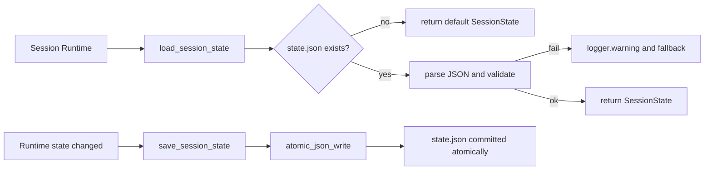
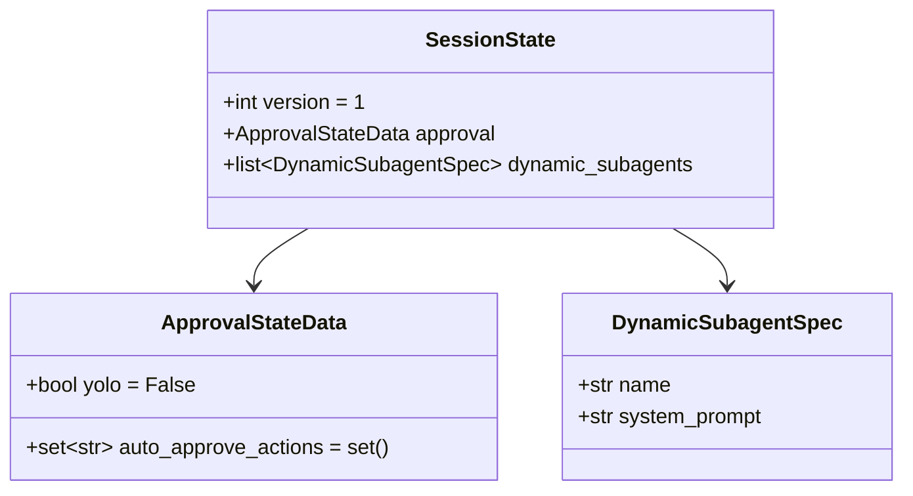
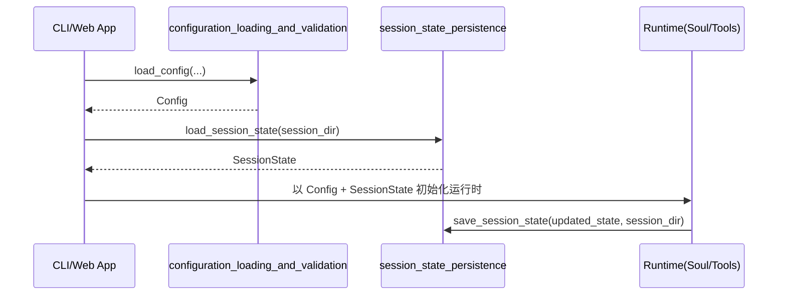

# session_state_persistence

`session_state_persistence` 模块（实现位于 `src/kimi_cli/session_state.py`）负责把“会话运行期状态”安全地读写到会话目录中的 `state.json`。它的定位不是全局配置中心，而是一个**轻量、可恢复、容错**的会话级持久化层：当一次 CLI/Web 会话结束或中断后，下一次恢复时可以继续沿用用户审批偏好和动态子代理定义。

从系统分层上看，它与 [configuration_loading_and_validation.md](configuration_loading_and_validation.md) 是互补关系。前者处理“应用级静态配置”（例如 provider、model、loop 上限）；本模块处理“单个会话的动态状态”（例如是否开启 yolo、本会话新增了哪些 subagent）。这种分离避免了把临时状态写回全局配置文件，也让会话 fork、迁移、归档更容易实现。

---

## 1. 模块职责与设计动机

该模块围绕三个目标设计：

- 以最小结构保存会话关键状态，降低状态文件损坏风险。
- 在读取时对坏数据“软失败”（fallback 到默认状态），保证会话可继续启动。
- 在写入时使用原子写入，减少进程中断导致的半写文件问题。

当前状态文件名固定为 `state.json`（常量 `STATE_FILE_NAME`），存放于调用方提供的 `session_dir` 下。调用方无需关心文件格式细节，只需通过 `load_session_state()` 与 `save_session_state()` 两个函数进行交互。



上图体现了该模块的核心取舍：**读取优先可用性，写入优先一致性**。也就是说，读失败不阻断会话，写时尽量保证文件不会处于中间态。

---

## 2. 数据模型结构

虽然模块树中标注的核心组件是 `ApprovalStateData`，但该文件实际定义了一整套会话状态模型：`ApprovalStateData`、`DynamicSubagentSpec`、`SessionState`。



### 2.1 `ApprovalStateData`

`ApprovalStateData` 继承 `pydantic.BaseModel`，用于表达“用户审批策略”的最小状态单元。

`yolo: bool = False` 表示是否启用全局“无需逐步审批”的快速模式（具体行为由上层执行器解释）。`auto_approve_actions: set[str]` 用于记录某些 action 名称的自动放行白名单，默认值通过 `Field(default_factory=set)` 构造，避免可变默认参数共享。

**返回/副作用说明**：该模型本身是纯数据对象，无外部副作用；在反序列化时若字段类型不符会触发 `ValidationError`，并由外层加载函数处理。

### 2.2 `DynamicSubagentSpec`

该模型描述会话期动态创建的子代理规格，包含 `name` 与 `system_prompt` 两个必填字符串字段。它的存在说明子代理并非一定来自静态配置，也可能在会话中被工具或用户临时创建并需要持久化。

### 2.3 `_default_dynamic_subagents()`

这是一个简单工厂函数，返回新的空列表 `[]`。它用于 `SessionState.dynamic_subagents` 的 `default_factory`。

之所以不用 `default=[]`，是为了避免多个 `SessionState` 实例共享同一个列表对象。这个模式与 `ApprovalStateData.auto_approve_actions` 的 `default_factory=set` 逻辑一致。

### 2.4 `SessionState`

`SessionState` 是状态聚合根，包含三个字段：

- `version: int = 1`：状态 schema 版本号，为将来迁移预留入口。
- `approval: ApprovalStateData`：审批策略状态。
- `dynamic_subagents: list[DynamicSubagentSpec]`：动态子代理列表。

这个聚合模型让持久化边界清晰：读取文件后要么得到完整 `SessionState`，要么回退默认值，不会返回半结构化字典。

---

## 3. 关键函数实现详解

## 3.1 `load_session_state(session_dir: Path) -> SessionState`

这个函数负责从 `session_dir/state.json` 读取并构建 `SessionState`。

执行过程分为三步：先检查文件是否存在；如果不存在直接返回 `SessionState()` 默认实例；如果存在则读取 UTF-8 文本并执行 `json.load` + `SessionState.model_validate`。当遇到 `json.JSONDecodeError`、`ValidationError` 或 `UnicodeDecodeError` 时，函数会记录 warning 日志并返回默认状态。

```python
from pathlib import Path
from kimi_cli.session_state import load_session_state

state = load_session_state(Path("./.sessions/abc123"))
print(state.approval.yolo)
```

**参数**：

- `session_dir`：会话目录路径，函数内部会拼接固定文件名 `state.json`。

**返回值**：

- 永远返回一个 `SessionState` 实例，不向调用方暴露解析异常。

**副作用**：

- 可能输出一条 warning 日志：`Corrupted state file, using defaults: {path}`。

这种“吞掉格式错误并回退默认值”的策略很适合交互式应用：比起让用户因为坏文件无法进入会话，更优先保证系统可用。

## 3.2 `save_session_state(state: SessionState, session_dir: Path) -> None`

该函数负责把传入的 `SessionState` 写入 `session_dir/state.json`。实现中先做 `state.model_dump(mode="json")`，然后调用 `atomic_json_write(...)` 落盘。

```python
from pathlib import Path
from kimi_cli.session_state import SessionState, save_session_state

session_dir = Path("./.sessions/abc123")
state = SessionState()
state.approval.yolo = True
state.approval.auto_approve_actions.add("tools.shell")

save_session_state(state, session_dir)
```

**参数**：

- `state`：要保存的会话状态对象。
- `session_dir`：目标会话目录。

**返回值**：

- 无返回值（`None`）。

**副作用**：

- 对文件系统写入 `state.json`。
- 原子写入策略由 `atomic_json_write` 保证（通常通过临时文件 + rename 实现，具体可见 `utils/io` 的实现文档）。

与加载函数不同，保存函数没有显式捕获 I/O 异常。因此目录不存在、权限不足、磁盘写失败等错误会向上抛出，由调用方决定重试、告警还是降级处理。

---

## 4. 组件协作与系统集成

在更大的 `config_and_session` 域中，典型启动/恢复流程如下：



这个关系说明：全局配置决定“系统能力边界”，会话状态决定“当前会话策略与临时上下文”。两者共同驱动运行时行为，但生命周期不同、存储位置不同、容错策略也不同。

如果你正在阅读子代理相关逻辑，建议同时参考 `agent_spec_resolution` 模块文档（`agent_spec_resolution.md`）以理解“静态子代理定义”与“动态子代理持久化”的分工。

---

## 5. 使用与扩展示例

### 5.1 最小使用模式

在会话进入点读取状态，在状态变更后显式保存：

```python
from pathlib import Path
from kimi_cli.session_state import load_session_state, save_session_state

session_dir = Path("./.sessions/demo")
state = load_session_state(session_dir)

# 用户在 UI 中开启了 yolo
state.approval.yolo = True

save_session_state(state, session_dir)
```

### 5.2 添加动态 subagent

```python
from kimi_cli.session_state import DynamicSubagentSpec

state.dynamic_subagents.append(
    DynamicSubagentSpec(
        name="reviewer",
        system_prompt="You are a strict code reviewer."
    )
)
save_session_state(state, session_dir)
```

### 5.3 向后兼容扩展建议

当你需要给 `SessionState` 增加新字段时，优先遵循以下方式：

- 为新字段提供默认值或 `default_factory`，保证旧 `state.json` 仍可被校验通过。
- 维护 `version` 字段语义；如果引入破坏性结构变更，应增加迁移逻辑而不是仅依赖默认值。
- 把迁移放在加载路径中（如 `load_session_state` 读取后根据版本升级），避免把兼容负担转嫁给所有调用方。

---

## 6. 边界条件、错误与已知限制

该模块实现简洁，但在生产环境中有几个重要注意点：

- **损坏文件会被静默降级为默认状态**（仅 warning 日志）。这能提升可用性，但也意味着你可能“丢失”坏文件中的用户状态。若业务更重视一致性，可在上层加入告警上报。
- **未实现显式 schema migration**。`version` 当前只作为占位字段，尚无分版本升级流程。
- **并发写入冲突未在本模块处理**。`atomic_json_write` 能避免半写，但不能解决两个进程最后写入覆盖的问题。多 writer 场景需引入锁或单写者策略。
- **保存时异常上抛**。调用方必须准备处理 `OSError` 等 I/O 异常，尤其是在容器只读文件系统或权限受限环境中。
- **集合序列化顺序不稳定**。`auto_approve_actions` 是 `set[str]`，落盘后通常会成为 JSON array，但元素顺序不保证稳定；如果你依赖文本 diff，需要在上层做排序策略。

---

## 7. 维护者速查

`session_state_persistence` 的核心价值是“以极低复杂度提供可恢复会话状态”。如果你要修改它，请优先守住三条约束：读取容错、默认值健壮、写入原子性。只要这三点不被破坏，模块就能持续为 CLI/Web 会话提供稳定的状态持久化基础。