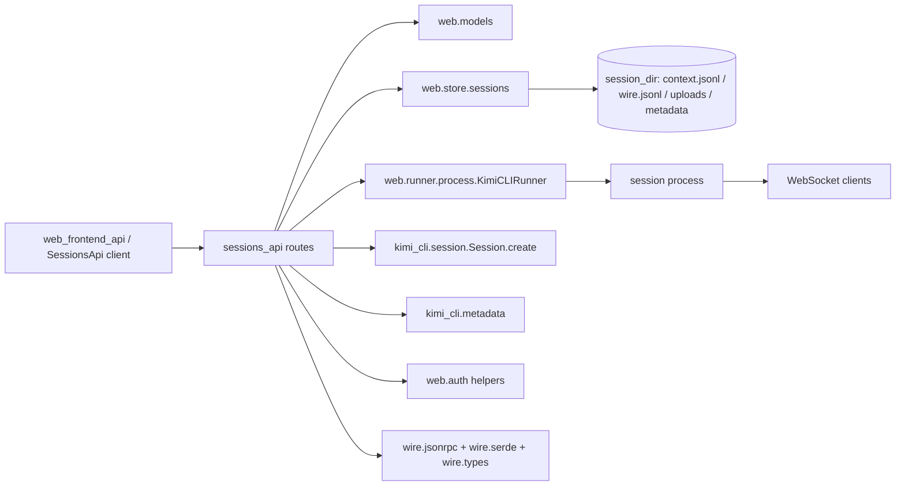
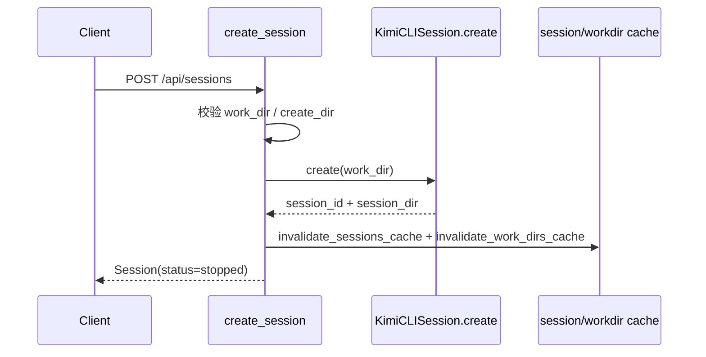
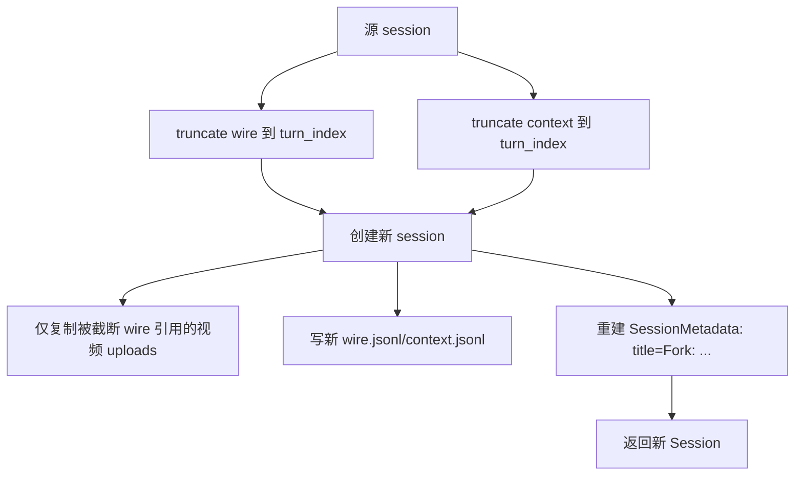
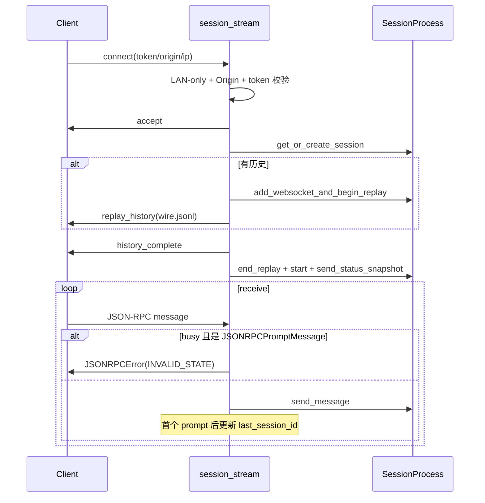

# sessions_api 模块文档

`sessions_api` 对应实现文件 `src/kimi_cli/web/api/sessions.py`，隶属于 `web_api` 模块中的 `sessions_api (current module)`。它是 Kimi Web 端最核心的“会话控制平面”之一：前端几乎所有会话生命周期操作（创建、查询、更新、删除、分叉、文件访问、实时流、标题生成、Git 统计）都通过这里进入后端。

这个模块存在的价值，不是提供简单 CRUD，而是把三类状态统一起来：第一类是文件系统中的会话持久化数据（`context.jsonl`、`wire.jsonl`、session metadata、uploads）；第二类是运行时状态（`KimiCLIRunner` 管理的会话进程、busy/running 状态）；第三类是全局元信息（work dirs 列表与 `last_session_id`）。`sessions_api` 通过 FastAPI 路由把这三类状态对齐成一致的 API 语义，保证前端可以“看见真实状态、进行受控修改、按需回放历史、继续实时交互”。

---

## 1. 模块在系统中的位置



从依赖关系看，`sessions_api` 是连接“API 层”和“会话引擎层”的胶水模块。若你需要深入某一层语义，请参考：数据结构见 [data_models.md](data_models.md)，JSON-RPC 契约见 [jsonrpc_transport_layer.md](jsonrpc_transport_layer.md)，wire 文件语义见 [wire_persistence_jsonl.md](wire_persistence_jsonl.md)，鉴权能力见 [auth_and_security.md](auth_and_security.md)。

---

## 2. 核心组件（本模块声明）

### 2.1 `CreateSessionRequest`

`CreateSessionRequest` 是创建会话的请求体，字段定义如下：

- `work_dir: str | None = None`：目标工作目录，不传则默认用户家目录。
- `create_dir: bool = False`：当目录不存在时是否自动创建。

内部处理并不是直接使用输入字符串，而是会执行 `Path(...).expanduser().resolve()` 后再校验：目录是否存在、是否为目录、是否可创建。若 `create_dir=True` 但权限不足，会返回 `403`；若 OS 层创建失败（如非法路径），会返回 `400`；若未开启自动创建且目录不存在，返回 `404`。

### 2.2 `ForkSessionRequest`

`ForkSessionRequest` 用于“从指定 turn 分叉会话”，字段定义：

- `turn_index: int = Field(..., ge=0)`：0-based turn 索引，fork 后包含 `0..turn_index`。

`ge=0` 是基础参数校验，真正“是否越界”在 `truncate_wire_at_turn` 中基于真实 `wire.jsonl` 内容判断，越界会被转为 `HTTP 400`。

---

## 3. 路由能力总览

```mermaid
flowchart TD
    A[GET /api/sessions/] --> A1[分页+搜索+归档过滤]
    B[GET /api/sessions/:id] --> B1[读取会话详情]
    C[POST /api/sessions/] --> C1[创建会话]
    D[PATCH /api/sessions/:id] --> D1[更新标题/归档]
    E[DELETE /api/sessions/:id] --> E1[删除会话]
    F[POST /api/sessions/:id/fork] --> F1[按 turn 分叉]
    G[POST /api/sessions/:id/files] --> G1[上传到 uploads]
    H[GET /api/sessions/:id/uploads/:path] --> H1[读取上传文件]
    I[GET /api/sessions/:id/files/:path] --> I1[读取 work_dir 文件或列目录]
    J[POST /api/sessions/:id/generate-title] --> J1[AI 生成标题]
    K[GET /api/sessions/:id/git-diff] --> K1[Git 变更统计]
    L[WS /api/sessions/:id/stream] --> L1[历史回放+实时流]

    W[GET /api/work-dirs/] --> W1[工作目录列表（带缓存）]
    X[GET /api/work-dirs/startup] --> X1[返回启动目录]
```



---

## 4. 关键内部机制

### 4.1 Runner 注入与可编辑性守卫

`get_runner` / `get_runner_ws` 通过 `app.state.runner` 注入 `KimiCLIRunner`，是本模块连接会话运行时的入口。`get_editable_session` 则在所有“会修改状态”的接口前执行双重检查：会话存在性（不存在 `404`）和 busy 状态（运行中不可改，返回 `400`）。这可避免并发竞争，例如正在执行 prompt 时被删除或 fork。

### 4.2 文件与路径安全模型

`sessions_api` 暴露了多个文件读取接口，因此实现了分层防护：

1. `resolve() + is_relative_to()`：阻止目录穿越。
2. `_contains_symlink()`：公共限制模式下，拦截路径链路中的 symlink。
3. `_is_path_in_sensitive_location()`：阻止落到用户家目录下敏感目录（`.ssh/.aws/.gnupg/.kube`）。
4. `_is_sensitive_relative_path()` + `_ensure_public_file_access_allowed()`：按隐藏路径、敏感名称、敏感扩展名、路径深度限制访问。

关键常量包括 `DEFAULT_MAX_PUBLIC_PATH_DEPTH=6`、`SENSITIVE_PATH_PARTS`、`SENSITIVE_PATH_EXTENSIONS`。这些额外限制仅在 `restrict_sensitive_apis=True` 时启用。

### 4.3 wire 历史重放

`_read_wire_lines` 会读取 `wire.jsonl`，过滤 metadata 行，把内部消息重组为前端可消费 JSON-RPC 文本：请求消息标记为 `method=request` 且补顶层 `id`，事件消息标记为 `method=event`。`replay_history` 再逐条发送给 WebSocket 客户端。该机制支撑“新连接先拿历史，再接实时流”。

### 4.4 Turn 截断与 checkpoint 识别

fork 依赖两条截断函数：`truncate_wire_at_turn`（严格）与 `truncate_context_at_turn`（best-effort）。其中 `_is_checkpoint_user_message` 会过滤 `<system>CHECKPOINT N</system>` 这种伪 user 记录，避免它污染真实 turn 计数。设计上 wire 严格报错、context 尽量保留可用内容，以兼容 slash command 等“未完整写入 context”场景。

---

## 5. 主要 API 详解

## 5.1 列表与详情

`GET /api/sessions/` 会对 `limit/offset` 做边界修正（`limit` 最大 500），并在后台触发 `run_auto_archive`（内部节流）。然后通过 `load_sessions_page` 获取持久化列表，再叠加 runner 实时状态（`is_running/status`）。

`GET /api/sessions/{session_id}` 则读取单会话并同样叠加运行态。

## 5.2 创建会话

`POST /api/sessions/` 会处理目录解析与可创建性，随后调用 `KimiCLISession.create(work_dir=...)` 建立新会话目录，并失效 sessions/work_dirs 缓存，最后返回 `Session` 视图对象（初始状态 `stopped`）。



## 5.3 更新与删除

`PATCH /api/sessions/{id}` 通过 `UpdateSessionRequest` 修改 metadata：可更新 `title` 与 `archived`。归档/取消归档时会同步维护 `archived_at` 与 `auto_archive_exempt`，避免刚手动取消归档又被自动归档器立刻打回。

`DELETE /api/sessions/{id}` 在确保会话可编辑后，先尝试停止运行进程，再清理 `last_session_id`，最后删除会话目录并失效缓存。

## 5.4 上传与文件读取

`POST /{id}/files` 将文件写入 `session_dir/uploads`，大小上限 `100MB`。文件名通过 `sanitize_filename` 清洗后拼接 UUID 片段，避免危险字符与重名冲突。注意当前实现先把上传内容整体读入内存，再判断大小，对高并发大文件并不理想。

`GET /{id}/uploads/{path}` 仅允许在 uploads 子树内读取。

`GET /{id}/files/{path}` 面向 `work_dir`：如果目标是目录则返回目录项（文件名、类型、大小），如果是文件则直接返回二进制内容并带 MIME 推断。公共限制模式下会进一步过滤敏感项与深层路径。

## 5.5 分叉会话

`POST /{id}/fork` 的实现重点是“最小继承”，而不是粗暴 `copytree`。



特别注意：仅复制“被截断 wire 引用且 MIME 为 video/*”的 uploads 文件，并写 `.sent` 标记，避免后续重复发送继承视频。metadata 采用全新构建，避免继承源会话的过期字段。

## 5.6 自动生成标题

`POST /{id}/generate-title` 会优先读取请求体中的 `user_message/assistant_response`，缺失则从首轮 `wire.jsonl` 提取。若 `title_generated=True`，直接返回已有标题，避免重复调 LLM。

生成策略：

- 始终先构建 fallback（由 user 文本截断得到）。
- 若累计失败次数 `>=3`，直接使用 fallback 并标记已生成。
- 否则尝试通过 `load_config -> create_llm -> kosong.generate` 调模型生成。
- AI 失败不抛错，仅记录 warning 并回退。

这保证了接口“可用性优先”：无论模型是否可用，都能给前端一个标题。

## 5.7 WebSocket 会话流

`/stream` 是最复杂路径，负责鉴权、历史回放、worker 启动和双向消息转发。



一个关键细节是：`last_session_id` 不是在连接时更新，而是在“首个可转发 prompt”时更新。这样用户仅打开历史查看不会改变“最近会话”指针。

---

## 6. Work Dirs 子路由与缓存

`/api/work-dirs` 使用模块级 TTL 缓存（30 秒）。缓存构建时会过滤临时路径（如 `/tmp`、`/var/folders`、`/.cache/`），并只保留当前存在的目录，最多返回 20 项。创建/分叉会话会调用 `invalidate_work_dirs_cache()` 使其失效。

`/api/work-dirs/startup` 直接返回 `app.state.startup_dir`，用于前端快速回到启动路径。

---

## 7. Git Diff 统计逻辑

`GET /{id}/git-diff` 在会话 `work_dir` 上执行轻量 Git 查询：先判断是否 Git 仓库，再判断是否有 `HEAD`，有提交时使用 `git diff --numstat HEAD` 汇总增删并推断 `added/modified/deleted`；另外始终补充 `git ls-files --others --exclude-standard` 获取未跟踪文件。

所有子进程命令都使用 `get_clean_env()` 且有 5 秒超时控制。若超时或异常，接口返回 `GitDiffStats(error=...)` 而不是抛 HTTP 5xx，这样前端可以稳定展示“统计不可用”状态。

---

## 8. 错误条件、边界与限制

典型错误包括：会话或文件不存在（`404`）、路径穿越或 fork turn 越界（`400`）、敏感访问或权限不足（`403`）、上传超限（`413`）。WebSocket 场景下会使用 close code `4401/4403/4004` 表达鉴权失败或会话不存在。

需要特别注意几个行为边界。第一，上传接口是“整文件读入内存后再判断大小”，在极端并发下可能导致内存压力。第二，历史重放与若干解析过程采用宽松异常处理（跳过坏行/吞异常），鲁棒性高但也可能掩盖数据损坏，需要结合日志排障。第三，敏感路径策略受 `restrict_sensitive_apis` 控制，若部署未开启该开关，接口只保留基础的路径穿越防护，不等于完整零信任安全模型。

---

## 9. 使用与扩展示例

下面给出几个常见调用示例。

```bash
# 创建会话（目录不存在时自动创建）
curl -X POST http://localhost:8000/api/sessions/ \
  -H 'Content-Type: application/json' \
  -d '{"work_dir":"~/projects/demo","create_dir":true}'

# 分叉到第 3 个 turn（0-based）
curl -X POST http://localhost:8000/api/sessions/<session_id>/fork \
  -H 'Content-Type: application/json' \
  -d '{"turn_index":3}'

# 读取会话工作目录下文件
curl http://localhost:8000/api/sessions/<session_id>/files/src/main.py
```

新增“会话写操作”路由时，推荐复用如下骨架：先 `get_editable_session`，再执行逻辑，最后按影响范围失效缓存。

```python
@router.post("/{session_id}/something")
async def do_something(session_id: UUID, runner: KimiCLIRunner = Depends(get_runner)):
    session = get_editable_session(session_id, runner)
    # ... mutate session state ...
    invalidate_sessions_cache()
    return {"ok": True}
```

---

## 10. 维护建议

维护此模块时，优先保证“状态一致性”而不是局部功能便利。任何会改变 session 文件或 metadata 的操作都要审查并发时序（是否会与 busy worker 冲突）、缓存失效（sessions/work_dirs 是否刷新）、以及前端契约（返回结构是否仍符合 `web.models`）。对于 WebSocket 路径，建议把新增消息类型对齐到现有 JSON-RPC 适配器，避免客户端无法相关联请求 ID 或错误码。

总体上，`sessions_api` 是 Kimi Web 体验的核心枢纽：它并不实现模型推理本身，但它决定了“会话如何被创建、恢复、回放、继续和治理”。理解这个模块，就等于理解了整个 Web 会话生命周期的主干。
