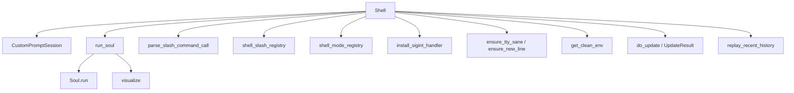
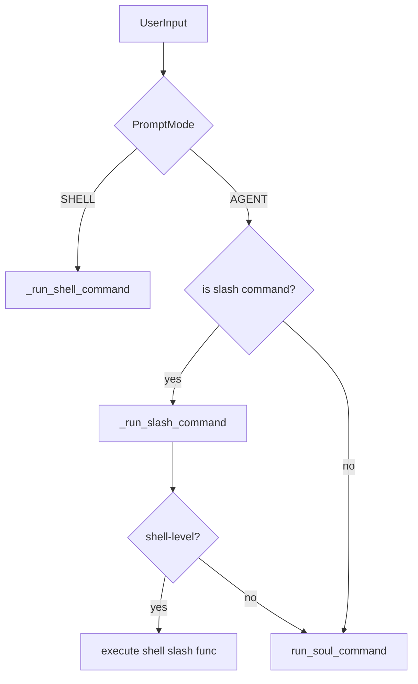
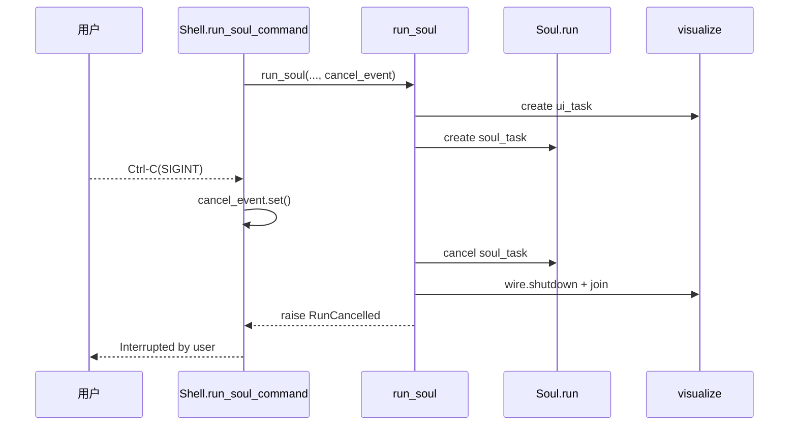

# shell_session_runtime 模块文档

## 1. 模块定位与存在意义

`shell_session_runtime` 对应 `src/kimi_cli/ui/shell/__init__.py`，是 Kimi CLI 交互式终端会话的**运行时编排层**。它不负责推理算法本身（那是 `soul_runtime` 的职责），而是负责把“人机交互现场”稳定运转起来：接收用户输入、区分 Agent/Shell 模式、分发 slash command、调用 `Soul` 执行、渲染运行可视化、处理 Ctrl-C 中断、显示欢迎与更新信息，并在异常时给出可操作提示。

从系统分层看，本模块位于 `ui_shell` 子系统最靠近执行流的一层，向上连接 `CustomPromptSession`（交互输入），向下连接 `run_soul(...)`（智能体执行总线），横向连接更新、信号、TTY 修复、历史回放、slash 命令注册表等基础能力。它存在的核心价值是把这些跨域细节集中到一个“会话控制器”，避免逻辑散落导致行为不一致。

---

## 2. 核心对象与职责

虽然模块树把核心组件标注为 `Level`，但在源码中真正的核心是 `Shell`、`WelcomeInfoItem`（及其嵌套枚举 `WelcomeInfoItem.Level`）、以及 `_print_welcome_info`。其中 `Level` 是嵌套类型，不是顶层类。

### 2.1 `Shell`

`Shell` 是会话运行时主控制器。它在构造时接收一个实现了 `Soul` 协议的对象，并把两类 slash command 合并：

- Soul 提供的命令（智能体能力侧）
- Shell 注册表提供的命令（会话控制侧）

这样可确保自动补全、权限检查、命令分发看到的是统一视图。

#### `__init__(self, soul: Soul, welcome_info: list[WelcomeInfoItem] | None = None)`

该构造函数完成如下初始化：

- `self.soul`：绑定当前会话对应的 Soul 实例。
- `self._welcome_info`：欢迎页附加信息。
- `self._background_tasks`：后台任务集合，用于追踪并清理自动更新等协程。
- `self._available_slash_commands`：`name -> SlashCommand` 映射，来源于 soul + shell 两侧。

**副作用**：读取并合并命令注册表；后续 prompt 补全和命令执行将依赖此映射。

#### `available_slash_commands`（property）

只读暴露合并后的命令表，主要给 Prompt 层和调试逻辑使用。

#### `run(self, command: str | None = None) -> bool`

这是会话入口。

当 `command` 非空时，走**单次执行模式**：直接调用 `run_soul_command(command)` 并退出。适合脚本化/非交互场景。

当 `command` 为空时，走**交互循环模式**：

1. 根据 `KIMI_CLI_NO_AUTO_UPDATE` 决定是否启动 `_auto_update()` 后台任务。
2. 调用 `_print_welcome_info(...)` 输出欢迎面板。
3. 若 soul 是 `KimiSoul`，调用 `replay_recent_history(...)` 回放近期历史。
4. 创建 `CustomPromptSession(...)`，注入：
   - 状态提供器 `status_provider=lambda: self.soul.status`
   - 当前模型能力/模型名/thinking 状态
   - agent-mode 与 shell-mode 的 slash command 列表
5. 进入循环读取输入并按优先级分发：
   - `exit/quit` 退出
   - `PromptMode.SHELL` -> `_run_shell_command`
   - slash command -> `_run_slash_command`
   - 其他文本 -> `run_soul_command`
6. `finally` 中始终执行 `ensure_tty_sane()`，防止终端状态污染。

返回 `True` 表示循环正常结束或执行成功；已知可恢复错误在内部被处理并提示用户。

#### `_run_shell_command(self, command: str) -> None`

在 Shell 模式执行本地命令。关键行为：

- 空字符串直接返回。
- 若输入是 slash command，只允许 shell mode 注册表中存在的命令。
- 对 `cd <dir>` 做显式提示并阻止执行，避免用户误以为目录切换可持久化。
- 使用 `install_sigint_handler` 安装临时 SIGINT 处理：Ctrl-C 时 `proc.terminate()`。
- 通过 `asyncio.create_subprocess_shell(...)` 启动命令，环境来自 `get_clean_env()`。
- 使用 `open_original_stderr()` 尽量把 stderr 恢复到原始终端。

**参数**：`command` 为用户输入命令串。

**返回**：无。

**副作用**：创建子进程；可能向终端输出错误/告警；安装并移除 SIGINT 处理器。

#### `_run_slash_command(self, command_call: SlashCommandCall) -> None`

slash 命令分发逻辑：

1. 若命令不在 `self._available_slash_commands`，立即提示 unknown。
2. 尝试从 shell registry 查找：命中则在 shell 层执行。
3. shell registry 未命中则视为 soul-level 命令，透传 `command_call.raw_input` 给 `run_soul_command`。

它对异常做了分级处理：

- `Reload`、`SwitchToWeb`：保留抛出给上层流程控制。
- `CancelledError`/`KeyboardInterrupt`：转换为 “Interrupted by user”。
- 其他异常：打印后重新抛出，避免吞掉真实故障。

#### `run_soul_command(self, user_input: str | list[ContentPart]) -> bool`

这是 shell 与 soul 之间的关键适配层。

执行过程：

1. 创建 `cancel_event`。
2. 用 `install_sigint_handler` 把 Ctrl-C 绑定为 `cancel_event.set()`。
3. 调用 `run_soul(...)`，并传入 UI 循环函数：
   - `visualize(wire.ui_side(merge=False), initial_status=StatusUpdate(...), cancel_event=cancel_event)`
4. 如果 soul 是 `KimiSoul`，传入其 `wire_file`，用于持久化与后续回放。

已知异常映射：

- `LLMNotSet`：提示登录。
- `LLMNotSupported`：提示模型能力不支持。
- `ChatProviderError`：若是 `APIStatusError`，对 `401/402/403` 给专门业务文案。
- `MaxStepsReached`：告警提示步数上限。
- `RunCancelled`：提示用户中断。
- 未知异常：提示后 re-raise。

**返回值**：成功 `True`，可预期失败/中断 `False`。

#### `_auto_update(self) -> None`

后台检查更新：

- `do_update(print=False, check_only=True)`
- 若 `UpdateResult.UPDATE_AVAILABLE`，周期 toast 提示升级命令
- 若 `UpdateResult.UPDATED`，提示重启生效

这是提示型后台任务，不阻塞主会话。

#### `_start_background_task(self, coro: Coroutine[..., ..., ...]) -> asyncio.Task`

统一后台任务管理：

- `asyncio.create_task` 创建任务并加入集合
- done callback 中自动移除
- 调用 `task.result()` 捕获后台异常并记录日志

用于避免“后台任务静默失败”与“任务引用丢失导致无法清理”。

### 2.2 `WelcomeInfoItem` 与 `WelcomeInfoItem.Level`

`WelcomeInfoItem` 是欢迎面板条目数据结构，字段包括：

- `name: str`
- `value: str`
- `level: Level = Level.INFO`

其中 `Level` 为嵌套枚举：

- `INFO = "grey50"`
- `WARN = "yellow"`
- `ERROR = "red"`

颜色值直接映射 Rich 样式字符串，既承载语义也驱动 UI 呈现。

### 2.3 `_print_welcome_info(name: str, info_items: list[WelcomeInfoItem]) -> None`

负责渲染启动欢迎面板：Logo、欢迎文案、帮助提示、额外信息项，以及版本更新提醒。它会检查 `LATEST_VERSION_FILE`，并通过 `semver_tuple` 与当前版本比较，必要时显示升级提示。

---

## 3. 架构与依赖关系

### 3.1 组件依赖图



这个依赖结构说明：`shell_session_runtime` 是“控制平面”，其价值在于组织执行顺序和错误边界，而非提供底层算法。

### 3.2 交互输入路由图



该流程体现了两个边界：

1. Shell 模式下的 slash command 是白名单机制。
2. Agent 模式下 slash command 可以被透传到 Soul 侧处理。

### 3.3 Soul 执行与取消时序



这保证了中断是“可控取消”，而不是把终端打到不可恢复状态。

---

## 4. 与相关模块的协作边界

本模块只负责“会话运行时编排”，不重复实现下列模块职责：

- `soul_runtime`：智能体 step 循环、工具调用、上下文压缩、重试策略。详见 [soul_runtime.md](soul_runtime.md)
- `interactive_prompt_and_attachments`：输入框、补全、快捷键、附件占位解析。详见 [interactive_prompt_and_attachments.md](interactive_prompt_and_attachments.md)
- `auto_update_lifecycle`：版本检查与升级状态机。详见 [auto_update_lifecycle.md](auto_update_lifecycle.md)
- `keyboard_input_listener`：按键事件模型。详见 [keyboard_input_listener.md](keyboard_input_listener.md)
- `wire_domain_types`：`StatusUpdate`/内容片段等消息类型。详见 [wire_domain_types.md](wire_domain_types.md)

---

## 5. 使用与扩展示例

### 5.1 启动交互会话

```python
shell = Shell(soul=my_soul)
ok = await shell.run()
```

### 5.2 单次命令执行（非交互）

```python
ok = await shell.run("/help")
```

### 5.3 注入欢迎信息

```python
shell = Shell(
    soul=my_soul,
    welcome_info=[
        WelcomeInfoItem(name="Workspace", value="/repo"),
        WelcomeInfoItem(name="Auth", value="expired", level=WelcomeInfoItem.Level.WARN),
    ],
)
```

### 5.4 扩展 shell-level slash command（模式可见）

```python
# 伪代码：在 shell slash registry 注册命令
registry.register(
    SlashCommand(
        name="mycmd",
        description="custom shell runtime action",
        func=my_handler,  # sync or async
        aliases=["mc"],
    )
)
```

注册后，`Shell` 初始化会自动合并，Prompt 补全也会同步可见。

---

## 6. 配置项与行为开关

`shell_session_runtime` 本身可配置项不多，但会受到以下输入影响：

- 环境变量 `KIMI_CLI_NO_AUTO_UPDATE`
  - `true/1/yes` 等真值会禁用自动更新后台任务。
- `Soul.status` / `Soul.model_capabilities` / `Soul.thinking`
  - 影响底栏状态、模式提示、输入能力提示。
- slash command 注册表内容
  - 影响路由结果与权限边界。

---

## 7. 边界条件、错误场景与已知限制

### 7.1 Shell 模式不是持久 shell

当前实现使用 `create_subprocess_shell`，每次调用是独立子进程。`cd`、`export` 等状态不会跨命令保留，因此模块主动拦截 `cd <dir>` 并提示。

### 7.2 Ctrl-C 语义依赖执行上下文

- 在 Soul 执行中：Ctrl-C 设置 `cancel_event`，触发优雅取消。
- 在 shell 子进程中：Ctrl-C 终止当前进程。

这两种语义是刻意区分的，不应混用假设。

### 7.3 未知异常会上抛

`run_soul_command` 和 `_run_slash_command` 对未知异常采用“提示 + re-raise”。这利于排障，但调用方若做二次封装，应在外层兜底。

### 7.4 版本提示来源于本地版本文件

欢迎页新版本提示依赖 `LATEST_VERSION_FILE`。如果文件不可用或版本格式异常，比较逻辑会退化（`semver_tuple` 无法解析时返回 `(0,0,0)` 风格结果）。

### 7.5 TTY 健康修复是防御性而非绝对保证

`ensure_tty_sane()` 仅恢复基础终端标志位，在某些平台/终端组合下仍可能出现边缘显示异常，因此建议保留 `finally` 调用位置，不要轻易移除。

---

## 8. 维护建议

维护该模块时，建议优先守住三条不变式：

1. **中断可预测**：任何新逻辑都不能破坏 Ctrl-C 的可取消性。
2. **终端可恢复**：无论异常还是正常退出，都应保证 `ensure_tty_sane()` 路径可达。
3. **错误可行动**：尽量把底层异常翻译成用户可执行下一步的提示。

如果要扩展新功能（例如更多后台任务、更多模式），推荐复用 `_start_background_task` 和现有路由骨架，避免并发生命周期管理再次分散。
