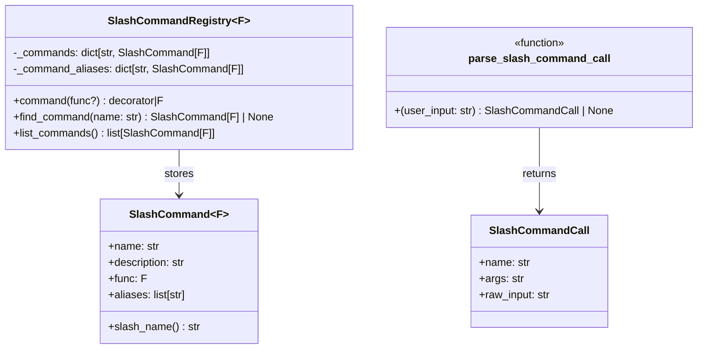
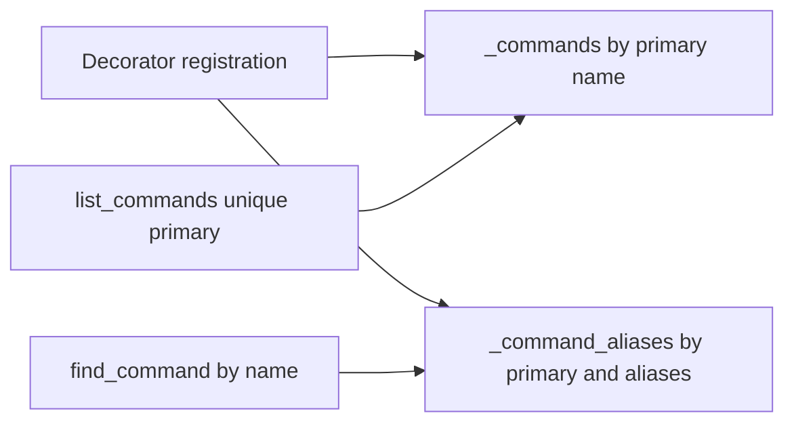
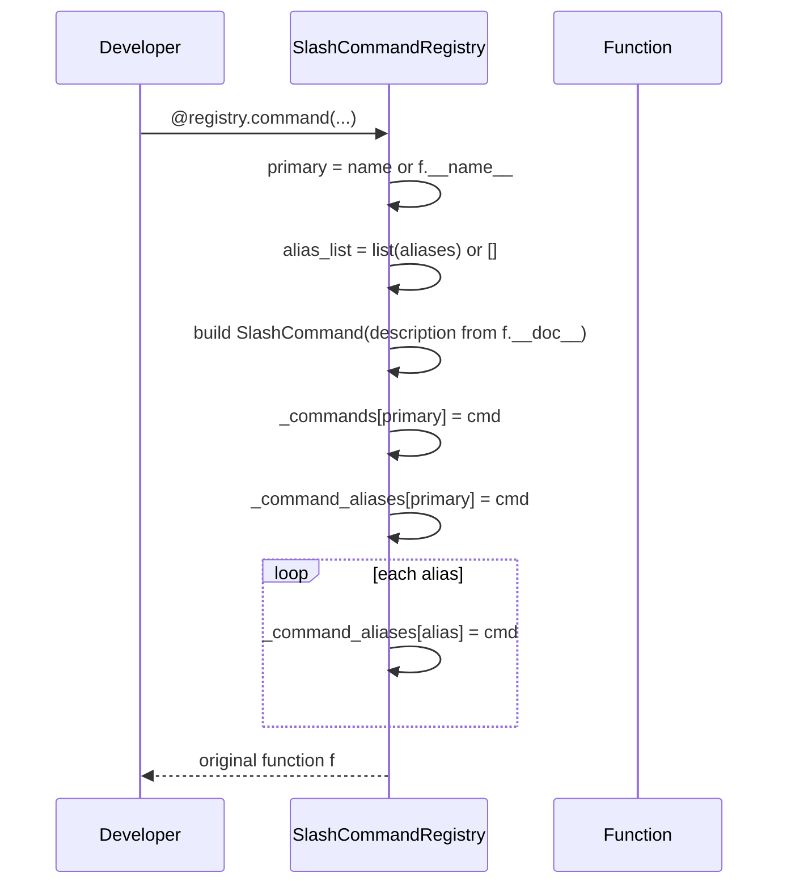
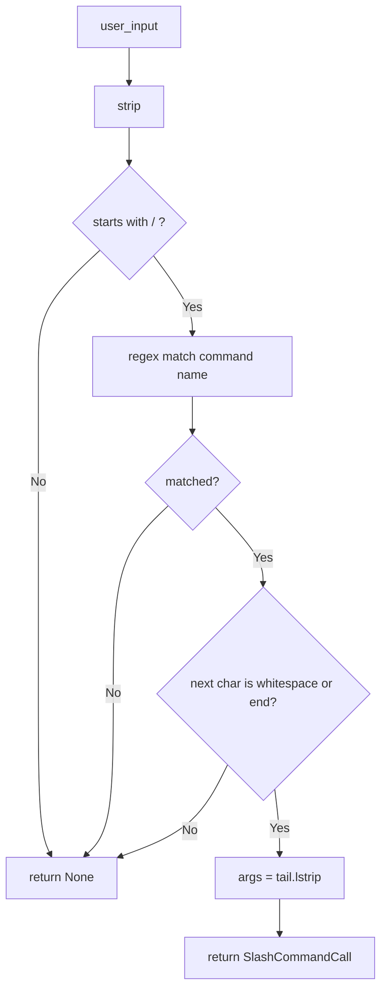
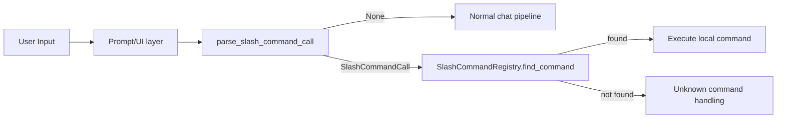

# slash_command_registry

## 引言：模块定位、问题背景与设计目标

`slash_command_registry` 模块对应 `src/kimi_cli/utils/slashcmd.py`，它为系统提供了一套极简但高内聚的“斜杠命令（slash command）注册与解析”基础能力。这个模块的存在，是为了把“命令声明”“命令查找”“输入解析”从 UI 或业务流程中拆出来，形成一个可复用、可测试、无框架耦合的基础设施层组件。

在交互式 CLI 或会话驱动系统里，用户输入常常同时承载两类语义：普通自然语言输入，以及以 `/` 开头的控制命令（例如 `/help`、`/reset`、`/todo:add`）。如果没有专门模块承接，命令管理很容易散落在多个调用点，出现命名不一致、别名冲突不透明、帮助信息无法统一生成等问题。`SlashCommandRegistry` 用“装饰器注册 + 字典索引”的方式，把命令定义与运行时查找统一起来；`parse_slash_command_call` 则把输入字符串转换为结构化调用对象，便于后续调度。

从模块树看，它位于 `utils` 层，与 [broadcast_pubsub.md](broadcast_pubsub.md)、[aioqueue_shutdown_semantics.md](aioqueue_shutdown_semantics.md) 属于同一类底层通用组件。与它们不同的是，`slash_command_registry` 不处理并发和生命周期，而是处理“命令元数据与文本语法”这条路径。

---

## 核心组件总览

本模块虽小，但实际由四个协同组件构成：

- `SlashCommand`：命令元数据（名称、描述、函数、别名）
- `SlashCommandRegistry`：命令注册与查找容器
- `SlashCommandCall`：解析后的调用对象
- `parse_slash_command_call`：将用户输入解析为 `SlashCommandCall`



上图体现了一个关键分层：注册器并不负责解析字符串，解析器也不负责查找命令。调用方通常先 `parse`，再 `registry.find_command`，最后调用 `cmd.func(...)`。这种解耦让两端可以独立演进，例如未来替换解析规则时，不影响命令注册 API。

---

## `SlashCommand`：命令声明对象

`SlashCommand` 是一个 `@dataclass(frozen=True, slots=True, kw_only=True)`。这组参数体现了明确的设计取向：命令对象是只读元数据（`frozen=True`），字段结构固定且内存开销更低（`slots=True`），并强制关键字参数初始化以提升可读性（`kw_only=True`）。

它包含四个字段：`name`（主命令名）、`description`（通常取函数 docstring）、`func`（执行函数）、`aliases`（别名列表）。其中 `func` 的类型约束是 `Callable[..., None | Awaitable[None]]`，意味着命令既可以是同步函数，也可以是异步函数，但语义上都不返回业务值。

### `slash_name()`

`slash_name()` 用于把命令格式化成人类可读字符串。若存在别名，会返回类似 `/help (h, ?)`；否则返回 `/help`。这个方法常用于帮助面板或命令列表展示，不参与解析和调度逻辑。

---

## `SlashCommandRegistry`：注册、索引与查询

`SlashCommandRegistry` 是模块核心。它内部维护两个映射：

- `_commands: dict[str, SlashCommand[F]]`：仅保存“主命令名 -> 命令对象”，用于去重列举
- `_command_aliases: dict[str, SlashCommand[F]]`：保存“主命令名或别名 -> 命令对象”，用于运行时查找



这种“双索引”设计是本模块最重要的实现点。若只维护一个字典，会在“快速 alias 查找”和“无重复列举主命令”之间反复做转换；双字典让两种访问路径都保持 O(1) 且语义清晰。

### `__init__()`

构造函数初始化两个空字典。没有外部依赖、没有副作用，注册器的全部状态均驻留内存。

### `command(...)`

`command` 是一个支持两种调用风格的装饰器 API，通过 `typing.overload` 提供类型提示：

1. `@registry.command`：直接用函数名作为主命令名。
2. `@registry.command(name="run", aliases=[...])`：显式指定主命令名和别名。

内部 `_register` 的执行步骤如下：



`description` 字段来源于 `(f.__doc__ or "").strip()`，意味着如果函数没有 docstring，描述就是空字符串。对调用方而言，这要求命令作者为帮助系统提供 docstring，否则 UI 可能显示空描述。

### `find_command(name: str)`

在 `_command_aliases` 上查询，返回 `SlashCommand` 或 `None`。它天然支持主命令和别名的统一查找，是执行路径中的主入口。

### `list_commands()`

返回 `_commands.values()` 的列表，即只包含主命令，不会重复展开别名。这个设计非常适合生成 `/help` 列表。

---

## `SlashCommandCall` 与 `parse_slash_command_call`

`SlashCommandCall` 是解析结果载体，包含：

- `name`：命令名（不含 `/`）
- `args`：命令后原始参数字符串（去掉左侧空白）
- `raw_input`：原始输入（仅做首尾 `strip` 后的版本）

`parse_slash_command_call(user_input: str)` 的目标是“判断输入是不是合法 slash command，如果是则拆成结构化对象”。

### 解析规则

函数遵循以下顺序：

1. 对输入做 `strip()`。
2. 若为空或不以 `/` 开头，返回 `None`。
3. 用正则 `^\/([a-zA-Z0-9_-]+(?::[a-zA-Z0-9_-]+)*)` 匹配命令名。
4. 若匹配失败，返回 `None`。
5. 若命令名后紧跟非空白字符（例如 `/help,`），判为非法并返回 `None`。
6. 剩余部分左裁剪空白后作为 `args`，返回 `SlashCommandCall`。



### 命令名语法要点

命令名允许字符集：`a-z A-Z 0-9 _ -`，并允许以 `:` 分段，例如 `todo:add`、`agent:create:fast`。这为命令命名空间提供了轻量支持。

---

## 典型使用方式

下面示例展示“注册 -> 解析 -> 查找 -> 执行”的完整链路。

```python
import inspect
from src.kimi_cli.utils.slashcmd import (
    SlashCommandRegistry,
    parse_slash_command_call,
)

registry = SlashCommandRegistry()

@registry.command
async def help(app, args: str) -> None:
    """Show available slash commands."""
    for cmd in registry.list_commands():
        print(f"{cmd.slash_name():20} {cmd.description}")

@registry.command(name="reset", aliases=["r"])
def clear_context(app, args: str) -> None:
    """Reset current conversation context."""
    app.reset()

async def dispatch(app, user_input: str) -> bool:
    call = parse_slash_command_call(user_input)
    if call is None:
        return False  # 非 slash 输入

    cmd = registry.find_command(call.name)
    if cmd is None:
        print(f"Unknown command: /{call.name}")
        return True

    result = cmd.func(app, call.args)
    if inspect.isawaitable(result):
        await result
    return True
```

这个模式体现了模块的边界：它不决定命令函数签名，不负责 await 策略，也不做错误恢复。调度器应自行决定参数传递和异常处理。

---

## 扩展与二次封装建议

如果你要在上层构建更完整的命令系统，建议优先通过“组合而非修改源码”的方式扩展。

一个常见封装方向是增加“注册校验”，例如检测别名冲突并在启动时报错。当前实现是“后注册覆盖先注册”，不会主动告警；这在动态插件环境中可能造成命令阴影（shadowing）。你可以包装 `command`，在写入字典前检查键是否已存在。

另一个方向是把 `args` 从原始字符串升级为结构化参数（如 `shlex.split`、`pydantic` 校验）。这应放在调度层完成，而不是改动 `parse_slash_command_call`，因为后者当前有意保持“只识别命令边界，不解释参数内容”的职责单一性。

---

## 边界条件、错误行为与限制

本模块设计简洁，但有几个必须注意的行为细节：

1. **重复注册会覆盖旧值**：无论主命令名还是别名，后一次注册会直接覆写 `_command_aliases` 中同名项。
2. **别名不去重**：`aliases` 若包含重复项，最终映射仍可工作，但属于无意义配置。
3. **无保留字机制**：没有禁止把别名设为其他命令主名，冲突由最后写入者决定。
4. **解析器不支持引号/转义语法**：`args` 只是原始尾字符串，不做 tokenization。
5. **命令名字符集有限**：不支持中文、`.`、`/`、`?` 等字符作为命令名组成部分。
6. **`/help,` 判非法**：命令名后必须是空白或字符串结束，这能避免粘连误解析，但也意味着某些“紧跟标点”的用户输入不会被识别为命令。

这些行为大多是“有意为之的低复杂度取舍”。当系统需求升级时，建议在外围新增策略层，而不是直接把注册器改成复杂框架。

---

## 与系统其他模块的关系

在整体架构中，`slash_command_registry` 常与交互输入层配合使用，尤其是 [ui_shell.md](ui_shell.md) 所描述的交互式 prompt 流程。通常 UI 收到用户文本后，先尝试 `parse_slash_command_call`，命中命令再走本地调度，否则作为普通对话消息继续流向 `soul_engine`（见 [soul_engine.md](soul_engine.md)）。



这种分流机制的价值在于：控制命令无需进入模型推理链路，减少延迟与成本，同时让命令行为更可预测。

---

## 测试与维护建议

建议至少覆盖三类测试：其一是注册行为测试（主名、别名、覆盖语义）；其二是解析规则测试（合法/非法输入、`:` 命名空间、空白边界）；其三是调度集成测试（同步与异步函数都能被正确执行）。

维护时应重点关注两条兼容性原则：第一，不轻易改变命令名正则，否则可能影响已有脚本和用户习惯；第二，若新增冲突检测等“更严格”策略，最好以可配置方式渐进引入，避免破坏现有动态注册流程。


---

## 配置、约定与可扩展模式

严格来说，`slash_command_registry` 本身几乎没有“配置项”，这恰恰是它的设计优势：状态只有注册表内容，行为由调用方约定。也就是说，你真正要“配置”的不是注册器对象，而是上层调度策略。常见策略包括：未知命令是否提示相近候选、命令执行异常是否中断主循环、异步命令是否设置超时、命令帮助是否按命名空间分组展示。

在团队协作场景中，推荐形成统一命名约定。例如将高层功能按 `namespace:action` 组织（如 `session:fork`、`todo:add`、`agent:create`），并保留少量短别名给高频命令。这种约定与当前解析器支持 `:` 分段命名天然匹配，且不需要任何额外改造。

如果你需要插件化加载命令，建议把每个插件模块暴露为“注册函数”，由主程序传入同一个 `SlashCommandRegistry` 实例进行集中注册。这样可以在注册阶段做统一冲突扫描，并在启动日志中打印最终命令映射快照，便于排查“命令被覆盖”的问题。

```python
# plugin_a.py

def register_commands(registry):
    @registry.command(name="todo:add", aliases=["ta"])
    def todo_add(app, args: str):
        """Add an item to todo list."""
        app.todo_add(args)

# bootstrap.py
from src.kimi_cli.utils.slashcmd import SlashCommandRegistry
import plugin_a, plugin_b

registry = SlashCommandRegistry()
plugin_a.register_commands(registry)
plugin_b.register_commands(registry)

# 可选：启动后输出所有主命令
for cmd in registry.list_commands():
    print(cmd.slash_name(), "-", cmd.description)
```

这个插件化模式与系统中其他“注册式”能力（例如工具注册、API 路由注册）一致，维护成本较低，也便于在测试中按需装配最小命令集。
