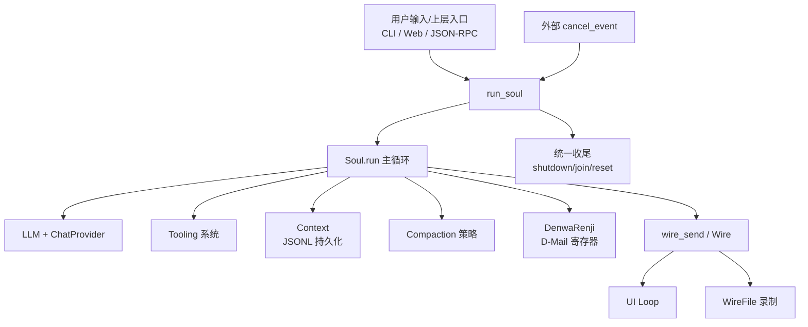
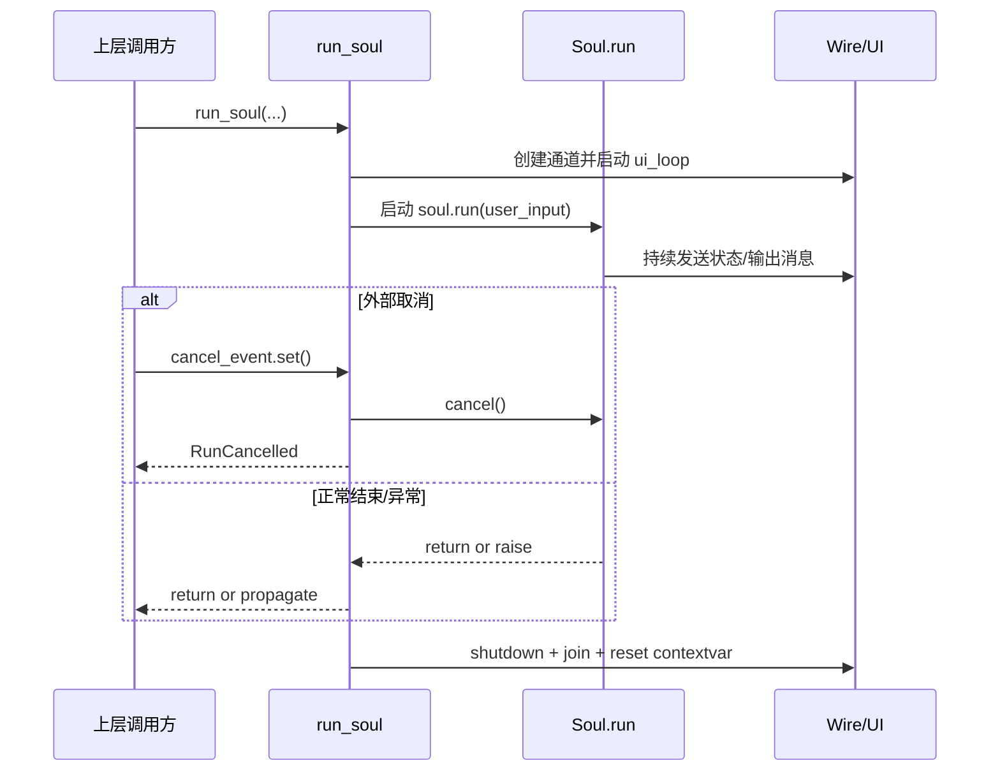
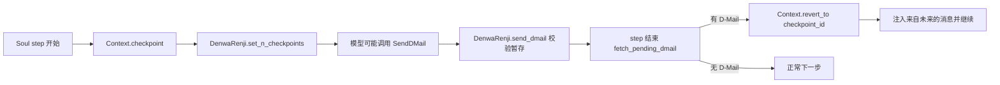

# soul_engine 模块文档

## 1. 模块简介：`soul_engine` 为什么存在

`soul_engine` 是 Kimi CLI 中“代理意识层（agent mind loop）”的核心模块。它不直接实现 UI、HTTP API、文件工具或模型 Provider，而是把这些能力组织成一个可运行、可中断、可回滚、可压缩上下文的会话引擎。简单说：如果把整个系统看成一个智能体操作系统，那么 `soul_engine` 就是“思考与行动的运行时内核”。

这个模块要解决的核心问题有四类。第一，**运行编排复杂度**：模型推理、工具调用、UI 流式展示、用户取消往往是并发发生的，需要统一生命周期管理。第二，**长会话状态管理**：对话历史不断增长，必须持久化并支持恢复。第三，**上下文窗口限制**：长历史会触发 token 压力，需要可替换的压缩策略。第四，**试错与回溯**：在多步任务中，系统需要“回到过去重来”的机制，避免错误路径持续放大。

因此，`soul_engine` 的设计采用了“协议 + 基础实现 + 外围协作”的结构：通过 `Soul` / `Compaction` 等协议定义能力边界，通过 `Context` / `DenwaRenji`（D-Mail）实现关键状态机制，并通过 `run_soul(...)` 与 `Wire` 建立 UI 与 Agent 的通信闭环。

---

## 2. 架构总览

从架构边界上看：

- `run_soul` 负责**会话生命周期编排**（启动、等待、取消、收尾）；
- `Soul` 实现负责**每一步推理与工具决策**；
- `Context` 负责**可恢复状态**；
- `Compaction` 负责**上下文减压**；
- `DMail/DenwaRenji` 负责**时间回溯意图**；
- `Wire` 负责**与 UI 的异步消息桥接**。

这套拆分让模块在演进时更可控：更换模型、扩展工具、替换压缩算法，不需要改运行时框架本身。

---

## 3. 子模块与核心组件说明（含文档索引）

### 3.1 soul_runtime：运行编排与取消语义

`soul_runtime` 定义了 `Soul` 协议与 `run_soul(...)` 执行入口，是 `soul_engine` 的运行时外壳。它通过 `ContextVar` 注入当前 `Wire`，让深层逻辑可用 `wire_send(...)` 发消息；并将低层 `asyncio.CancelledError` 映射成业务语义 `RunCancelled`，便于上层统一处理会话状态。

详细设计、异常契约、执行时序请阅读：[soul_runtime.md](soul_runtime.md)

### 3.2 context_persistence：上下文持久化与 checkpoint 回退

`Context` 使用 JSONL 事件日志记录消息、token usage 与 checkpoint 元信息，提供 `restore / checkpoint / revert_to / clear` 等能力。该模块让会话状态从内存解耦为可恢复资产，是长任务与 time-travel 能力的地基。

完整行为细节、文件格式与边界条件请阅读：[context_persistence.md](context_persistence.md)

### 3.3 conversation_compaction：可替换的历史压缩策略

`Compaction` 协议定义了上下文压缩接口，`SimpleCompaction` 是默认实现：保留最近关键消息，将更早历史格式化后交给 LLM 生成压缩摘要，再回写为新上下文前缀。它是控制 token 成本与避免上下文超限的关键组件。

策略流程、参数含义与限制请阅读：[conversation_compaction.md](conversation_compaction.md)

### 3.4 time_travel_messaging：D-Mail 时间回邮机制

`DMail` 是发送到过去 checkpoint 的消息载体，`DenwaRenji` 负责校验与暂存 pending dmail。其本质是“回退意图寄存器”，由 Soul 主循环在 step 边界消费并触发 `Context.revert_to(...)`。

完整端到端协作与错误处理请阅读：[time_travel_messaging.md](time_travel_messaging.md)

---

## 4. 关键交互流程

### 4.1 一次标准会话运行

这个流程体现了 `soul_engine` 最重要的工程目标：**无论成功、失败还是取消，都能可预测收尾**。

### 4.2 checkpoint + D-Mail 回退流程

该机制适合“先探索再回退重走”的任务，但请注意：当前仅回退对话上下文，不自动回退文件系统副作用。

---

## 5. 与其他模块的系统关系

`soul_engine` 位于系统中间层：向上连接交互入口，向下连接模型与工具。

- 与 `wire_protocol`：定义消息结构与传输语义（`WireMessage`、JSON-RPC 相关类型）。
- 与 `kosong_chat_provider` / `kosong_contrib_chat_providers`：提供实际 LLM 调用能力。
- 与 `kosong_tooling` + `tools_*`：执行文件、shell、web、多代理等工具行为。
- 与 `config_and_session`：控制 loop 限制、审批状态与会话配置。
- 与 `ui_shell` / `web_api`：一个走终端交互，一个走服务端会话 API，二者都消费 soul 运行事件。

可参考已生成文档：
- [config_and_session.md](config_and_session.md)
- [kosong_chat_provider.md](kosong_chat_provider.md)
- [kosong_core.md](kosong_core.md)

---

## 6. 使用与扩展建议

接入 `soul_engine` 时，建议遵循以下实践：

1. 通过 `run_soul(...)` 统一启动会话，不要绕开它直接裸跑 `soul.run(...)`，否则容易丢失取消语义和 UI 收尾保障。
2. 在 Soul 实现中统一用 `wire_send(...)` 输出运行事件，避免 UI 绑定内部对象。
3. 使用 `Context` 时坚持“单 writer”原则，避免多协程并发写同一 context 文件。
4. 当上下文接近上限时触发 `Compaction`，并记录压缩前后 token 变化以便调优。
5. 使用 D-Mail 前确保 checkpoint 策略稳定（例如每 step 打点），否则可回退粒度会不一致。

---

## 7. 错误条件、边界与已知限制

`soul_engine` 的主要风险点集中在状态一致性与并发边界：

- **取消竞争**：`cancel_event` 与 `soul_task` 可能近乎同时完成，行为取决于事件判定时机。
- **上下文文件损坏**：`Context.restore()` 依赖合法 JSONL，遇坏行会中断恢复。
- **压缩语义漂移**：`SimpleCompaction` 依赖 LLM 摘要质量，关键细节可能丢失。
- **回退非全量事务**：D-Mail 只回退对话，不回退工具副作用（文件/外部系统）。
- **UI 收尾超时**：`run_soul` 对 UI task 是软超时等待，UI 不规范退出会出现 timeout 警告。

这些限制并不意味着模块不可用，而是提示维护者要在上层策略补齐：例如审批机制、幂等工具设计、文件快照与回放机制。

---

## 8. 维护者快速导航

如果你第一次接手该模块，推荐阅读顺序：

1. [soul_runtime.md](soul_runtime.md)：先理解会话怎么被驱动与停止。
2. [context_persistence.md](context_persistence.md)：再理解状态如何存、如何回退。
3. [conversation_compaction.md](conversation_compaction.md)：理解长会话如何减压。
4. [time_travel_messaging.md](time_travel_messaging.md)：最后理解 time-travel 的控制平面。

此外，若你在排查跨模块问题，建议联读：
- [wire_protocol.md](wire_protocol.md)：消息结构与传输层语义
- [tools_misc.md](tools_misc.md)：`SendDMail` 等工具侧行为
- [config_and_session.md](config_and_session.md)：会话控制与审批状态

读完这四份子模块文档并补充上述跨模块文档后，再回到具体 Soul 实现代码，会更容易定位扩展点与风险边界。