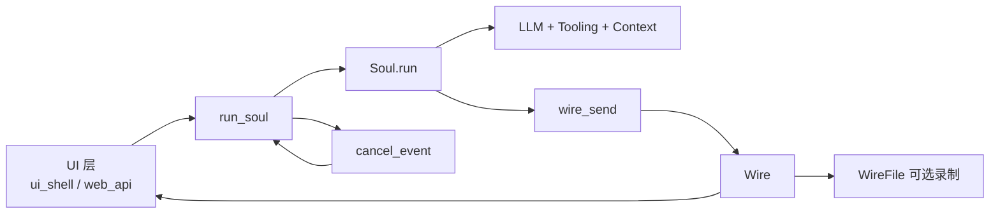
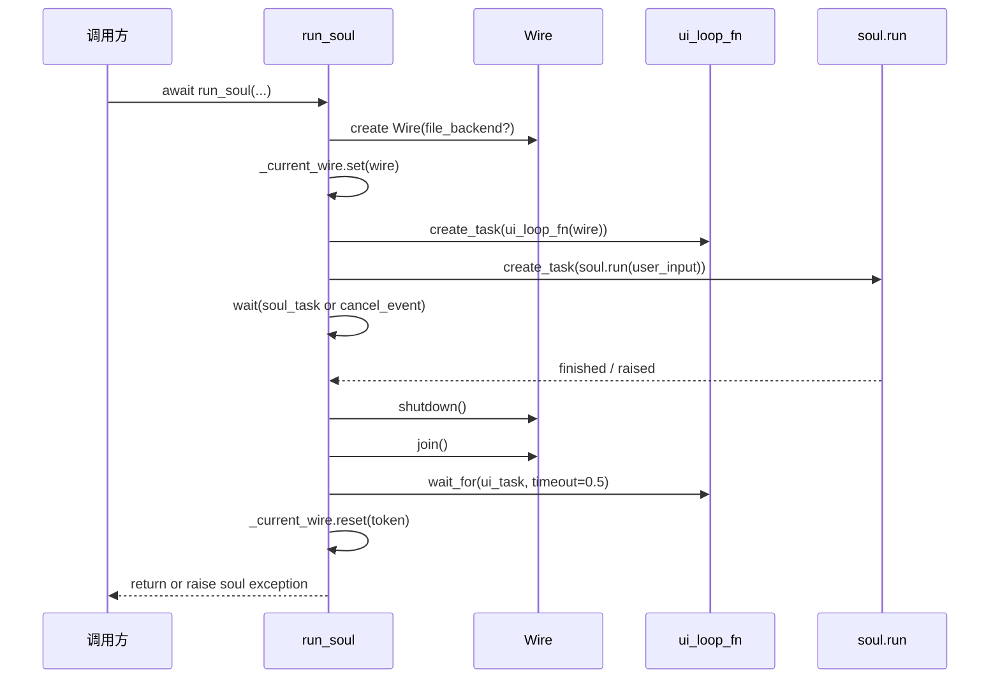
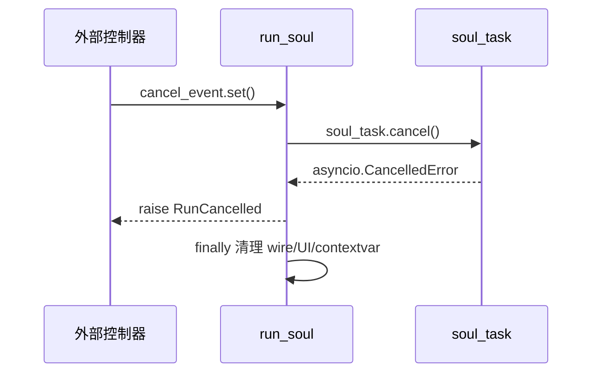
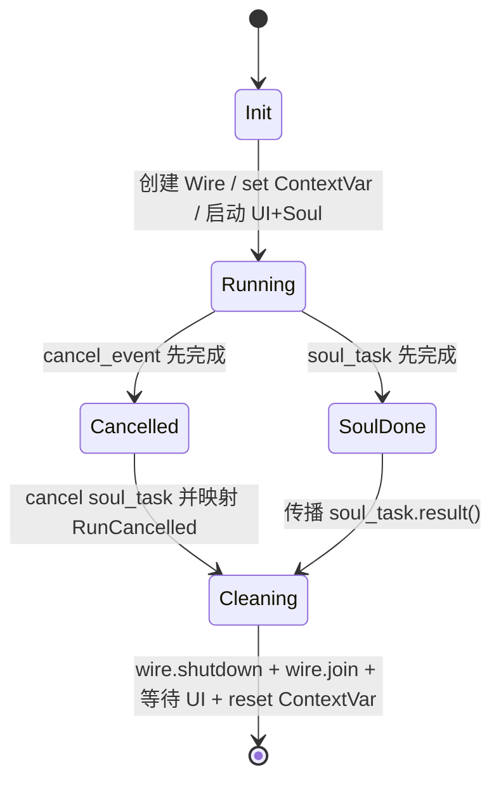
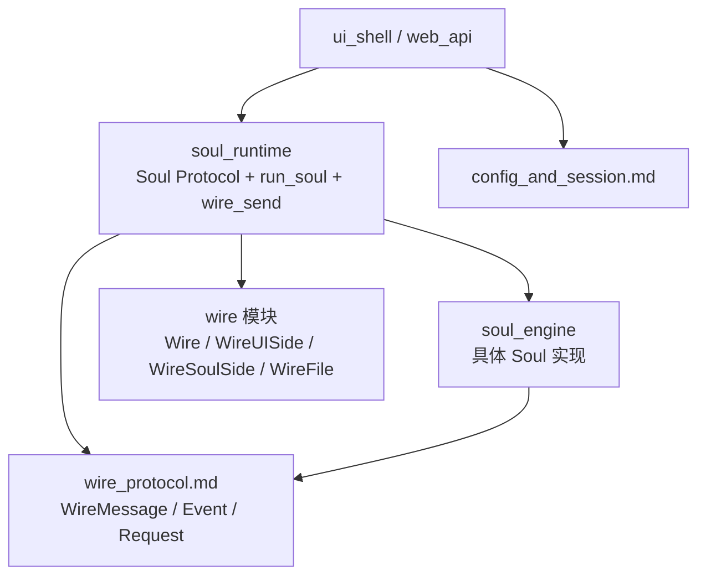

# soul_runtime 模块文档

## 1. 模块定位与设计目标

`soul_runtime` 是 `soul_engine` 的运行时编排层，核心职责不是“实现一个具体的 Agent（Soul）”，而是为任意符合 `Soul` 协议的实现提供统一的执行外壳。它把三个本来容易纠缠的 concerns 解耦开：第一，Agent 本体的推理与工具调用循环；第二，UI 的异步展示循环；第三，外部取消信号（用户中断、会话终止、上层调度停止）。

这个模块存在的原因是，单纯 `await soul.run(...)` 在工程上不够：真实 CLI/Web 会话需要实时流式输出、可回放记录、可中断清理、并且要保证异常语义可被调用方正确区分。`run_soul(...)` 正是这层“运行时胶水（runtime glue）”：它通过 `Wire` 建立 soul 与 UI 的通信通道，借助 `ContextVar` 为当前异步上下文注入全局可访问的 wire，然后负责生命周期收束（shutdown/join/reset）。

从系统边界上看，`soul_runtime` 不关心具体模型 prompt、不关心工具细节，也不直接做 context 压缩；它只定义运行契约（`Soul` Protocol）和执行控制流。这让模块在可测试性与可替换性上非常强：任何对象只要满足 Protocol，就能被 `run_soul` 托管执行。

---

## 2. 在整体系统中的位置



该图体现了 `soul_runtime` 的桥接角色：上层调用 `run_soul`，下层执行 `Soul.run`，中间通过 `Wire` 双向“解耦式连接”。Soul 不需要直接依赖 UI 实现；UI 也不需要知道 soul 内部状态机，只消费 wire 消息流即可。

与其他模块的关系建议按以下文档阅读：

- 通信消息结构与协议细节：[`wire_protocol.md`](wire_protocol.md)
- Soul 的上下文持久化能力：[`context_persistence.md`](context_persistence.md)
- 会话压缩策略接口：[`conversation_compaction.md`](conversation_compaction.md)
- 时间回邮消息（DMail）能力：[`time_travel_messaging.md`](time_travel_messaging.md)

---

## 3. 核心组件详解

## 3.1 `Soul`（`Protocol`）

`Soul` 是运行时契约，不是具体类。它定义了运行时最小必需能力：可识别的名称、模型信息曝光、状态快照、可用 slash command 清单，以及最关键的异步入口 `run(user_input)`。

### 设计意图

采用 `typing.Protocol` + `@runtime_checkable` 的方式，意味着框架强调“结构化类型兼容”而不是继承树耦合。实现者无需继承某个基类，只要方法/属性形状一致即可。这让 `soul_runtime` 可以托管不同风格的 soul（主 Agent、子 Agent、测试假实现）而不引入侵入式基类约束。

### 成员说明

- `name: str`：Soul 实例逻辑名称，通常用于 UI 展示、日志定位。
- `model_name: str`：当前 LLM 模型名；LLM 未配置时返回空字符串。
- `model_capabilities: set[ModelCapability] | None`：模型能力集合（如 tool use、vision 等）；LLM 未设置时为 `None`。
- `thinking: bool | None`：当前 thinking 模式状态；未显式配置或 LLM 不可用时可为 `None`。
- `status: StatusSnapshot`：不可变状态快照，避免 UI/调用方修改内部状态。
- `available_slash_commands: list[SlashCommand[Any]]`：当前可处理的 slash command 元数据。
- `run(user_input: str | list[ContentPart]) -> awaitable`：执行主循环直到停止条件（无后续 tool call、达到步数上限、外部取消或异常）。

### `run(...)` 的异常契约

`Soul.run` 在接口层明确了几类异常语义：

- `LLMNotSet`：模型尚未注入。
- `LLMNotSupported`：模型能力不足（例如缺少工具调用能力）。
- `ChatProviderError`（来自 provider 层）：上游模型服务失败。
- `MaxStepsReached`：达到步骤上限，被动停止。
- `asyncio.CancelledError`：协程被外层取消（通常由 `run_soul` 触发）。

这些异常会被 `run_soul` 原样或语义映射后抛给上层，从而支撑 UI 和 API 的分类处理策略。

---

## 3.2 `RunCancelled`

`RunCancelled` 是 `soul_runtime` 对“外部取消事件”的领域化异常封装。其意义在于把“技术层协程取消”（`asyncio.CancelledError`）转译成“业务层运行取消”事件，避免上层误把它当作普通 coroutine 取消噪音。

在 `run_soul` 中，当 `cancel_event` 先完成时，会 `cancel` 掉 `soul_task`，并在捕获 `CancelledError` 后改抛 `RunCancelled`。这样调用方只需捕获一个语义更稳定的异常来更新会话状态（例如标记为 cancelled，而非 failed）。

---

## 3.3 运行时辅助异常与状态类型

虽然当前模块树仅将 `Soul` 和 `RunCancelled` 作为核心组件暴露，但同文件中的以下类型在实践中同样关键：

### `LLMNotSet`

表示 soul 尚未完成 LLM 绑定。典型触发点是会话创建后未完成 provider/model 解析，就提前执行 `run`。

### `LLMNotSupported`

构造参数：

- `llm: LLM`：当前 LLM 实例。
- `capabilities: list[ModelCapability]`：缺失能力列表。

它会在错误消息中给出模型名与缺失能力，便于直接定位“配置错模型”还是“功能开关不匹配”。

### `MaxStepsReached`

构造参数：

- `n_steps: int`：已执行步数。

用于防止 agent runaway loop。上层可据此触发提示（继续/停止）或自动 checkpoint。

### `StatusSnapshot`

不可变 dataclass（`frozen=True, slots=True`），字段：

- `context_usage: float`：上下文占用百分比。
- `yolo_enabled: bool`：是否自动批准（YOLO）模式。

不可变快照的好处是：UI 拿到的状态不会在渲染中途被并发修改，降低竞态可见性问题。

---

## 4. `run_soul(...)` 深入解析

`run_soul` 是本模块最关键的编排函数。它把 soul 执行、UI 事件循环、取消控制、消息落盘和资源清理整合为单一入口。

函数签名：

```python
async def run_soul(
    soul: Soul,
    user_input: str | list[ContentPart],
    ui_loop_fn: Callable[[Wire], Coroutine[Any, Any, None]],
    cancel_event: asyncio.Event,
    wire_file: WireFile | None = None,
) -> None
```

### 参数语义

- `soul`：任何符合 `Soul` Protocol 的对象。
- `user_input`：用户输入，可是纯文本或结构化 `ContentPart` 列表。
- `ui_loop_fn`：长生命周期 UI 协程函数，接收 `Wire` 并持续消费消息。
- `cancel_event`：外部可控取消开关。
- `wire_file`：可选消息录制后端，开启后会将完整消息写入文件用于 replay/audit。

### 正常路径流程



在正常完成时，`soul_task.result()` 会把 soul 内部异常原样抛出；若无异常则正常返回。`cancel_event_task` 会被主动取消并通过 `contextlib.suppress` 忽略 `CancelledError`。

### 取消路径流程



这条路径保证了“即使取消也会清理”。`finally` 块永远执行，避免 UI task 或 recorder 残留。

---

## 5. Wire 上下文绑定机制（`ContextVar`）

模块通过 `_current_wire: ContextVar[Wire | None]` 保存当前 run 的 wire。`wire_send(msg)` 不接收 wire 参数，而是直接从上下文读取并发送。

### 为什么这样设计

如果把 wire 显式层层传参，Soul 内部多层调用（工具执行、子流程、事件回调）会污染函数签名并增加耦合。`ContextVar` 让任意深度的运行时代码都可以“隐式访问当前通道”，类似线程本地变量，但适配 asyncio 任务上下文。

### API 行为

- `get_wire_or_none()`：返回当前上下文 wire，若不在 run 中则 `None`。
- `wire_send(msg)`：断言 wire 存在后发送消息；若在非运行上下文调用会触发 `assert`。

### 约束与 gotcha

`wire_send` 使用断言保护，这意味着：

1. 不应在 `run_soul` 之外直接调用它；
2. 测试中若需调用，需先手动设置 `_current_wire` 或通过 `run_soul` 托管；
3. 若 Python 以优化模式关闭断言（`-O`），该保护会失效，建议调用层仍遵守契约而非依赖断言。

---

## 6. 关键依赖与组件协作

## 6.1 与 `Wire` 的协作

`Wire` 是 soul/UI 的消息总线。`run_soul` 中创建的 `Wire(file_backend=wire_file)` 提供两个关键能力：

- 实时发布/订阅（UI 消费）；
- 可选录制（`WireFile`，用于回放与审计）。

`wire.shutdown()` 会先 `flush` soul-side merge buffer，再关闭内部队列。UI 侧收到队列 shutdown 后通常会退出 receive 循环，并可能抛 `QueueShutDown`。

## 6.2 与 UI Loop 的协作

`ui_loop_fn` 被当作“长运行协程”。`run_soul` 在退出时用 `wait_for(..., timeout=0.5)` 等待它收尾：

- 收到 `QueueShutDown`：视为正常关停；
- 超时：记录 warning（`UI loop timed out`），防止无限等待。

这是一种“软超时”策略，优先保证主流程可回收，不让 UI 垮掉拖死整个 session。

## 6.3 与 LLM/能力模型的协作

`LLMNotSupported` 持有 `llm.model_name` 与 capability 列表，强调运行前能力检查的重要性。对应细节可参考 LLM 模块文档（建议链接：`kosong_chat_provider.md` 与后续 LLM 适配文档）。

---

## 7. 使用方式与代码示例

### 7.1 最小可运行示例

```python
import asyncio
from kimi_cli.soul import run_soul, RunCancelled

async def ui_loop(wire):
    ui = wire.ui_side(merge=True)
    while True:
        msg = await ui.receive()
        print("UI got:", msg)

async def main(soul):
    cancel_event = asyncio.Event()
    try:
        await run_soul(
            soul=soul,
            user_input="请分析这个仓库",
            ui_loop_fn=ui_loop,
            cancel_event=cancel_event,
            wire_file=None,
        )
    except RunCancelled:
        print("Run cancelled by external signal")

# asyncio.run(main(your_soul))
```

### 7.2 在 Soul 内发送消息

```python
from kimi_cli.soul import wire_send

def emit_status(msg):
    wire_send(msg)  # msg must be WireMessage
```

这里的关键是：Soul 内部代码不需要知道 UI 是终端还是 Web，只发送标准 `WireMessage` 即可。

### 7.3 带录制的运行

```python
from pathlib import Path
from kimi_cli.wire.file import WireFile

wire_file = WireFile(Path("./session.wire.jsonl"))
await run_soul(..., wire_file=wire_file)
```

录制可用于故障复现、会话回放与调试比对。

---

## 8. 扩展与实现建议

当你实现一个新的 Soul 时，建议把 `run` 逻辑拆分为“单步推进函数 + 外层循环”，并在关键节点发送 wire 消息（用户输入回显、模型输出增量、工具调用开始/结束、错误事件）。这样 UI 才能做到细粒度可视化。

如果要扩展 slash command，优先通过 `available_slash_commands` 暴露元数据，让 UI/前端可以自动提示。命令具体语义不应塞到 `soul_runtime`，而应放在 soul 实现或 `utils.slashcmd` 注册体系中。

对于取消处理，务必在 Soul 内部正确传播 `CancelledError`，不要吞掉该异常后继续执行，否则 `run_soul` 的 `RunCancelled` 语义会被破坏，导致会话状态不一致。

---

## 9. 边界条件、错误条件与已知限制

## 9.1 边界与错误条件

- 当 `cancel_event` 与 `soul_task` 几乎同时完成时，分支依据 `cancel_event.is_set()` 判定；如果事件已置位，即便 soul 刚结束，也会进入取消分支。
- `wire_send` 在无上下文 wire 时会断言失败。
- UI 若未按约定消费并退出，可能触发 `UI loop timed out` 警告。
- `wire.join()` 内部 recorder 异常会被记录日志，但不会再次向上抛出阻断主流程（故障隔离策略）。

## 9.2 已知限制

- `run_soul` 默认只等待 UI 0.5 秒，重型 UI 清理逻辑可能不够用。
- 取消策略目前是“直接 cancel soul_task”，没有更细粒度的阶段化 stop protocol（如先请求停止再硬取消）。
- `_current_wire` 是单 run 上下文语义；跨 run 共享状态需调用方自行管理，不能依赖该 ContextVar。

---

## 10. 可观测性与运维建议

该模块在关键节点打了 debug/warning 日志（启动 UI、启动 soul、取消 run、UI 超时、wire 关闭等）。在排查“无输出卡死”“无法取消”“回放缺失”问题时，建议先看 run_soul 生命周期日志，再结合 wire 文件比对消息是否已发送。

在线上部署中，如果经常出现 `UI loop timed out`，通常意味着 UI 消费循环没有正确处理 `QueueShutDown` 或内部阻塞严重，建议优先修复 UI loop 的退出条件，而不是盲目增大 timeout。

---

## 11. 总结

`soul_runtime` 的价值在于把 Soul 执行从“一个协程调用”提升为“可观测、可取消、可回放、可清理”的完整运行时事务。`Soul` Protocol 保证实现可替换，`run_soul` 保证生命周期一致，`ContextVar + wire_send` 保证深层调用的消息可达。对于维护者而言，只要守住这三层契约，模块就能稳定支撑 CLI、Web、以及后续多代理场景下的统一运行。


## 12. 内部并发模型与状态机视角

`run_soul` 本质上是一个“二选一等待 + 统一清理”的并发控制器。它同时启动 `soul_task` 与 `cancel_event_task`，并用 `asyncio.wait(..., FIRST_COMPLETED)` 决定主分支。这个设计避免了在 soul 内部混入额外取消轮询逻辑，也避免 UI loop 直接操控 soul 任务造成耦合。



这个状态机最关键的工程价值是：无论成功、失败、取消，都会进入 `Cleaning`。因此运行时资源（队列、录制器任务、ContextVar token）具有一致的释放路径，减少“偶发卡死/泄漏”。

## 13. 依赖关系与职责边界（跨模块）



在边界设计上，`soul_runtime` 不直接依赖具体工具模块（`tools_file`、`tools_shell` 等）或具体模型 provider（`kosong_chat_provider`）。这些能力由具体 `Soul` 实现聚合，运行时只负责编排和通道生命周期。这种“薄运行时 + 厚实现层”的结构有两个好处：第一，运行时接口稳定；第二，新增模型或工具时通常不需要修改 `run_soul`。

如果你要进一步理解消息结构，建议直接查看 [`wire_protocol.md`](wire_protocol.md) 与 [`wire_domain_types.md`](wire_domain_types.md)；如果你要理解 Soul 内如何做上下文压缩与历史管理，参考 [`conversation_compaction.md`](conversation_compaction.md) 与 [`context_persistence.md`](context_persistence.md)。

## 14. 实现与扩展检查清单（面向维护者）

当你新增一个 `Soul` 实现时，可以按下面的检查顺序自测运行时兼容性：

- 是否完整实现 `Soul` Protocol 的属性和 `run` 方法，并保持属性读取无副作用。
- `run` 是否在关键节点发送 `WireMessage`，并保证消息类型可被 wire 协议序列化。
- 遇到外部取消时，是否允许 `CancelledError` 正常冒泡，而不是吞异常后继续执行。
- 是否在能力不足时抛出 `LLMNotSupported`，并给出准确 capability 列表。
- 是否有显式步骤上限并在超限时抛出 `MaxStepsReached`，避免死循环。

下面是一个更接近真实工程的包装调用方式：

```python
import asyncio
from pathlib import Path

from kimi_cli.soul import run_soul, RunCancelled, LLMNotSet, LLMNotSupported, MaxStepsReached
from kimi_cli.wire.file import WireFile


async def run_session(soul, user_text: str):
    cancel_event = asyncio.Event()
    wire_file = WireFile(Path("./runs/latest.wire.jsonl"))

    async def ui_loop(wire):
        ui = wire.ui_side(merge=True)
        while True:
            msg = await ui.receive()
            # 渲染到 TUI / WebSocket
            print(msg)

    try:
        await run_soul(
            soul=soul,
            user_input=user_text,
            ui_loop_fn=ui_loop,
            cancel_event=cancel_event,
            wire_file=wire_file,
        )
    except RunCancelled:
        # 业务语义：用户取消
        pass
    except (LLMNotSet, LLMNotSupported):
        # 配置或模型能力错误
        raise
    except MaxStepsReached:
        # 可提示用户继续或调整策略
        raise
```

## 15. 常见故障排查路径

当出现“UI 没有任何输出”时，先确认 Soul 是否使用了 `wire_send` 发送消息，再确认 UI loop 是从 `wire.ui_side(...)` 消费而不是读取其他通道。若 Soul 输出存在但 UI 仍空白，重点检查 UI loop 是否被阻塞在其他 I/O。

当出现“取消后任务没退出”时，先看日志中是否进入 `Cancelling the run task`，再检查 Soul 内部是否错误捕获了 `CancelledError`。如果捕获后继续运行，会让 `run_soul` 的取消语义失效。

当出现“回放文件缺记录”时，确认是否传入了 `wire_file`，并检查结束时是否执行到 `wire.shutdown()` / `wire.join()`。`run_soul` 已在 `finally` 里兜底，但如果进程被硬杀（SIGKILL）仍可能丢失尾部记录，这属于预期限制。
