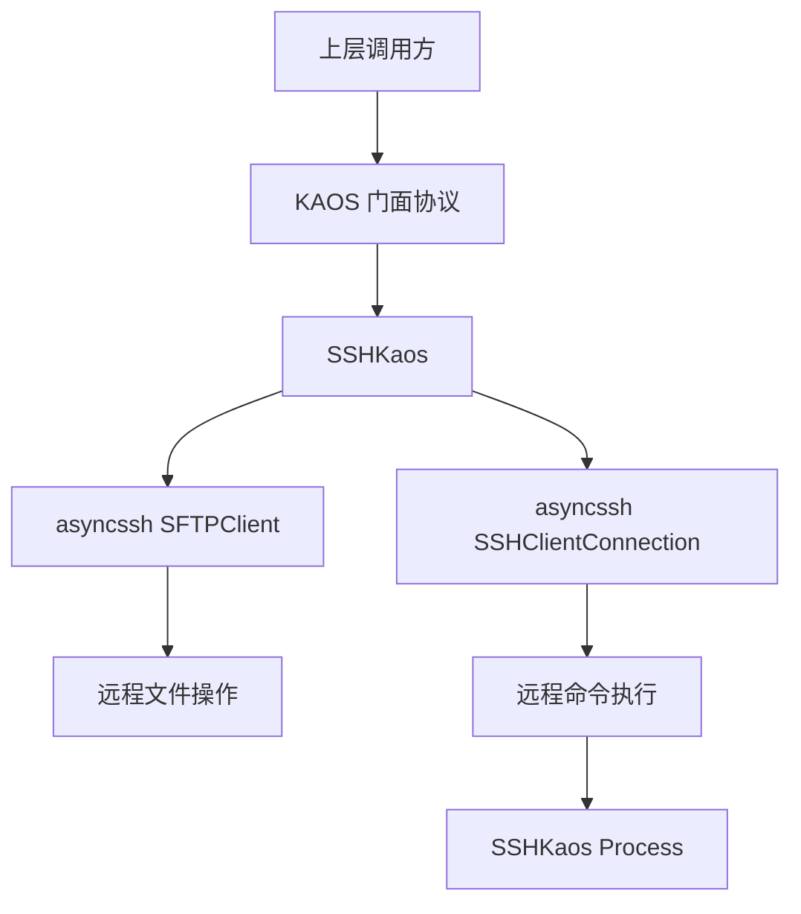
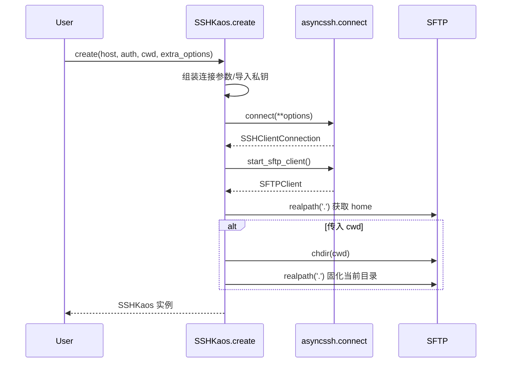
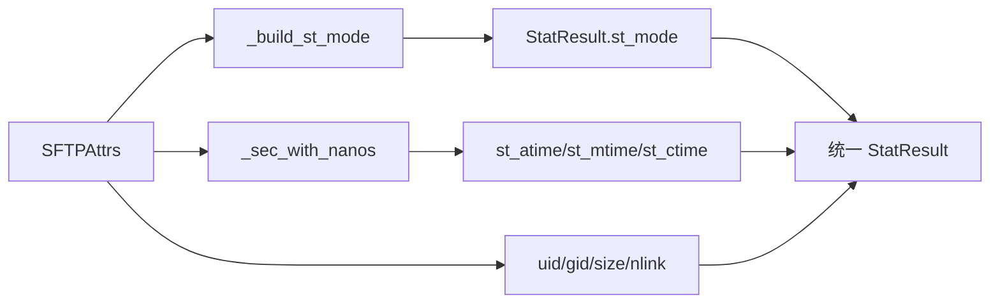
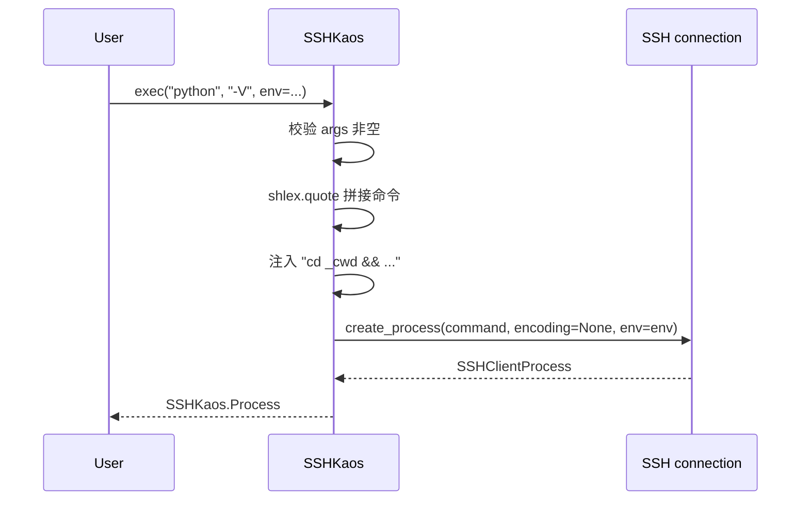
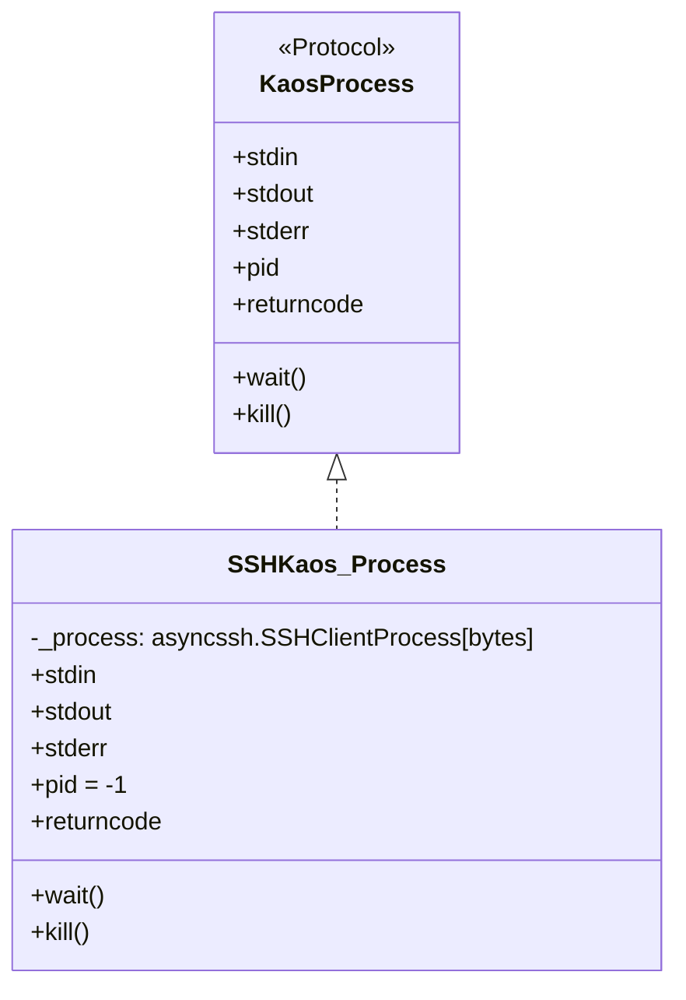

# ssh_backend 模块文档

## 模块概述

`ssh_backend` 对应实现文件 `packages/kaos/src/kaos/ssh.py`，核心类型是 `SSHKaos`。这个模块的目标是把 KAOS 抽象层（`Kaos` 协议）定义的统一能力，映射到远程 Linux/Unix 主机之上：文件系统操作走 SFTP，进程执行走 SSH session。换句话说，它让上层业务代码可以“像操作本地一样操作远程”，并且保持异步、可组合、与 `LocalKaos` 尽量一致的调用习惯。

该模块存在的设计动机非常实际：在 agent 或自动化工作流里，执行面并不总在本机。你可能需要在远端容器、跳板机、CI 节点或沙箱环境执行 shell、读写文件、遍历目录。若上层直接依赖 `asyncssh`，会把网络与后端细节扩散到整个系统；`SSHKaos` 则承担了“后端适配器”角色，把这些细节收敛在一个实现里，并对齐到 KAOS 的协议语义。

从系统层次看，`ssh_backend` 是 `kaos_core` 的一个可替换后端，与 `local_backend`（`LocalKaos`）形成同接口、不同执行面的关系。关于协议本身可参考 [kaos_protocols.md](kaos_protocols.md)，关于本地实现的对照可参考 [local_kaos.md](local_kaos.md)。

---

## 架构与依赖关系



这个结构的关键点在于 `SSHKaos` 同时持有两个通道对象：`SSHClientConnection` 与 `SFTPClient`。二者能力边界不同，语义也不同。比如 SFTP 的 `chdir()` 并不会自动影响 SSH exec 的当前目录，模块内部需要显式桥接；这也是该实现最核心的“兼容性工作”。

---

## 核心类型：`SSHKaos`

`SSHKaos` 是 `Kaos` 协议在远程场景下的实现。类属性 `name = "ssh"` 用于标识后端类型。构造后对象内部保存连接句柄、SFTP 客户端、`home`、当前 `cwd` 与 `host`。

### 创建连接：`SSHKaos.create(...)`

`create` 是异步工厂方法，负责认证参数整合、网络连接、SFTP 初始化和初始目录建立。

```python
ssh = await SSHKaos.create(
    host="example.com",
    port=22,
    username="deploy",
    key_paths=["~/.ssh/id_ed25519"],
    # 或 key_contents=[PRIVATE_KEY_PEM]
    cwd="/workspace/project",
)
```

它的行为可以概括为以下流程：先组装 `asyncssh.connect()` 参数，再处理密钥来源（`key_contents` 会被 `asyncssh.import_private_key` 转换），随后强制设置 `encoding=None` 以统一进程 IO 为 bytes。实现里还设置了 `known_hosts=None`，这样不会因为主机未加入 known_hosts 而失败。连接成功后启动 SFTP 客户端，解析 home 目录；若调用者传入 `cwd`，会先 `sftp.chdir(cwd)` 再 `realpath(".")` 固化为真实路径。



这里有一个重要安全取舍：`known_hosts=None` 牺牲了主机密钥验证，适合开发环境或可信内网，不适合强安全生产场景。如果你的部署要求抗中间人攻击，应扩展 `create` 让 known_hosts 策略可配置。

### 路径语义与目录状态

`pathclass()` 返回 `PurePosixPath`，意味着远程路径一律按 POSIX 规则解释。`normpath()` 使用 `posixpath.normpath`，`gethome()` 和 `getcwd()` 返回 `KaosPath` 包装结果。`chdir()` 通过 SFTP 改目录并刷新内部 `_cwd`。

需要特别注意：在这个后端里，`cwd` 是 `SSHKaos` 实例维护的逻辑状态，不是本地进程级全局状态。这与 `LocalKaos` 的 `os.chdir` 行为不同，但通过后续 `exec` 的目录注入策略，上层能得到近似一致体验。

### 文件元信息：`stat(...)`

`stat(path, follow_symlinks=True)` 内部调用 `sftp.stat`，并把 `SFTPAttrs` 映射到统一的 `StatResult`。`asyncssh.SFTPError` 被转换为 `OSError`，避免上层绑死第三方异常类型。

其中最关键的是 `st_mode` 的构造。SFTP 返回的权限与类型信息不总是完整组合，模块通过 `_build_st_mode(attrs)` 把 `FILEXFER_TYPE_*` 映射到 `stat.S_IF*`，在权限里缺失类型位时做补齐。时间字段通过 `_sec_with_nanos()` 合并秒和纳秒。由于 SFTP 不提供 inode/device，`st_ino` 与 `st_dev` 固定为 `0`。



这个设计体现了“兼容优先”：即便远端信息不完整，也保证返回结构稳定，方便上层统一判断 `is_file/is_dir` 等行为。

### 目录遍历与匹配：`iterdir` / `glob`

`iterdir(path)` 调用 SFTP `listdir`，并显式过滤 `.` 和 `..`（因为某些 SFTP 服务器会返回这两项），再逐项产出 `KaosPath`。`glob(path, pattern, case_sensitive=True)` 先把输入目录解析成真实路径，再执行 SFTP glob，最后对结果再次 `realpath`。

这里有一个明确限制：`case_sensitive=False` 会直接抛 `ValueError`，因为当前后端环境不支持可靠的大小写不敏感匹配语义。

### 文件读写：`readbytes/readtext/readlines/writebytes/writetext`

这些方法都直接基于 `sftp.open(...)` 实现，并保持与协议约定一致的参数风格。`readbytes` 支持可选 `n` 前缀读取；`readtext`/`writetext` 支持 `encoding` 与 `errors`；`writetext` 支持 `mode="w"|"a"`。

`readlines` 是一个需要重点说明的点：因为 `SFTPClientFile` 不支持原生逐行异步迭代，该实现先整文件 `readtext`，然后 `splitlines()` 再 `yield`。这不是流式实现，对超大文本文件会有明显内存压力。

### 目录创建：`mkdir(...)`

当 `parents=True` 时，使用 `sftp.makedirs`；否则先 `exists` 检查，若已存在且 `exist_ok=False` 抛 `FileExistsError`，再调用 `sftp.mkdir`。该逻辑意图与本地后端行为保持一致，降低跨后端差异。

### 进程执行：`exec(*args, env=None)`

`exec` 要求至少一个参数（程序名），否则抛 `ValueError`。命令拼装使用 `shlex.quote` 逐参数转义，降低注入风险。之后如 `_cwd` 存在，会把命令改写为 `cd <cwd> && <command>` 再交给 `connection.create_process`，并返回 `SSHKaos.Process`。



目录注入是该方法最关键的设计：它修复了“SFTP cwd 与 SSH exec cwd 不同步”的天然差异，从而保持调用者对 `chdir` 后行为的直觉一致性。代价是更严格：若 `_cwd` 无效，命令会在 `cd` 阶段失败。

### 生命周期终止：`unsafe_close()`

`unsafe_close()` 依次调用 `sftp.exit()` 与 `connection.close()`。调用后实例不可复用。方法名中的 `unsafe` 提醒调用者：这是低层连接关闭，不负责协调上层并发任务是否已完成。

---

## `SSHKaos.Process`：远程进程包装器

`SSHKaos.Process` 是 `KaosProcess` 的适配层，内部持有 `asyncssh.SSHClientProcess[bytes]`。它将 `stdin/stdout/stderr` 暴露为 `AsyncWritable/AsyncReadable`，以保持协议一致。

`returncode` 直接透传底层值；`kill()` 也直接调用底层 kill。`pid` 固定返回 `-1`，因为 `asyncssh.SSHClientProcess` 不提供可靠 PID。`wait()` 采用 `wait_closed()` 而不是底层 `wait()`，原因是后者会走 `communicate()` 并消耗输出缓冲，导致“wait 后再读 stdout/stderr”场景丢数据。这里的实现刻意与 `LocalKaos.Process` 行为对齐。



---

## 典型使用方式

最常见模式是：创建连接、执行若干文件或命令操作、最后关闭连接。

```python
from kaos.ssh import SSHKaos

ssh = await SSHKaos.create(
    host="10.0.0.12",
    username="root",
    password="***",
    cwd="/tmp",
)

try:
    await ssh.writetext("demo.txt", "hello ssh backend\n")
    content = await ssh.readtext("demo.txt")

    proc = await ssh.exec("bash", "-lc", "pwd && cat demo.txt")
    out = await proc.stdout.read()
    code = await proc.wait()

    print(code, out.decode())
finally:
    await ssh.unsafe_close()
```

如果你在系统中通过 `kaos` 门面切换后端，业务逻辑通常无需修改，仅替换当前后端实例即可。这也是 KAOS 抽象层的主要收益。更完整的门面说明请参考 [kaos_protocols.md](kaos_protocols.md)。

---

## 扩展与定制建议

扩展 `ssh_backend` 时，最重要原则是先守住 `Kaos` 协议语义，再增加可选能力。实践中常见扩展包括：增加 `known_hosts` 与 host key policy 配置、为 `exec` 增加超时/取消控制、补充流式大文件读取能力、在更高层统一异常映射（例如把网络错误规整为自定义错误族）。

由于 `SSHKaos` 与 `LocalKaos` 属于同契约不同实现，任何扩展后都建议跑同一套契约测试，重点验证 `cwd`、`wait` 后输出可读性、文件元信息与错误语义是否仍与本地后端对齐。

---

## 边界条件、错误与限制

这个模块最容易出问题的地方并非 API 表层，而是“远程 + 网络 + 协议差异”叠加。你需要特别关注以下事实：`pid` 在 SSH 后端不可用（固定 `-1`）；`glob` 不支持 `case_sensitive=False`；`readlines` 非流式可能导致大文件内存峰值；`stat` 的 `st_ino/st_dev` 永远为 `0`；`known_hosts=None` 有安全风险；`exec` 依赖 `_cwd` 注入，目录不存在时命令不会真正执行；`unsafe_close` 后对象不可再用。

另外，除了 `stat` 把 `SFTPError` 转为 `OSError` 之外，其它方法大多保留 `asyncssh` 原始异常语义。若上层需要统一错误模型，应在调用边界再做一层封装。

---

## 与其他文档的关系

本文聚焦 `ssh_backend` 自身实现细节，不重复介绍 KAOS 抽象整体。建议按下面顺序阅读：先看 [kaos_core.md](kaos_core.md) 理解模块定位，再看 [kaos_protocols.md](kaos_protocols.md) 理解协议契约，最后对照 [local_kaos.md](local_kaos.md) 观察本地/远程两种后端在语义对齐上的实现差异。
