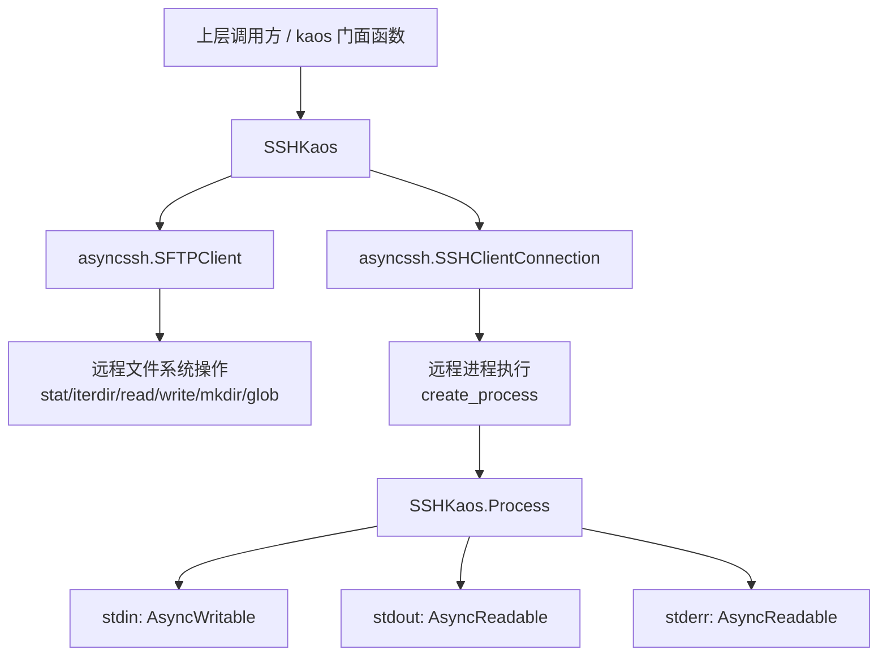
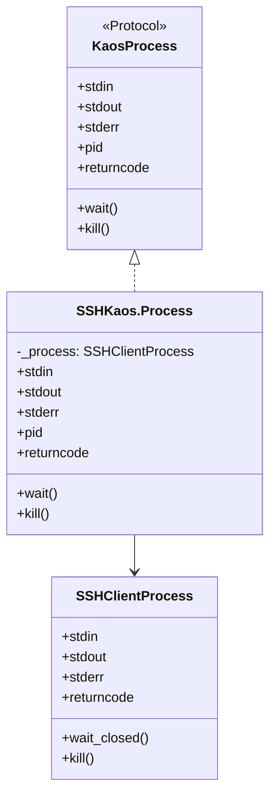
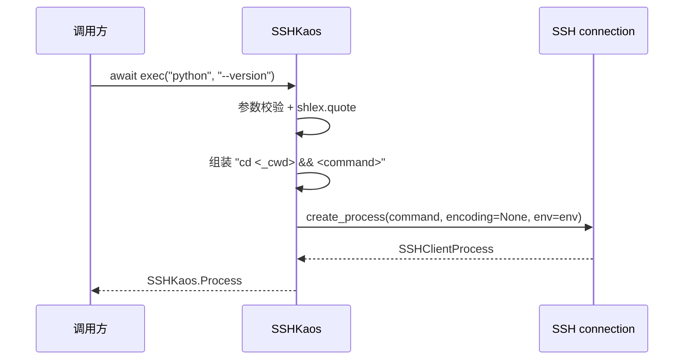
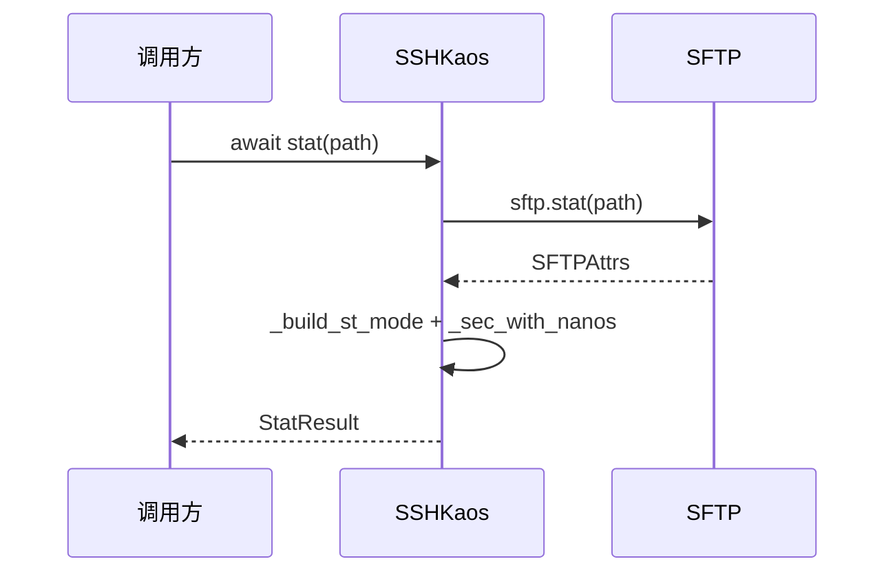
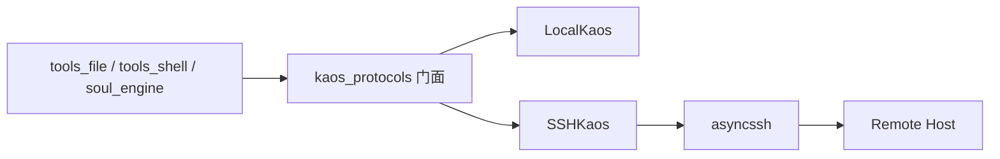

# ssh_kaos 模块文档

## 1. 模块定位与设计动机

`ssh_kaos` 对应 `packages/kaos/src/kaos/ssh.py`，核心实现是 `SSHKaos`。它的作用是把 `Kaos` 协议定义的“文件系统 + 进程执行”能力映射到远程主机，通过 `SSH` 和 `SFTP` 提供统一的异步操作接口。

这个模块存在的关键意义，是让上层调用方（例如文件工具、shell 工具、agent 执行流程）无需区分“本地执行”还是“远程执行”。在调用方式上，`SSHKaos` 与 `LocalKaos`（见 [local_kaos.md](local_kaos.md)）尽量保持一致；在实现层面，它通过 `asyncssh` 处理网络连接、鉴权、远程进程和远程文件访问。

从设计取舍看，`ssh_kaos` 不是 SSH 客户端的完整封装，而是一个“协议适配后端”：只实现 `Kaos` 所要求的最小且高频能力，保证跨后端的一致语义。这一契约本身定义在 [kaos_protocols.md](kaos_protocols.md)，整体位置见 [kaos_core.md](kaos_core.md)。

---

## 2. 架构总览



`SSHKaos` 内部维护两个关键句柄：一个是 SSH 连接（用于执行命令），一个是 SFTP 客户端（用于文件操作）。这两个通道语义并不完全一致，模块内部做了必要的“语义桥接”，例如显式维护并注入 `cwd` 到命令执行链路中。

---

## 3. 关键组件与内部实现细节

## 3.1 `_FILEXFER_TYPE_TO_MODE` 与 `_build_st_mode`

`SFTPAttrs` 里的文件类型（`attrs.type`）与权限（`attrs.permissions`）并不总能直接构成完整 `st_mode`。`ssh_kaos` 用 `_FILEXFER_TYPE_TO_MODE` 把 `asyncssh.constants.FILEXFER_TYPE_*` 映射到 `stat.S_IF*` 位，再由 `_build_st_mode(attrs)` 合并。

行为规则如下：

- 如果 `permissions` 存在，优先用权限值；
- 如果权限值里没有文件类型位，而 `attrs.type` 可映射，则补上类型位；
- 如果没有权限值，则退化为仅类型位。

这个转换是为了让 `stat()` 返回的 `StatResult.st_mode` 尽量贴近本地 `os.stat` 语义，减少上层判断分支。

## 3.2 `_sec_with_nanos`

`asyncssh.SFTPAttrs` 的时间字段可能拆分为秒与纳秒。`_sec_with_nanos(sec, ns)` 把它们合并成 Python `float` 秒值，返回规则是：

- `ns is None` 时直接返回 `float(sec)`；
- 否则返回 `sec + ns / 1e9`。

这是 `stat` 结果中 `st_atime/st_mtime/st_ctime` 的标准化步骤。

## 3.3 `SSHKaos.Process`

`SSHKaos.Process` 是对 `asyncssh.SSHClientProcess[bytes]` 的轻量包装，目的是满足 `KaosProcess` 协议。



有两个实现细节非常重要：

第一，`pid` 固定返回 `-1`。原因是 `asyncssh.SSHClientProcess` 不提供可用的远程 PID。这意味着调用方不能依赖 SSH 后端的 `pid` 做精确进程管理。

第二，`wait()` 使用 `wait_closed()` 而不是 `wait()`。代码注释明确指出 `asyncssh.SSHClientProcess.wait()` 会通过 `communicate()` 消耗并清空 stdout/stderr 缓冲；使用 `wait_closed()` 可以让“先等进程结束、后读取输出”这一调用模式与 `LocalKaos` 对齐。

## 3.4 `SSHKaos.create(...)`

这是异步工厂方法，负责连接初始化与会话基线状态建立。

```python
ssh = await SSHKaos.create(
    host="example.com",
    port=22,
    username="alice",
    key_paths=["~/.ssh/id_ed25519"],
    cwd="/workspace/project",
)
```

核心参数与行为：

- `host`：目标主机（必填）。
- `port`：SSH 端口，默认 `22`。
- `username/password`：密码鉴权可选。
- `key_paths`：私钥文件路径列表。
- `key_contents`：私钥内容字符串列表，会经 `asyncssh.import_private_key` 转为 `SSHKey`。
- `cwd`：初始化远程工作目录；若提供会先 `chdir` 再取真实路径。
- `**extra_options`：透传给 `asyncssh.connect`，可扩展连接参数（如超时、代理等）。

内部默认策略：

- 强制 `encoding=None`，统一按 bytes 流处理进程 I/O；
- 设置 `known_hosts=None`，避免 “Host key is not trusted” 失败。

最后该方法返回 `SSHKaos(connection, sftp, home, cwd, host)` 实例。`home` 由 `sftp.realpath(".")` 在初始状态下解析获得。

> 安全提示：`known_hosts=None` 会绕过主机密钥校验，适合开发或受控环境，不适合高安全生产环境。

## 3.5 `SSHKaos` 核心方法总览

`SSHKaos` 通过结构化协议匹配 `Kaos`（见 [kaos_protocols.md](kaos_protocols.md)）。主要方法分为四类：路径上下文、文件系统、内容读写、进程执行与关闭。

### 3.5.1 路径与上下文方法

- `host`：返回构造时记录的主机名。
- `pathclass()`：固定返回 `PurePosixPath`，因为远程路径按 POSIX 语义处理。
- `normpath(path)`：`posixpath.normpath` 归一化并返回 `KaosPath`。
- `gethome()` / `getcwd()`：返回当前记录的远程 home/cwd。
- `chdir(path)`：调用 `sftp.chdir()`，再以 `realpath(".")` 更新内部 `_cwd`。

这里与本地后端有个关键差异：`cwd` 在 SSH 后端是对象内维护状态，不是进程级全局状态。

### 3.5.2 文件系统与元信息

- `stat(path, follow_symlinks=True)`：调用 `sftp.stat`，再映射为统一 `StatResult`。
  - 捕获 `asyncssh.SFTPError` 并转成 `OSError`，避免上层直接依赖第三方异常类型。
  - `st_ino/st_dev` 固定为 `0`（SFTP 不支持）。
- `iterdir(path)`：列目录并产出 `KaosPath`；显式过滤 `.` 与 `..`（SFTP 可能返回它们）。
- `glob(path, pattern, case_sensitive=True)`：在真实路径上做 glob。
  - `case_sensitive=False` 直接抛 `ValueError`（当前环境不支持）。

### 3.5.3 文件读写

- `readbytes(path, n=None)`：二进制读取；`n=None` 读全量。
- `readtext(path, encoding='utf-8', errors='strict')`：文本读取。
- `readlines(...)`：由于 `SFTPClientFile` 不支持原生 `readlines`，实现为先 `readtext`，再 `splitlines()` 后逐行 `yield`。
- `writebytes(path, data)` / `writetext(path, data, mode='w'|'a', ...)`：返回底层写入长度。

`readlines` 的实现不是流式读取，这在大文件场景是重要限制（见第 7 节）。

### 3.5.4 目录创建与进程执行

- `mkdir(path, parents=False, exist_ok=False)`：
  - `parents=True` 时走 `sftp.makedirs`；
  - 否则先 `exists` 检查，再 `mkdir`，并在已存在且 `exist_ok=False` 时抛 `FileExistsError`。
- `exec(*args, env=None)`：
  - 至少需要一个参数，否则 `ValueError`；
  - 通过 `shlex.quote` 拼接命令，降低注入风险；
  - 若有 `_cwd`，执行前显式前缀 `cd <cwd> && ...`，确保与其他后端的 cwd 语义对齐；
  - 返回 `SSHKaos.Process`。

### 3.5.5 连接关闭

`unsafe_close()` 会调用 `sftp.exit()` 与 `connection.close()`，关闭后实例不可再用。方法名中的 `unsafe` 强调：该操作是“硬关闭”，不保证调用方尚未完成的操作可以安全恢复。

---

## 4. 关键行为流程

## 4.1 `exec` 流程：SFTP cwd 与 SSH 执行语义桥接



这一段逻辑解决了一个常见坑：SFTP 的当前目录不会自动影响 SSH `exec`。`ssh_kaos` 显式注入 `cd`，让 `chdir()` 对后续命令生效，尽量贴近本地后端认知。

## 4.2 `stat` 流程：远程属性到统一结果



这条链路的目标是“兼容优先”：即使远端能力不完整，也要输出结构稳定的 `StatResult`。

---

## 5. 使用与配置示例

## 5.1 最小连接与文件操作

```python
from kaos.ssh import SSHKaos

ssh = await SSHKaos.create(
    host="192.168.1.10",
    username="root",
    password="***",
    cwd="/tmp",
)

try:
    await ssh.writetext("hello.txt", "hello over ssh\n")
    text = await ssh.readtext("hello.txt")
    print(text)
finally:
    await ssh.unsafe_close()
```

## 5.2 私钥内容直传（无落盘）

```python
ssh = await SSHKaos.create(
    host="example.com",
    username="deploy",
    key_contents=[PRIVATE_KEY_PEM],
)
```

这种方式适合密钥由密管系统动态注入的场景。

## 5.3 与 `kaos` 门面配合

```python
import kaos
from kaos.ssh import SSHKaos

ssh = await SSHKaos.create(host="example.com", username="alice", cwd="/work")
token = kaos.set_current_kaos(ssh)
try:
    proc = await kaos.exec("bash", "-lc", "pwd && ls")
    out = await proc.stdout.read()
    await proc.wait()
    print(out.decode())
finally:
    kaos.reset_current_kaos(token)
    await ssh.unsafe_close()
```

这体现了 KAOS 抽象层的核心价值：业务代码几乎不变，仅切换后端实例。

---

## 6. 与其他模块关系

`ssh_kaos` 在系统中的角色是 `kaos_core` 的远程后端实现。它遵循 `kaos_protocols` 的契约，与 `local_kaos` 形成“同接口、不同执行面”的关系。上层如 `tools_file`、`tools_shell`、`acp_kaos` 不需要依赖 `asyncssh` 细节，只需要依赖 KAOS 门面函数。



---

## 7. 边界条件、错误行为与已知限制

`ssh_kaos` 的主要复杂度不在 API 量，而在“远程系统能力差异”和“网络语义”上。以下几点在实际维护中最容易踩坑：

- `pid` 不可用：`SSHKaos.Process.pid == -1`，不要在 SSH 后端依赖真实 PID。
- `glob` 不支持 `case_sensitive=False`：会抛 `ValueError`。
- `readlines` 非流式：当前实现先整体读入文本，超大文件会占用大量内存。
- `stat` 信息不完整：`st_ino/st_dev` 恒为 `0`，且部分字段可能由默认值补齐。
- `known_hosts=None` 的安全风险：会跳过主机密钥校验，存在中间人攻击面。
- `exec` 的 cwd 依赖内部 `_cwd`：如果远程目录不存在，`cd` 阶段会失败，命令不会执行。
- `unsafe_close()` 后对象不可复用：调用方应在生命周期结束时统一关闭，避免并发任务误用已关闭实例。

此外，网络抖动、连接中断、认证失败通常会以 `asyncssh` 异常形式出现，`stat` 之外的方法并未统一转换异常类型。调用层若需要一致错误模型，应做统一包装。

---

## 8. 扩展建议

如果你要扩展 `SSHKaos`（例如更严格安全策略或更强大文件能力），建议优先保持 `Kaos` 契约语义稳定，再新增可选能力。常见可扩展方向包括：

- 在 `create` 中允许配置 `known_hosts` 校验策略，而非固定 `None`；
- 为 `exec` 增加超时/取消封装（保持返回 `KaosProcess` 的兼容）；
- 为大文件读取提供真正流式 `readlines`；
- 统一异常映射层，减少上层对 `asyncssh` 的感知。

扩展后建议与 `LocalKaos` 跑同一套契约测试，验证跨后端一致性。

---

## 9. 参考阅读

- [kaos_core.md](kaos_core.md)：KAOS 总体架构与系统位置。
- [kaos_protocols.md](kaos_protocols.md)：`Kaos`/`KaosProcess` 协议及门面函数。
- [local_kaos.md](local_kaos.md)：本地后端实现细节，便于做语义对照。
