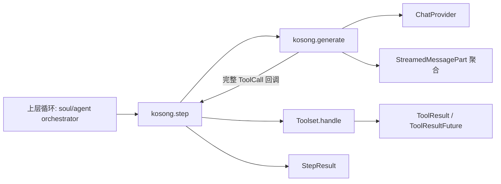
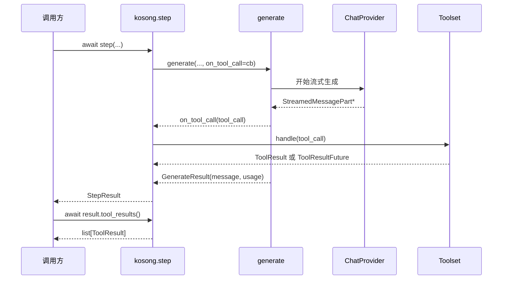
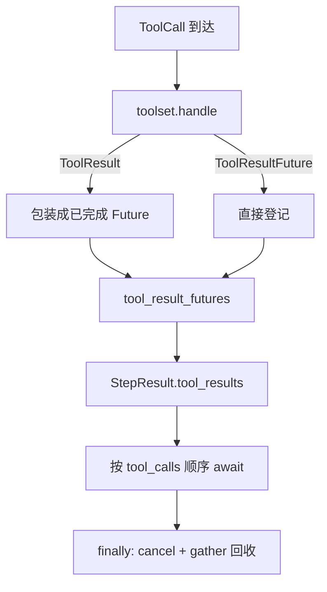

# step_runtime 模块文档

## 模块概述：它解决了什么问题，为什么存在

`step_runtime` 是 `kosong_core` 中将“模型单次生成”升级为“可执行代理步骤”的运行时薄层。它的核心入口是 `kosong.step(...)`，核心结果类型是 `StepResult`。从职责边界上看，`generate(...)` 负责把 provider 的流式输出拼装成最终 `Message`，而 `step(...)` 负责在生成过程中拦截 `ToolCall`、触发工具执行、统一结果等待语义，并在失败/取消时确保后台任务不会泄漏。

这个模块存在的根本原因，是上层 agent 循环（例如 soul runtime）通常只想处理“这一步输入了什么、产出了什么”，而不想直接管理多路工具 future、回调时机、异常传播和取消清理。`step_runtime` 通过一个稳定的单步抽象，把这些细节封装到可复用的运行时协议中。

---

## 在整体系统中的位置



这张图体现了一个关键设计：`step_runtime` 不直接实现 provider，也不实现具体工具，它只是连接 `generate`（模型输出层）和 `Toolset`（工具执行层），向上暴露一个“单步可等待结果对象”。关于 provider 协议与流式消息细节可参考 [provider_protocols.md](provider_protocols.md) 与 [kosong_chat_provider.md](kosong_chat_provider.md)；关于工具协议可参考 [kosong_tooling.md](kosong_tooling.md)。

---

## 核心组件一：`step(...)`

### 签名

```python
async def step(
    chat_provider: ChatProvider,
    system_prompt: str,
    toolset: Toolset,
    history: Sequence[Message],
    *,
    on_message_part: Callback[[StreamedMessagePart], None] | None = None,
    on_tool_result: Callable[[ToolResult], None] | None = None,
) -> StepResult
```

### 参数与语义

`chat_provider` 是模型后端抽象，`system_prompt` 与 `history` 一起定义本轮输入上下文，`toolset` 负责处理模型产出的工具调用。`on_message_part` 用于增量消费流式片段（UI 渲染、日志、调试），`on_tool_result` 用于在工具 future 完成时做即时侧效果（例如“工具完成提示”）。

函数不会修改传入的 `history`；它只返回本轮新增 assistant `message` 及关联信息。

### 内部执行机制

`step(...)` 内部维护两份状态：

- `tool_calls: list[ToolCall]`：按出现顺序记录工具调用。
- `tool_result_futures: dict[str, ToolResultFuture]`：按 `tool_call.id` 保存结果 future。

当 `generate(...)` 在流处理中识别到完整 `ToolCall` 时，会触发 `on_tool_call` 回调。`step(...)` 在回调里调用 `toolset.handle(tool_call)`，并做“统一 future 化”处理：

1. 若 `handle` 直接返回 `ToolResult`（同步完成），就创建一个已完成的 `ToolResultFuture` 并 `set_result`。
2. 若返回本身是 `ToolResultFuture`（异步执行），直接登记并绑定 done callback。

这样上层在后续消费时无需区分同步/异步工具路径。

### 回调行为与副作用

`future_done_callback` 会在 future 完成时调用 `on_tool_result(result)`。这个回调运行在事件循环回调上下文，不建议在里面执行阻塞逻辑。若回调内部抛异常（除 `CancelledError` 外），异常不会在 `step(...)` 主协程内被显式处理，可能表现为事件循环未处理异常日志；生产代码应在回调内部自捕获。

### 异常与取消清理

当 `generate(...)` 抛出 `ChatProviderError` 或 `asyncio.CancelledError` 时，`step(...)` 会进行集中清理：移除 done callback、取消全部已登记 future、`gather(..., return_exceptions=True)` 回收，再将原异常重新抛出。

这保证了两点：一是取消语义可向上传播；二是不会遗留“父任务失败但工具任务仍在后台运行”的悬挂任务。

---

## 核心组件二：`StepResult`

`StepResult` 是 `@dataclass(frozen=True, slots=True)`。`frozen=True` 表明结果对象语义上不可变，`slots=True` 降低实例属性开销，适合高频 step 场景。

```python
@dataclass(frozen=True, slots=True)
class StepResult:
    id: str | None
    message: Message
    usage: TokenUsage | None
    tool_calls: list[ToolCall]
    _tool_result_futures: dict[str, ToolResultFuture]
```

### 字段解释

`id` 是 provider 生成消息 ID（可为空）；`message` 是本步完整 assistant 消息；`usage` 是 token 使用统计（provider 不支持时为 `None`）；`tool_calls` 保存本步出现的工具调用；`_tool_result_futures` 是与这些调用关联的 future 容器。

### `tool_results()` 的工作方式

```python
async def tool_results(self) -> list[ToolResult]
```

该方法按 `tool_calls` 顺序逐个 `await` 对应 future，然后返回 `list[ToolResult]`。这里强调“调用顺序一致性”，而不是“谁先完成先返回”。这对把工具结果重新拼回对话时序非常重要。

方法在 `finally` 中总会取消并回收所有 future；因此它不仅是“取结果”，也是“收口清理”。这意味着同一个 `StepResult` 不应被设计为多次重复等待同一批 future 的可重入对象。

---

## 端到端时序



这个时序说明一个常被忽视的事实：工具执行可能早于消息流结束就启动，因此 `StepResult` 返回时部分工具可能已经完成，部分还在运行。调用方可以根据产品策略决定立即等待，或稍后再统一收敛。

---

## 数据流与清理流



这个流程展示了模块的关键不变量：无论工具同步还是异步，内部都以 future 统一表示；无论成功还是失败，最终都会进入回收路径。

---

## 使用示例

### 最小示例

```python
result = await kosong.step(
    chat_provider=provider,
    system_prompt="You are a precise assistant.",
    toolset=toolset,
    history=history,
)

print(result.message)
print(result.usage)

tool_results = await result.tool_results()
for tr in tool_results:
    print(tr)
```

### 带流式与工具完成回调

```python
async def on_part(part):
    # UI 增量显示或调试日志
    print("[part]", part)

def on_tool_result(res):
    try:
        print("[tool done]", res.tool_call_id)
    except Exception:
        # 建议回调内部自兜底
        pass

result = await kosong.step(
    chat_provider=provider,
    system_prompt=system_prompt,
    toolset=toolset,
    history=history,
    on_message_part=on_part,
    on_tool_result=on_tool_result,
)

await result.tool_results()
```

---

## 扩展与实现建议

在扩展层面，最常见做法是实现自己的 `Toolset` 或定制 `ChatProvider`。对 `step_runtime` 来说，最重要的契约是：`Toolset.handle(...)` 应尽快返回 `ToolResult` 或 `ToolResultFuture`，不要在该调用里做长时间阻塞。否则会拖慢流式处理链路，影响消息增量体验。

对于工具错误处理，建议尽量把失败编码为工具结果（例如 `is_error` 的返回值对象），而不是直接抛出未捕获异常破坏主流程。关于具体工具返回值建模可参见 [kosong_tooling.md](kosong_tooling.md)。

---

## 边界条件、错误条件与已知限制

`step_runtime` 当前设计有几个需要明确的操作性约束。首先，`tool_result_futures` 以 `tool_call.id` 为键，模块假定该 ID 唯一；若上游出现重复 ID，后写入会覆盖先写入，导致结果映射错误。其次，`StepResult.tool_results()` 带有清理副作用，不适合作为“可多次重放”的查询接口。再次，`on_tool_result` 仅处理 `CancelledError` 的静默路径，其他异常需要调用方自己兜底。

此外，`step(...)` 只对 `ChatProviderError` 与 `CancelledError` 做显式清理分支；若某些实现抛出其他异常类型，依然会向上冒泡，调用方应在更高层统一异常策略（例如重试、降级、终止会话）。

---

## 维护者视角：设计不变量

维护这个模块时，最关键的是守住两个不变量。第一，工具执行形态必须被统一成 future 语义，保证调用方消费接口稳定。第二，任何退出路径（成功、失败、取消）都必须可回收工具任务，避免悬挂协程和资源泄漏。

只要这两个不变量保持不变，`step_runtime` 就可以在不感知具体 provider 和工具实现细节的前提下持续稳定地服务上层 agent 编排。
