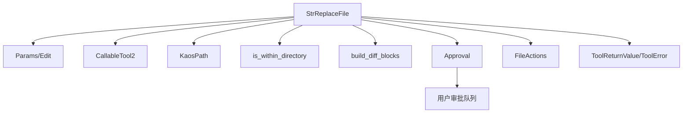
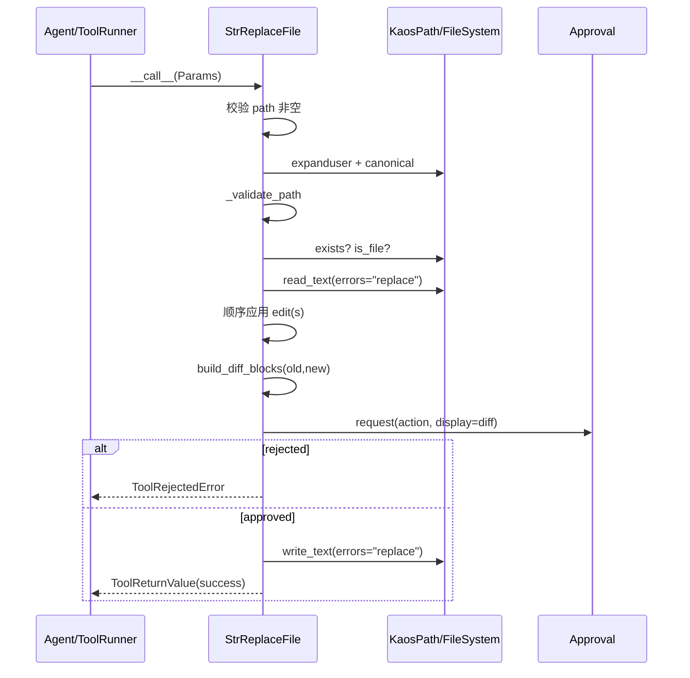
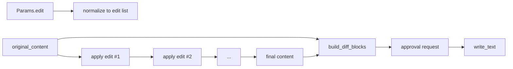

# string_replacement 模块文档

## 模块概述

`string_replacement` 模块对应实现文件 `src/kimi_cli/tools/file/replace.py`，核心职责是为 agent 提供一个“**基于字符串匹配的文件内替换工具**”。它不是 AST 级重写器，也不是正则引擎，而是强调可预测、可审阅、可审批的文本替换能力：先读取文件，按规则应用一个或多个替换，再展示 diff 并请求用户批准，最后才落盘。

这个模块存在的原因非常明确。在 AI agent 场景里，直接写文件虽然高效，但风险也很高：容易误改、越界改、无感改。`StrReplaceFile` 将编辑动作放入统一治理链路（路径约束、审批、差异可视化、结构化错误返回），使“自动改文件”变成一个对用户可见、可拒绝、可追踪的行为。它与 [text_reading.md](text_reading.md) 和 [file_writing.md](file_writing.md) 共同构成文件编辑闭环：读取上下文 → 定位并替换 → 审批后写入。

---

## 代码位置与核心组件

- 文件：`src/kimi_cli/tools/file/replace.py`
- 核心组件：
  - `Edit`
  - `Params`
  - `StrReplaceFile`

---

## 设计意图与行为边界

`StrReplaceFile` 的设计重点不是“替换能力尽可能强”，而是“替换行为尽可能可控”。因此它选择了朴素且稳定的 `str.replace` 语义，避免复杂语法带来的歧义；同时它把敏感动作交给 `Approval` 流程，并根据路径位置区分 `FileActions.EDIT` 与 `FileActions.EDIT_OUTSIDE`，让策略层能够做差异化风控。

这也决定了它的边界：它不支持正则表达式、不支持按行范围替换、不提供交互式冲突解决，不会自动创建文件或目录；它只对“已存在的普通文件”做内容替换，并将改动以 diff 形式交给用户确认。

---

## 数据模型详解

## `Edit`

`Edit` 是单次替换操作的数据模型，继承 `pydantic.BaseModel`。它定义“把什么替换成什么，以及替换多少次”。

### 字段

- `old: str`：待替换的旧字符串，可多行。
- `new: str`：替换后的新字符串，可多行。
- `replace_all: bool = False`：是否替换所有匹配项；默认仅替换第一次匹配。

### 行为语义

当 `replace_all=False` 时，工具调用 `content.replace(old, new, 1)`，只改第一个匹配；当 `replace_all=True` 时，调用 `content.replace(old, new)`，改全部匹配。这个语义简单清晰，也意味着匹配是“字面字符串匹配”，不做正则解释。

---

## `Params`

`Params` 是工具入参模型，定义目标文件和替换动作集合。

### 字段

- `path: str`：目标文件路径。若目标在工作目录外，必须使用绝对路径。
- `edit: Edit | list[Edit]`：可传单个替换或多个替换，多个替换会按顺序串行应用。

### 重要特性

`edit` 支持 union（单对象或列表）是该模块的实用设计：简单场景不必包列表，复杂场景可一次性提交多步替换。注意多编辑是**有序且状态相关**的，后续编辑看到的是前面编辑后的新内容。

---

## `StrReplaceFile` 实现详解

`StrReplaceFile` 继承 `CallableTool2[Params]`，遵循统一工具协议，返回类型为 `ToolReturnValue` 或其错误子类（`ToolError` / `ToolRejectedError`）。

### 类属性与构造

- `name = "StrReplaceFile"`
- `description = load_desc(.../replace.md)`
- `params = Params`

构造函数：

```python
__init__(self, builtin_args: BuiltinSystemPromptArgs, approval: Approval)
```

构造阶段注入两项关键依赖：

- `builtin_args.KIMI_WORK_DIR`：工作目录边界，用于路径策略判断。
- `approval`：审批服务，用于写入前请求用户确认。

### `_validate_path(self, path: KaosPath) -> ToolError | None`

该方法负责路径安全校验，逻辑是：

1. 先取 `resolved_path = path.canonical()`。
2. 如果 `resolved_path` 不在工作目录内，且原始路径不是绝对路径，则拒绝。

返回值语义：

- 校验通过：`None`
- 校验失败：`ToolError(brief="Invalid path", ...)`

副作用：无文件系统写操作，仅做路径语义判断。

### `_apply_edit(self, content: str, edit: Edit) -> str`

这是纯函数式的单编辑执行器：输入旧内容 + `Edit`，输出替换后内容。

- `replace_all=True` → `content.replace(edit.old, edit.new)`
- `replace_all=False` → `content.replace(edit.old, edit.new, 1)`

副作用：无。

### `__call__(self, params: Params) -> ToolReturnValue`

这是主执行流程，可分为以下阶段。

1. **基础输入检查**：`params.path` 为空时立即返回 `ToolError("Empty file path")`。
2. **路径展开与校验**：`KaosPath(path).expanduser()` → `_validate_path` → `canonical()`。
3. **文件存在性与类型检查**：必须存在且是普通文件。
4. **读取文本内容**：`read_text(errors="replace")`。
5. **应用替换**：将 `edit` 统一归一化为列表，按顺序调用 `_apply_edit`。
6. **变更检测**：若替换后内容与原文一致，返回 `No replacements made`。
7. **构建 diff 展示**：`build_diff_blocks(path, original_content, content)`。
8. **审批请求**：根据路径在工作目录内外选择 `FileActions.EDIT` 或 `FileActions.EDIT_OUTSIDE`，调用 `approval.request(...)`。
9. **落盘写入**：审批通过后 `write_text(content, errors="replace")`。
10. **成功返回**：返回 `ToolReturnValue(is_error=False, message=..., display=diff_blocks)`。

异常路径：任意未捕获异常都会进入总 `except`，转换为 `ToolError(brief="Failed to edit file")`。

---

## 架构关系图



`StrReplaceFile` 本质上是一个“编排层”：它不把路径、审批、展示、协议揉在一起实现，而是调用现有基础组件完成每个职责。这样做的好处是可维护性高，且每层行为都可独立演进。

---

## 调用时序图



这个时序的关键点是“审批在写入前，且携带 diff”。用户看到的是具体改动，而不是抽象参数。

---

## 数据流（多编辑场景）



在多编辑模式下，替换是链式变换，后续编辑依赖前一步结果，因此编辑顺序是语义的一部分。

---

## 返回值、错误模型与副作用

成功时返回 `ToolReturnValue`，特点如下：

- `is_error=False`
- `output=""`（主要信息放在 `message`）
- `message` 包含编辑数量和替换数量统计
- `display` 包含 diff blocks，供 UI 展示

失败时通常返回 `ToolError`，常见 `brief` 包括：

- `Empty file path`
- `Invalid path`
- `File not found`
- `Invalid path`（不是文件）
- `No replacements made`
- `Failed to edit file`

用户拒绝审批时返回 `ToolRejectedError`（继承自 `ToolError`）。

主要副作用只有一个：审批通过后会覆盖写回目标文件。

---

## 使用示例

### 单次替换（默认只替换首个匹配）

```python
params = Params(
    path="/workspace/app/config.toml",
    edit=Edit(old="debug = true", new="debug = false")
)
ret = await tool(params)
```

### 一次调用执行多个替换

```python
params = Params(
    path="/workspace/app/main.py",
    edit=[
        Edit(old="import oldlib", new="import newlib"),
        Edit(old="OldClient(", new="NewClient(", replace_all=True),
    ],
)
ret = await tool(params)
```

### 工作目录外编辑（必须绝对路径）

```python
params = Params(
    path="/etc/example.conf",  # outside work dir, absolute path required
    edit=Edit(old="ENABLED=0", new="ENABLED=1"),
)
```

---

## 配置与运行时行为说明

该模块自身没有独立配置文件，行为主要受运行时注入对象影响：

- `KIMI_WORK_DIR`：决定“目录内/目录外”判定和路径规则。
- `Approval`：决定是否需要人工确认，或是否启用自动放行（例如 yolo/auto-approve）。

因此，想调整风险策略时，通常不改 `replace.py`，而是调整审批状态与工具编排层策略。

---

## 边界条件、错误条件与已知限制

以下是维护中最容易踩坑的点。

- **未匹配即报错**：若所有替换后内容完全不变，工具返回错误而不是成功空操作。
- **多编辑顺序敏感**：前一个编辑可能影响后一个编辑是否还能匹配。
- **替换计数近似**：成功消息中的 `total_replacements` 基于 `original_content` 统计，复杂多编辑（特别是相互影响的编辑）下可能与真实执行次数不完全一致。
- **`old=""` 的特殊行为**：Python `str.replace` 对空字符串有边界插入语义，可能导致大量非预期变更；当前实现未显式禁止。
- **编码容错但可能信息丢失**：`read_text/write_text(errors="replace")` 会替换非法字符，提高鲁棒性，但可能改变原始字节语义。
- **不支持正则/结构化改写**：仅字面匹配替换，复杂重构建议结合 `ReadFile + WriteFile` 或外部脚本工具。
- **审批上下文要求**：`Approval.request` 期望在工具调用上下文中执行；若上下文异常，最终会被 `except` 包装成 `Failed to edit file`。

---

## 扩展建议

如果你要扩展本模块，推荐遵循现有分层思路：

1. 在参数模型层新增能力（例如 `strict: bool`、`case_sensitive: bool`）。
2. 在 `_apply_edit` 增强替换策略，但保持默认行为兼容。
3. 保持“先 diff、后审批、再落盘”的顺序不变。
4. 错误返回继续使用 `ToolError` 体系，避免抛原始异常破坏工具协议。

若要支持正则替换，建议新增独立工具（如 `RegexReplaceFile`），而不是直接改变 `StrReplaceFile` 默认语义，以免破坏现有 agent 提示与调用预期。

---

## 与其他模块关系

- 与 [file_module_entrypoint.md](file_module_entrypoint.md)：该模块通过入口统一导出为 `StrReplaceFile`。
- 与 [text_reading.md](text_reading.md)：常见模式是先读取定位，再替换。
- 与 [file_writing.md](file_writing.md)：二者都走审批链路，但 `WriteFile` 关注整体写入，`StrReplaceFile` 聚焦局部替换。
- 与 [kosong_tooling.md](kosong_tooling.md)：继承 `CallableTool2`，遵循统一参数验证与返回协议。
- 与 [soul_engine.md](soul_engine.md) / [config_and_session.md](config_and_session.md)：审批状态与会话策略会直接影响是否自动放行编辑。

---

## 维护者速查

- 想定位“为什么没改成功”：先看是否命中 `No replacements made`。
- 想定位“为什么被拒绝”：看 `Approval` 状态、动作类型是否 `EDIT_OUTSIDE`。
- 想排查“改动展示不对”：看 `build_diff_blocks` 的上下文分组逻辑。
- 想排查“替换数量不准”：看成功消息统计逻辑是否应改为基于逐步内容统计。


---

## 典型实现伪代码（便于快速理解）

下面的伪代码对应 `__call__` 的核心控制流，省略了类型细节，但保留了关键决策点：

```python
async def __call__(params):
    if not params.path:
        return ToolError("Empty file path")

    p = KaosPath(params.path).expanduser()
    err = await _validate_path(p)
    if err:
        return err
    p = p.canonical()

    if not await p.exists():
        return ToolError("File not found")
    if not await p.is_file():
        return ToolError("Invalid path")

    original = await p.read_text(errors="replace")
    content = original

    edits = [params.edit] if isinstance(params.edit, Edit) else params.edit
    for e in edits:
        content = _apply_edit(content, e)

    if content == original:
        return ToolError("No replacements made")

    diff_blocks = build_diff_blocks(str(p), original, content)
    action = EDIT if in_workdir(p) else EDIT_OUTSIDE

    approved = await approval.request(name, action, f"Edit file `{p}`", display=diff_blocks)
    if not approved:
        return ToolRejectedError()

    await p.write_text(content, errors="replace")
    return ToolReturnValue(success_message, display=diff_blocks)
```

这段流程体现了该工具最核心的工程原则：**先验证、再计算、后审批、最终写入**。它把“可逆审阅”放在“高效修改”之前，符合 agent 场景下的安全优先策略。

---

## 回归测试建议

在维护或扩展 `StrReplaceFile` 时，建议至少覆盖以下测试组，避免行为回归：

- 路径测试：工作目录内相对路径、工作目录外相对路径（应失败）、工作目录外绝对路径（可继续）。
- 文件类型测试：不存在路径、目录路径、普通文件路径。
- 替换语义测试：`replace_all=False` 只替换首个；`replace_all=True` 替换全部；多编辑顺序影响结果。
- 空变更测试：`old` 不存在时返回 `No replacements made`。
- 审批测试：批准与拒绝分支（拒绝应返回 `ToolRejectedError` 且不写盘）。
- 编码容错测试：包含非法字符输入时 `errors="replace"` 的读写行为。

如果你正在编写更高层集成测试，可把它和 [text_reading.md](text_reading.md)、[file_writing.md](file_writing.md) 组合验证完整文件编辑链路。
