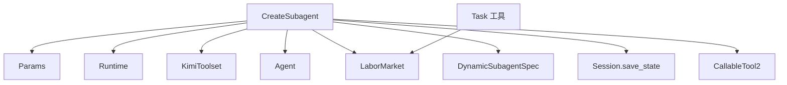
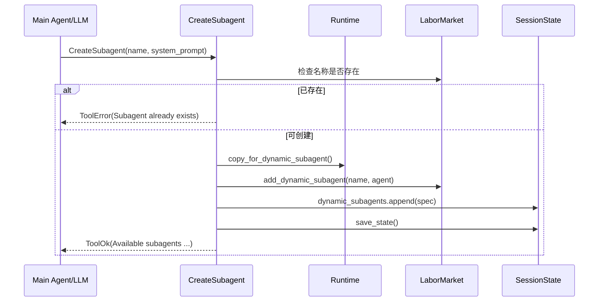
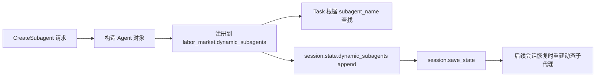

# subagent_creation 模块文档

## 1. 模块概述与存在意义

`subagent_creation` 对应代码文件 `src/kimi_cli/tools/multiagent/create.py`，核心提供一个可被 LLM 调用的工具：`CreateSubagent`。它的职责是让主代理在**会话运行中**即时创建“动态子代理（dynamic subagent）”，并把这个子代理注册到当前运行时可调度的子代理池中，同时将定义持久化到会话状态。

这个模块存在的核心原因，是为多代理体系补齐“运行时编排”能力。静态子代理通常来自预先配置（例如 agent spec 或工作目录中的约定配置），但真实任务经常出现临时角色需求：比如“只做 API 文档摘要”“只做安全审计”“只负责测试用例生成”。如果每次都回到静态配置层修改文件，成本高且会打断当前对话流程。`CreateSubagent` 将该过程变成一个标准工具调用，使“创建角色”成为可验证、可记录、可恢复的系统操作。

从系统分工看，`subagent_creation` 负责“定义子代理”，`subagent_task_dispatch`（`Task` 工具）负责“执行子代理任务”。两者组成多代理协作中的定义-调度闭环：先创建可路由的 agent 名称，再通过 `Task` 按名称派发具体工作。

---

## 2. 设计目标与关键取舍

该模块的设计并不追求复杂策略，而是强调运行时一致性和低摩擦接入。创建出的动态子代理会共享主代理的 `KimiToolset`，这保证子代理可用工具集合与当前会话一致，不需要再走一次独立工具装配流程。与此同时，子代理运行时通过 `Runtime.copy_for_dynamic_subagent()` 构造，它会复用同一个 `LaborMarket`，从而确保新建子代理在创建后可立即被 `Task` 发现。

这里有一个重要架构取舍：动态子代理默认不是“沙箱化能力副本”，而是“共享能力域内的角色特化”。这使协作链路更顺滑，但也意味着权限边界并不会自动缩小。换言之，`system_prompt` 的职责边界约束是“软约束”，真正的强权限控制不在本模块内实现。

---

## 3. 核心组件说明

本模块核心只有两个代码组件，但它们覆盖了完整链路：参数契约、冲突检测、对象创建、运行时注册、会话持久化与工具返回协议。

### 3.1 `Params`

`Params` 是 `CreateSubagent` 的输入模型，继承自 `pydantic.BaseModel`，字段如下：

```python
class Params(BaseModel):
    name: str
    system_prompt: str
```

`name` 是子代理唯一标识，后续会由 `Task.params.subagent_name` 进行引用；`system_prompt` 用于定义该子代理的角色、能力边界与输出风格。字段上的 `Field(description=...)` 主要用于工具 schema 呈现（给 LLM/调用方更好提示），并不直接增加额外业务约束。

参数校验由 `CallableTool2` 框架层负责：调用参数会先被反序列化并映射到 `Params`。如果参数结构不匹配，调用在进入业务逻辑前就会失败并返回工具级校验错误。关于统一工具模型与错误协议，可参考 [kosong_tooling.md](kosong_tooling.md)。

### 3.2 `CreateSubagent`

`CreateSubagent` 继承 `CallableTool2[Params]`，声明了工具名、描述和参数类型。

```python
class CreateSubagent(CallableTool2[Params]):
    name: str = "CreateSubagent"
    description: str = load_desc(Path(__file__).parent / "create.md")
    params: type[Params] = Params
```

工具描述通过 `load_desc(...)` 从 `create.md` 加载，保证提示文案与代码解耦，便于后续迭代。

#### 构造函数：`__init__(toolset: KimiToolset, runtime: Runtime)`

构造阶段仅做依赖注入并缓存引用：

- `toolset`：主代理当前使用的工具集；新子代理会直接共享。
- `runtime`：主代理运行时；用于访问 `labor_market`、`session` 等状态面。

这里没有副作用，不会创建子代理，也不会写入状态。

#### 调用入口：`__call__(params: Params) -> ToolReturnValue`

这是整个模块的关键流程：

1. 首先检查 `params.name` 是否已存在于 `self._runtime.labor_market.subagents`。
2. 若名称冲突，立即返回 `ToolError`，并给出 `brief="Subagent already exists"`。
3. 若名称可用，构造新的 `Agent`：
   - `name=params.name`
   - `system_prompt=params.system_prompt`
   - `toolset=self._toolset`（共享工具集）
   - `runtime=self._runtime.copy_for_dynamic_subagent()`
4. 调用 `labor_market.add_dynamic_subagent(...)` 注册到动态子代理池。
5. 同步持久化定义：向 `session.state.dynamic_subagents` 追加 `DynamicSubagentSpec`，随后 `session.save_state()`。
6. 返回 `ToolOk`，其中 `output` 会列出当前可用子代理名称，`message` 标识创建成功。

该路径的关键特征是：它同时改变**内存态（可立即调度）**和**持久态（可会话恢复）**。

---

## 4. 依赖关系与架构视图

### 4.1 组件依赖图



这张图的重点是：`CreateSubagent` 的输出不是直接执行结果，而是对 `LaborMarket` 和 `SessionState` 的状态更新。`Task` 再基于同一 `LaborMarket` 做按名调度，因此创建动作和执行动作解耦但状态联通。

### 4.2 运行流程时序图



流程中真正可能失败的点，除了重名外，还包括状态保存阶段（例如文件系统异常）。当前实现对 `save_state()` 没有本地 try/except，异常会交给上层工具框架转换为运行时错误返回。

### 4.3 创建后到调度执行的数据流



该数据流体现了双通道一致性：一条面向当前会话即时调度，一条面向后续会话恢复。

---

## 5. 与相邻模块的协作边界

`subagent_creation` 本身不执行子代理任务，不处理上下文隔离细节，也不管理 UI 事件转发。这些职责分别位于邻接模块中：

- 子代理任务派发与执行结果收敛由 `Task` 负责，详见 [multiagent_task_execution.md](multiagent_task_execution.md)。
- 运行时拷贝语义（固定子代理 vs 动态子代理）由 `Runtime.copy_for_fixed_subagent` / `copy_for_dynamic_subagent` 定义，可在 [soul_engine.md](soul_engine.md) 查看。
- 动态子代理定义持久化的数据结构（`DynamicSubagentSpec`）属于会话状态模型体系，见 [session_state_management.md](session_state_management.md) 与 [config_and_session.md](config_and_session.md)。

理解本模块最好的方式，是把它看成多代理系统中的“注册中心写入端”：它只负责把一个新角色安全地写入共享可见状态。

---

## 6. 参数、返回值与副作用（接口契约）

### 6.1 入参契约

典型调用示例：

```json
{
  "name": "code_reviewer",
  "system_prompt": "You are a strict code reviewer. Focus on correctness, security, and maintainability."
}
```

`name` 建议保持稳定、可读、可路由，最好采用小写加下划线；`system_prompt` 建议显式包含角色职责、边界限制、输出格式要求与完成判定标准。

### 6.2 返回契约

成功返回 `ToolOk`，通常包含：

- `message`: `Subagent '<name>' created successfully.`
- `output`: `Available subagents: ...`

失败返回 `ToolError`，当前业务显式处理的是重名冲突；其余运行异常由框架转换。

### 6.3 副作用

该工具是强副作用工具，调用后会产生以下状态变化：

- 修改内存中的 `labor_market`（立即生效）。
- 修改 `session.state.dynamic_subagents` 并持久化（长期生效）。

因此它不应被视为纯函数；重放调用会导致不同结果（例如第二次重放触发重名错误）。

---

## 7. 使用与扩展示例

### 7.1 最常见使用模式：先创建，再调用

```text
Step 1: CreateSubagent(name="security_auditor", system_prompt="...")
Step 2: Task(subagent_name="security_auditor", prompt="Audit the auth flow for token leakage risks")
```

这是一种“角色先行”的委派模式，适合对输出风格、目标边界有明确要求的复杂任务。

### 7.2 为不同问题创建多个专用子代理

```text
CreateSubagent(name="doc_summarizer", system_prompt="Summarize docs into concise bullet points")
CreateSubagent(name="test_designer", system_prompt="Design high-value tests with edge cases")
CreateSubagent(name="perf_reviewer", system_prompt="Analyze performance bottlenecks and suggest fixes")
```

后续可由主代理分别用 `Task` 分发不同子问题，形成并行协作。

### 7.3 可扩展方向（代码演进建议）

如果要增强 `subagent_creation`，可以考虑增加以下能力：

- 增加 `DeleteSubagent` 和 `UpdateSubagent`，补全生命周期管理。
- 在 `Params` 上添加 `min_length` / `pattern` 约束，降低错误输入。
- 支持可选的 tool visibility profile，为子代理进行能力收敛。
- 在 `DynamicSubagentSpec` 中补充元数据（创建时间、用途标签、创建来源）。

---

## 8. 边界条件、错误场景与限制

### 8.1 名称冲突不仅针对动态子代理

检查使用的是 `labor_market.subagents` 联合视图，因此与固定子代理重名同样会失败。这是为了防止 `Task` 路由歧义。

### 8.2 输入质量未被强约束

当前模型层并未强制禁止空字符串或极短提示词。理论上可以创建低质量甚至不可用的子代理定义，最终问题会在执行阶段暴露。实践上应通过上层 prompt policy 或调用前校验弥补。

### 8.3 持久化失败可能导致“部分成功”

如果已经执行 `add_dynamic_subagent(...)`，但 `save_state()` 失败，内存态与持久态会短暂不一致：当前会话可见，重启后可能丢失。该场景需要依赖上层错误处理和运维观察。

### 8.4 无并发去重保障

当前逻辑是简单存在性检查后插入，如果未来出现并发调用同名创建，理论上可能出现竞态窗口。是否发生取决于上层调度是否允许并发执行同一工具。

### 8.5 不负责安全隔离

共享 `KimiToolset` 的设计使动态子代理默认具备与主代理同级工具访问能力。若系统要求严格最小权限，需要在 toolset 装配层或调度层实现，而非依赖本模块。

---

## 9. 维护者视角：排障与诊断建议

当用户反馈“子代理创建成功但无法调用”时，优先检查三件事。第一，确认 `Task` 使用的 `subagent_name` 与创建返回一致，避免拼写差异。第二，确认是否在后续流程中发生会话切换；动态子代理恢复依赖会话状态文件。第三，检查 `session.save_state()` 是否报错，避免出现仅内存成功而持久化失败的情况。

当用户反馈“创建时报 already exists”时，应进一步区分冲突来源：可能是已有动态子代理，也可能是固定子代理同名。由于 `subagents` 是联合视图，这两种冲突都会表现为同一错误文案。

---

## 10. 总结

`subagent_creation` 是多代理体系中的关键编排模块，它让主代理在不中断会话的情况下即时创建新角色，并保证该角色既可立即调度，又可跨会话恢复。模块代码规模虽小，但承担了运行时状态与持久化状态的一致性连接点。理解它时应抓住三个关键词：**按需创建、共享劳动市场、会话持久化**。如果你正在扩展多代理能力，这个模块通常就是最先需要增强的入口之一。