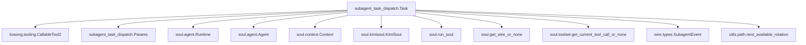
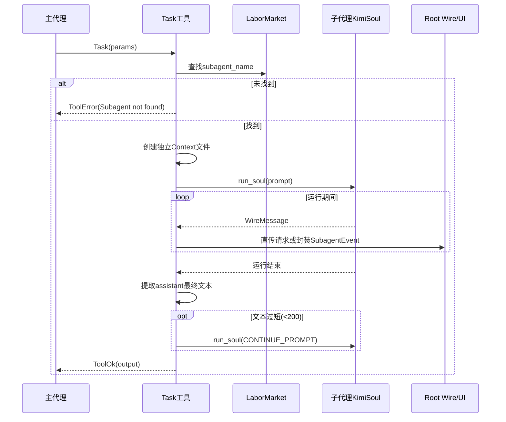
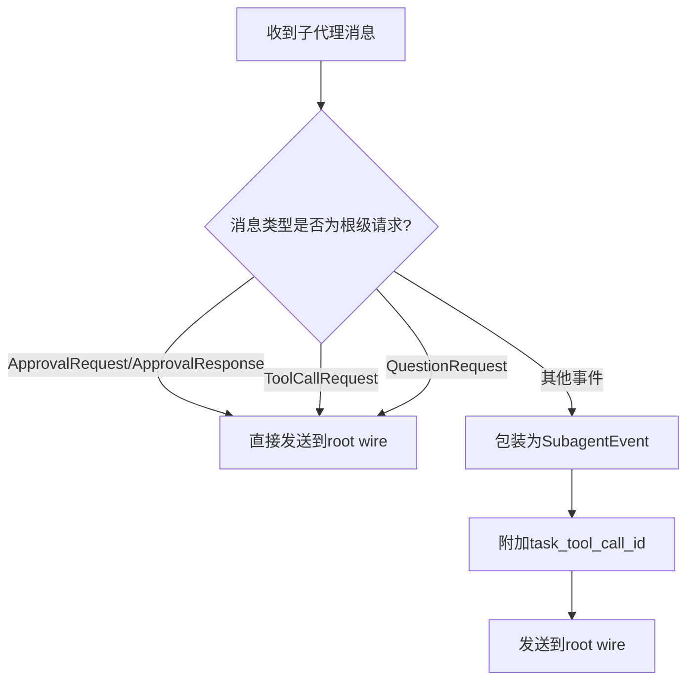

# subagent_task_dispatch 模块文档

## 1. 模块定位与存在意义

`subagent_task_dispatch` 对应实现文件 `src/kimi_cli/tools/multiagent/task.py`，核心组件是 `Task` 工具与其参数模型 `Params`。这个模块的职责不是“创建子代理”，而是“把一个已经存在的子代理调度起来执行任务，并把结果安全地返回给当前主代理回路”。

在多代理架构中，主代理经常需要把某些任务分包给更专门的角色（例如安全审计、测试生成、文档整理）。如果这些任务都放在主代理同一个上下文中执行，会带来上下文污染、token 消耗上升、信息可读性下降。`Task` 通过“独立 Context 文件 + 子代理 Soul 执行 + Wire 事件桥接”实现隔离式分工，这就是它存在的主要工程价值。

从系统关系上看，`subagent_task_dispatch` 与 [subagent_creation.md](subagent_creation.md) 形成完整闭环：后者负责把可用子代理注册到 `Runtime.labor_market`，本模块负责在运行时按名称分发任务并收敛结果。

---

## 2. 设计目标与核心思路

本模块的设计围绕三个目标展开。第一是**执行隔离**：子代理使用独立上下文文件，不读取主代理对话历史，从而要求调用方必须把背景信息写进 `prompt`。第二是**交互正确性**：子代理执行中的审批、提问、工具调用请求属于根会话级别交互，必须直接透传到 root wire，而不是简单作为“子事件”包裹。第三是**输出可用性**：若子代理返回过短摘要，模块会自动触发一次 continuation prompt，让结果更接近可交付文本。

这一设计使 `Task` 成为 orchestration 层组件：它不承担 LLM 推理本体，而是组织运行时环境、消息路由与错误边界。

---

## 3. 核心组件详解

### 3.1 `Params`：任务调度参数契约

`Params` 是基于 `pydantic.BaseModel` 的输入模型，定义了工具调用所需的三个字段：

```python
class Params(BaseModel):
    description: str
    subagent_name: str
    prompt: str
```

`description` 是简短任务标签（3-5 词），用于提升工具调用可读性；`subagent_name` 用于命中 `labor_market.subagents` 的具体代理；`prompt` 是真正交给子代理执行的指令。代码注释明确指出：子代理看不到主代理上下文，因此 `prompt` 必须带全背景、范围、约束和期望输出。

参数验证由 `CallableTool2` 框架统一处理，若字段缺失或类型不符，调用不会进入业务执行阶段。关于 `ToolOk`/`ToolError` 返回协议可参见 [kosong_tooling.md](kosong_tooling.md)。

### 3.2 `Task`：子代理任务分发与运行控制器

`Task` 继承 `CallableTool2[Params]`，工具名为 `Task`。初始化时会加载 `task.md` 描述模板，并把当前运行时已知固定子代理（`runtime.labor_market.fixed_subagent_descs`）注入描述文本，帮助模型理解可选子代理列表。

其关键成员包括：

- `self._labor_market`：子代理注册表与查找入口。
- `self._session`：提供 `context_file`，用于生成子代理上下文文件。

#### `__call__(self, params: Params) -> ToolReturnValue`

该方法是工具入口，内部流程分三段：先检查 `subagent_name` 是否存在；存在则委托 `_run_subagent`；若内部出现异常则统一包装成 `ToolError("Failed to run subagent")`。

它的返回值遵循工具协议：成功时 `ToolOk(output=...)`，失败时 `ToolError(message=..., brief=...)`。

#### `_get_subagent_context_file(self) -> Path`

该方法负责生成唯一的子代理上下文文件路径。实现策略是从主上下文文件派生一个 `*_sub` 基名，并调用 `next_available_rotation(...)` 申请可用轮转路径。这里依赖 `next_available_rotation` 的“占位保留”语义，确保并发场景下路径冲突概率极低。

这个方法有两个副作用：其一是保证上下文目录存在（`mkdir(parents=True, exist_ok=True)`）；其二是触发轮转保留文件创建（来自 `next_available_rotation` 的行为）。

#### `_run_subagent(self, agent: Agent, prompt: str) -> ToolReturnValue`

这是模块的核心执行链路，负责在独立上下文中跑完整个子代理回合并提取最终文本。

首先它从上下文变量获取当前 root wire（`get_wire_or_none`）与当前工具调用（`get_current_tool_call_or_none`），并通过 `assert` 强制要求当前函数只能在标准工具调用上下文中执行。随后定义消息转发函数 `_super_wire_send`：

- `ApprovalRequest` / `ApprovalResponse` / `ToolCallRequest` / `QuestionRequest` 直接发送到 root wire；
- 其他消息封装成 `SubagentEvent(task_tool_call_id, event=msg)` 再发送。

然后它创建子代理 `Context` 与 `KimiSoul`，调用 `run_soul(...)` 执行任务。若抛出 `MaxStepsReached`，返回带拆分建议的 `ToolError`。

执行完成后它校验上下文末条消息必须是 `assistant`，并提取文本作为结果。若文本长度小于 200，则用固定 `CONTINUE_PROMPT` 再执行一次补充总结（最多一次），最终返回 `ToolOk`。

---

## 4. 运行流程与交互架构

### 4.1 模块依赖架构图



这个依赖图说明 `Task` 是一个桥接器：上接工具系统，下接 Soul 执行引擎，旁路 Wire 协议层做事件路由。

### 4.2 调度时序图



时序上要注意：`Task` 并不直接“执行工具调用”，它只是把子代理产生的请求转发到 root wire，让上层统一执行/审批。

### 4.3 子代理事件路由决策图



这条规则是模块最关键的协议边界。如果把审批或问题请求错误包装成普通子事件，可能导致 UI 层无法正确完成交互闭环。

---

## 5. 参数、返回值与副作用一览

`Task.__call__` 输入是 `Params`，输出是 `ToolReturnValue`。成功结果放在 `ToolOk.output`（字符串）；失败包含 `message` 和 `brief` 两层错误信息，便于同时服务日志与 UI 提示。

本模块的副作用主要体现在文件和事件两方面。文件方面会创建/写入新的子代理上下文文件；事件方面会把子代理执行过程转发到 root wire，并可能触发审批请求、提问请求和实际工具调用请求。调用方应假设 `Task` 可能引发完整的外部交互链路，而不是“纯函数式本地计算”。

---

## 6. 使用建议与示例

典型调用示例：

```json
{
  "description": "audit oauth flow",
  "subagent_name": "security_reviewer",
  "prompt": "Review src/kimi_cli/auth OAuth callback validation. Include state handling, token lifecycle, and replay risk. Provide file-level findings and concrete fixes."
}
```

编写 `prompt` 时建议明确四件事：检查范围、输出结构、必须引用的证据粒度、可接受假设边界。因为子代理上下文隔离，任何未写入 `prompt` 的背景都不会被自动继承。

如果你希望把子代理结果直接用于后续主代理决策，建议在 prompt 中要求固定输出模板（如“结论/证据/风险/建议”），能显著降低“输出短且泛”的概率。

---

## 7. 配置点与可扩展性

该模块可调项目前主要在源码常量层：`MAX_CONTINUE_ATTEMPTS` 和“短答阈值 200 字符”。其中 `MAX_CONTINUE_ATTEMPTS` 当前默认 1，配合 `if` 分支语义，实际就是“最多补写一次”。

可扩展方向包括将短答阈值与 continuation 策略外置到配置系统（可参考 [config_and_session.md](config_and_session.md) 的配置管理思路），为 `_run_subagent` 增加超时/取消策略，以及在返回体中附带更多执行元数据（如子代理名、步骤数、是否触发续写），以便上层编排策略做质量评估。

---

## 8. 边界条件、错误语义与已知限制

当 `subagent_name` 不存在时会立即失败，这是最常见错误之一，通常来自未先创建动态子代理或命名不一致。`_run_subagent` 依赖 `assert` 获取当前 wire 与 tool call，因此它不适合作为脱离工具上下文的通用函数直接调用，测试时需要模拟正确上下文。

`run_soul` 可能抛出多类异常，但当前模块只对 `MaxStepsReached` 做特化处理，其他异常在上层统一映射为 `Failed to run subagent`。这简化了调用方错误面，但也牺牲了错误细分能力。另一个限制是结果抽取依赖“最后一条消息必须是 assistant”，如果未来消息协议变化导致末条角色不同，这里会误判失败。

续写逻辑也有一个实践注意点：如果第一轮成功、第二轮 continuation 失败，最终会落入统一失败路径，调用方无法区分“主任务成功但补写失败”与“主任务整体失败”。

---

## 9. 与其他模块的关系（避免重复阅读建议）

若你要深入理解此模块，请优先串联阅读以下文档，而不是在本文重复基础机制：

1. [soul_runtime.md](soul_runtime.md)：`run_soul` 生命周期、取消语义、`MaxStepsReached` 来源。
2. [context_persistence.md](context_persistence.md)：`Context` 的历史写入、checkpoint、回滚机制。
3. [wire_protocol.md](wire_protocol.md) 与 [wire_domain_types.md](wire_domain_types.md)：`SubagentEvent` 及审批/提问/工具请求消息模型。
4. [subagent_creation.md](subagent_creation.md)：子代理注册来源与命名约定。
5. [tools_multiagent.md](tools_multiagent.md)：多代理工具集合的整体边界。

把这些文档合起来看，可以完整理解“子代理定义 → 调度执行 → 事件回传 → 结果汇总”的全链路。
