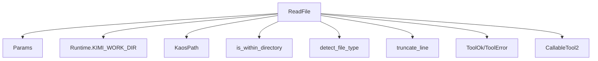
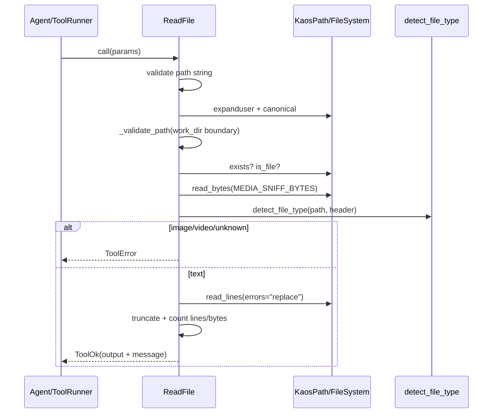
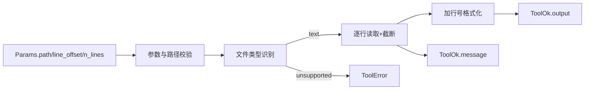

# text_reading 模块文档

## 模块概述

`text_reading` 模块对应实现文件 `src/kimi_cli/tools/file/read.py`，核心职责是为 agent 提供**受约束的文本文件读取能力**。它并不是一个“任意文件读取器”，而是一个带有路径安全校验、文件类型判定、读量上限控制、输出格式标准化的工具组件。这个模块存在的意义，是在自动化代理（agent）场景里，将“读取文件”从一个高风险、易失控的底层动作，提升为一个**可治理、可预测、可向模型稳定暴露**的工具调用。

从系统视角看，`ReadFile` 属于 `tools_file` 子系统中的文本读取分支，与 `media_reading`、`file_writing`、`string_replacement`、`file_discovery_and_search` 形成互补。它的设计明显偏向“安全第一 + token 成本可控 + 人机双端可读”：一方面限制超大输出（行数、字节数、单行长度），另一方面把结果整理成类似 `cat -n` 的带行号文本，便于模型后续精确引用行号进行修改或讨论。

---

## 代码位置与核心组件

- 文件：`src/kimi_cli/tools/file/read.py`
- 核心组件：
  - `Params`
  - `ReadFile`
- 关键常量：
  - `MAX_LINES = 1000`
  - `MAX_LINE_LENGTH = 2000`
  - `MAX_BYTES = 100 << 10`（即 `102400` 字节）

---

## 设计目标与为什么这样设计

这个模块的设计不是“尽可能多读”，而是“**稳定读、可解释读、必要时分段读**”。在 LLM agent 场景中，如果文件读取不做约束，常见问题包括：上下文爆炸导致推理成本上升、模型误读二进制内容、越界路径访问、错误工具选型（例如拿文本读取器去读图片/视频）。`ReadFile` 通过前置校验和分层防护，把这些问题尽可能在工具边界就拦截掉。

具体来说，它通过以下策略实现工程平衡：

- 使用 `Params`（Pydantic）做参数模型化，保证输入合法性（例如 `line_offset >= 1`）。
- 使用 `KaosPath` 与 `is_within_directory` 做路径约束，避免隐式越界读取。
- 通过 `detect_file_type` + 文件头 sniff（magic bytes）拒绝明显不适合文本读取的类型。
- 在读取循环中同时施加行数、字节数、单行长度三重限制，防止大文件输出冲垮上下文。
- 输出统一行号格式，便于下游流程（尤其是编辑工具）进行精确定位。

---

## 组件详解

## `Params`

`Params` 是 `ReadFile` 的参数模型，继承自 `pydantic.BaseModel`。它定义了调用者可以控制的读取范围与偏移规则，并把这些约束前移到参数验证阶段。

### 字段说明

1. `path: str`

该字段表示要读取的文件路径。描述文本里强调了一个重要行为：当目标文件在工作目录外时，应使用绝对路径。模块本身还会在运行时执行额外路径校验（见 `_validate_path`），所以这不是“文档建议”，而是会影响实际结果的规则。

2. `line_offset: int = 1`

这是读取起始行号（1-based）。`ge=1` 约束确保不会出现 0 或负值。对于大文件，调用方可用该参数实现分段读取。

3. `n_lines: int = MAX_LINES`

表示希望读取的行数。默认值就是上限 `MAX_LINES`，同时 `ge=1`。即使调用方传入更大值，工具内部仍会在读取循环中受 `MAX_LINES` 限制。

### 参数验证行为

`Params` 自身只约束“最小值”和字段类型，实际的路径存在性、文件类型可读性等由 `ReadFile.__call__` 处理。也就是说，参数验证与业务验证是分层的：前者保证输入格式，后者保证可执行与安全。

---

## `ReadFile`

`ReadFile` 继承 `CallableTool2[Params]`，是一个可被工具框架统一调用的异步工具实现。它返回 `ToolReturnValue` 的两个主要子类之一：成功时 `ToolOk`，失败时 `ToolError`。

### 构造与初始化

构造函数签名：`__init__(self, runtime: Runtime) -> None`

初始化过程中有三个关键动作：

- 使用 `load_desc` 加载 `read.md` 描述模板，并注入 `MAX_LINES/MAX_LINE_LENGTH/MAX_BYTES` 到提示文本。
- 调用父类 `CallableTool2` 初始化，完成工具元数据（名称、描述、参数 schema）构建。
- 从 `runtime.builtin_args.KIMI_WORK_DIR` 提取工作目录，后续用于路径安全判断。

这意味着 `ReadFile` 在运行时行为部分依赖 `Runtime`，但依赖点非常集中，主要是工作目录上下文。

### `_validate_path(self, path: KaosPath)`

这个私有异步方法只做一件事：验证路径是否满足模块的“工作目录边界 + 绝对路径例外”规则。

其核心逻辑是：

- 先取 `resolved_path = path.canonical()`。
- 若 `resolved_path` 不在工作目录内，且原始 `path` 不是绝对路径，则返回 `ToolError`。
- 其他情况返回 `None`。

这里有一个重要语义：**工作目录外访问并非一律禁止**，但必须显式使用绝对路径，避免“相对路径不透明跳转”造成误读或越权。

### `__call__(self, params: Params) -> ToolReturnValue`

这是实际执行入口，流程较长，但结构清晰，可分为“输入检查 → 路径与文件校验 → 类型判定 → 受限读取 → 输出封装”。

#### 1) 输入检查

如果 `params.path` 为空字符串，直接返回：

- `ToolError.brief = "Empty file path"`
- `ToolError.message = "File path cannot be empty."`

#### 2) 路径规范化与安全校验

- `KaosPath(params.path).expanduser()`：展开 `~`。
- 调用 `_validate_path`。
- 通过后再 `canonical()`，得到稳定路径用于后续操作。

#### 3) 文件存在性与类型（文件/目录）校验

- 若不存在：`File not found`
- 若不是普通文件：`Invalid path`

这些错误都通过 `ToolError` 返回，不抛给上层。

#### 4) 文件类型判定（文本 vs 图像/视频/未知）

工具会先读取头部字节：`p.read_bytes(MEDIA_SNIFF_BYTES)`，再调用 `detect_file_type(str(p), header=header)`。

- 若判定 `image` 或 `video`：返回 `Unsupported file type`，并提示应使用其他工具。
- 若判定 `unknown`：返回 `File not readable`，并提示可考虑 shell / Python / MCP 工具链。

这个分流机制使 `ReadFile` 对“看起来不适合文本读取”的文件采取保守策略，减少乱码或二进制污染上下文。

#### 5) 分段读取与上限控制

读取循环通过 `async for line in p.read_lines(errors="replace")` 逐行处理，其中 `errors="replace"` 表示编码错误将被替换而不是抛异常，提升鲁棒性。

循环中关键点：

- 跳过 `line_offset` 之前的行。
- 对每一行执行 `truncate_line(line, MAX_LINE_LENGTH)`。
- 统计 UTF-8 字节数，累计到 `n_bytes`。
- 在以下任一条件触发时中止：
  - 已读取行数达到 `params.n_lines`
  - 已读取行数达到 `MAX_LINES`
  - 已读字节达到 `MAX_BYTES`

注意：`params.n_lines` 与 `MAX_LINES` 是双层约束。即使调用方设定极大值，最终仍不会超过模块硬上限。

#### 6) 输出格式化与状态消息

读取结果会被格式化为带行号文本：`f"{line_num:6d}\t{line}"`。这模拟 `cat -n` 风格，行号宽度 6，右对齐，后接制表符。

最终返回 `ToolOk`：

- `output`：拼接后的正文（使用 `"".join(lines_with_no)`，依赖原始行自带换行）。
- `message`：汇总信息，包括读取行数、是否触达上限、是否到达 EOF、哪些行被截断。

### 异常处理

`__call__` 最外层包裹 `try/except Exception`。任何未预期异常都会变为：

- `brief = "Failed to read file"`
- `message = f"Failed to read {params.path}. Error: {e}"`

这样可以保证工具协议层总是得到结构化返回，而不是原始异常。

---

## 关键依赖与关系说明

`ReadFile` 并不孤立运行，它依赖多个基础组件协同：

- `CallableTool2`（来自 `kosong_tooling`）：提供统一工具接口、参数 schema 暴露、调用约束。
- `ToolOk` / `ToolError`：统一成功与失败返回结构。
- `Runtime`（来自 `soul_engine` 路径中的 agent runtime）：提供 `KIMI_WORK_DIR` 运行上下文。
- `detect_file_type` 与 `MEDIA_SNIFF_BYTES`（来自文件工具公共 utils）：负责类型预判。
- `truncate_line`、`load_desc`（工具辅助函数）：分别用于行截断与描述模板加载。
- `is_within_directory`（路径工具）：执行目录包含关系判断。

这类分层让 `ReadFile` 聚焦业务流程，把通用能力外置到 utils 与 tooling 层，降低耦合。



上图展示的是“运行时依赖”而非导入顺序：`ReadFile` 的安全判断、类型判断、输出封装分别由不同底层组件支撑。

---

## 调用过程时序图



这个流程的关键价值在于：在“真正读全文”之前，先做可观测、可解释的拦截判定，避免不必要的开销与风险。

---

## 数据流与输出结构



`ToolOk` 中 `output` 与 `message` 的职责分离很重要：`output` 是模型可继续处理的正文，`message` 是执行摘要（读了多少、为什么停止、哪些行被截断）。这使模型能够更可靠地决定“继续读下一段”还是“进入编辑/分析”。

---

## 使用方式

在框架内通常不会手动调用 `__call__`，而是由 tooling 层通过 `call(arguments)` 触发参数校验后执行。不过在理解或测试阶段，可以参考如下模式：

```python
from kimi_cli.tools.file.read import ReadFile, Params

# runtime 通常由系统创建（包含 KIMI_WORK_DIR）
rf = ReadFile(runtime)
ret = await rf(Params(path="./README.md", line_offset=1, n_lines=200))

if ret.is_error:
    print("error:", ret.brief, ret.message)
else:
    print(ret.message)
    print(ret.output)
```

或者以 JSON 参数方式走 `CallableTool2.call`：

```python
ret = await rf.call({"path": "./README.md", "line_offset": 1, "n_lines": 100})
```

### 分段读取建议

对于大文件，推荐使用“分页式”读取：

1. 第一次读 `line_offset=1, n_lines=300`
2. 根据返回行数和 `message` 判断是否 EOF
3. 继续读 `line_offset=301, n_lines=300`

这样可以减少单次上下文负担，并提高 agent 的定位精度。

---

## 配置与可调参数

`text_reading` 模块本身没有外部配置文件，但行为受代码常量与运行时上下文影响：

- `MAX_LINES`：单次读取最大行数硬限制。
- `MAX_LINE_LENGTH`：单行截断阈值。
- `MAX_BYTES`：累计字节上限。
- `runtime.builtin_args.KIMI_WORK_DIR`：工作目录边界判断基础。

如果你要调整读取策略（例如允许更大文件片段），需要修改常量并评估：

- 模型上下文成本变化
- 前端渲染与传输压力
- 与其他文件工具（尤其替换/写入）联动时的体验一致性

---

## 边界条件、错误场景与运维注意事项

该模块的行为整体偏保守，以下情况最常见且最值得提前理解。

首先，路径规则容易被误解。工具并不禁止访问工作目录外文件，但要求使用绝对路径；相对路径若越界会被拒绝。这个规则能减少歧义，但也可能让用户在“看似合法的相对路径”上踩坑。

其次，`detect_file_type` 的保守性意味着“非典型文本文件”可能被判定为 `unknown` 并拒读。对于这类文件，需要转用 shell/Python/MCP 工具，或者先做格式转换后再读。

再次，单行截断不是按 token，而是按字符长度（`len(str)`）+ 保留行尾换行。超长行会在末尾追加 `...`，并在 message 中给出被截断行号列表。下游处理时不应把截断内容当作完整原文。

此外，字节上限按 UTF-8 编码后统计，非 ASCII 文本可能更早触达 `MAX_BYTES`。这会导致“行数远未到上限却提前停止”的现象，是预期行为。

最后，`output` 使用 `"".join(lines_with_no)` 拼接，依赖每行是否自带换行。虽然大多数 `read_lines` 输出会保留换行，但若遇到特殊最后一行（无换行）时，展示上可能与用户直觉略有差异。

---

## 扩展建议

如果你要扩展 `text_reading`，建议优先保持“先判定再读取”的防线结构，不要直接把读取循环前置。可考虑的扩展方向包括：

- 增加可选编码参数（如 `encoding`）并保留 `errors="replace"` 兜底。
- 增加 `include_line_numbers` 开关（默认开启）以兼容不同消费方。
- 对 `unknown` 类型提供更细粒度原因（magic 冲突、NUL 字节命中、后缀黑名单等）。
- 在 `message` 中增加 machine-readable `extras` 字段，方便上层自动决策（例如继续分页读取）。

扩展时应同步审视 [file_module_entrypoint.md](file_module_entrypoint.md) 的导出边界与 [tools_file.md](tools_file.md) 的整体工具语义，避免同类工具间行为不一致。

---

## 与其他模块的关系（避免重复细节）

`text_reading` 是 `tools_file` 的子模块之一，其上游是工具调度与 agent runtime，下游通常是编辑工具或分析推理过程。若你需要系统级背景，建议配合以下文档阅读：

- 文件工具总入口与导出边界： [file_module_entrypoint.md](file_module_entrypoint.md)
- 文件工具总览： [tools_file.md](tools_file.md)
- 字符串替换工具（常与读取结果联动）： [string_replacement.md](string_replacement.md)
- 文件写入工具： [file_writing.md](file_writing.md)
- 文件搜索与发现工具： [file_discovery_and_search.md](file_discovery_and_search.md)
- agent 运行时上下文来源： [soul_engine.md](soul_engine.md)
- 工具抽象基类与返回协议： [kosong_tooling.md](kosong_tooling.md)

---

## 返回值契约与可观测性

为了让调用方更容易做自动化分支处理，`ReadFile` 的返回值语义应被视为稳定契约。

成功场景返回 `ToolOk`，其中 `output` 是可继续被模型消费的正文（带行号），`message` 是执行摘要。失败场景返回 `ToolError`，其中 `brief` 适合做 UI 标签或分支判断，`message` 适合展示给用户或写入日志。该工具不会把底层异常直接向上抛出，因此在工具编排层通常不需要额外 `try/except` 捕获“业务错误”，只需判断返回类型。

从可观测性角度，建议在上层记录以下字段：输入 `path/line_offset/n_lines`、返回类型（`ToolOk` 或 `ToolError`）、`brief`、`message`。这样在排查“为什么没读全”“为什么被拒绝”时，能够快速定位是路径策略、类型策略还是读量上限触发。

---

## 小结

`text_reading` 模块通过 `ReadFile + Params` 实现了一个工程上可落地的“安全文本读取”工具：它既保证了调用体验（可分页、带行号、错误可解释），又把路径边界、文件类型、输出规模等关键风险前置控制。对于不熟悉该模块的开发者，最重要的理解是：`ReadFile` 的核心价值不只是“读文件”，而是把“读文件”转化为一个可被 agent 系统可靠消费的标准化操作。
