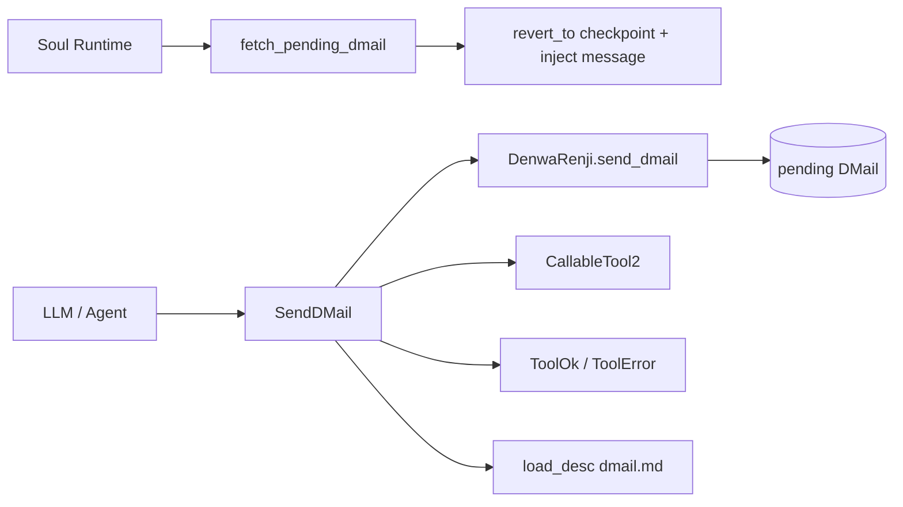
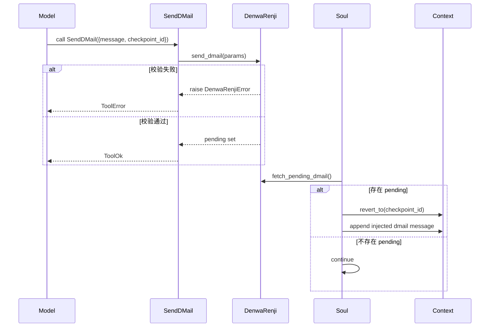

# time_travel_message_dispatch 模块文档

## 1. 模块定位与设计动机

`time_travel_message_dispatch` 对应的实现入口是 `src/kimi_cli/tools/dmail/__init__.py` 中的 `SendDMail`。这个模块的本质职责不是直接执行“时间回溯”，而是把模型在当前步骤中产生的“给过去发送消息”的意图，封装成一个标准工具调用，并安全地登记到运行时的时间消息寄存器（`DenwaRenji`）中。

它存在的原因是：在长链路任务中，Agent 常常在执行数步之后才意识到早期决策有误。如果没有显式回溯信号通道，系统只能继续在错误分支上修补。`SendDMail` 提供了一个受控的“回到某个 checkpoint 并注入提示”的机制，让系统可以在保持工具协议一致性的前提下，执行语义层面的历史分叉重试。

从架构分层看，本模块位于 `tools_misc`，但语义上横跨三个层级：工具协议层（`kosong_tooling`）、时空消息状态层（`time_travel_messaging` 的 `DenwaRenji`/`DMail`）、以及运行时消费层（`soul_runtime`）。因此它是一个典型的“薄适配器 + 强语义桥接”模块。

---

## 2. 组件总览与依赖关系

当前模块只有一个核心类：`SendDMail`。不过它依赖的外部组件决定了实际行为边界。



这张图说明一个关键事实：`SendDMail` 只完成“登记”，不完成“执行回溯”。真正回退动作由 `Soul` 在后续步骤检查 pending dmail 后触发。也就是说，工具成功返回并不意味着世界线已经切换。

---

## 3. 核心类详解：`SendDMail`

### 3.1 类签名与静态元数据

`SendDMail` 继承 `CallableTool2[DMail]`，声明了三项工具协议元数据：

- `name = "SendDMail"`
- `description = load_desc(Path(__file__).parent / "dmail.md")`
- `params = DMail`

这种设计让工具参数 schema 与运行时数据模型共享同一个 `DMail` 类型，避免字段重复定义导致协议漂移。`description` 通过 `load_desc` 从 Markdown 动态加载，也让提示词文案与 Python 实现解耦。

### 3.2 构造函数

```python
def __init__(self, denwa_renji: DenwaRenji) -> None:
    super().__init__()
    self._denwa_renji = denwa_renji
```

构造函数采用依赖注入。`SendDMail` 不维护 checkpoint 数量、不维护 pending 状态，所有业务状态都下沉在 `DenwaRenji`。这使工具本身保持无状态，便于测试和复用。

### 3.3 调用流程：`async __call__(params: DMail) -> ToolReturnValue`

核心逻辑可以概括为“委托 + 异常翻译 + 协议返回”三步：

1. 调用 `self._denwa_renji.send_dmail(params)` 登记消息；
2. 若抛出 `DenwaRenjiError`，转为 `ToolError` 返回；
3. 若无异常，返回 `ToolOk`。

注意：成功分支的 `ToolOk.message` 文案是“如果你看到这条消息，D-Mail 并未真正成功发送……”。这看起来反直觉，但属于有意设计，用来提醒模型：当前只是工具层阶段性成功，后续可能因为审批拒绝等流程中断而不生效。

---

## 4. 参数模型、返回值与副作用

### 4.1 参数：`DMail`

`SendDMail` 的参数类型来自 `src.kimi_cli.soul.denwarenji.DMail`：

```python
class DMail(BaseModel):
    message: str
    checkpoint_id: int = Field(ge=0)
```

`checkpoint_id` 在模型层仅保证非负；是否“存在该 checkpoint”由 `DenwaRenji.send_dmail` 结合 `_n_checkpoints` 再次校验。

### 4.2 返回值：`ToolReturnValue`

返回值遵循 `kosong_tooling` 协议：

- 失败路径：`ToolError(is_error=True, message=..., brief=...)`
- 成功路径：`ToolOk(is_error=False, message=..., brief="El Psy Kongroo")`

这保证运行时、UI、日志层可以统一处理工具结果，而不是依赖异常控制流。

### 4.3 副作用

`SendDMail` 自身不做 I/O。它唯一业务副作用是可能改变 `DenwaRenji` 内部状态：把 `_pending_dmail` 从 `None` 置为一条待处理消息。该状态随后会被 `Soul` 消费并清空。

---

## 5. 端到端交互过程



流程要点在于“延迟生效”：工具调用阶段只写入信号，运行时阶段才执行回退与消息注入。因此调试时不能只看工具返回，还必须看后续 step 是否完成消费。

---

## 6. 错误条件、边界行为与已知限制

`SendDMail` 的大多数失败来自 `DenwaRenji` 约束。常见错误包括：已有 pending dmail、`checkpoint_id` 非法、目标 checkpoint 不存在。工具层会统一包装为 `ToolError`，避免裸异常泄露到协议层。

一个经常被误解的边界是：`ToolOk` 不等于最终回溯成功。比如后续工具审批被拒绝，运行时可能中止并清理 pending dmail，导致这次登记未实际生效。这正是成功文案“唱反调”的设计原因。

另一个关键限制是系统当前只回退会话上下文，不回退文件系统或外部副作用。如果先前步骤已经修改了文件、执行了 shell 命令或触发外部请求，D-Mail 回退并不会自动撤销这些影响。使用时应在 `message` 中显式提示“当前环境可能已改变”。

---

## 7. 使用与集成示例

### 7.1 运行时注册示例

```python
from kimi_cli.soul.denwarenji import DenwaRenji
from kimi_cli.tools.dmail import SendDMail

denwa_renji = DenwaRenji()
send_dmail_tool = SendDMail(denwa_renji)

# 伪代码：注册到工具系统
# toolset.register(send_dmail_tool.base, send_dmail_tool.call)
```

### 7.2 调用参数示例

```json
{
  "message": "不要继续全量扫描；回到 checkpoint 2 后仅检查 auth middleware 与 session status 变更。",
  "checkpoint_id": 2
}
```

建议把 `message` 写成“给过去自己的可执行指令 + 关键经验摘要”，而不是面向终端用户的解释文本。

---

## 8. 可扩展性建议

如果将来需要增强此模块（例如支持多条 D-Mail 排队、优先级、审计字段），建议保持当前职责边界：工具层继续做协议适配，状态与约束继续放在 `DenwaRenji`，实际回退逻辑继续留在 `Soul`/`Context`。不要把队列管理或事务控制硬塞到 `SendDMail`，否则会破坏模块解耦。

---

## 9. 关联文档

- 时间消息状态机与 `DMail` 模型：[`time_travel_messaging.md`](time_travel_messaging.md)
- `SendDMail` 的同主题文档（工具视角）：[`dmail_time_travel_signal.md`](dmail_time_travel_signal.md)
- Soul 主循环和回退消费路径：[`soul_runtime.md`](soul_runtime.md)
- 工具协议（`CallableTool2` / `ToolReturnValue`）：[`kosong_tooling.md`](kosong_tooling.md)
