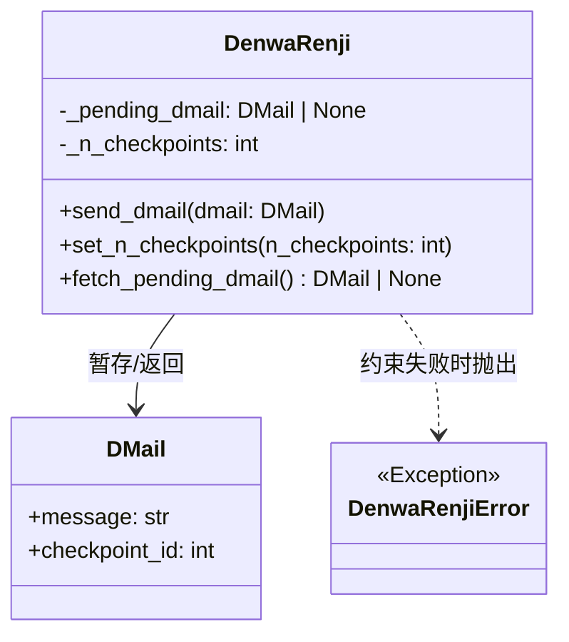
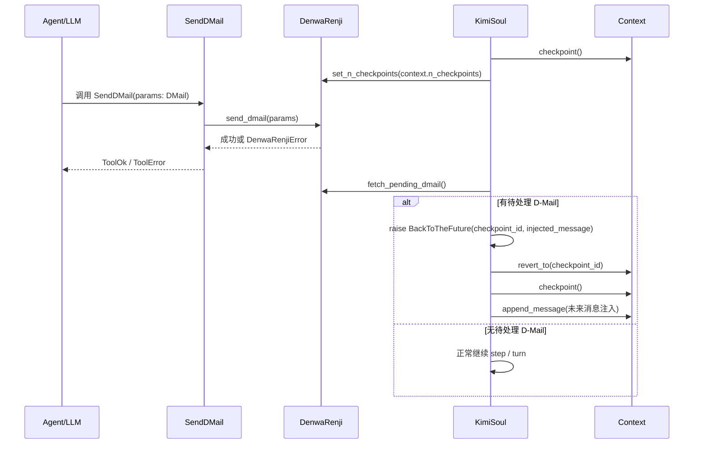
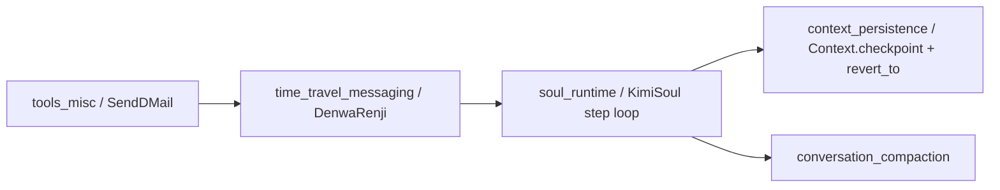

# time_travel_messaging 模块文档

## 1. 模块定位与设计动机

`time_travel_messaging` 对应实现位于 `src.kimi_cli.soul.denwarenji`，其核心目标是提供一种“跨检查点回邮”的轻量机制：让当前回合中的 Agent 可以提交一条 `DMail`，请求系统在后续步骤中把会话上下文回退到指定 `checkpoint`，并将这条消息注入回退后的上下文，形成一种“未来的我给过去的我发消息”的行为模型。

这个模块存在的根本原因不是为了做科幻叙事，而是为复杂、多步、可试错任务提供可控回溯能力。在工具调用、计划执行、外部副作用存在不确定性的情况下，Agent 可能在“走了几步后才发现早先决策不理想”。普通重试通常只能在当前状态继续，而 `DMail` 机制允许把关键经验压缩成文本，并回到更早的推理分叉点重新推进。

在系统分层上，它并不负责真正的上下文持久化，也不直接执行回滚动作，而是充当一个“意图登记器（intent registry）”：

- `DenwaRenji` 负责校验和暂存待处理 `DMail`；
- `KimiSoul` 在每一步结束时读取并消费该暂存意图，决定是否触发回退；
- `Context` 负责真正的 `revert_to(checkpoint_id)` 文件与内存状态重建。

因此，本模块是 `soul_runtime` 与 `context_persistence` 之间的桥接点之一。建议配合阅读 [`soul_runtime.md`](soul_runtime.md) 与 [`context_persistence.md`](context_persistence.md) 以获得完整运行图景。

---

## 2. 核心组件概览

当前模块文件定义了三个对象：`DMail`、`DenwaRenjiError`、`DenwaRenji`。其中模块树将 `DMail` 作为核心组件暴露，但工程上真正承载行为的是 `DenwaRenji`。



这张图体现了一个非常简洁的状态机：模块内部只维护“当前是否有一条待处理 D-Mail”与“当前 checkpoint 上限”两个状态变量。它刻意不记录历史队列，不做并发调度，也不持久化消息本体，换来的是低复杂度和清晰约束。

---

## 3. `DMail` 数据模型详解

### 3.1 结构定义

`DMail` 继承自 `pydantic.BaseModel`，字段如下：

- `message: str`：要发送到过去的文本消息；
- `checkpoint_id: int`：目标检查点 ID，字段层面带 `ge=0` 约束。

`Field(description=...)` 为工具参数 schema、自动文档和交互层提示提供可读描述。由于 `SendDMail` 工具直接将 `params` 绑定为 `DMail`，这些描述会自然进入工具调用协议，帮助模型理解参数含义。

### 3.2 参数语义

`checkpoint_id` 的语义是“回退目标的检查点编号”，其编号体系由 `Context.checkpoint()` 生成，0 表示第一个 checkpoint。需要特别注意，系统在实际回退时会“截断到目标 checkpoint 之前”，即目标 checkpoint 及之后内容都会被移除（详见 `Context.revert_to` 行为，参考 [`context_persistence.md`](context_persistence.md)）。

### 3.3 TODO 暗示的能力边界

源码注释中有：`# TODO: allow restoring filesystem state to the checkpoint`。这说明当前实现只回退“对话上下文”，不回退文件系统或工具副作用。也就是说，Agent 虽然在语义上回到过去，但工作目录中的文件改动可能仍然存在，这是一条非常关键的行为边界。

---

## 4. `DenwaRenji` 内部机制

### 4.1 状态设计

`DenwaRenji` 在初始化时维护两项状态：

- `_pending_dmail: DMail | None`：单槽位暂存区，表示当前步骤链路中是否已有待处理回邮；
- `_n_checkpoints: int`：由 `Soul` 在每步前同步的当前 checkpoint 总数。

这种设计本质上是“单生产者-单消费者意图寄存器”：工具侧调用 `send_dmail` 生产意图，运行时主循环通过 `fetch_pending_dmail` 消费并清空。

### 4.2 `send_dmail(dmail: DMail)`

该方法是模块的主要入口，供 `SendDMail` 工具调用。它按顺序执行三类校验：

1. 如果 `_pending_dmail` 已存在，拒绝新消息（一次仅允许一条待处理 D-Mail）；
2. 如果 `checkpoint_id < 0`，拒绝（双重防御：即使 `pydantic` 已限制，运行期仍再次校验）；
3. 如果 `checkpoint_id >= _n_checkpoints`，拒绝（目标 checkpoint 不存在）。

全部通过后，将 `dmail` 写入 `_pending_dmail`。

这个流程没有返回值；失败时抛 `DenwaRenjiError`。由于上层工具会将异常转译为 `ToolError`，最终用户/模型看到的是可读错误消息而非 Python 异常。

### 4.3 `set_n_checkpoints(n_checkpoints: int)`

该方法由 `Soul` 在每个 step 开始时调用，用于同步当前上下文可用的 checkpoint 上限。`DenwaRenji` 自身不直接依赖 `Context`，因此这个方法是它与外部状态对齐的唯一渠道。

注意它没有做非负校验，默认相信调用方。这是“薄中间层”的典型取舍：将状态合法性主要交给运行时编排器保证。

### 4.4 `fetch_pending_dmail() -> DMail | None`

该方法实现“读取即清空（consume-on-read）”语义：

- 返回当前 `_pending_dmail`；
- 然后立即将 `_pending_dmail` 置为 `None`。

这确保单条 D-Mail 只会被处理一次，避免同一回退意图被重复执行。对运行时来说，这是幂等控制的关键点。

---

## 5. 与运行时的协作流程（端到端）

虽然 `time_travel_messaging` 本身代码很短，但它实际价值体现在与 `SendDMail` 工具及 `KimiSoul` 主循环的联动上。



流程上有三个重要行为细节：

第一，`set_n_checkpoints` 必须发生在 step 前，否则 `send_dmail` 的合法性判定可能使用陈旧上限，导致误判。

第二，真正触发“回到过去”的并不是工具调用本身，而是 step 结束后 `Soul` 对 pending dmail 的检查。也就是说，`send_dmail` 是“登记意图”，不是“立即回滚”。

第三，回退后 `Soul` 会注入一条系统风格消息，提示“你收到了来自未来自我的 D-Mail”，并要求不要向用户泄露这一信息。该消息载体仍是 `Message(role="user", content=[system(...)])` 的形式，这与其他上下文注入策略保持一致。

---

## 6. 与其它模块的关系边界

`time_travel_messaging` 不是独立子系统，它依赖上层和旁路模块共同构成可用功能：



这里可以把它理解为“控制平面”而不是“数据平面”。它只承载回退决策信号；真正的历史内容、压缩、token 统计、文件旋转都在其他模块。

为避免重复，这些相关主题请参考：

- 运行主循环、`BackToTheFuture` 异常处理与重试逻辑：[`soul_runtime.md`](soul_runtime.md)
- checkpoint 落盘、回退、文件轮转：[`context_persistence.md`](context_persistence.md)
- 上下文过长时的压缩策略：[`conversation_compaction.md`](conversation_compaction.md)

---

## 7. 关键行为与错误条件

### 7.1 单待处理消息约束

`DenwaRenji` 明确禁止并存多条待处理 D-Mail。如果同一 step 内或相邻处理窗口里重复调用 `SendDMail`，第二次会失败并返回 `ToolError`。这条约束避免了“多个回退目标冲突”的歧义，但也限制了高级场景（例如批量规划多个备选历史分支）。

### 7.2 checkpoint 合法性依赖同步时机

`send_dmail` 通过 `_n_checkpoints` 判断目标是否合法，而这个值来自外部 `set_n_checkpoints`。若调用顺序错误或未来改造中遗漏同步，会导致错误接受/拒绝。当前实现依赖 `KimiSoul` 的固定调用顺序保障一致性。

### 7.3 工具成功消息的“反直觉文案”

`SendDMail.__call__` 在成功时返回的 `ToolOk.message` 文案是：

> "If you see this message, the D-Mail was NOT sent successfully..."

这是一种有意的提示语设计，用于提醒模型“不要把这条 ToolOk 当作最终用户可见确认”，并考虑审批拒绝等上游中断场景。维护者需要理解：`ToolOk` 表示“登记步骤成功执行”，不保证整轮事务最终提交。

### 7.4 工具拒绝时会清空 pending dmail

在 `KimiSoul._step` 中，如果任一工具结果为 `ToolRejectedError`，运行时会调用 `fetch_pending_dmail()` 丢弃待处理 D-Mail，再以 `tool_rejected` 停止本步。这避免了“审批失败后残留旧回退意图”污染后续步骤。

### 7.5 仅上下文回退，不回退副作用

这是当前最大的使用陷阱：回退只影响对话历史文件，不影响已执行的 shell/file/network 工具副作用。你可能在逻辑上“回到旧 checkpoint”，但工作目录内容已改变。因此 D-Mail 文本本身常需包含“环境已变化”的提醒或补救策略。

---

## 8. 使用方式与示例

### 8.1 工具层接入（系统内部）

```python
from kimi_cli.soul.denwarenji import DenwaRenji
from kimi_cli.tools.dmail import SendDMail

denwa_renji = DenwaRenji()
send_dmail_tool = SendDMail(denwa_renji)
```

在 Agent toolset 中注册 `SendDMail` 后，模型即可在工具调用阶段提交 `DMail` 参数。

### 8.2 直接调用 `DenwaRenji`（测试/单元验证）

```python
from kimi_cli.soul.denwarenji import DenwaRenji, DMail, DenwaRenjiError

dr = DenwaRenji()
dr.set_n_checkpoints(3)  # 可用 id: 0,1,2

dr.send_dmail(DMail(message="不要先改配置文件，先跑只读检查", checkpoint_id=1))

pending = dr.fetch_pending_dmail()
assert pending is not None
assert pending.checkpoint_id == 1
assert dr.fetch_pending_dmail() is None  # consume-on-read

try:
    dr.send_dmail(DMail(message="invalid", checkpoint_id=9))
except DenwaRenjiError:
    pass
```

这个示例有助于理解它的最小状态机行为：校验、单槽存储、读取清空。

### 8.3 扩展思路：从单槽到队列

若未来希望支持“多条时间消息排队”或“按优先级处理”，可以把 `_pending_dmail` 从单值改为队列结构，并显式定义冲突解析策略（例如只取最早、只取最近、按 checkpoint 优先）。但这会显著增加运行时语义复杂度，需同步更新 `KimiSoul` 的消费逻辑与错误恢复模型。

---

## 9. 设计取舍与可演进方向

当前实现最大的优点是简单可靠：状态少、边界清晰、可预测，且与现有 step loop 耦合点有限。它很适合作为“可逆推理”能力的 MVP。

同时其能力边界也非常明确。它没有跨会话持久化 D-Mail 队列；没有并发隔离（默认假定单会话串行处理）；没有副作用回滚；也没有对消息内容做结构化约束或安全过滤。随着系统复杂度上升，可能需要引入以下增强：

- 将 D-Mail 与 checkpoint 一并持久化，支持崩溃恢复后的继续处理；
- 与文件系统快照机制集成，实现“上下文 + 工作目录”一致回退；
- 增加 D-Mail 元数据（来源 step、优先级、签名）用于审计与冲突决策；
- 提供策略化注入模板，避免当前固定提示词在不同代理人格下产生偏差。

这些增强建议在不破坏 `DMail` 基础契约的前提下渐进实现，以保持工具协议兼容性。

---

## 10. 维护者检查清单（实践建议）

在修改本模块或其调用链时，建议至少验证以下不变量：

- 在任一步开始前，`DenwaRenji._n_checkpoints` 与 `Context.n_checkpoints` 同步；
- `fetch_pending_dmail()` 仍保持读取即清空语义；
- 工具拒绝/审批失败路径不会遗留 stale pending dmail；
- 回退后一定重新打 checkpoint 并注入 D-Mail 消息，避免上下文断层；
- 文档明确提示“不会回滚文件系统副作用”。

如果这些不变量被破坏，最常见后果是：错误回退、重复回退、回退后上下文失真或用户可见行为不可解释。
