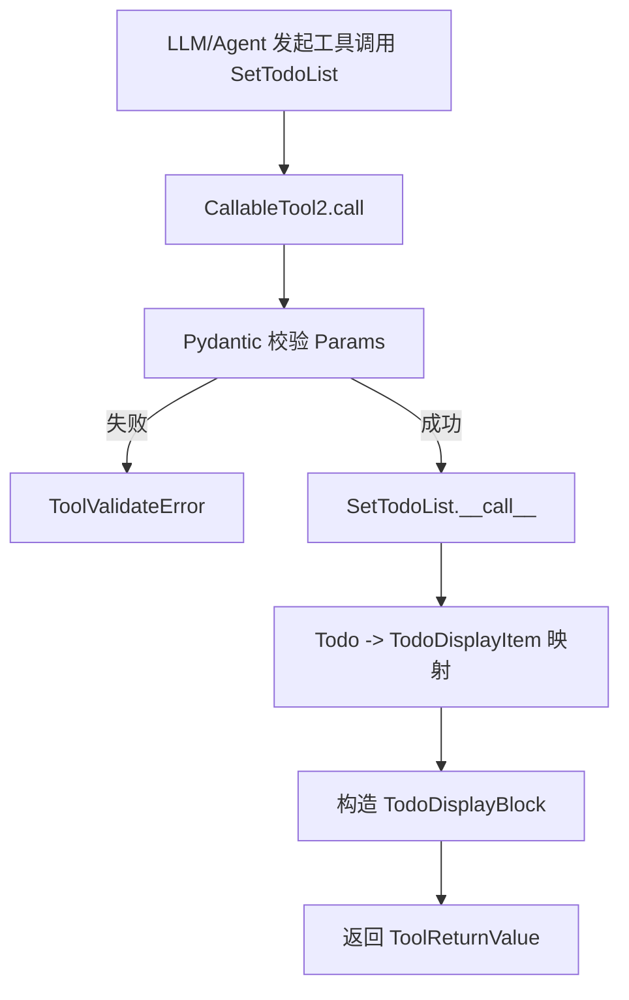
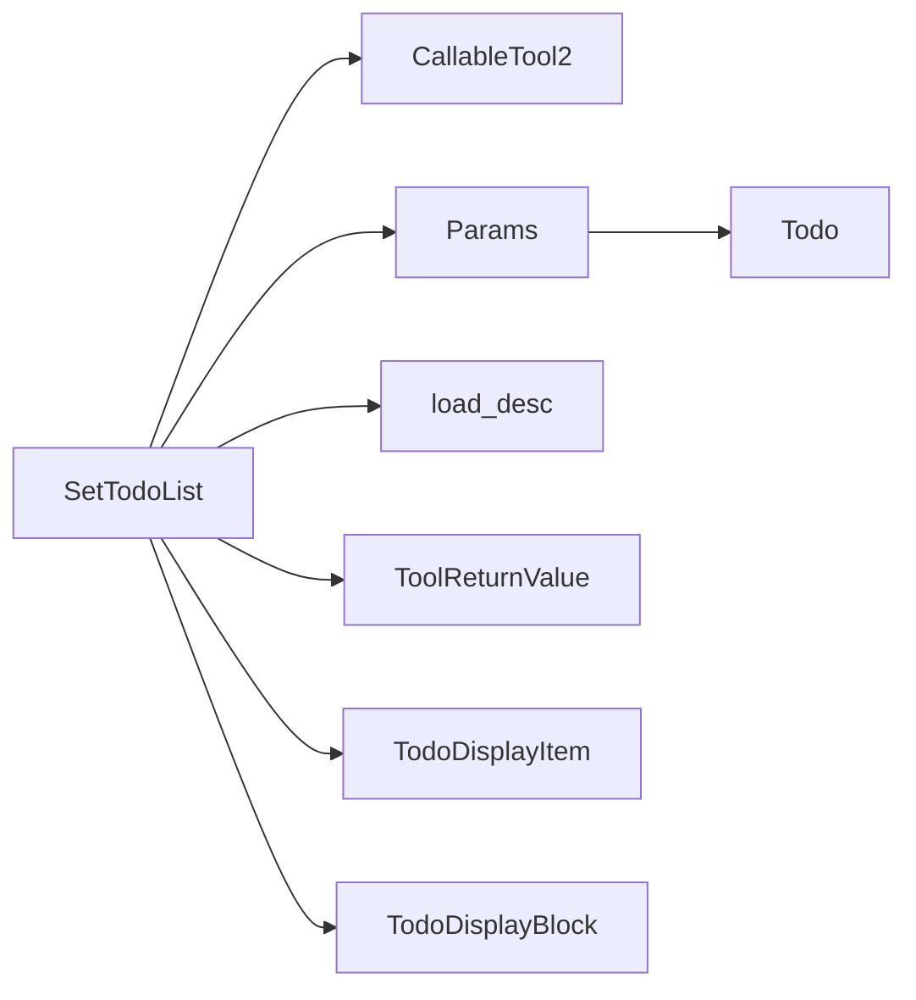
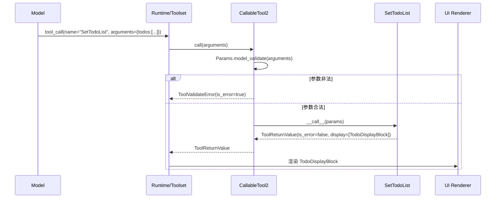
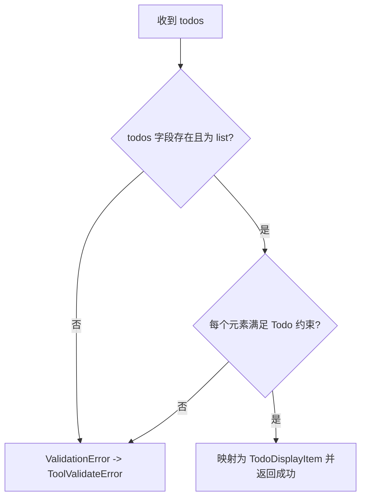

# todo_state_presentation 模块文档

## 1. 模块简介：它解决什么问题、为什么存在

`todo_state_presentation` 模块（代码位于 `src/kimi_cli/tools/todo/__init__.py`）实现了一个面向 Agent 的任务状态呈现工具：`SetTodoList`。这个工具的核心职责不是“执行任务”，而是把“当前任务拆解与进度”以结构化方式回传给系统和前端展示层，让模型、运行时和用户可以在同一视图下理解当前工作状态。

在复杂多步骤任务中，模型如果只通过自然语言描述“我接下来要做什么”，很容易出现计划丢失、步骤重复、状态漂移的问题。`SetTodoList` 通过显式的 `todos` 列表（每项有 `title` 和 `status`）把计划状态标准化，进而支持更好的可观察性与可维护性。它存在的价值可以概括为：把隐式推理中的“任务进度”变成显式、可校验、可显示的数据。

从系统分层看，它属于 `tools_misc` 里的状态展示类工具，与 `internal_thinking`（内部思考记录）和 `ask_user_interaction`（用户交互）形成互补：`SetTodoList` 不负责提问、不负责推理、不负责外部副作用，而是负责把进度快照写入统一工具返回结构。

---

## 2. 核心架构与依赖关系



该流程体现了一个重要设计：参数校验与协议一致性由 `CallableTool2` 统一处理，业务实现 `SetTodoList.__call__` 只关注“把输入 todo 列表转换成展示块并返回成功结果”。因此这个模块实现非常小，但能稳定接入整个工具运行时。



依赖图说明了该模块的三个支柱：

- 工具框架契约（`CallableTool2` / `ToolReturnValue`，来自 [`kosong_tooling.md`](./kosong_tooling.md)）
- 输入参数模型（`Todo`、`Params`）
- UI 展示模型（`TodoDisplayItem`、`TodoDisplayBlock`）

此外，工具描述来自 `set_todo_list.md`，并通过 `load_desc` 在模块加载时读入，这会直接影响模型在运行时“何时使用该工具”的行为。

---

## 3. 核心组件详解

### 3.1 `Todo`

`Todo` 是单条任务项的数据模型：

```python
class Todo(BaseModel):
    title: str = Field(description="The title of the todo", min_length=1)
    status: Literal["pending", "in_progress", "done"] = Field(description="The status of the todo")
```

它定义了两部分约束。第一，`title` 必须是非空字符串（`min_length=1`），这可以阻止“空标题任务”进入系统。第二，`status` 只能是三种离散值：`pending`、`in_progress`、`done`。这种 `Literal` 约束确保了状态机简单且可预测，也让前端渲染与统计逻辑无需处理开放枚举。

语义上建议把这三个状态理解为：

- `pending`：尚未开始
- `in_progress`：正在执行
- `done`：已经完成

模块本身并不强制状态迁移顺序（比如从 `done` 改回 `in_progress` 在技术上是允许的），因此“状态是否合理”属于调用方策略而非模型层硬约束。

### 3.2 `Params`

`Params` 是工具整体入参：

```python
class Params(BaseModel):
    todos: list[Todo] = Field(description="The updated todo list")
```

这里强调的是“**全量更新**”语义：工具每次接收的是完整 todo 列表，而不是增量 patch。配套描述文件 `set_todo_list.md` 也明确提示这是唯一 todo 工具，每次操作都要更新整个列表。这种设计牺牲了部分更新便利性，但换来状态一致性：任何一次调用都可被视为当前真值快照，便于回放和调试。

### 3.3 `SetTodoList`

`SetTodoList` 是实际工具实现：

```python
class SetTodoList(CallableTool2[Params]):
    name: str = "SetTodoList"
    description: str = load_desc(Path(__file__).parent / "set_todo_list.md")
    params: type[Params] = Params

    @override
    async def __call__(self, params: Params) -> ToolReturnValue:
        items = [TodoDisplayItem(title=todo.title, status=todo.status) for todo in params.todos]
        return ToolReturnValue(
            is_error=False,
            output="",
            message="Todo list updated",
            display=[TodoDisplayBlock(items=items)],
        )
```

这个实现有几个关键点：

第一，`name` 固定为 `SetTodoList`，这是模型函数调用时匹配的工具名。第二，`description` 由文件动态加载，避免在代码里硬编码长提示词，也便于后续更新工具行为规范。第三，`__call__` 不做状态持久化，不与外部存储交互，只做数据映射并返回展示块。

返回值中：`is_error=False` 表示调用成功，`message="Todo list updated"` 给模型最小确认，`display` 包含一个 `TodoDisplayBlock` 用于 UI 渲染，`output=""` 则表示没有额外文本结果需要注入模型上下文。

---

## 4. 执行机制与调用生命周期



在这条链路里，最容易被忽略的是：业务类 `SetTodoList` 并不直接接收原始 JSON，而是接收已通过 Pydantic 校验的 `Params`。这降低了业务代码中的防御式判断负担，也让错误格式在统一层处理。

---

## 5. 输入输出契约与示例

### 5.1 输入参数示例

```json
{
  "todos": [
    {"title": "梳理需求边界", "status": "done"},
    {"title": "实现核心逻辑", "status": "in_progress"},
    {"title": "补充回归测试", "status": "pending"}
  ]
}
```

### 5.2 成功返回（概念化）

```json
{
  "is_error": false,
  "output": "",
  "message": "Todo list updated",
  "display": [
    {
      "type": "todo",
      "items": [
        {"title": "梳理需求边界", "status": "done"},
        {"title": "实现核心逻辑", "status": "in_progress"},
        {"title": "补充回归测试", "status": "pending"}
      ]
    }
  ]
}
```

### 5.3 参数校验失败示例

例如传入：

```json
{
  "todos": [
    {"title": "", "status": "working"}
  ]
}
```

会在校验阶段失败，原因包括：`title` 违反 `min_length=1`，`status` 不在允许枚举内。该错误由 `CallableTool2.call` 统一转换为工具错误返回，而不会进入 `SetTodoList.__call__`。

---

## 6. 与其他模块的关系（避免重复说明）

`todo_state_presentation` 的实现很聚焦，但在系统里位置很关键：

- 与 [`kosong_tooling.md`](./kosong_tooling.md) 的关系是“框架与实现”。前者定义工具协议、参数校验、返回结构；本模块只实现 todo 语义。
- 与 [`internal_thinking.md`](./internal_thinking.md) 的关系是“思考 vs 状态展示”。`Think` 记录推理过程，而 `SetTodoList` 记录任务进度。
- 与 [`ask_user_interaction.md`](./ask_user_interaction.md) 的关系是“自主管理 vs 外部确认”。当任务不确定时先问用户，确定后再更新 todo 更合理。

因此，实际运行中常见链路是：先通过思考或提问确定计划，再用 `SetTodoList` 维护全局进度面板。

---

## 7. 设计 rationale：为什么采用“全量覆盖 + 展示块”

该模块没有选择“增删改单项 todo”的命令式接口，而是采用一次提交完整列表的快照方式。这样做有三个工程收益。首先，回放历史时每次调用都可单独解释，不依赖前序 patch。其次，异常恢复简单：只要有最近一次快照，就能恢复当前状态。最后，UI 渲染无需合并逻辑，降低前后端协作复杂度。

同时，返回 `TodoDisplayBlock` 而非纯文本，使展示层可以结构化渲染（例如按状态着色、分组、排序），并保持与其他 display block 的统一协议。代价是工具需要与 display 模型保持字段兼容，但从长期维护看收益更大。

---

## 8. 扩展与二次开发建议

如果你要扩展该模块，推荐优先考虑向后兼容。

可行方向之一是扩展 `Todo` 字段，例如增加 `id`、`priority`、`assignee`、`due_date`。但应注意这会影响三处：Pydantic schema、模型调用提示、UI 渲染组件（`TodoDisplayItem`）。可行方向之二是增加服务端语义检查，例如拒绝重复标题、限制最大 todo 数量、检查至少存在一个 `in_progress`。这类检查可以放在 `__call__` 中，并以 `ToolReturnValue(is_error=True, ...)` 返回业务错误。

示例（伪代码）：

```python
async def __call__(self, params: Params) -> ToolReturnValue:
    titles = [t.title for t in params.todos]
    if len(titles) != len(set(titles)):
        return ToolReturnValue(
            is_error=True,
            output="",
            message="Duplicate todo titles are not allowed",
            display=[],
        )
    ...
```

如果要从“仅展示”升级为“展示 + 持久化”，建议把持久化职责放到独立服务层，不要直接把数据库逻辑塞进工具类，以维持工具代码可测、可替换、低耦合。

---

## 9. 边界条件、错误场景与已知限制



当前实现的关键限制包括：

- 它不持久化 todo，仅返回展示结果；状态长期保存取决于上层会话系统。
- 它不校验“业务合理性”，只校验“结构合法性”。例如多个 `in_progress`、状态回退、重复标题都不会被阻止。
- 它采用全量更新模式；调用方若遗漏旧任务，会导致该任务在新快照中“消失”。
- `description` 在模块加载时读取文件，若 `set_todo_list.md` 缺失或不可读，可能在导入阶段就失败。

此外还要注意，`todos` 列表未设长度上限。理论上可提交极长列表，可能导致上下文与 UI 负担增加，应由上层提示词或策略控制规模。

---

## 10. 实践建议与使用模式

在真实任务中，推荐把 todo 列表维护为“稳定里程碑”，而不是“每个微操作都建一条任务”。`set_todo_list.md` 也强调了这一点：滥用会让上下文变脏、降低效率。一个有效模式是：当任务复杂度上升时再引入 todo，并在完成一个里程碑后做一次全量更新。

建议的最小实践是：

1. 首次拆解时建立 3~7 条任务；
2. 任一条任务完成后立即更新状态；
3. 避免频繁改名，保持标题可追踪；
4. 收尾时把剩余项清理为 `done` 或移除。

通过这种方式，`todo_state_presentation` 能在不增加执行复杂度的前提下，显著提升多步骤任务的透明度与可控性。
