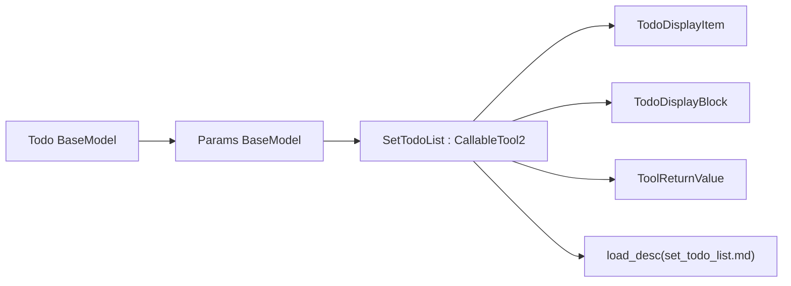
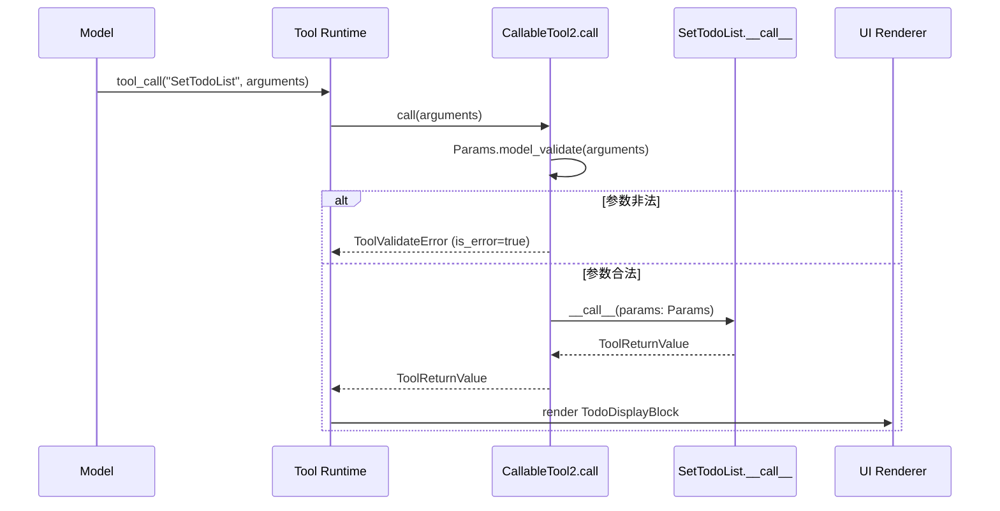
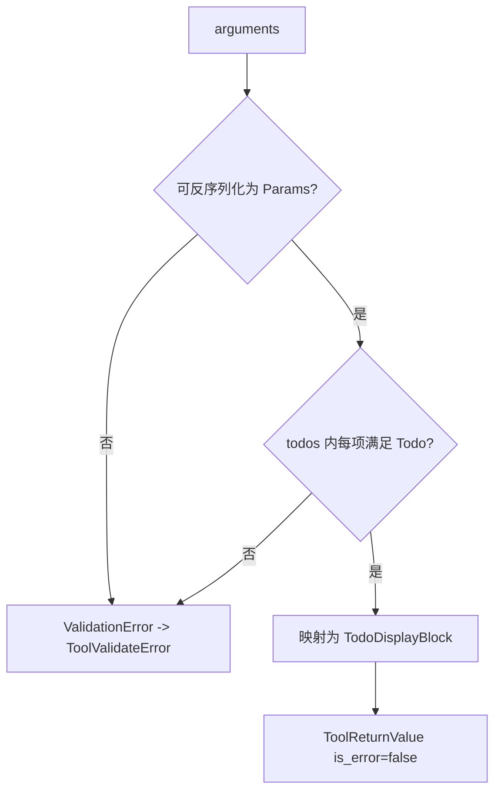

# todo_state_projection 模块文档

## 模块概述：它做什么、为什么存在

`todo_state_projection`（代码位于 `src/kimi_cli/tools/todo/__init__.py`）是一个“任务状态投影（projection）”工具模块。它的核心目标不是执行任务本身，而是把 Agent 当前的任务拆解与进度，投影为结构化、可验证、可渲染的数据块，供运行时和 UI 一致消费。

在复杂任务中，模型经常需要跨多个步骤推进工作。仅靠自然语言“我接下来要做什么”，容易出现计划漂移、遗漏里程碑、重复劳动等问题。这个模块通过 `SetTodoList` 工具，把“任务计划与状态”从隐式文本提升为显式数据模型（`Todo` / `Params`），再转换为展示层结构（`TodoDisplayBlock`）。这样的设计能显著提升任务可观测性，也便于回放、调试和跨轮次上下文管理。

从系统位置看，它属于 `tools_misc` 家族中的轻量状态工具，与 [internal_reasoning_marker.md](./internal_reasoning_marker.md)（内部思考标记）和 [interactive_user_query.md](./interactive_user_query.md)（向用户提问）互补：`SetTodoList` 不负责决策、不负责外部副作用、不负责持久化，只负责把“当前 todo 快照”以标准 `ToolReturnValue` 返回。

---

## 设计动机与核心思路

该模块采用“全量快照更新（full snapshot）”而非“增量 patch 更新”策略。每次调用都提交完整 `todos` 列表，系统把它视为当前真值。这一选择的核心好处在于：任何一次调用都可独立解释，历史回放无需重放多个 patch；当发生中断时，只要保留最近一次快照即可恢复可见进度；UI 渲染也不需要复杂合并逻辑。

工具描述文本来自 `set_todo_list.md`，并在类定义时通过 `load_desc(...)` 读取。该描述会直接影响模型“何时该用 / 不该用 todo 工具”的策略，因此它不仅是注释，而是运行行为的一部分。

---

## 组件清单与职责

该模块只有三个核心组件，但职责边界清晰：

- `Todo`：单条任务项模型，定义标题和状态。
- `Params`：工具入参模型，承载完整 todo 列表。
- `SetTodoList`：工具实现，接收 `Params`，映射为 display block，并返回 `ToolReturnValue`。

与此同时，模块依赖以下外部组件：

- `CallableTool2` / `ToolReturnValue`（来自 [kosong_tooling.md](./kosong_tooling.md)）：提供工具协议、参数校验入口、返回值标准。
- `TodoDisplayItem` / `TodoDisplayBlock`：承载 UI 展示数据。
- `load_desc`：加载并渲染工具描述文件（Jinja2）。



上图体现了一个重要事实：业务逻辑极薄，主要承担“类型化输入 -> 展示结构输出”的转换工作；参数合法性与工具协议由框架层负责，这使该工具在行为上稳定、可预测。

---

## 核心数据模型详解

### 1) `Todo`

```python
class Todo(BaseModel):
    title: str = Field(description="The title of the todo", min_length=1)
    status: Literal["pending", "in_progress", "done"] = Field(description="The status of the todo")
```

`Todo` 表示一个最小任务单元。`title` 要求非空（`min_length=1`），避免空任务污染面板；`status` 使用 `Literal` 限定为三态：`pending`、`in_progress`、`done`。这种离散状态约束非常关键：它把 UI 展示和上层统计复杂度压到最低，并避免“自由文本状态”带来的兼容性问题。

需要注意的是，这里只做结构层面的有效性约束，并未定义业务状态机。例如从 `done` 回退到 `in_progress` 在技术上可行，模块不会阻止。

### 2) `Params`

```python
class Params(BaseModel):
    todos: list[Todo] = Field(description="The updated todo list")
```

`Params` 强调的是“整表更新语义”：每次提交完整列表，而非对旧列表做增删改命令。模型约束只要求 `todos` 是 `Todo` 列表，没有设置最小长度，因此空列表在类型层面是允许的（可用来表达“清空 todo 面板”）。

---

## 工具实现详解：`SetTodoList`

```python
class SetTodoList(CallableTool2[Params]):
    name: str = "SetTodoList"
    description: str = load_desc(Path(__file__).parent / "set_todo_list.md")
    params: type[Params] = Params

    @override
    async def __call__(self, params: Params) -> ToolReturnValue:
        items = [TodoDisplayItem(title=todo.title, status=todo.status) for todo in params.todos]
        return ToolReturnValue(
            is_error=False,
            output="",
            message="Todo list updated",
            display=[TodoDisplayBlock(items=items)],
        )
```

`SetTodoList` 通过继承 `CallableTool2[Params]` 与工具运行时对齐。`name` 用于模型函数调用匹配；`params` 指定 Pydantic 入参类型；`description` 从 markdown 文件加载，减少硬编码并支持运营侧更新。

`__call__` 逻辑非常直接：把 `params.todos` 映射成 `TodoDisplayItem` 列表，再封装到 `TodoDisplayBlock`，最终返回成功 `ToolReturnValue`。其中：

- `is_error=False`：声明调用成功。
- `output=""`：不向模型注入额外文本主体。
- `message="Todo list updated"`：给模型一个简短确认。
- `display=[TodoDisplayBlock(...)]`：把结构化数据交给 UI 层渲染。

这个实现没有网络、数据库、文件写入等副作用，属于纯计算映射，行为可重复且容易测试。

---

## 调用链路与运行时交互



关键点在于，`SetTodoList.__call__` 不直接处理原始 JSON，而是接收已校验的 `Params` 对象。也就是说，诸如状态枚举错误、空标题、字段缺失等问题会在 `CallableTool2.call` 阶段被截断并转换为工具错误，不会进入业务逻辑。

---

## 输入输出契约与示例

### 输入示例（完整快照）

```json
{
  "todos": [
    {"title": "梳理需求", "status": "done"},
    {"title": "实现主流程", "status": "in_progress"},
    {"title": "补充测试", "status": "pending"}
  ]
}
```

### 成功返回（概念化）

```json
{
  "is_error": false,
  "output": "",
  "message": "Todo list updated",
  "display": [
    {
      "type": "todo",
      "items": [
        {"title": "梳理需求", "status": "done"},
        {"title": "实现主流程", "status": "in_progress"},
        {"title": "补充测试", "status": "pending"}
      ]
    }
  ]
}
```

### 参数错误示例

```json
{
  "todos": [
    {"title": "", "status": "working"}
  ]
}
```

这个输入会在校验阶段失败：`title` 违反最小长度，`status` 不在允许枚举内。错误由框架层封装为工具错误返回。

---

## 与其他模块的关系（引用）

`todo_state_projection` 在架构中很小，但依赖关系明确：

- 与 [kosong_tooling.md](./kosong_tooling.md) 是“协议层与实现层”关系。`CallableTool2` 负责参数验证和 schema 暴露，`SetTodoList` 只实现 todo 语义。
- 与 [tools_misc.md](./tools_misc.md) 是“同组工具”关系。它与 `Think`、`AskUserQuestion`、`SendDMail` 共同构成非文件/非网络类辅助工具。
- 与 [ui_shell.md](./ui_shell.md) 存在“显示消费”关系。`TodoDisplayBlock` 最终由 UI 层解释为可视化待办面板。

为了避免重复，工具框架细节（如 `ToolReturnValue` 字段语义、校验错误包装）建议优先阅读 `kosong_tooling.md`。

---

## 配置与可变行为

该模块没有独立配置文件，也没有运行时开关。可变行为主要来源于两处：

首先是 `set_todo_list.md` 描述文本，它会影响模型如何选择使用该工具。描述中明确提示“这是唯一 todo 工具，且每次需更新整个列表”，也列举了不建议使用 todo 的场景。其次是调用方传入的 `todos` 快照内容，即业务策略层可自由控制粒度、排序和状态迁移。

换言之，这个模块是“低配置、高约束”的典型：约束清晰，但策略弹性留给上层 agent 提示词和调度逻辑。

---

## 边界条件、错误处理与限制



当前实现下需要重点关注以下边界与限制：

- **仅结构校验，不做业务校验**：允许重复标题、多个 `in_progress`、非单调状态迁移。
- **全量覆盖语义**：调用方若漏传旧任务，会导致其从新快照中消失。
- **无持久化能力**：返回仅用于当前运行链路与展示，长期状态依赖会话层保存机制。
- **描述文件加载时机早**：`description` 在类定义阶段读取文件；若 `set_todo_list.md` 缺失或不可读，可能在模块导入时即失败。
- **列表长度无上限**：超长 todo 列表会增加模型上下文和 UI 渲染负担。

---

## 扩展建议：如何安全演进

如果要增强能力，建议保持“协议稳定、行为可解释”的原则。

一个常见扩展是给 `Todo` 增加字段（如 `id`、`priority`、`due_date`）。这会同时影响参数 schema、模型调用提示和展示组件，请保持向后兼容（新增可选字段优先）。另一个扩展方向是在 `__call__` 增加业务规则验证，例如禁止重复标题或限制列表长度，并在违规时返回 `is_error=True` 的 `ToolReturnValue`。

示例（业务规则校验）：

```python
@override
async def __call__(self, params: Params) -> ToolReturnValue:
    titles = [t.title for t in params.todos]
    if len(titles) != len(set(titles)):
        return ToolReturnValue(
            is_error=True,
            output="",
            message="Duplicate todo titles are not allowed",
            display=[],
        )

    items = [TodoDisplayItem(title=t.title, status=t.status) for t in params.todos]
    return ToolReturnValue(
        is_error=False,
        output="",
        message="Todo list updated",
        display=[TodoDisplayBlock(items=items)],
    )
```

如果未来要做“持久化 todo”，建议把存储逻辑放在独立 service/repository 层，`SetTodoList` 继续保持为薄适配器，避免工具类变成高耦合业务入口。

---

## 实践建议（面向使用者）

在日常使用中，最有效的方式是把 todo 当作“里程碑面板”而非“微操作日志”。当任务明显跨多个阶段时再启用它；每完成一个阶段就更新一次全量快照；避免过细粒度拆分导致上下文噪声。

`set_todo_list.md` 也强调了这一点：简单问答、几步可完成的小修复、完全机械执行的指令，通常不需要 todo 工具。相反，当任务在执行中逐渐变复杂，也可以中途开始引入 todo，并在后续持续维护。

总体上，`todo_state_projection` 是一个小而关键的基础模块：它通过极简实现，为多步骤任务提供了稳定的状态可视化支点。
