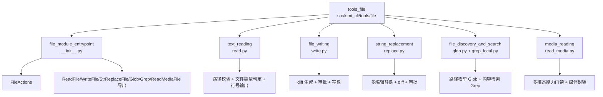
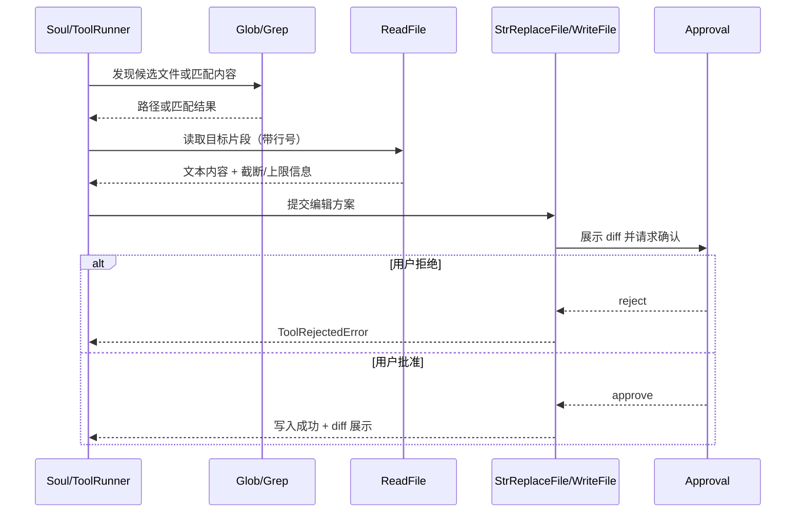
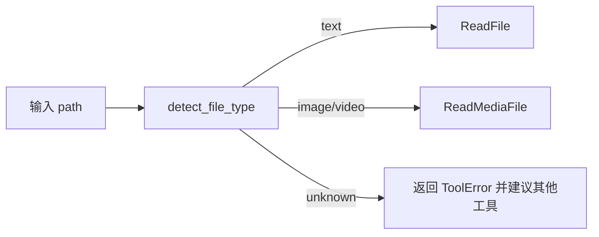

# tools_file 模块文档

## 1. 模块简介

`tools_file` 模块（对应代码路径 `src/kimi_cli/tools/file/`）是 kimi-cli 工具系统中的“文件能力中枢”。它把面向 agent 的文件操作拆分为多个专业工具：文本读取、媒体读取、文件写入、字符串替换、路径发现与内容检索，并通过统一入口导出给上层运行时调用。这个模块的存在不是为了简单封装 `open/read/write`，而是为了在自动化代理场景中把高风险文件操作转化为可治理、可审计、可拒绝的标准化工具调用。

在 LLM agent 场景中，文件操作天然存在三类问题：一是安全边界问题（路径越界、误改工作区外文件）；二是上下文成本问题（一次读太多、超长行、二进制误读）；三是交互可控性问题（改了什么、是否需要用户确认）。`tools_file` 的设计正是围绕这三类问题展开：通过路径校验和工作目录规则做边界控制，通过读取上限和类型识别控制输入规模，通过 diff + 审批机制控制写入风险。这使它不仅是“工具集合”，更是系统可信执行链的一部分。

从系统架构位置来看，`tools_file` 处于 `soul_engine` 驱动的工具执行平面，与 [tools_shell.md](tools_shell.md)、[tools_web.md](tools_web.md)、[tools_misc.md](tools_misc.md) 并列；其参数模型与返回协议依赖 [kosong_tooling.md](kosong_tooling.md)；运行时上下文（如 `KIMI_WORK_DIR`、模型能力、审批状态）来自 [soul_engine.md](soul_engine.md) 和 [config_and_session.md](config_and_session.md)。因此，它既是底层文件 I/O 能力的封装层，也是上层 agent 策略执行的承载层。

---

## 2. 架构总览

`tools_file` 由一个入口聚合模块和五个功能子模块组成。入口模块负责导出与动作语义统一；子模块分别处理文本读取、媒体读取、写入/替换、发现/检索等能力。整体上采用“分治实现 + 统一导出 + 协议一致”的架构模式。



上图体现出一个关键事实：`tools_file` 并非“一个巨大工具”，而是一组职责明确的工具组件。这样拆分的好处是每类风险可以按工具粒度治理。例如，读取工具重点关注输出规模和类型分流；写入工具重点关注审批与变更展示；检索工具重点关注查询范围与性能；媒体工具重点关注模型能力匹配和体积控制。

---

## 3. 子模块功能总览（含交叉引用）

### 3.1 入口与语义层：`file_module_entrypoint`

入口模块定义了 `FileActions`（`READ`、`EDIT`、`EDIT_OUTSIDE`）并统一导出所有文件工具。它本身不负责复杂 I/O，但承担了“对外 API 稳定面”的职责，确保调用方不需要感知子模块路径变化。对于审批、审计、遥测等策略系统，`FileActions` 还是行为语义的标准标签来源。详细说明见 [file_module_entrypoint.md](file_module_entrypoint.md)。

### 3.2 文本读取：`text_reading`

`ReadFile` 提供受控文本读取，支持起始行偏移、读取行数控制，并内置行长与总字节上限。它会在读取前判定文件类型，拒绝图片/视频和不可读二进制，避免将不适合的内容灌入模型上下文。输出采用带行号格式，便于后续替换工具进行精确定位。详细说明见 [text_reading.md](text_reading.md)。

### 3.3 文件写入：`file_writing`

`WriteFile` 支持 `overwrite` 与 `append` 两种模式。它在真正写盘前会读取旧内容并构建 diff，再通过审批系统请求用户确认。审批通过后才执行写入，并返回包含变更展示块（`display`）的结构化结果。这一机制是 `tools_file` 风险控制的核心一环。详细说明见 [file_writing.md](file_writing.md)。

### 3.4 字符串替换：`string_replacement`

`StrReplaceFile` 用字面字符串替换实现轻量编辑能力，支持单编辑或多编辑串行执行。它同样遵循“先生成 diff、再审批、后写盘”的安全流程。该工具不支持正则与 AST 语义，强调可预测行为与低歧义。详细说明见 [string_replacement.md](string_replacement.md)。

### 3.5 文件发现与检索：`file_discovery_and_search`

该子模块包含 `Glob` 与 `Grep`。`Glob` 负责路径层面的模式匹配，强调工作目录边界和结果上限；`Grep` 基于 ripgrep 实现内容检索，提供多输出模式和上下文参数，并内置缺失二进制时的自动下载流程。二者组合可形成“先筛范围，再搜内容”的高效检索链。详细说明见 [file_discovery_and_search.md](file_discovery_and_search.md)。

### 3.6 媒体读取：`media_reading`

`ReadMediaFile` 面向图片/视频输入，按模型能力（`image_in`/`video_in`）进行门禁控制。它会将媒体封装为模型可消费的内容 part，视频在 Kimi provider 下优先走上传通道，其他场景回退到 data URL。该工具与文本读取形成类型分流，避免误用。详细说明见 [media_reading.md](media_reading.md)。

---

## 4. 核心交互流程

### 4.1 读取-编辑闭环



这个流程解释了 `tools_file` 为什么要拆成多个工具：agent 不需要“盲写”，而是先探索、再读取、再最小化编辑，并在变更落盘前经过审批。该设计显著降低误改风险，也提高了人机协同可解释性。

### 4.2 文本/媒体分流流程



通过统一类型探测策略，`tools_file` 避免了“用错工具”的常见问题。特别是在自动代理场景下，这种强制分流有助于减少失败重试和无效上下文消耗。

---

## 5. 关键设计决策与内部机制

### 5.1 路径安全策略

绝大多数文件工具都采用同一条规则：如果目标不在工作目录内，则必须使用绝对路径。该规则不是绝对禁止越界访问，而是要求调用方显式表达意图，防止相对路径带来的隐式跳转。`Glob` 更严格，直接限制搜索范围必须在工作目录内。

### 5.2 工具返回协议一致性

各工具统一基于 `ToolReturnValue`/`ToolOk`/`ToolError`，这使上层调度器能够用一致分支处理成功与失败，而不需要理解每个工具的异常细节。失败不抛原始异常到上层，而是转换为结构化错误，这对 UI 展示、日志聚合、重试策略都非常重要。

### 5.3 审批驱动的写操作治理

`WriteFile` 与 `StrReplaceFile` 在写盘前均生成 diff 并请求审批，且依据 `FileActions.EDIT` 与 `EDIT_OUTSIDE` 区分风险等级。这是模块中最关键的治理机制：用户能在操作前看到具体变更，并可拒绝执行。

### 5.4 成本与上限控制

读取类工具普遍有显式上限：文本读取限制行数、行长和字节数；媒体读取限制文件大小。其目标是防止单次工具调用吞噬过多上下文与资源，保持 agent 回路稳定。

---

## 6. 使用与集成指导

在典型集成中，`tools_file` 不会被业务代码直接裸调，而是注册到工具执行框架中由 agent 选择调用。但开发者在测试和扩展时可按以下思路使用。

```python
from kimi_cli.tools.file import ReadFile, WriteFile, StrReplaceFile, Glob, Grep, ReadMediaFile

# 实例化时依赖 runtime / builtin_args / approval，按工具类型注入
# 例如：ReadFile(runtime), WriteFile(builtin_args, approval) ...
```

推荐调用策略是：

1. 先用 `Glob` 或 `Grep` 缩小目标范围；
2. 再用 `ReadFile` 获取必要上下文（分页读取大文件）；
3. 优先用 `StrReplaceFile` 做最小化改动；
4. 需要整体重写时再用 `WriteFile`；
5. 图片/视频输入统一走 `ReadMediaFile`。

如果你在开发新工具，建议保持 `CallableTool2 + Params` 的模式，并在入口模块统一导出，以保证工具发现与文档一致性。相关入口约束见 [file_module_entrypoint.md](file_module_entrypoint.md)。

---

## 7. 配置与运行时依赖

`tools_file` 本身没有独立配置文件，但行为强依赖运行时上下文：

- `KIMI_WORK_DIR`：路径边界判断基准；
- `Approval` 状态：决定写操作是否需要人工确认；
- 当前模型 capabilities：决定媒体工具是否可用；
- 本地环境与网络：影响 `Grep` 的 ripgrep 获取与首次调用延迟。

关于这些上游配置来源，请参考 [config_and_session.md](config_and_session.md) 与 [soul_engine.md](soul_engine.md)。

---

## 8. 边界条件、错误场景与限制

`tools_file` 的整体行为偏保守，这带来可靠性，也带来一些需要开发者理解的限制。

首先，路径规则可能与用户直觉不一致。工作目录外访问不是完全禁止，但相对路径越界会被拒绝；`Glob` 则直接禁止目录越界搜索。其次，读取工具会主动拒绝不匹配类型（例如用 `ReadFile` 读视频），这是设计选择而非功能缺失。

再次，写入类工具的审批机制虽然提升安全性，但在自动化批处理里会增加交互成本；如果会话策略设为自动批准，需意识到风险随之上升。另一个现实限制是大文件性能：`WriteFile`/`StrReplaceFile` 为了生成 diff 常需要读取并比较完整文本，超大文件场景会有明显开销。

`Grep` 方面的已知注意点是其路径沙箱不如 `Glob` 严格（实现注释已明确未使用 `KaosPath`）；并且首次执行可能触发 ripgrep 下载，受平台和网络影响。媒体工具方面，非 Kimi provider 的视频可能以 data URL 回退，体积可能非常大。

---

## 9. 扩展建议

扩展 `tools_file` 时建议遵循三个原则：第一，保持工具职责单一，不要让一个工具同时承担发现、读取、修改多重语义；第二，保持返回协议一致，优先返回结构化 `ToolError` 而非抛异常；第三，修改写入行为时不要绕过审批链路，尤其是工作目录外编辑。

如果你需要新增能力（例如正则替换、原子写入、语义搜索），推荐新增独立工具并在入口模块统一导出，而不是破坏现有工具语义。这样可以保持提示词、调用策略和用户心智模型稳定。

---

## 10. 相关文档索引

> 说明：以下子模块文档均已在当前文档目录生成，并与本总览形成一一对应的交叉引用；建议按“入口层 → 发现/读取 → 写入/替换 → 媒体”的顺序阅读，以建立完整心智模型。

- 总览入口： [file_module_entrypoint.md](file_module_entrypoint.md)
- 文本读取： [text_reading.md](text_reading.md)
- 文件写入： [file_writing.md](file_writing.md)
- 字符串替换： [string_replacement.md](string_replacement.md)
- 发现与检索： [file_discovery_and_search.md](file_discovery_and_search.md)
- 媒体读取： [media_reading.md](media_reading.md)
- 工具协议基础： [kosong_tooling.md](kosong_tooling.md)
- Agent 运行时： [soul_engine.md](soul_engine.md)
- 配置与会话： [config_and_session.md](config_and_session.md)
- 线协议： [wire_protocol.md](wire_protocol.md)

