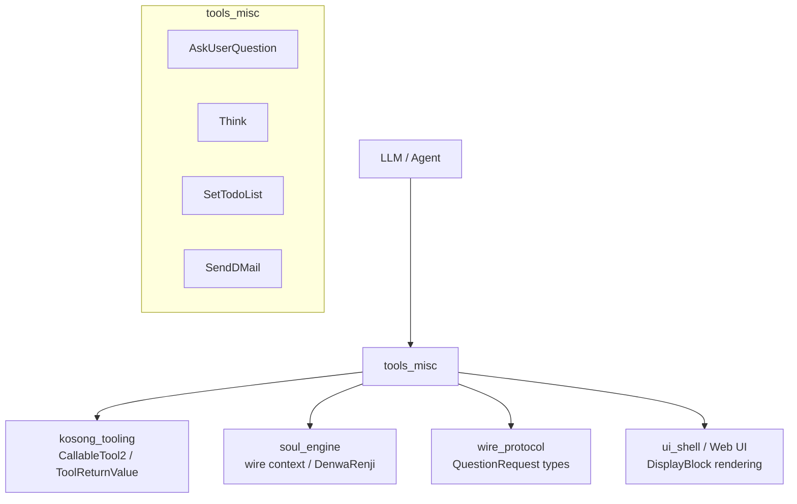
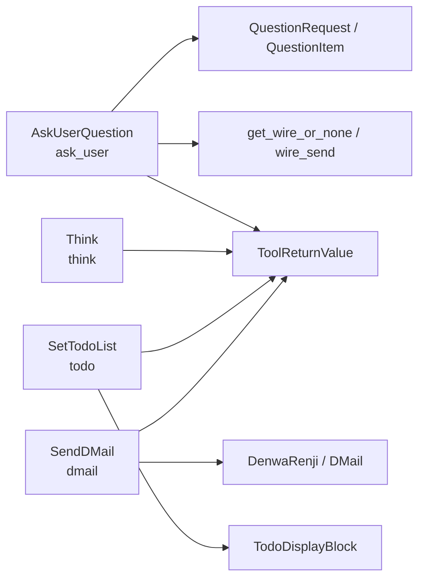
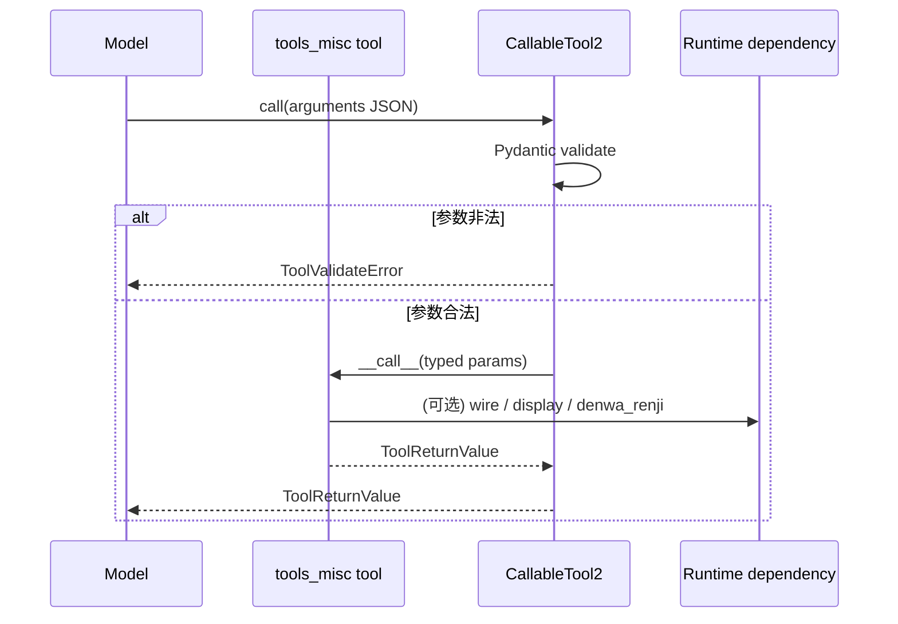
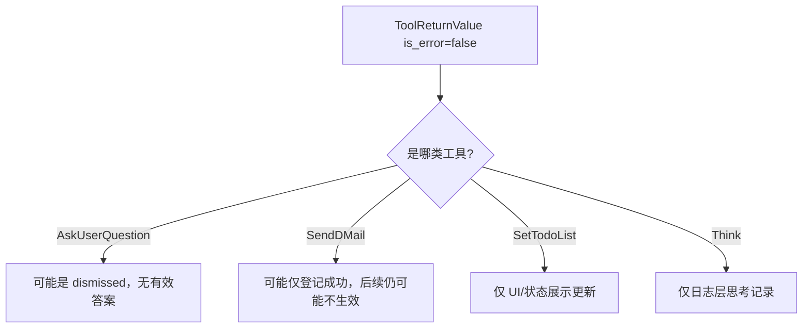

# tools_misc 模块文档

## 1. 模块总览：它是什么、为什么存在

`tools_misc` 是 `kimi_cli` 工具体系中的“杂项但关键”工具集合，覆盖了四类在 Agent 运行中高频出现、但不适合归入文件、Shell、Web 等外部执行域的能力：用户结构化问答（AskUserQuestion）、内部思考记录（Think）、任务清单展示（SetTodoList）、以及时间回溯信号发送（SendDMail）。

这个模块存在的核心价值，不是提供“重计算能力”，而是提供“运行时控制能力”。在真实的代理执行中，很多关键动作并不直接读写文件或访问网络，而是决定 **是否继续、问谁、如何展示当前状态、何时回退到更优分支**。`tools_misc` 将这些控制点规范为统一的工具调用接口，避免逻辑散落在提示词或硬编码控制流里。

从设计角度看，该模块体现了三个原则：第一，所有能力都通过 `CallableTool2` 接入，复用统一参数校验与返回协议；第二，每个工具尽量“单一职责”，例如 `Think` 只记日志、`SetTodoList` 只生成展示块；第三，复杂语义（如 D-Mail 的时空控制）下沉到 `soul_engine`，工具层仅做协议适配，降低耦合。

---

## 2. 在整体系统中的位置

`tools_misc` 位于 Agent 执行层与运行时基础设施之间：

- 向上服务模型/Agent 的工具调用决策（何时问用户、何时更新待办、何时发送 D-Mail）；
- 向下依赖 `kosong_tooling` 的工具协议（参数 schema、`ToolReturnValue`、错误语义）；
- 在特定工具上依赖 `soul_engine` 与 `wire_protocol`（例如 `AskUserQuestion` 依赖 Wire 问答通道，`SendDMail` 依赖 `DenwaRenji`）。

上图说明 `tools_misc` 并不是一个“对外资源访问层”，而是连接模型决策与系统控制面的桥梁模块。它让模型可以通过标准工具调用表达“交互、规划、回退”这类高层行为，同时保持运行时可观测与可治理。

---

## 3. 模块内部架构与组件关系

`tools_misc` 内部可以清晰拆成四个子模块，每个子模块单独维护自己的参数模型与调用实现，最终都返回 `ToolReturnValue` 协议对象。

该架构的关键点是“同构调用、异构语义”：调用入口统一，业务含义各异。这种结构对维护者很友好——新增工具时可以复用同样模板（`Params` + `CallableTool2.__call__`），而不需要重写调用协议。

---

## 4. 子模块功能概述（含交叉引用）

### 4.1 interactive_user_query

`AskUserQuestion` 负责在工具调用上下文中发起结构化用户提问。它会先检查 Wire 是否可用、工具调用上下文是否存在，然后构造 `QuestionRequest` 发送到客户端并异步等待回答。它支持多题批量、每题 2~4 个选项、可选多选；并在客户端不支持时返回明确的降级指引（不要再调用该工具，改为文本询问）。

详细设计、异常路径与返回语义请见：[interactive_user_query.md](interactive_user_query.md)。

### 4.2 internal_reasoning_marker

`Think` 是一个“无副作用思考记录”工具。它不访问外部资源，不改变业务状态，主要用于让 Agent 在复杂步骤之间显式插入推理动作，并在运行日志中留下可观测轨迹。其实现极简，但在行为治理和回放分析上价值很高。

详细说明请见：[internal_reasoning_marker.md](internal_reasoning_marker.md)。

### 4.3 todo_state_projection

`SetTodoList` 用于提交一份当前 todo 全量快照，并通过 `TodoDisplayBlock` 输出给 UI 展示。它强调状态可见性而非执行能力，典型用途是让用户和模型对“当前计划与进度”保持同步。参数层严格限制状态枚举（`pending/in_progress/done`），但不强制状态迁移规则。

完整契约、示例和限制见：[todo_state_projection.md](todo_state_projection.md)。

### 4.4 time_travel_message_dispatch

`SendDMail` 是时间回溯链路中的“信号登记工具”：它接收 `DMail` 参数并委托 `DenwaRenji` 挂起一条待处理消息。注意它并不直接执行回退动作，真正上下文回退发生在后续 `Soul` 运行阶段消费 pending dmail 时。工具返回成功只代表“登记成功”，不保证最终世界线切换已完成。

详细行为、陷阱和运行语义见：[time_travel_message_dispatch.md](time_travel_message_dispatch.md)。

---

## 5. 统一执行流程与数据流

尽管四个工具功能不同，它们共享同一调用生命周期：参数验证 → 工具逻辑 → 结构化返回。

其中 `X` 在不同工具中代表不同依赖：

- AskUserQuestion：Wire + QuestionRequest future
- Think：无外部依赖（最小路径）
- SetTodoList：DisplayBlock 构造
- SendDMail：DenwaRenji 状态机

这种模式保证了“输入错误在前置层统一处理，业务错误在工具内显式返回”。

---

## 6. 开发与扩展指南

扩展 `tools_misc` 时，建议遵循现有模式而不是引入特例流程。一个典型新工具应至少包含：

1. `Params(BaseModel)`：明确字段约束、长度限制、枚举范围；
2. `class NewTool(CallableTool2[Params])`：声明 `name/description/params`；
3. `async __call__`：只做该工具职责内的逻辑，并返回 `ToolReturnValue`；
4. 需要用户可视反馈时，通过 `display` 返回结构化 block，而不是拼接纯文本。

如果工具依赖运行时上下文（如 Wire、当前 tool_call），应像 `AskUserQuestion` 一样先做前置检查并提供可执行的降级提示，避免抛未处理异常破坏主循环。

---

## 7. 常见风险、边界条件与限制

`tools_misc` 的主要风险不是算法复杂度，而是运行语义误解。维护和使用时应特别注意：

- **成功返回不总是最终成功**：`SendDMail` 的 `ToolOk` 代表信号已登记，不代表回退事务最终落地。
- **非错误不代表有答案**：`AskUserQuestion` 中用户 dismiss 会返回 `is_error=false`，但 `answers` 为空。
- **展示更新不等于持久化**：`SetTodoList` 仅返回 display block，不直接负责长期状态存储。
- **思考工具无副作用**：`Think` 不会获取新信息，不能替代检索/执行工具。

---

## 8. 运维与调试建议

在排查行为异常时，建议按以下顺序定位：先看参数校验错误（通常在 `CallableTool2.call`），再看工具 `message/brief`，最后看下游依赖状态（Wire 是否可用、`DenwaRenji` checkpoint 数是否正确、UI 是否消费 display block）。

对于联调场景，推荐重点覆盖四类测试：

- AskUserQuestion：Wire 缺失、客户端不支持、用户 dismiss、有效回答；
- Think：参数非法与高频调用行为；
- SetTodoList：状态枚举非法、空标题、长列表展示；
- SendDMail：checkpoint 越界、重复 pending、登记成功但后续未生效。

---

## 9. 相关模块文档

为避免重复，以下文档建议配套阅读：

- 工具协议层：[kosong_tooling.md](kosong_tooling.md)
- 运行时与 Soul 主循环：[soul_engine.md](soul_engine.md)、[soul_runtime.md](soul_runtime.md)
- 时间回溯消息机制：[time_travel_messaging.md](time_travel_messaging.md)
- 本模块子文档：
  - [interactive_user_query.md](interactive_user_query.md)
  - [internal_reasoning_marker.md](internal_reasoning_marker.md)
  - [todo_state_projection.md](todo_state_projection.md)
  - [time_travel_message_dispatch.md](time_travel_message_dispatch.md)
