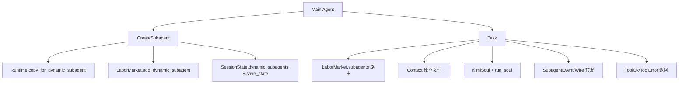
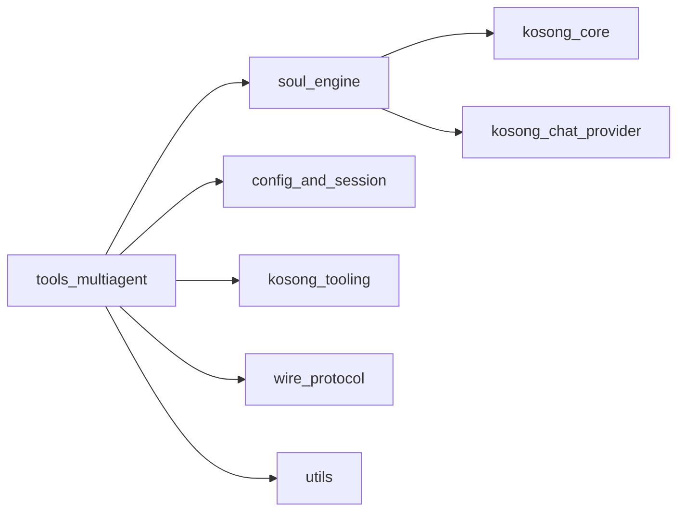
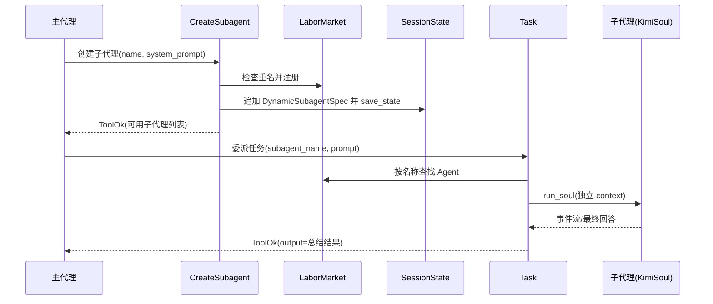

# tools_multiagent 模块文档

## 1. 模块概览：它解决什么问题、为什么存在

`tools_multiagent` 是 Kimi CLI 多代理编排能力在“工具层”的核心入口，当前由两个工具组成：`CreateSubagent` 与 `Task`。它的核心价值不是让模型“多开几个线程”，而是把“角色定义”和“任务委派”做成可调用、可观测、可持久化的标准工具协议：主代理可以先动态创建一个具备特定 system prompt 的子代理，再把某个子任务独立交给该子代理完成，并将结果回传主代理继续整合。

在复杂工程任务里，主代理往往面临两类冲突：一类是上下文污染（把所有探索过程都塞进主会话，噪声会越来越高）；另一类是角色冲突（同一个 system prompt 同时做架构设计、代码审查、测试计划，输出容易发散）。`tools_multiagent` 通过“子代理独立上下文 + 按名称路由 + 运行中动态注册”把这两个问题拆解开：主代理负责 orchestration，子代理负责局部执行，最终由主代理汇总。

该模块与 [soul_engine.md](soul_engine.md) 的运行时机制、[config_and_session.md](config_and_session.md) 的会话持久化、[kosong_tooling.md](kosong_tooling.md) 的工具协议深度协作。换句话说，`tools_multiagent` 是一个薄而关键的编排层：它本身不实现 LLM 推理循环，但决定了多代理如何在系统内“被创建、被调用、被观察、被恢复”。

---

## 文档导航（本模块拆分文档）

为避免主文档过长，`tools_multiagent` 的实现细节已拆分到以下子模块文档：

- [subagent_creation.md](subagent_creation.md)：覆盖 `CreateSubagent` / `Params`，重点说明动态子代理创建、重名校验、`LaborMarket` 注册、会话持久化（`DynamicSubagentSpec`）等。
- [subagent_task_dispatch.md](subagent_task_dispatch.md)：覆盖 `Task` / `Params`，重点说明子代理按名路由、独立 `Context`、`run_soul` 执行、`SubagentEvent` 事件桥接、短答续写与错误语义。

后续若你要修改代码，建议先阅读上述两篇子文档，再回到本文件查看系统级架构与跨模块关系。

---

## 2. 架构总览

### 2.1 模块内架构图



上图展示了 `tools_multiagent` 的两个职责面：`CreateSubagent` 负责“注册与持久化”，`Task` 负责“执行与回传”。二者都依赖 `Runtime`，但触达的状态层不同：前者写 `LaborMarket` 与 `SessionState`，后者读 `LaborMarket` 并创建独立 `Context` 执行子代理任务。

### 2.2 跨模块依赖图



从系统层面看，`tools_multiagent` 是“上接工具调用、下接 soul runtime”的中间层。它通过 `CallableTool2` 接受参数化调用，通过 `KimiSoul/run_soul` 启动子代理执行，通过 `Wire/SubagentEvent` 将执行过程暴露给 UI 或上层控制流。

### 2.3 端到端流程图（创建 + 执行）



这个流程强调 `tools_multiagent` 的设计哲学：**主代理做编排，子代理做执行，系统保证可回放和可观测**。

---

## 3. 子模块功能总览（含文档索引）

> 文档交叉引用说明：本文件只做总览与系统关系说明，子模块实现细节统一维护在 [multiagent_create.md](multiagent_create.md) 与 [multiagent_task_execution.md](multiagent_task_execution.md)。

### 3.1 `multiagent_create`：动态定义子代理

`multiagent_create` 对应 `CreateSubagent` 工具，负责在运行时创建新子代理并注册到共享 `LaborMarket`，同时把定义写入 session state，确保会话恢复后仍可重建。它还执行名称冲突检测，避免与已有固定/动态子代理重名。该模块是“多代理生命周期”的创建入口。

详细设计、参数语义、副作用与限制请见：
- [multiagent_create.md](multiagent_create.md)

### 3.2 `multiagent_task_execution`：调用子代理执行任务

`multiagent_task_execution` 对应 `Task` 工具，负责按 `subagent_name` 路由到目标代理，并在独立上下文文件中运行 `KimiSoul`。该过程会将子代理事件转发到根 wire：审批/问答/工具请求走根级直传，其他事件封装为 `SubagentEvent`。此外它包含“短答自动续写一次”的质量兜底机制，提升回传可用性。

详细执行链路、事件桥接策略、错误处理与扩展建议请见：
- [multiagent_task_execution.md](multiagent_task_execution.md)

---

## 4. 关键内部机制（跨子模块视角）

`tools_multiagent` 的核心不在复杂算法，而在几个“必须保持一致”的系统不变式。第一，子代理名称在统一命名空间中必须唯一，否则 `Task` 路由会出现歧义。第二，子代理任务应在独立 context 文件执行，避免主会话历史被中间推理污染。第三，交互型请求（审批、提问、工具调用）必须上送根 wire，不能被普通事件封装吞掉。第四，动态子代理定义应持久化，否则会话恢复后会出现“运行时可用、重启后消失”的一致性问题。

这些机制分别由 `CreateSubagent.__call__` 和 `Task._run_subagent` 协同保证。前者关注“注册 + 持久化”，后者关注“执行 + 事件桥接 + 结果抽取”。

---

## 5. 使用与操作指南

典型使用顺序是两步：先创建角色，再委派任务。

```json
{
  "tool": "CreateSubagent",
  "params": {
    "name": "security_reviewer",
    "system_prompt": "You are a security reviewer focusing on auth, secrets, and injection risks."
  }
}
```

```json
{
  "tool": "Task",
  "params": {
    "description": "audit oauth flow",
    "subagent_name": "security_reviewer",
    "prompt": "Review src/kimi_cli/auth for OAuth state validation and token lifecycle issues. Return findings with file references and mitigations."
  }
}
```

实践上，`prompt` 必须写成“上下文自足”的任务说明，因为子代理看不到主代理上下文。建议至少包含：检查范围、输出结构、约束条件、验收标准。

---

## 6. 配置、扩展与治理建议

`tools_multiagent` 自身配置项不多，但会受到上层 runtime 配置影响（如步数上限、审批策略、模型能力）。可扩展方向主要包括：增加子代理删除/更新工具、把短答阈值与 continuation 策略配置化、为子代理引入最小权限 toolset、为任务返回增加结构化元数据（耗时、步数、模型名等）。

在治理层面，建议建立命名规范（如 `domain_role`）、提示词模板规范和审计日志策略，避免动态子代理在长会话中无限膨胀且难以追踪来源。

---

## 7. 风险、边界与已知限制

当前实现存在几个需要开发者注意的边界：其一，`CreateSubagent` 仅支持新增，不支持删除和修改；其二，`Task` 依赖工具调用上下文中的 wire 和 tool_call_id，脱离标准执行路径会断言失败；其三，短答续写策略是固定一次、固定阈值，结果质量仍受模型行为影响；其四，动态子代理默认继承主工具集，不会自动降权，安全边界要在上层策略控制。

如果你在生产环境扩展该模块，优先保证“事件路由正确性”和“状态持久化一致性”，这是多代理稳定运行的基础。

---

## 8. 推荐阅读路径

1. [multiagent_create.md](multiagent_create.md)（先看创建生命周期）
2. [multiagent_task_execution.md](multiagent_task_execution.md)（再看执行与事件桥接）
3. [soul_engine.md](soul_engine.md)（理解 `KimiSoul` 与 runtime 主循环）
4. [config_and_session.md](config_and_session.md)（理解 session state 与恢复）
5. [kosong_tooling.md](kosong_tooling.md)（理解 `CallableTool2` 与 `ToolOk/ToolError`）

通过以上文档可以完整建立 `tools_multiagent` 从“定义角色”到“委派执行”再到“结果回流”的系统认知。
