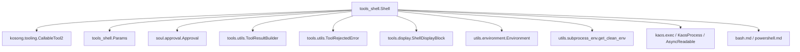
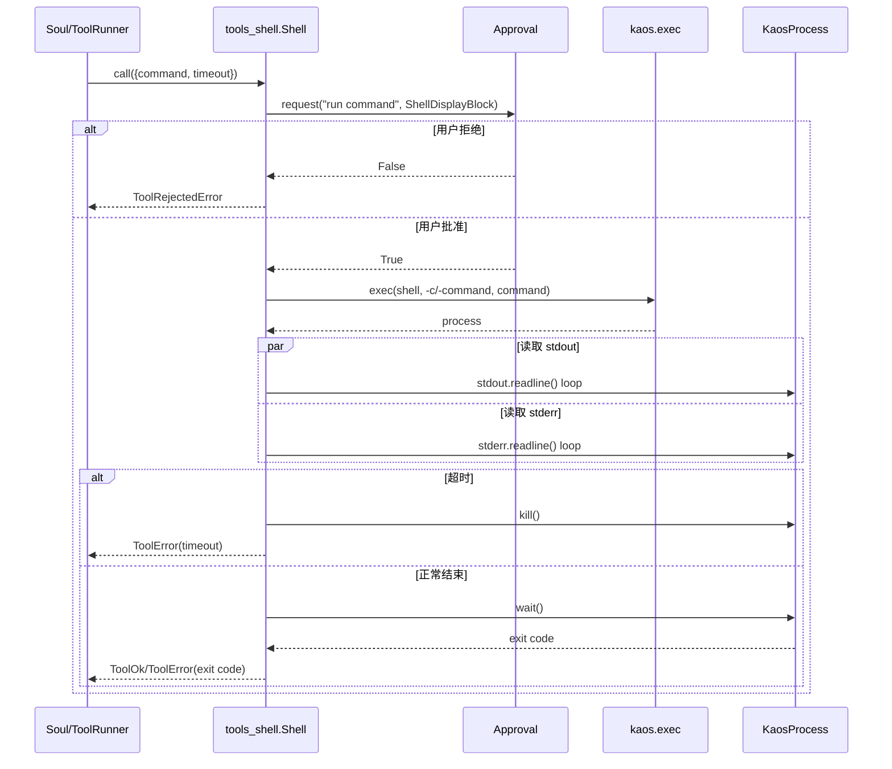
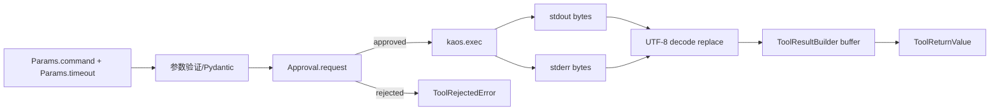

# tools_shell 模块文档

## 1. 模块简介

`tools_shell` 模块（代码位置：`src/kimi_cli/tools/shell/__init__.py`）为 kimi-cli 的工具体系提供“受控命令执行”能力。它的目标不是简单地把字符串传给系统 shell，而是在 agent 运行时里，把高自由度、高风险的命令执行操作包装成一个结构化、可审批、可超时终止、可回显审计的工具调用。

在一个由大模型驱动的自动化执行系统中，shell 能力通常是最强但也最危险的工具之一。`tools_shell` 的设计重点放在三个方面：第一，输入参数强约束（命令与超时范围）；第二，执行前的人机审批（Approval）；第三，输出收敛与失败语义标准化（`ToolResultBuilder` + `ToolReturnValue`）。这三点共同确保了模块既可用于复杂自动化任务，也不会轻易突破系统治理边界。

从整体架构上看，`tools_shell` 与 [tools_file.md](tools_file.md)、`tools_web`、`tools_misc` 等并列，作为 `soul_engine` 的可调用工具之一；其协议层依赖 [kosong_tooling.md](kosong_tooling.md) 的 `CallableTool2`/`ToolReturnValue`；其进程执行能力由 [kaos_core.md](kaos_core.md) 提供；审批行为与会话策略由 [soul_engine.md](soul_engine.md) 及 [config_and_session.md](config_and_session.md) 提供上游支撑。

---

## 2. 模块定位与设计动机

`tools_shell` 存在的核心原因，是给 agent 一个“通用后备执行面”。当文件工具、Web 工具、专用业务工具无法覆盖任务时，shell 可以快速补位，例如运行编译、执行测试、查看系统状态、调用本机命令链等。相比为每个需求都写一个专用工具，shell 的泛化能力更高。

但泛化意味着风险：命令可能修改关键文件、访问越权路径、执行长时间阻塞任务，或输出超大日志吞噬上下文。因此该模块并未追求“最原始的 subprocess 暴露”，而是采用“治理优先”的设计：每次调用都是一次全新 shell 进程、每次调用默认有超时、所有操作经过统一 approval 入口、输出经 builder 进行截断控制并形成一致错误语义。这使得 shell 能力在可控前提下被系统化复用。

---

## 3. 核心组件详解

`tools_shell` 当前只有两个核心组件，但职责分层非常清晰：`Params` 负责接口契约与参数边界，`Shell` 负责生命周期编排（描述、审批、执行、输出整形、异常转换）。

### 3.1 `Params`：调用参数模型

`Params` 是一个 Pydantic `BaseModel`，定义如下字段：

- `command: str`：要执行的 shell 命令。
- `timeout: int`：命令超时秒数，默认 `60`，下限 `1`，上限 `MAX_TIMEOUT`（`5 * 60`，即 300 秒）。

需要注意两层校验：

第一层是 Pydantic 的结构/范围校验，保证 `timeout` 在合法区间。第二层是 `Shell.__call__` 内部的语义校验：即使 `command` 字段是字符串，也会拒绝空命令（`""`），返回结构化错误 `"Command cannot be empty."`。这种“双重校验”避免了参数类型合法但业务无意义的调用进入执行阶段。

### 3.2 `Shell`：工具主类

`Shell` 继承 `CallableTool2[Params]`，是一个标准化可调用工具。它通过 `name = "Shell"` 暴露给工具系统，通过 `params = Params` 声明参数 schema，并在构造时动态加载平台相关描述文档。

#### `__init__(approval: Approval, environment: Environment)`

构造函数完成三件事：

1. 根据 `environment.shell_name` 判断当前是否为 Windows PowerShell。
2. 调用 `load_desc(...)` 从 `bash.md` 或 `powershell.md` 加载工具描述，并注入 `${SHELL}` 占位符（包括 shell 名称和路径）。
3. 保存审批器 `Approval`、shell 类型标记与 shell 路径。

这里的设计重点是“描述与运行环境对齐”。模型看到的 tool description 不是静态文本，而是根据当前系统自动切换，减少跨平台命令误用（例如在 Windows 上误生成 Linux-only 命令）。

#### `__call__(params: Params) -> ToolReturnValue`

这是工具主流程，顺序如下：

1. 创建 `ToolResultBuilder` 用于累积输出和组织返回值。
2. 空命令检查，失败立即返回 `builder.error(...)`。
3. 发起审批请求：`approval.request(sender="Shell", action="run command", ...)`，并附带 `ShellDisplayBlock` 供 UI 展示具体命令。
4. 若用户拒绝，直接返回 `ToolRejectedError()`。
5. 定义 `stdout_cb` 与 `stderr_cb`：将字节流按 UTF-8（`errors="replace"`）解码并写入 builder。
6. 调用 `_run_shell_command(...)` 真正执行命令。
7. 根据 exit code 组装成功或失败响应；若超时则返回 timeout 错误。

这里有一个非常关键的行为：stdout 与 stderr 都写入同一个 builder，因此返回给模型的 `output` 是合并流，不保留通道区分。对于大多数诊断场景这很方便，但如果你在扩展时需要“分别处理 stderr”，需要在回调和返回结构上新增字段而非沿用当前逻辑。

#### `_run_shell_command(command, stdout_cb, stderr_cb, timeout) -> int`

这是底层执行器，主要负责进程创建、并发读流、超时控制与清理：

- 通过 `kaos.exec(*self._shell_args(command), env=get_clean_env())` 启动子进程。
- 使用内部协程 `_read_stream` 按 `readline()` 读取 stdout/stderr，并将每行交给回调。
- 通过 `asyncio.gather(...)` 并发消费两个流，再用 `asyncio.wait_for(..., timeout)` 实现总超时。
- 正常情况下等待结束并返回 `process.wait()` 的 exit code。
- 超时时调用 `process.kill()` 终止子进程，然后抛出 `TimeoutError` 给上层转换为工具错误。

这里体现了模块对“悬挂进程”风险的显式治理：超时不是仅返回错误，而是尝试主动杀进程，防止资源泄漏与后台僵尸任务。

#### `_shell_args(command: str) -> tuple[str, ...]`

该方法负责平台参数差异封装：

- PowerShell：`(<shell_path>, "-command", command)`
- bash/sh：`(<shell_path>, "-c", command)`

通过集中封装，主流程不需要分支处理平台细节，也使未来扩展到其他 shell（如 `zsh`, `pwsh`）时修改点更集中。

---

## 4. 架构与依赖关系

### 4.1 静态依赖图



这张图说明 `tools_shell` 本身保持“小体积编排层”定位：它不直接实现进程协议、展示协议或审批存储，而是复用上游模块能力。这样做的收益是跨模块一致性强；代价是运行行为高度依赖外围组件（例如 approval 策略、kaos 实现、builder 上限设置）。

### 4.2 运行时交互流程



该流程中最重要的两条控制线是“审批线”和“超时线”。审批线决定是否允许执行；超时线决定执行是否被强制回收。二者共同构成了 shell 工具的安全与稳定性边界。

### 4.3 数据流（输入到返回）



从数据流角度看，`tools_shell` 会把“字节流”统一映射为“文本输出 + 结构化消息 + 可选 display block”。这使上层模型和 UI 都能用统一协议消费结果，而不直接面对底层异步流复杂性。

---

## 5. 关键行为与实现细节

### 5.1 Tool 描述模板按平台动态加载

`Shell` 会在初始化时加载 `bash.md` 或 `powershell.md`，并将 `${SHELL}` 渲染为当前 shell 名称和路径。这意味着同一个 `Shell` 工具在不同系统上的“自我说明”不同，从 prompt 级别降低平台错配概率。

### 5.2 每次调用是“全新 shell 会话”

工具描述明确指出：每次 shell 调用都在新环境执行，历史命令、`cd` 变更、临时变量不会自动保留。这是进程级隔离带来的自然结果。开发者不应依赖“上一条命令的会话状态”，而应该在单次 `command` 中用 `&&`、`;`、管道等组合完整逻辑。

### 5.3 输出截断不是异常，而是协议行为

`ToolResultBuilder` 会按字符上限和行长度上限截断输出，并在 message 中追加“Output is truncated ...”提示。换句话说，超长日志不一定触发错误，可能是成功返回但内容被裁剪。若你的扩展场景需要完整日志，应考虑外部落盘或分段采样策略。

### 5.4 超时异常的捕获语义

实现里使用 `except TimeoutError`。在 asyncio 语境中，`asyncio.wait_for` 超时会抛出 `TimeoutError`（兼容 `asyncio.TimeoutError`）。当前处理逻辑会先杀进程再向上抛，最终在 `__call__` 层转成工具错误返回。这是用户可理解语义与系统资源回收之间的折中实现。

---

## 6. 参数与返回协议

### 6.1 输入参数

```python
class Params(BaseModel):
    command: str
    timeout: int = 60  # 1 <= timeout <= 300
```

示例：

```json
{
  "command": "ls -la && python -V",
  "timeout": 30
}
```

### 6.2 返回值（`ToolReturnValue`）

`Shell` 的返回遵循 [kosong_tooling.md](kosong_tooling.md) 中定义的统一结构：

- `is_error`: 是否错误。
- `output`: 合并后的 stdout/stderr 文本。
- `message`: 给模型的摘要说明（成功、退出码、超时等）。
- `display`: 给用户界面的展示块（可能包含 brief 或 shell block）。

失败并不等于抛异常，通常会返回 `is_error=True` 的 `ToolReturnValue`。只有工具内部未处理异常才会穿透到更高层。

---

## 7. 使用方式与集成示例

### 7.1 基本实例化

```python
from kimi_cli.tools.shell import Shell
from kimi_cli.soul.approval import Approval
from kimi_cli.utils.environment import Environment

approval = Approval(yolo=False)
environment = await Environment.detect()
tool = Shell(approval=approval, environment=environment)
```

### 7.2 调用示例

```python
result = await tool.call({"command": "pwd && ls", "timeout": 20})

if result.is_error:
    print("error:", result.message)
else:
    print(result.output)
```

在真实系统中通常不是直接调用 `tool.call(...)`，而是由 soul/tool-runner 统一调度和注入 tool-call 上下文。尤其是 `Approval.request(...)` 要求在工具调用上下文中执行，否则会抛出 `RuntimeError("Approval must be requested from a tool call.")`。

### 7.3 高效调用建议

实际实践中，建议把相关操作合并为单次命令以减少工具往返开销，例如：

```bash
cd /repo && git status && pytest -q
```

但需要保持单次命令在 `timeout` 内可完成；否则应适当拆分并提高可观测性。

---

## 8. 配置与运行时影响因素

`tools_shell` 本身无独立配置文件，但行为受以下运行时条件强影响。

首先是 `Environment.detect()` 的探测结果，它决定是使用 bash/sh 还是 PowerShell，以及工具描述模板。其次是 approval 策略：`yolo=True` 或 action 自动批准会让 shell 跳过人工审批，这对自动化效率有利，但风险显著上升。再次是 subprocess 环境清理：`get_clean_env()` 在 Linux + PyInstaller 场景会修复动态库环境变量，避免子进程加载错误库。

另外，`kaos.exec` 的具体实现（本地或 SSH）也会影响命令执行环境、路径语义和可用命令集。跨机执行语义可参考 [kaos_core.md](kaos_core.md) 与 [ssh_kaos.md](ssh_kaos.md)。

---

## 9. 边界条件、错误条件与限制

### 9.1 常见错误路径

- 空命令：返回 `Command cannot be empty.`。
- 用户拒绝审批：返回 `ToolRejectedError`（`Rejected by user`）。
- 非零退出码：返回 `Failed with exit code: N`。
- 超时：进程被 kill，返回 `Killed by timeout (Xs)`。

### 9.2 行为限制与已知取舍

一个重要限制是 stdout/stderr 合并输出。它简化了模型消费，但会丢失通道来源信息。另一个限制是读取策略基于 `readline()`，对于“长期不换行的大块输出”可观测性会变差，直到缓冲区刷出或进程结束才可能看到结果。

此外，shell 调用之间不保留状态，不适合依赖交互会话上下文的命令。模块也不会主动做命令级安全过滤（例如阻止 `rm -rf`）；真正的治理依赖审批和上层策略，而非黑名单机制。

---

## 10. 扩展与维护建议

如果你要扩展 `tools_shell`，推荐优先保持现有“编排层”风格，即把复杂能力放在可替换子组件里，而不是把大量策略硬编码进 `Shell.__call__`。

例如，若要支持流式增量回传到 UI，可替换 `stdout_cb/stderr_cb` 写入路径，让 builder 之外再分发一条事件流；若要支持更细粒度超时（如启动超时、静默超时），可在 `_run_shell_command` 增加分层计时器；若要支持更多 shell 类型，可扩展 `Environment` 探测与 `_shell_args` 分支，并提供对应描述模板。

但无论如何扩展，都应保留三条底线：参数约束、审批钩子、超时回收。缺少其中任意一项，都会使该工具从“可治理执行器”退化为“裸 subprocess 包装器”。

---

## 11. 相关文档

- 协议与工具基类： [kosong_tooling.md](kosong_tooling.md)
- 底层执行抽象： [kaos_core.md](kaos_core.md)、[local_kaos.md](local_kaos.md)、[ssh_kaos.md](ssh_kaos.md)
- 运行时与审批： [soul_engine.md](soul_engine.md)、[config_and_session.md](config_and_session.md)
- 文件工具（常与 shell 搭配）： [tools_file.md](tools_file.md)
