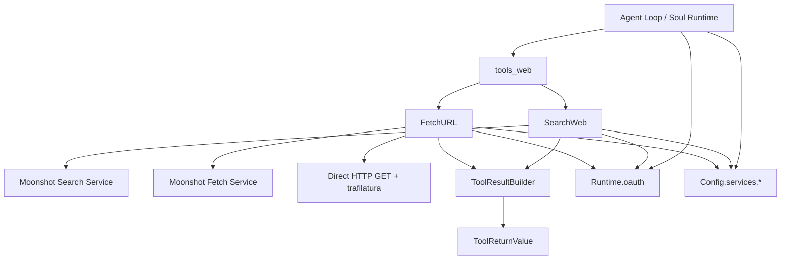
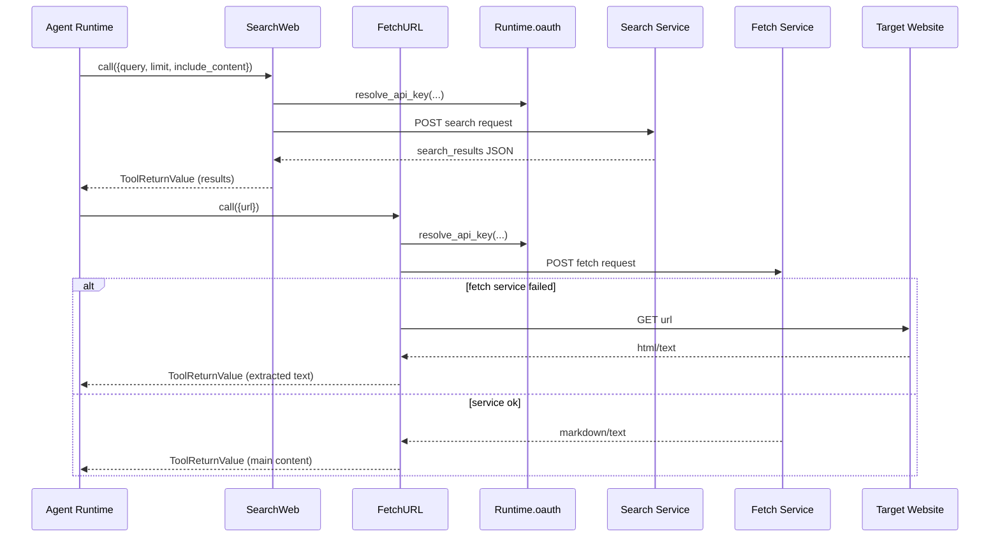
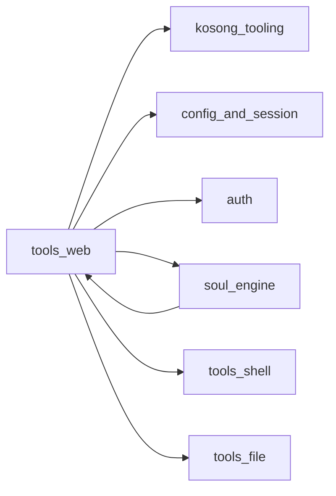

# tools_web 模块文档

`tools_web` 是 Kimi CLI 工具体系中的“联网信息入口”模块，核心提供两类能力：**网页搜索（SearchWeb）**与**网页抓取（FetchURL）**。它的存在目标不是构建浏览器或搜索引擎，而是把外部网络信息以统一、可控、可审计的方式接入代理运行时（agent runtime），并输出为模型可消费的文本结果。

从系统演进角度看，`tools_web` 解决了三个典型问题。第一，模型需要最新或外部事实时，不能仅依赖参数知识，需要可执行的检索与抓取能力。第二，网络工具经常伴随配置差异、鉴权差异与服务可用性波动，必须通过统一协议屏蔽复杂性。第三，工具失败不能直接中断主循环，而应返回结构化错误，便于代理进行重试、改写查询或切换策略。

因此，`tools_web` 采用了与 `kosong_tooling` 一致的 `CallableTool2 -> ToolReturnValue` 约定，结合 `Config` 与 `Runtime.oauth` 进行配置驱动和鉴权驱动的调用，在可用性、可维护性和行为一致性之间取得平衡。

---

## 1. 模块边界与职责

`tools_web` 只关注两件事：**找信息源**与**读取信息源文本**。其中 `SearchWeb` 用于“找”，返回标题、摘要、URL（可选正文）；`FetchURL` 用于“读”，从指定 URL 提取主体文本。这种职责拆分避免了“一个工具做完所有事”的耦合，也更符合代理的推理过程：先发散检索，再收敛抓取与验证。

该模块不负责以下能力：

- 不执行 JavaScript 渲染（不是浏览器自动化）；
- 不做长期索引构建（不是离线搜索系统）；
- 不做复杂结果排序算法（依赖外部搜索服务）；
- 不直接处理 UI 呈现（由上层 shell/web 负责）。

---

## 2. 架构总览

### 2.1 组件结构图

这个图体现了 `tools_web` 的核心设计：工具层只做协议编排，网络能力可以来自远程服务，也可以来自本地 HTTP 回退路径（主要在 `FetchURL`）。所有结果都收敛为统一 `ToolReturnValue`，使上层代理无需关心底层来源差异。

### 2.2 调用时序图

时序上，`SearchWeb` 与 `FetchURL` 可以独立使用，但在真实任务中通常串联。`FetchURL` 的“服务优先 + 本地回退”是该模块最关键的稳健性设计之一。

---

## 3. 子模块说明与文档导航

`tools_web` 代码层面可清晰拆分为两个子模块，建议先阅读本文件理解整体，再深入子模块实现。以下两个文档已生成并可直接跳转：**[web_search.md](web_search.md)** 与 **[web_fetch.md](web_fetch.md)**。

### 3.1 `web_search`：联网检索

`web_search` 负责将远程搜索服务封装为标准工具，重点在参数约束、鉴权头拼装、响应 schema 校验和结果文本格式化。它在加载阶段就会检查配置是否存在；未配置时通过 `SkipThisTool` 直接跳过注册，避免向模型暴露不可用能力。它还支持 `include_content` 控制是否抓取页面正文，以平衡信息完整性和 token 成本。

详见：**[web_search.md](web_search.md)**

### 3.2 `web_fetch`：网页正文抓取

`web_fetch` 负责从单个 URL 获取文本内容。若配置了抓取服务，则优先调用服务端接口并带上 OAuth/追踪头；服务失败时自动回退到本地 HTTP GET。对于 HTML 响应，使用 `trafilatura` 提取主文本；对于 `text/plain` 或 `text/markdown`，直接返回原文。该工具非常适合在搜索后对候选页面做“二次深读”。

详见：**[web_fetch.md](web_fetch.md)**

---

## 4. 与其他模块的协作关系

`tools_web` 不是孤立模块，它依赖并受益于系统中多个基础模块：

- 与 **[kosong_tooling.md](kosong_tooling.md)**：共享工具抽象（`CallableTool2`）和结果协议（`ToolReturnValue`）。
- 与 **[config_and_session.md](config_and_session.md)**：通过 `Config.services.moonshot_search/moonshot_fetch` 控制能力启停与服务地址。
- 与 **[auth.md](auth.md)**：通过 `Runtime.oauth` 解析 API key、注入公共请求头。
- 与 **[soul_engine.md](soul_engine.md)** / **[soul_runtime.md](soul_runtime.md)**：由代理主循环调度工具执行，并消费工具结果。
- 与 **[tools_shell.md](tools_shell.md)**、**[tools_file.md](tools_file.md)**：在复杂任务中组合使用（例如：先搜索资料，再抓取内容，再落盘分析）。

### 4.1 依赖关系图

这个依赖图反映出 `tools_web` 的定位是“高价值功能模块 + 轻量基础依赖”，不直接持有复杂状态，主要依靠配置与 runtime 注入运行上下文。

---

## 5. 关键设计 rationale

`tools_web` 的实现体现了几个明确的工程取舍：

第一，**配置优先而非硬编码**。搜索服务是否启用、抓取服务地址、鉴权来源都由配置决定，这使同一套代码可以运行在本地开发、内网代理、生产网关等不同环境。

第二，**错误结构化而非异常外抛**。大多数失败通过 `ToolResultBuilder.error(...)` 返回，给模型与上层循环更稳定的行为边界。相比直接抛异常，结构化错误更利于代理自恢复。

第三，**结果文本化而非原始对象透传**。工具将搜索/抓取结果格式化为可读文本，直接契合 LLM 消费场景，降低上层 prompt 拼装复杂度。

第四，**能力分层与回退策略**。`SearchWeb` 是强服务依赖；`FetchURL` 则提供服务失败后的本地兜底，体现不同能力的可替代性设计。

---

## 6. 使用建议（开发与运维）

在实际使用中，建议采用“先搜后读”的最小成本策略：先以较小 `limit` 且 `include_content=False` 搜索，确认候选 URL 后再调用 `FetchURL` 抓取正文。这样可以显著减少 token 消耗和无效抓取请求。

配置上建议为 search/fetch 服务分别设置清晰的超时、鉴权与 tracing 头策略，便于排障。由于工具会携带 `X-Msh-Tool-Call-Id`，服务端应记录该字段并接入日志链路，方便从用户问题追踪到具体外部请求。

扩展上建议保持 `Params` 与输出格式向后兼容；若要增加新字段（如时间过滤、站点白名单），优先以可选参数引入，避免破坏现有提示词与自动化流程。

---

## 7. 风险、边界与限制

`tools_web` 的主要风险并不在 Python 逻辑本身，而在外部依赖与网络现实：服务波动、接口 schema 演进、网页内容反爬策略、编码异常、响应体过大等。`web_search` 对响应结构校验严格，接口变更会立刻暴露；`web_fetch` 在本地抓取时不支持 JS 渲染，面对重前端页面可能提取失败。

此外，工具当前没有在模块内实现强 SSRF 防护策略；如果部署场景安全要求高，应在更高层（网络策略、代理网关、URL allowlist）进行约束。

---

## 8. 快速索引

- 主类（搜索）：`src.kimi_cli.tools.web.search.SearchWeb`
- 主类（抓取）：`src.kimi_cli.tools.web.fetch.FetchURL`
- 输入模型：`search.Params`、`fetch.Params`
- 结果模型：`search.SearchResult`
- 子模块文档：
  - [web_search.md](web_search.md)
  - [web_fetch.md](web_fetch.md)

如果你是首次接触本模块，建议阅读顺序：**本文件 -> web_search.md -> web_fetch.md**。
