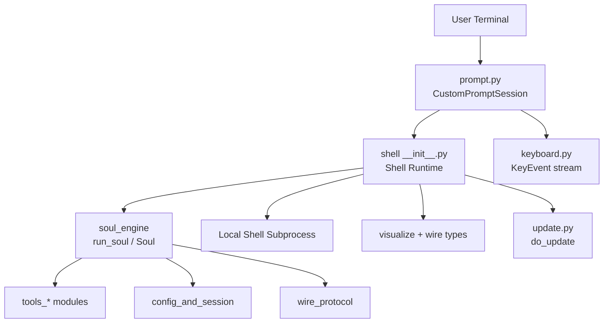
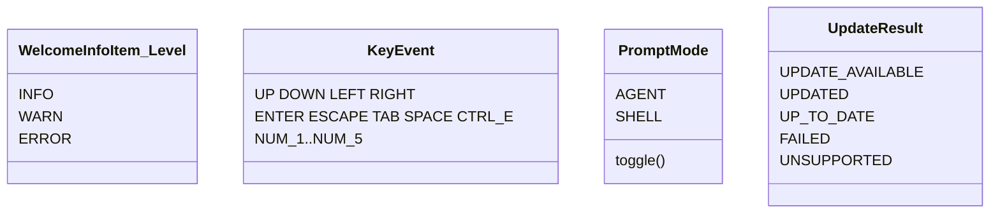
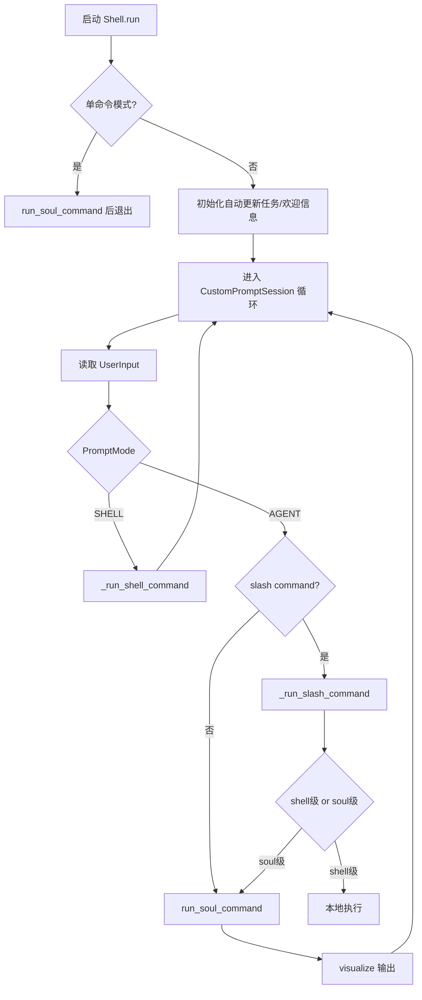

# ui_shell 模块文档

## 1. 模块简介

`ui_shell` 是 Kimi CLI 的终端交互外壳层，位于用户与智能体执行引擎之间，负责把“人在终端里的操作”转换成“系统可执行的会话动作”。如果说 [soul_engine.md](soul_engine.md) 负责推理与任务执行，那么 `ui_shell` 负责让这个能力在真实命令行中可用、可中断、可恢复、可理解。

该模块存在的核心原因是：AI CLI 的交互复杂度远高于传统单次命令程序。它需要同时处理输入编辑、快捷键、slash command、Shell/Agent 模式切换、多模态附件占位符、状态栏刷新、异常翻译、自动更新提醒，以及终端异常状态修复。`ui_shell` 通过统一会话编排把这些能力收敛到清晰边界内，避免业务逻辑（Soul、Tool、Wire）被 UI 细节污染。

---

## 2. 架构总览

从依赖关系看，`ui_shell` 并不承担模型推理或工具执行本身，而是把这些下游系统组织成稳定的人机回路：输入 -> 路由 -> 执行 -> 渲染 -> 下一轮输入。

### 2.1 子模块职责分层

- **会话运行时层**：`Shell`（见 [shell_session_runtime.md](shell_session_runtime.md)）
- **输入与富文本层**：`CustomPromptSession`、`PromptMode`（见 [interactive_prompt_and_attachments.md](interactive_prompt_and_attachments.md)）
- **底层按键监听层**：`KeyEvent`（见 [keyboard_input_listener.md](keyboard_input_listener.md)）
- **更新生命周期层**：`UpdateResult` + `do_update`（见 [auto_update_lifecycle.md](auto_update_lifecycle.md)）

这种拆分使每一层可独立演进：例如补全策略可改而不影响更新流程，更新策略可改而不影响输入解析。

---

## 3. 核心组件与当前模块树映射

当前 `ui_shell` 模块树给出的核心组件是：

- `Level`（实际为 `WelcomeInfoItem.Level`）
- `KeyEvent`
- `PromptMode`
- `UpdateResult`

它们分别代表“展示级别语义”“按键事件语义”“输入模式语义”“更新流程状态语义”。这四个枚举类共同形成了 UI shell 的状态词汇表：前端展示、用户动作、交互路由、后台维护都围绕这些语义协同。

---

## 4. 运行流程（端到端）

这个流程强调两件事：
1) `ui_shell` 是持续循环，不是一次性执行器；
2) 模式与命令类型是双重路由条件，决定输入去向。

---

## 5. 子模块导读（高层）

### 5.1 shell_session_runtime

`shell_session_runtime` 提供 `Shell` 主控制器，负责会话生命周期、slash command 分发、SIGINT 处理、错误到用户文案的映射、欢迎信息渲染，以及后台任务托管。它是所有 UI 行为的总编排器，也是最重要的扩展入口。

为了避免在主文档重复实现细节，本文件只描述其系统位置；`Shell.run` 主循环分支、`run_soul_command` 异常翻译矩阵、`WelcomeInfoItem.Level` 的展示语义、TTY 恢复与 SIGINT 的边界行为，请直接阅读 [shell_session_runtime.md](shell_session_runtime.md)。

### 5.2 interactive_prompt_and_attachments

该子模块实现输入层“重功能化”：模式切换、slash/@ 补全、输入历史、底栏状态、toast、剪贴板图片到附件占位符再到 `ContentPart` 的转换。它把原始文本输入升级成可被模型理解的结构化消息。

具体包括 `PromptMode` 切换逻辑、`CustomPromptSession` 快捷键设计、`AttachmentCache` 的缓存键与降级行为、`UserInput(command/content)` 双轨语义等，详见 [interactive_prompt_and_attachments.md](interactive_prompt_and_attachments.md)。

### 5.3 keyboard_input_listener

该子模块通过“线程监听 + asyncio 队列桥接”统一 Unix/Windows 键盘读取差异，把底层字节流规范化为 `KeyEvent`。它是高级交互（导航、快捷键、选择）的基础设施。

如果你需要排查键位不生效、终端 raw 模式恢复、暂停/恢复握手等问题，请查阅 [keyboard_input_listener.md](keyboard_input_listener.md)；主文档不重复平台分支和字节映射细节。

### 5.4 auto_update_lifecycle

该子模块负责版本检查、下载、解压、安装与状态返回，通过 `UpdateResult` 对外提供稳定流程语义。`Shell` 可以以后台检查或前台执行两种方式调用它。

平台检测、`semver_tuple` 比较、并发更新锁 `_UPDATE_LOCK`、下载与安装失败路径、以及安全限制（例如签名校验缺失）请阅读 [auto_update_lifecycle.md](auto_update_lifecycle.md)。

---

## 6. 与系统其他模块的关系

- 与 **Soul 执行**：`ui_shell` 调用 `run_soul` 并消费状态，Soul 内部机制见 [soul_runtime.md](soul_runtime.md)。
- 与 **Wire 协议**：输入被编码为 `ContentPart`，状态以 `StatusUpdate` 可视化，详见 [wire_domain_types.md](wire_domain_types.md) 与 [jsonrpc_transport_layer.md](jsonrpc_transport_layer.md)。
- 与 **工具体系**：Agent 模式下输入最终触发工具调用（文件、Web、Shell、多智能体等），详见 [tools_file.md](tools_file.md)、[tools_web.md](tools_web.md)、[tools_shell.md](tools_shell.md)、[tools_multiagent.md](tools_multiagent.md)、[tools_misc.md](tools_misc.md)。
- 与 **配置与会话状态**：模型能力、会话配置影响 prompt 与状态显示，详见 [config_and_session.md](config_and_session.md)。

---

## 7. 使用与扩展建议

### 7.1 典型使用

- 交互模式：`await Shell(...).run()`
- 单命令模式：`await Shell(...).run(command="...")`

单命令模式适合自动化触发；交互模式适合人工连续工作流。

### 7.2 扩展方向

- 增加 shell-level slash command：优先在 shell registry 注册，避免侵入 Soul。
- 增加附件类型：在 prompt 附件缓存与占位符解析链路中扩展 `kind`。
- 增强更新安全：可在 update 层补充签名校验与原子安装。

---

## 8. 关键注意事项（边界/限制）

1. **Shell 模式不是完整 shell 会话**：每条命令独立子进程执行，`cd` 等状态不会持久。
2. **未知异常策略**：已知异常会转用户提示，未知异常通常会继续抛出，调用方需有外层兜底。
3. **附件弱一致**：占位符依赖本地缓存，缓存丢失时会退化为文本。
4. **平台差异**：键盘监听与更新平台支持都受 OS/架构约束。
5. **自动更新提示持续性**：发现新版本后会周期性 toast，UI 定制时要考虑提示位冲突。

---

## 9. 维护建议

维护 `ui_shell` 时，优先保证三件事：
- Ctrl-C 可预测（中断不应导致终端坏状态）
- TTY 可恢复（退出后不留 raw 模式副作用）
- 错误可理解（用户能从提示中知道下一步动作）

在此基础上再做功能扩展，能显著降低交互系统回归风险。