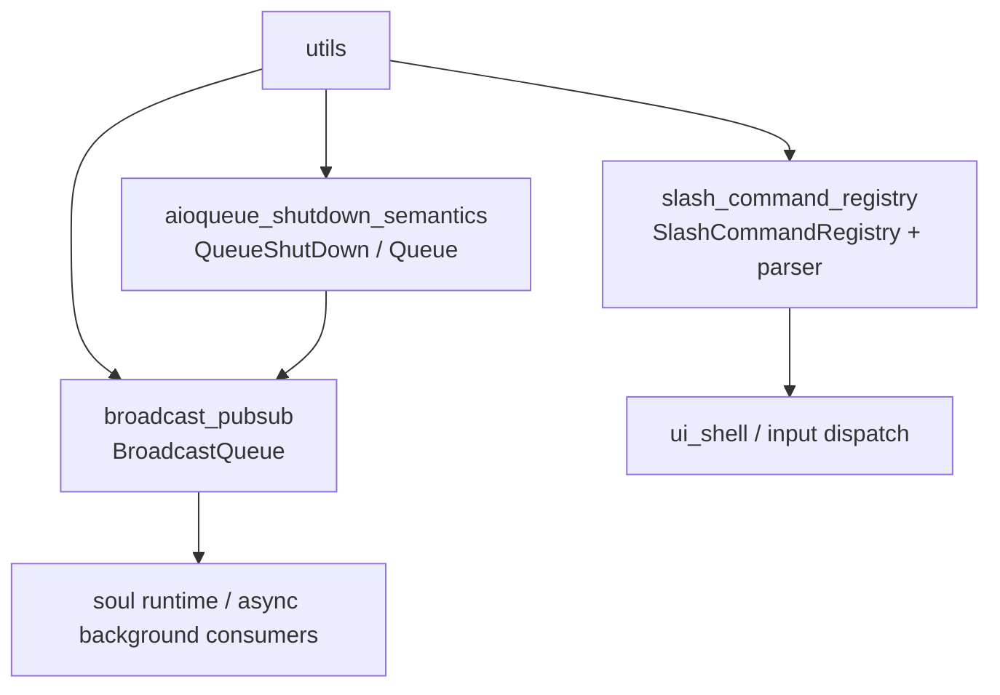
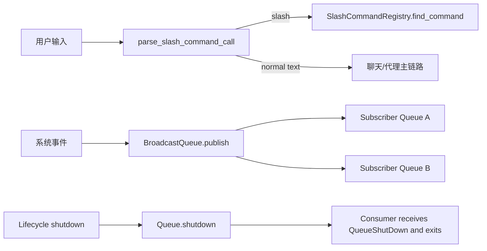
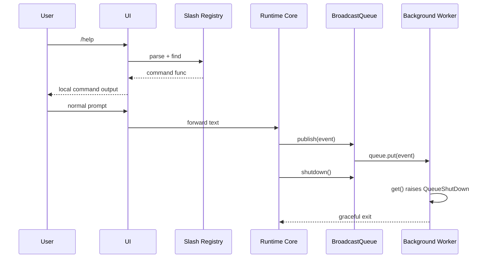

# utils 模块文档

## 1. 模块概述：`utils` 为什么存在

`utils` 模块是 `kimi_cli` 中一组“低耦合、高复用”的基础设施组件集合，当前聚焦三类能力：异步队列关闭语义、进程内广播发布订阅、Slash 命令注册与解析。它们看起来彼此独立，但在系统运行期（尤其是 CLI 交互循环与后台任务协作）中共同解决了一个核心问题：**如何在并发与交互并存的环境下，让控制流明确、可收敛、可扩展**。

这个模块存在的设计动机不是提供复杂业务能力，而是把常见的“容易写散、容易出错”的机制沉淀为统一原语。比如，普通 `asyncio.Queue` 在 Python 3.13 之前没有官方 shutdown 协议，消费者很容易卡死；多个协程需要监听同一事件时，work-queue 语义并不满足广播需求；命令行输入中 `/help` 这类本地控制指令如果混入业务流程，很容易导致解析重复和行为不一致。`utils` 的价值就是把这些问题抽成稳定工具，减少上层模块重复造轮子。

从模块树来看，`utils` 位于系统底层，服务对象包括但不限于交互层（参考 [ui_shell.md](ui_shell.md)）、会话与执行主流程（参考 [soul_engine.md](soul_engine.md)、[kosong_core.md](kosong_core.md)）以及其他工具模块。它不主导业务策略，但决定了很多关键路径的“行为确定性”。

---

## 2. 架构总览

`utils` 当前由三个子模块组成：

- `aioqueue_shutdown_semantics`：提供 shutdown-aware 异步队列语义（[aioqueue_shutdown_semantics.md](aioqueue_shutdown_semantics.md)）
- `broadcast_pubsub`：基于上述队列实现多订阅者广播（[broadcast_pubsub.md](broadcast_pubsub.md)）
- `slash_command_registry`：提供 Slash 命令注册、索引、解析（[slash_command_registry.md](slash_command_registry.md)）

上图体现了两个事实。第一，`broadcast_pubsub` 在实现上依赖 `aioqueue` 的关闭语义，因此二者是“能力叠加”关系而非平行孤岛。第二，`slash_command_registry` 更多作用在输入控制路径，与并发通信路径解耦，但最终都汇入同一运行时。

### 2.1 运行时数据与控制流视角

这个流程图强调：`utils` 同时覆盖“输入控制分流”（slash command）和“异步事件分发与收敛”（queue + broadcast）两条基础链路。前者解决可控入口，后者保证可控退出。

---

## 3. 子模块功能说明（高层）

### 3.1 `aioqueue_shutdown_semantics`

该子模块提供兼容 Python 版本差异的可关闭异步队列抽象。它通过 `QueueShutDown` 异常统一了关闭后的读写行为，并在 Python < 3.13 时用哨兵机制模拟官方语义。这使上层协程能够使用一致的退出协议，而无需将“结束标记”混入业务消息体。详细实现、状态机、`immediate` 行为差异与边界条件见 [aioqueue_shutdown_semantics.md](aioqueue_shutdown_semantics.md)。

### 3.2 `broadcast_pubsub`

该子模块提供轻量 fan-out 广播：每个订阅者获得独立 `Queue`，发布时同一消息投递到所有当前订阅队列。它专注进程内异步分发，不提供持久化、回放和 topic 路由。模块复用了 `aioqueue` 的 shutdown 语义，能够在生命周期结束时把终止信号传到所有消费者。API 行为、时序图、异常传播与扩展建议见 [broadcast_pubsub.md](broadcast_pubsub.md)。

### 3.3 `slash_command_registry`

该子模块把 Slash 命令能力拆成两个层面：注册器（命令元数据与别名索引）和解析器（从原始输入提取命令名与参数）。它的优势在于语义清晰、类型约束明确、与 UI/调度逻辑低耦合。调用方可先解析再查找，命中后自行决定同步或异步执行策略。详细正则语法、冲突行为和调度示例见 [slash_command_registry.md](slash_command_registry.md)。

---

## 4. 核心设计原则与工程取舍

`utils` 的实现风格高度一致：**优先确定性与可维护性，而非功能堆叠**。例如，`aioqueue` 明确把关闭状态编码为异常协议；`broadcast` 刻意不引入复杂消息中间件语义；`slashcmd` 仅做命令边界识别而不做参数 DSL。这样的取舍让上层模块更容易预测基础组件行为，也减少了跨模块隐式契约。

另一个贯穿式原则是“把控制流信号与业务数据解耦”。队列关闭通过 `QueueShutDown` 表达，命令分流通过结构化 `SlashCommandCall` 表达，而不是让调用方靠魔法值或字符串约定猜测状态。这一点直接提升了并发收尾和输入处理的鲁棒性。

---

## 5. 实际使用指南（跨子模块）

典型的 CLI 运行时会把这三类能力组合起来：

1. 用户输入先经过 `parse_slash_command_call`；
2. 若命中 slash command，通过 `SlashCommandRegistry` 查找并执行本地命令；
3. 普通消息进入主对话/代理流程；
4. 运行过程中系统事件可通过 `BroadcastQueue` 扩散给 UI、日志、状态管理等多个订阅方；
5. 程序退出或会话重置时，统一触发 `BroadcastQueue.shutdown()`，让订阅者通过 `QueueShutDown` 有序退出。

---

## 6. 配置、扩展与二次开发建议

严格来说，`utils` 本身配置项非常少。可调行为主要来自 API 参数（如 `shutdown(immediate=True/False)`）与调用策略（如 `publish` vs `publish_nowait`、命令冲突是否允许覆盖）。因此扩展重点不在“改配置文件”，而在“定义上层策略封装”。

如果你希望扩展该模块，建议采用包装层而非直接改底层语义：

- 在 slash command 上层增加冲突检测、权限控制、参数结构化解析；
- 在 broadcast 上层增加订阅指标、失败隔离、topic 路由；
- 在 queue 上层增加观测性（metrics/tracing），而保持 `QueueShutDown` 契约不变。

这样可以尽量避免破坏既有调用方，尤其是依赖这些原语实现生命周期收敛的模块。

---

## 7. 风险点与注意事项

`utils` 虽然轻量，但承载了系统“基础行为契约”，使用时要特别注意以下风险：

- 对 `QueueShutDown` 的误分类：它更多是生命周期控制信号，不应一律当成异常故障报警。
- `shutdown(immediate=True)` 的数据丢弃特性：适合快速停机，不适合强一致消费场景。
- `BroadcastQueue.publish_nowait` 的部分投递风险：出现异常时可能中断后续订阅者投递。
- `SlashCommandRegistry` 的覆盖语义：后注册可覆盖同名主命令或别名，默认无冲突告警。
- 解析器的有意简化：`parse_slash_command_call` 不负责引号/转义参数语法。

这些并非缺陷，而是模块有意识的复杂度边界。关键是调用方在系统设计层做出清晰选择。

---

## 8. 与其他模块文档的关联阅读

为避免重复，建议按以下顺序深入：

1. 先读 [aioqueue_shutdown_semantics.md](aioqueue_shutdown_semantics.md)：理解关闭语义与异常协议。
2. 再读 [broadcast_pubsub.md](broadcast_pubsub.md)：理解如何把队列语义应用到多订阅广播。
3. 然后读 [slash_command_registry.md](slash_command_registry.md)：理解输入命令控制路径。
4. 最后结合 [ui_shell.md](ui_shell.md)、[soul_engine.md](soul_engine.md) 看这些基础能力如何进入实际运行时。

通过上述链路，你可以从“基础并发原语”过渡到“完整交互系统行为”，形成对 `utils` 在整体架构中作用的完整认知。

## 9. 本轮生成的子模块文档索引

为了便于按实现文件精确追踪，本模块本轮生成的子模块文档如下：

- 异步队列关闭语义： [async_queue_shutdown.md](async_queue_shutdown.md)
- 广播发布订阅队列： [broadcast_pubsub_queue.md](broadcast_pubsub_queue.md)
- Slash 命令注册与解析： [slash_command_registry.md](slash_command_registry.md)

如果你正在维护旧链接（如 `aioqueue_shutdown_semantics.md`、`broadcast_pubsub.md`），建议后续统一迁移到以上文件名，避免文档入口分叉。
