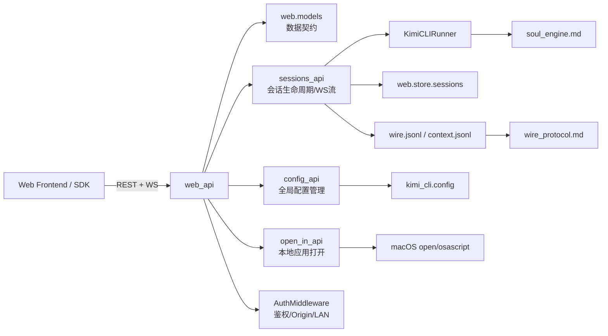
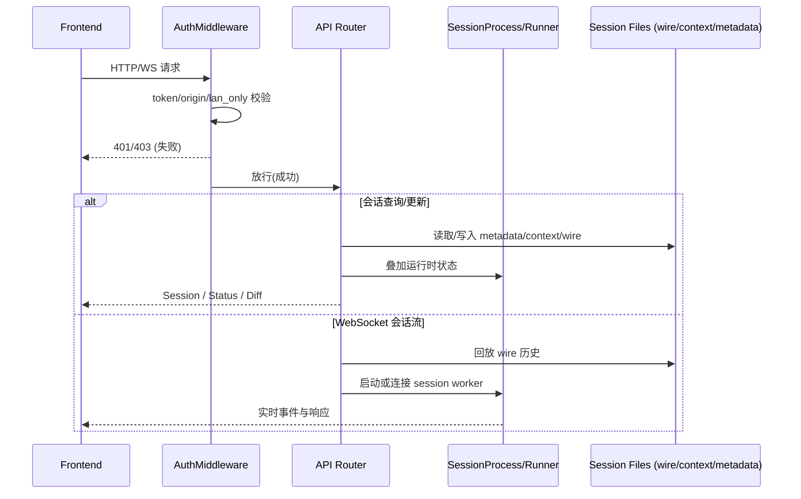

# web_api 模块文档

## 1. 模块概述：`web_api` 做什么、为什么存在

`web_api`（对应 `src/kimi_cli/web/*`）是 Kimi CLI 的 Web 服务接口层，负责把本地 CLI/会话运行时能力暴露为可被前端调用的 HTTP + WebSocket API。它的直接使用者是前端 SDK 与页面层（见 [web_frontend_api.md](web_frontend_api.md)），而它的下游依赖是会话运行器、配置系统、wire 日志、鉴权中间件和本地系统能力。

这个模块存在的核心原因是：CLI 的原生交互是终端会话，但在 Web UI 场景下，用户需要可视化地浏览历史、管理会话、查看文件、更新配置、实时收发消息。`web_api` 通过统一的数据模型、路由契约和安全控制，把“本地状态 + 运行时进程 + 文件系统”整合成稳定 API，避免前端直接触碰底层复杂实现。

从设计上，它强调三件事：第一，**契约稳定**（Pydantic 模型定义明确输入输出）；第二，**状态一致性**（通过 runner + store 聚合运行态与落盘态）；第三，**安全边界**（AuthMiddleware、路径限制、敏感 API 开关）。

---

## 2. 总体架构与组件关系

上图可以把 `web_api` 理解成一个“编排层”：它不是纯粹的 CRUD，也不是直接的 AI 推理层，而是连接前端调用与后端会话基础设施的中枢。`sessions_api` 管理最复杂的会话状态与消息流；`config_api` 管理全局配置并协调运行中会话重启；`open_in_api` 承担宿主机集成功能；`AuthMiddleware` 作为入口守卫确保所有 API 按策略访问。

---

## 3. 请求与数据流（端到端）

这条链路反映了 `web_api` 的关键特点：很多接口是“文件状态 + 运行时状态”的融合结果。仅看磁盘并不能知道会话是否 busy，仅看 runner 也无法返回历史与元数据，因此必须在 API 层统一协调。

---

## 4. 子模块导览（高层功能）

### 4.1 数据模型层：`data_models`

`data_models` 定义了前后端共享的数据契约，包括 `Session`、`SessionStatus`、`UpdateSessionRequest`、`GitDiffStats`、`GenerateTitleRequest/Response` 等。它的价值在于把“路由实现细节”与“传输对象形状”解耦，确保前端和后端围绕同一语义协作。详细字段和示例请看 [data_models.md](data_models.md)。

### 4.2 会话接口层：`sessions_api`

`sessions_api` 是 `web_api` 的核心业务子模块，覆盖会话创建、查询、更新、删除、fork、文件上传/读取、Git diff、标题生成，以及 WebSocket 实时流。它内部实现了 busy 保护、历史回放、路径安全检查、缓存失效和运行器协同，是最需要维护者深入理解的部分。详细流程与关键函数见 [sessions_api.md](sessions_api.md)。

### 4.3 配置接口层：`config_api`

`config_api` 提供全局配置快照读取、默认模型/思考模式更新、原始 `config.toml` 读写，并支持在配置变更后协调重启运行中的会话。该模块强调“校验后写入”和“敏感接口可禁用”，是运维与控制面的关键入口。详见 [config_api.md](config_api.md)。

### 4.4 宿主机集成层：`open_in_api`

`open_in_api` 提供 `POST /api/open-in`，用于在服务运行主机上打开 Finder、VS Code、Cursor、Terminal、iTerm 等应用。它属于体验增强能力，重点在平台限制（仅 macOS）、路径校验、命令失败处理与回退策略。详见 [open_in_api.md](open_in_api.md)。

### 4.5 安全入口层：`auth_and_security`

`auth_and_security` 通过 `AuthMiddleware` 提供统一的 Bearer Token 校验、Origin 检查和 LAN-only 限制，并对 API 路径实施集中式拦截。它决定了整个 `web_api` 的暴露边界与默认安全姿态。详见 [auth_and_security.md](auth_and_security.md)。

---

## 5. 与其他模块的关系（避免重复）

- 与前端调用契约关系：见 [web_frontend_api.md](web_frontend_api.md)
- 与会话消息协议关系：见 [wire_protocol.md](wire_protocol.md)、[jsonrpc_transport_layer.md](jsonrpc_transport_layer.md)、[wire_persistence_jsonl.md](wire_persistence_jsonl.md)
- 与配置加载/校验关系：见 [configuration_loading_and_validation.md](configuration_loading_and_validation.md)
- 与运行时会话引擎关系：见 [soul_engine.md](soul_engine.md)、[soul_runtime.md](soul_runtime.md)

`web_api` 本身不重复定义这些模块的底层语义，而是在接口层进行编排与约束。

另外，`web_api` 的核心子模块文档已拆分为以下独立文件，建议按需深入阅读：

- [data_models.md](data_models.md)
- [sessions_api.md](sessions_api.md)
- [config_api.md](config_api.md)
- [open_in_api.md](open_in_api.md)
- [auth_and_security.md](auth_and_security.md)

---

## 6. 扩展与维护建议

扩展 `web_api` 时，建议遵循以下顺序：先定义或扩展 `web.models` 契约，再实现路由逻辑，最后补齐鉴权/敏感能力限制与错误语义。对于会修改会话目录或运行态的接口，务必考虑 busy 状态保护与缓存失效；对于文件或路径相关接口，务必复用现有 traversal/symlink/sensitive-path 检查策略。

如果要新增复杂功能（例如新的会话批处理 API），建议拆到独立子模块文档，并在本文件增加引用，保持主文档“架构总览”角色而不变成实现细节堆叠。
