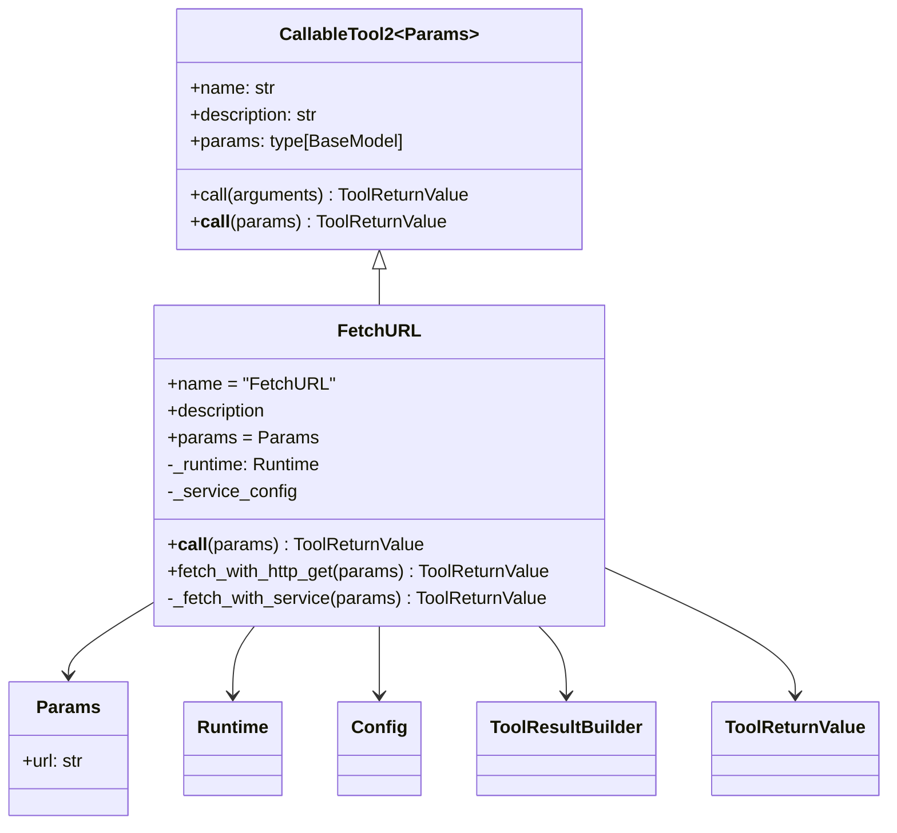
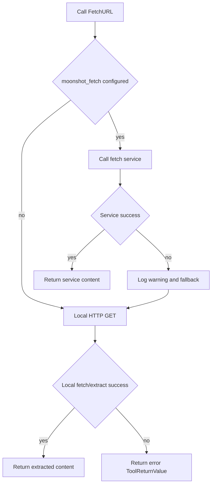
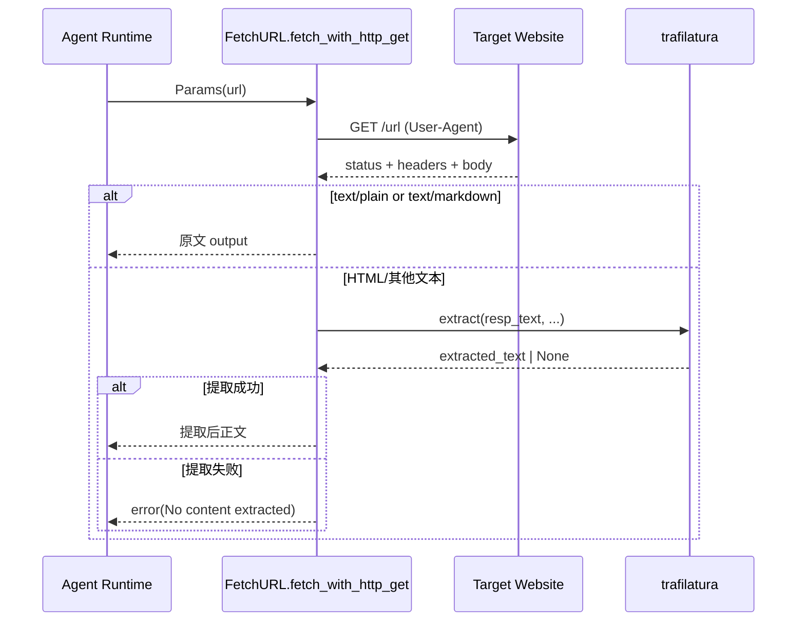
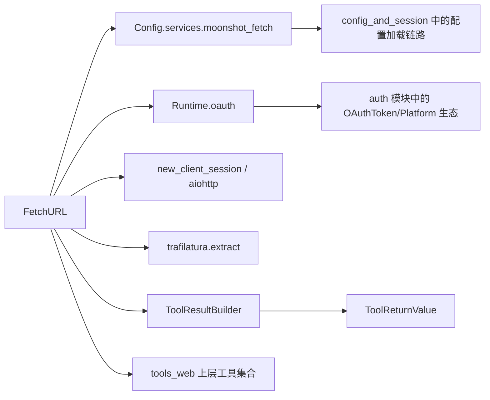

# web_fetch 模块文档

`web_fetch` 是 `tools_web` 下负责“抓取并抽取网页正文”的工具模块。它将外部 URL 转换为可供 LLM 消化的纯文本内容，并通过统一的 `ToolReturnValue` 协议返回给代理运行时。模块的核心价值在于：在“直接 HTTP 抓取”和“远程提取服务”之间提供分层回退策略，让代理在面对真实互联网页面时更稳健地获得可读内容。

与 `web_search`（负责“找链接”）不同，`web_fetch` 负责“读链接内容”。在典型链路中，代理先通过搜索得到候选 URL，再调用 `FetchURL` 获取页面主体文本，最后再做总结、比对或事实抽取。

---

## 1. 模块定位与设计动机

`web_fetch` 的设计目标不是实现一个浏览器，而是提供一个“低依赖、可异步执行、面向文本”的网页读取能力。它优先返回 markdown/plain text；若页面是 HTML，则尝试用 `trafilatura` 提取主内容；若配置了服务端抓取能力，则先调用服务端（通常更强，可能支持更稳定的提取策略），失败后自动回退到本地 HTTP GET。

这种“服务优先 + 本地回退”的设计兼顾了两类运行环境：

- 在具备企业/平台级抓取服务时，可以获得更一致的抽取质量与统一鉴权。
- 在服务不可达、未配置、临时故障时，仍可使用本地网络能力完成基础抓取，减少工具不可用窗口。

此外，模块完全对齐 `CallableTool2` 工具体系，保证参数校验、结果格式、错误信号与其他工具一致，便于代理调度器统一处理。

---

## 2. 核心组件总览

`web_fetch` 当前包含两个核心组件：

1. `Params`：工具输入参数模型（Pydantic）。
2. `FetchURL`：工具实现类，继承 `CallableTool2[Params]`。

### 2.1 组件关系图



上图体现了该模块在工具框架中的位置：`FetchURL` 作为一个标准 callable tool，输入是 `Params`，输出是 `ToolReturnValue`，并借助 `ToolResultBuilder` 统一构建成功/失败结果。

---

## 3. 核心类与函数详解

## 3.1 `Params`

`Params` 是一个非常精简的输入模型：

```python
class Params(BaseModel):
    url: str = Field(description="The URL to fetch content from.")
```

它的职责是把工具调用参数约束为结构化对象，并在 `CallableTool2.call()` 过程中由 Pydantic 自动校验。当前仅校验“存在字符串字段”，并不在模型层强制 URL 语法合法性（例如 scheme、host 是否有效）。这意味着非法 URL 可能在真正请求阶段才暴露为网络异常。

**参数说明**

- `url: str`：目标网页地址。

**返回行为**

- 该类本身不返回结果，只用于参数验证和 JSON Schema 导出（供模型侧工具调用）。

---

## 3.2 `FetchURL`

`FetchURL` 是模块主入口，继承 `CallableTool2[Params]`，具备标准工具元信息：

- `name = "FetchURL"`
- `description = load_desc(.../fetch.md, {})`
- `params = Params`

其中 `description` 从外部 markdown 模板加载（`load_desc`），意味着你可以在不改 Python 代码的情况下更新工具提示词/说明文本。

### 3.2.1 初始化：`__init__(config: Config, runtime: Runtime)`

初始化时保存两类运行态依赖：

- `self._runtime`：用于 OAuth 相关能力（API key 解析、公共请求头）。
- `self._service_config = config.services.moonshot_fetch`：抓取服务配置。若为空，工具将直接走本地 HTTP 抓取。

这体现了配置与运行时分离：配置决定可用路径，运行时提供鉴权上下文。

### 3.2.2 主调用：`__call__(self, params: Params)`

主调用逻辑很短，但体现关键策略：

1. 如果存在服务配置：先走 `_fetch_with_service`。
2. 若服务返回成功（`is_error == False`）：立即返回。
3. 若服务失败：记录 warning 日志后回退到 `fetch_with_http_get`。
4. 若未配置服务：直接本地抓取。

### 3.2.3 本地抓取：`fetch_with_http_get(params)`（静态方法）

该方法通过 `aiohttp` 发起 GET 请求，并根据响应类型决定处理方式：

1. 创建 `ToolResultBuilder(max_line_length=None)`，关闭“单行截断”，尽量保留提取文本完整性。
2. 使用 `new_client_session()` 创建异步会话，附带浏览器风格 `User-Agent` 发请求。
3. 若 HTTP 状态码 `>= 400`，直接返回错误结果（包含状态码）。
4. 读取 `response.text()`。
5. 若 `Content-Type` 为 `text/plain` 或 `text/markdown`：直接原文返回（不做抽取）。
6. 否则尝试 `trafilatura.extract(...)` 从 HTML 提取正文。
7. 若提取失败（空结果）：返回“无法提取有效内容”错误。
8. 提取成功：写入并返回成功结果。

**`trafilatura.extract` 关键参数**

- `include_comments=True`：包含评论区文本。
- `include_tables=True`：包含表格文本。
- `include_formatting=False`：去除原始格式。
- `output_format="txt"`：输出纯文本。
- `with_metadata=True`：附加元数据信息（视提取器行为而定）。

### 3.2.4 服务抓取：`_fetch_with_service(params)`

该方法面向“外部抓取服务”路径，常用于集中式提取能力。

执行流程：

1. 读取当前 tool call 上下文 `get_current_tool_call_or_none()`，并要求非空（`assert`）。
2. 通过 `runtime.oauth.resolve_api_key(...)` 解析服务 API key。
3. 若无 key：返回“服务未配置”错误。
4. 组装请求头：
   - `User-Agent: USER_AGENT`
   - `Authorization: Bearer <api_key>`
   - `Accept: text/markdown`
   - `X-Msh-Tool-Call-Id: <当前 tool_call.id>`
   - `runtime.oauth.common_headers()`
   - `custom_headers`（来自服务配置，可覆盖/扩展）
5. `POST self._service_config.base_url`，请求体 `{"url": params.url}`。
6. 若状态码不是 `200`：返回服务失败错误。
7. 否则读取文本并返回成功结果。
8. 网络异常（`aiohttp.ClientError`）统一返回网络错误。

该路径不在本模块内执行 HTML 解析，默认信任服务端已完成抽取并返回可用文本（通常 markdown）。

---

## 4. 端到端执行流程

### 4.1 主流程（含回退）



这个流程强调“可用性优先”：服务通道出错不会立即终止，而是继续尝试本地抓取。

### 4.2 本地抓取内部数据流



该数据流说明 `web_fetch` 的核心输出是“文本语义内容”，而非 DOM、截图或脚本执行结果。

---
### 4.3 模块依赖与协作边界图



这个依赖图强调了一个维护层面的事实：`web_fetch` 本身并不持有认证状态和配置解析逻辑，它只是消费 `Runtime` 与 `Config` 的结果。这种分层让抓取工具保持“能力单一”，并把复杂性分别留在配置管理与认证模块中。对于开发者来说，这意味着排障时应优先定位是哪一层出问题：如果是 API key 缺失，通常是配置或 OAuth 解析链路；如果是抓取文本质量不佳，则更可能是目标网页结构或 `trafilatura` 提取策略导致。

---


## 5. 配置与依赖

`web_fetch` 依赖以下能力：

- 网络客户端：`aiohttp`（通过 `new_client_session()` 创建）。
- 内容抽取：`trafilatura`（本地 HTML 主文提取）。
- 工具协议：`CallableTool2` + `ToolReturnValue`（详见 [kosong_tooling.md](kosong_tooling.md)）。
- 运行时鉴权：`Runtime.oauth`。
- 配置来源：`Config.services.moonshot_fetch`（详见 [config_and_session.md](config_and_session.md)）。

一个概念性配置示例如下（字段名以实际 `Services` 模型为准）：

```toml
[services.moonshot_fetch]
base_url = "https://your-fetch-service.example.com/fetch"
api_key = "${FETCH_API_KEY}"
oauth = "moonshot"
# 可选
[services.moonshot_fetch.custom_headers]
X-Env = "prod"
```

当该配置不存在或 API key 解析失败时，工具仍可走本地 HTTP 模式。

---

## 6. 返回值与错误语义

无论成功失败，`FetchURL` 都返回 `ToolReturnValue`，关键字段：

- `is_error`：是否失败。
- `output`：正文或部分输出。
- `message`：给模型的说明。
- `display`：给用户界面的摘要块（`brief`）。

常见错误分层：

- **HTTP 层失败**：如 404/500，返回 `HTTP <status> error`。
- **网络层失败**：`aiohttp.ClientError`，返回 network error。
- **内容层失败**：响应非空但抽取器无结果，返回 `No content extracted`。
- **服务配置失败**：服务路径无可用 API key，返回 `Fetch service not configured`。

注意：模块并未抛出业务异常给上层，而是尽量封装为结构化错误结果，这与工具框架整体风格一致。

---

## 7. 使用示例

### 7.1 作为工具实例调用

```python
from src.kimi_cli.tools.web.fetch import FetchURL, Params

tool = FetchURL(config=config, runtime=runtime)
ret = await tool(Params(url="https://example.com"))

if ret.is_error:
    print("fetch failed:", ret.message)
else:
    print(ret.output)
```

### 7.2 通过 `CallableTool2` 通用入口调用（JSON 参数）

```python
ret = await tool.call({"url": "https://example.com"})
```

这种方式会先触发 `Params` 的 Pydantic 校验，不符合结构会直接返回验证错误。

---

## 8. 可扩展点与二次开发建议

如果你需要扩展 `web_fetch`，建议优先沿以下方向进行：

1. **增强 URL 校验**：在 `Params` 上使用 `HttpUrl` 或自定义 validator，提前拦截明显非法输入。
2. **可配置提取策略**：把 `trafilatura.extract` 参数外置到配置，按场景切换是否包含 comments/tables。
3. **响应体大小保护**：当前代码未显式限制 body 大小，可在读取流时增加上限，避免超大页面导致内存压力。
4. **超时与重试策略**：`new_client_session()` 默认策略较通用，若业务需要可增加请求级 timeout 与有限重试。
5. **内容类型扩展**：可加入对 `application/json`、`application/xml` 的特化处理，而不仅依赖文本/HTML路径。

---

## 9. 边界条件、陷阱与限制

需要特别注意以下行为：

`FetchURL` 不执行 JavaScript，也不驱动浏览器，因此依赖前端渲染（SPA 首屏空 HTML）的页面可能提取不到正文。模块已在错误信息中明确提示“可能需要 JavaScript 渲染”。

`response.text()` 依赖服务端声明或自动推断编码。若目标站编码异常，可能出现乱码或抽取质量下降。

服务抓取分支中存在 `assert tool_call is not None`。正常工具调用上下文下这是成立的；但若你在离线测试中直接调用私有方法，可能触发断言错误。

本地抓取时使用硬编码浏览器 UA，而服务抓取使用全局 `USER_AGENT` 常量。两条路径 UA 不一致，可能导致站点返回不同内容，这在排障时需要考虑。

该模块默认信任 URL 输入，不做 SSRF 防护逻辑。若运行环境需要强安全隔离，应在更上层（网关、策略层或工具封装层）限制可访问目标。

---

## 10. 与其他模块的关系

`web_fetch` 只负责“取内容”，不负责“找内容”。建议和 `web_search` 组合使用：先搜索，再按需抓取候选结果。

工具协议、参数 JSON Schema、错误返回约定由 `kosong_tooling` 提供，详见 [kosong_tooling.md](kosong_tooling.md)。

服务配置与运行时 OAuth 依赖来自配置/会话体系，详见 [config_and_session.md](config_and_session.md) 与 [auth.md](auth.md)。

---

## 11. 维护者速查

- 入口类：`FetchURL`
- 输入模型：`Params(url: str)`
- 主策略：服务抓取优先，失败回退本地 HTTP
- 本地抽取器：`trafilatura.extract`
- 统一结果构造：`ToolResultBuilder -> ToolReturnValue`
- 关键风险：JS 渲染页面、超大响应、编码异常、无 SSRF 限制

