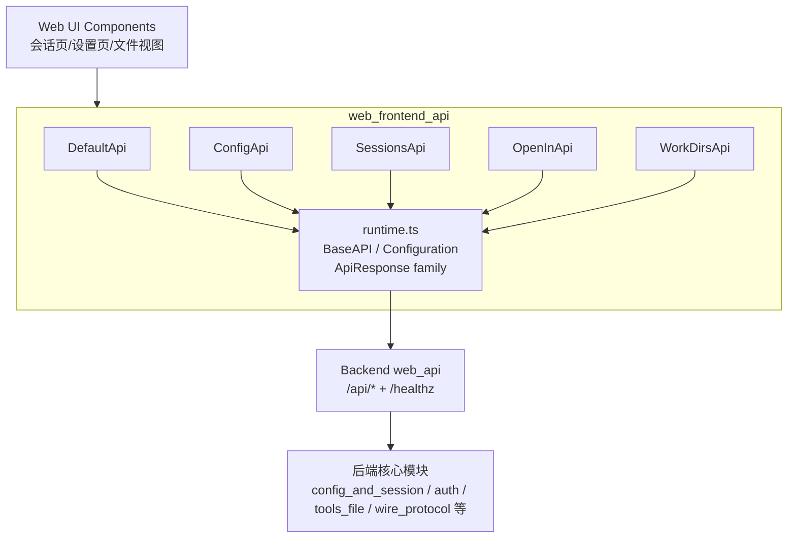
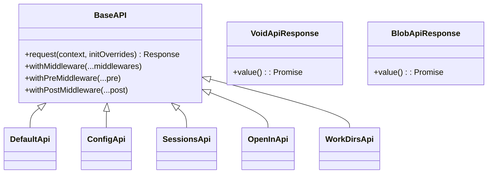
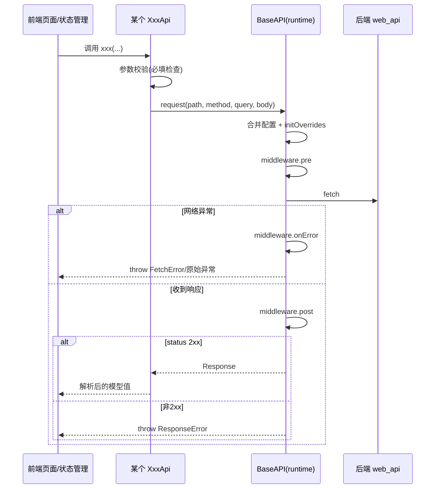

# web_frontend_api 模块文档

## 1. 模块概述

`web_frontend_api` 是 Kimi Web 前端访问后端 Web 服务的“类型化 API 客户端层”，对应代码位于 `web/src/lib/api/`。这个模块由 OpenAPI Generator 自动生成，核心目标不是实现业务逻辑，而是把后端 HTTP 契约固化为可复用、可组合、可静态检查的 TypeScript 类，降低手写 `fetch` 带来的路径拼接错误、参数遗漏、序列化不一致和错误处理漂移。

从系统分层看，前端 UI（会话列表、设置页、工作目录选择、Open In 操作等）并不直接访问后端接口，而是通过 `ConfigApi`、`SessionsApi`、`OpenInApi`、`WorkDirsApi`、`DefaultApi` 这组客户端统一调用。所有客户端又共享 `runtime.ts` 中的运行时能力（配置、请求生命周期、中间件、异常模型、响应解包器）。这种架构让“业务接口定义”与“传输执行机制”分离：业务层保持清晰，基础设施层可集中演进。

该模块存在的根本价值是**契约稳定性与工程可维护性**。当后端 `web_api`（见 [web_api.md](web_api.md)）更新字段或接口时，前端只需更新 OpenAPI schema 并重新生成客户端，就能在编译期发现不兼容点，而不是在运行时排查大量散落在 UI 代码里的手写请求。

---

## 2. 架构总览



上图展示了该模块的关键设计：每个 `*Api` 类都很“薄”，主要负责 endpoint 路径、参数检查与模型映射；真正的请求执行（URL 拼接、query 序列化、body 序列化、中间件拦截、异常抛出）由 `runtime.ts` 统一处理。这样可以避免不同 API 子类出现行为分叉，例如有的接口把非 2xx 当正常分支，有的接口直接抛错。

### 2.1 组件关系（类层面）



所有 API 客户端继承自 `BaseAPI`，因此天然共享相同错误语义与扩展机制。`VoidApiResponse` 与 `BlobApiResponse` 是运行时响应解包器族的一部分，用于支持“无内容响应”与“二进制响应”场景（详见 [frontend_runtime_layer.md](frontend_runtime_layer.md)）。

---

## 3. 子模块功能说明（高层）

> 下面只给高层职责和使用场景，详细方法级说明请跳转对应文档，避免重复。

### 3.1 `frontend_runtime_layer`（`runtime.ts`）

该子模块是整个 `web_frontend_api` 的执行内核，提供 `Configuration`（basePath、headers、credentials、fetch 实现、中间件等）、`BaseAPI`（请求生命周期）、统一错误类型（`ResponseError` / `FetchError` / `RequiredError`）以及响应包装器（`JSONApiResponse`、`TextApiResponse`、`VoidApiResponse`、`BlobApiResponse`）。任何 `*Api` 类的行为边界都受它约束。

详细文档：[
frontend_runtime_layer.md](frontend_runtime_layer.md)

### 3.2 `frontend_default_api_client`（`DefaultApi`）

该子模块提供基础健康检查接口 `GET /healthz`。虽然功能简单，但在启动探测、故障降级和联调诊断中非常关键，通常用于在发起高语义业务请求前先判断服务连通性。

详细文档：[frontend_default_api_client.md](frontend_default_api_client.md)

### 3.3 `frontend_config_api_client`（`ConfigApi`）

该子模块负责配置读取与更新，包括读取 `config.toml` 快照、读取全局配置、更新 TOML 文本、更新默认模型与思考开关等。它常与后端配置加载与会话重启逻辑联动，因此前端应同时处理“HTTP 成功但业务失败字段”的情况。

详细文档：[frontend_config_api_client.md](frontend_config_api_client.md)

### 3.4 `frontend_sessions_api_client`（`SessionsApi`）

该子模块是最大、最核心的客户端，覆盖会话生命周期（创建/查询/更新/删除）、会话文件读写相关接口、上传文件、生成标题、获取 Git diff 统计等。由于接口既有强类型 JSON 返回，也有按 content-type 动态返回 `any` 的场景，调用方需在部分路径中加入运行时类型守卫。

详细文档：[frontend_sessions_api_client.md](frontend_sessions_api_client.md)

### 3.5 `frontend_open_in_api_client`（`OpenInApi`）

该子模块提供 `POST /api/open-in`，用于请求后端在宿主机应用中打开指定路径（如 Finder、VSCode、Terminal 等）。要特别注意“执行发生在后端宿主机”这一边界，不等同于在用户浏览器所在机器执行。

详细文档：[frontend_open_in_api_client.md](frontend_open_in_api_client.md)

### 3.6 `frontend_work_dirs_api_client`（`WorkDirsApi`）

该子模块提供工作目录发现能力：读取 Web 启动目录与可用工作目录列表。它常用于会话创建前的目录候选展示，属于低副作用的环境信息读取接口。

详细文档：[frontend_work_dirs_api_client.md](frontend_work_dirs_api_client.md)

---

## 4. 端到端数据流与调用流程

### 4.1 典型请求流程



这个流程解释了为何调用方应普遍采用 `try/catch` 包裹 API 调用：在该生成客户端里，非 2xx 不是“正常返回分支”，而是异常分支。

### 4.2 与后端模块协作关系

- 前端契约入口：`web_frontend_api`（本文模块）
- 后端 HTTP 接口实现：`web_api`（见 [web_api.md](web_api.md)）
- 配置变更后可能联动：`config_and_session`（见 [config_and_session.md](config_and_session.md)）
- 会话消息与文件关联：`wire_protocol`、`tools_file`（见 [wire_domain_types.md](wire_domain_types.md)、[tools_file.md](tools_file.md)）

`web_frontend_api` 本身不直接操作这些后端内部模块，但接口语义与它们强相关，尤其是 `SessionsApi` 与 `ConfigApi`。

---

## 5. 实际使用与配置指南

### 5.1 基础初始化

```ts
import { Configuration } from '@/lib/api/runtime';
import { SessionsApi } from '@/lib/api/apis/SessionsApi';
import { ConfigApi } from '@/lib/api/apis/ConfigApi';

const config = new Configuration({
  basePath: 'http://127.0.0.1:8000',
  credentials: 'include',
  headers: { 'X-Client': 'kimi-web' },
});

export const sessionsApi = new SessionsApi(config);
export const configApi = new ConfigApi(config);
```

### 5.2 推荐的调用模式

1. 业务调用优先使用非 `Raw` 方法，减少模板代码。
2. 当需要状态码/响应头/原始 body 时使用 `Raw` 方法。
3. 在应用层统一处理 `ResponseError`、`FetchError`、`RequiredError`，避免每个页面重复写错误分支。
4. 对返回 `any` 的接口（例如部分文件读取接口）增加运行时校验，不要假设固定 schema。

### 5.3 中间件扩展示例

```ts
import { SessionsApi } from '@/lib/api/apis/SessionsApi';

const apiWithLog = sessionsApi.withPreMiddleware(async ({ url, init }) => {
  console.debug('[api:req]', init.method, url);
}).withPostMiddleware(async ({ url, response }) => {
  console.debug('[api:resp]', response.status, url);
});
```

该机制适合埋点、链路追踪、统一审计日志等需求；如果要做自动重试，请按接口幂等性区分（`GET` 与 `PATCH/POST` 不能简单同策略）。

---

## 6. 关键边界、错误条件与常见陷阱

1. **参数缺失错误是本地抛出**：许多方法在请求前就会检查必填字段并抛 `RequiredError`，这不是后端返回错误。
2. **非 2xx 一律异常**：由 `BaseAPI.request` 统一抛 `ResponseError`，不会返回“错误对象”。
3. **业务失败可能藏在 2xx 响应体中**：例如某些配置接口即使 HTTP 成功，也可能返回 `success: false`，调用方需检查业务字段。
4. **动态 content-type 返回带来 `any` 风险**：`SessionsApi` 部分文件接口会按响应头在 JSON/Text 之间切换，前端要做类型守卫。
5. **路径参数编码差异**：包含 `/` 的文件路径会被 `encodeURIComponent` 编码，需在反向代理/路由层联调验证。
6. **Open In 的执行位置**：动作发生在后端服务机器，而不是浏览器客户端机器。
7. **自动生成代码可再生**：本模块文件通常不建议手改；应通过 OpenAPI 规范或生成流程调整。

---

## 7. 扩展与维护建议

如果你要扩展 `web_frontend_api`，优先遵循“更新 OpenAPI -> 重新生成客户端 -> 在应用层适配”流程，而不是手动往生成文件里加逻辑。推荐把自定义能力放在外层 wrapper（例如 `apiService.ts`）中，实现统一错误翻译、重试策略、缓存策略和 UI 级 DTO 适配。

当新增接口时，建议同时检查以下事项：

- 是否需要 `BlobApiResponse`（下载/二进制）或 `VoidApiResponse`（空响应）。
- 是否需要更明确的响应 schema，避免前端拿到 `any`。
- 是否需要新增全局 middleware（鉴权、trace-id、审计）。
- 是否涉及后端敏感能力（配置写入、宿主机命令执行），并在 UI 中提供足够确认与错误提示。

---

## 8. 相关文档索引

- 总体后端接口： [web_api.md](web_api.md)
- API 客户端总览（聚合文档）： [api_clients.md](api_clients.md)
- 响应包装器细节： [runtime_response_wrappers.md](runtime_response_wrappers.md)

- 运行时层（强烈建议先读）： [frontend_runtime_layer.md](frontend_runtime_layer.md)
- 健康检查客户端： [frontend_default_api_client.md](frontend_default_api_client.md)
- 配置客户端： [frontend_config_api_client.md](frontend_config_api_client.md)
- 会话客户端： [frontend_sessions_api_client.md](frontend_sessions_api_client.md)
- Open In 客户端： [frontend_open_in_api_client.md](frontend_open_in_api_client.md)
- 工作目录客户端： [frontend_work_dirs_api_client.md](frontend_work_dirs_api_client.md)
