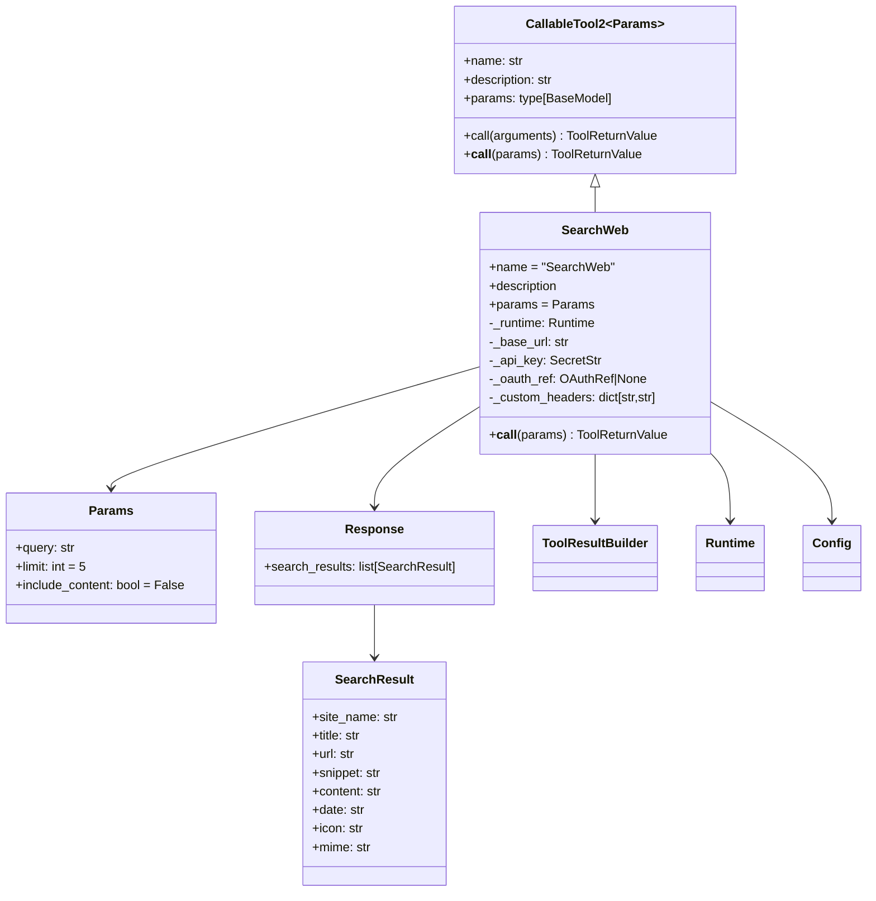
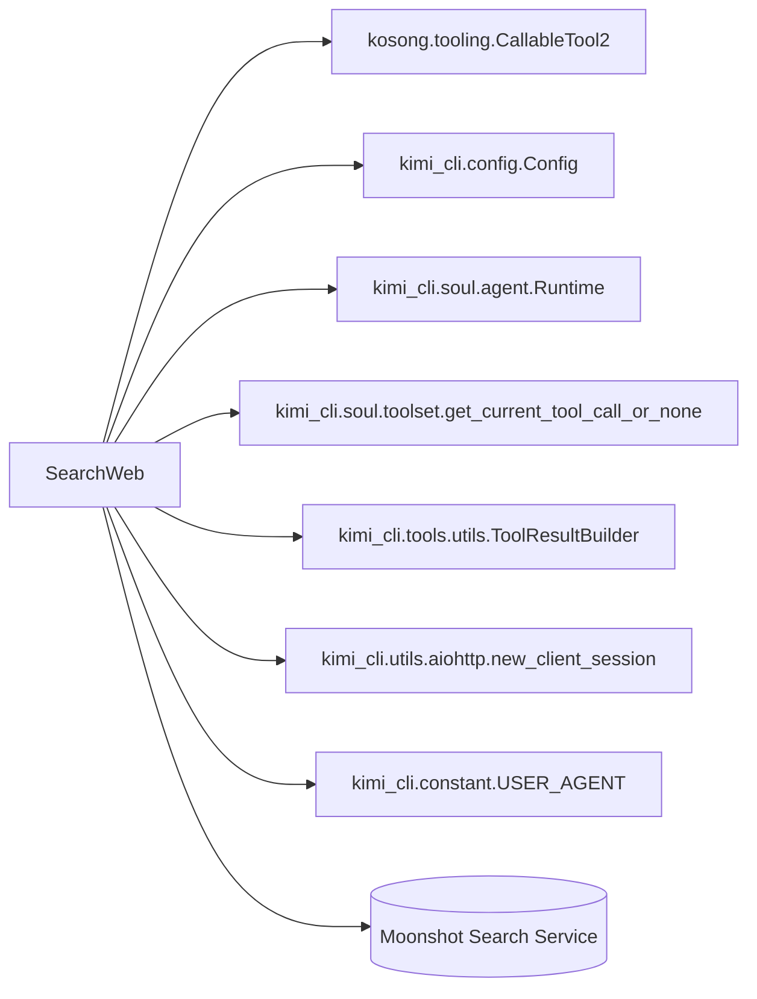
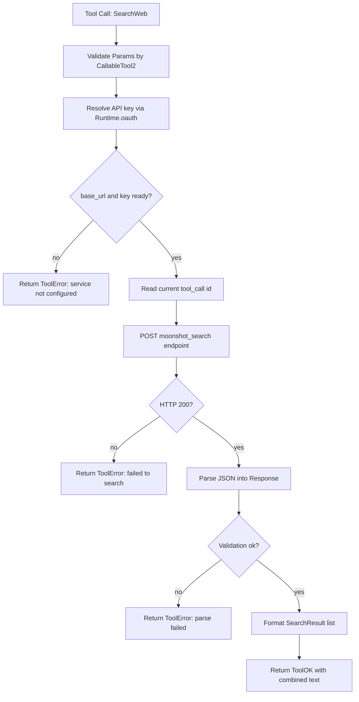
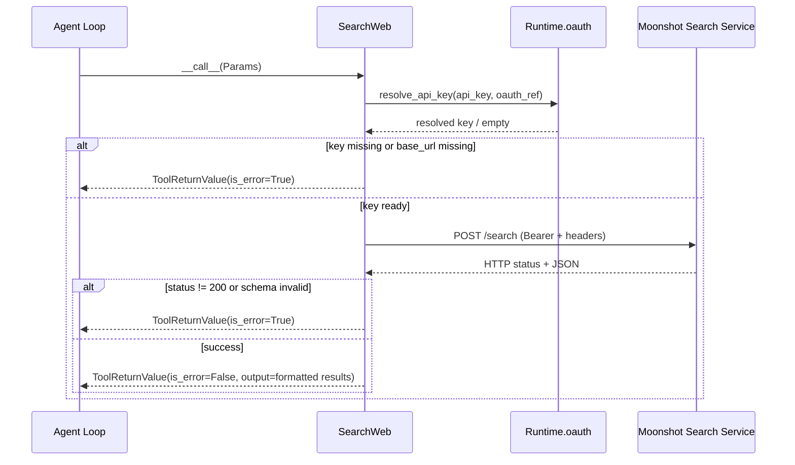

# web_search 模块文档

`web_search` 是 `tools_web` 下负责“联网检索”的工具模块。它为代理提供一个结构化的网页搜索入口，使模型可以在需要最新信息、公开资料或跨站点线索时，直接发起搜索并获取可读摘要（可选附带网页正文）。从系统设计角度看，这个模块解决的是“让模型以统一工具协议访问外部搜索服务”的问题，而不是在本地实现搜索引擎本身。

在整体工具链中，`web_search` 通常承担“发现候选信息源”的职责，而 `web_fetch` 承担“读取某个具体 URL 正文”的职责。也就是说，前者偏“找”，后者偏“读”。因此它常见于两段式工作流：先检索，再抓取，再总结。关于抓取细节请参考 [web_fetch.md](web_fetch.md)。

---

## 1. 模块定位与设计动机

`web_search` 的核心目标是将远程搜索服务封装为一个 `CallableTool2` 标准工具，保证参数校验、调用语义、错误返回格式与其他工具一致。模块本身并不处理复杂搜索排序算法，也不直接爬虫抓站；它把检索能力委托给 `Config.services.moonshot_search` 指定的服务端接口，再将返回数据解析为内部模型并转写为文本输出。

这种设计有三个直接收益。第一，搜索能力可通过配置切换环境（如不同网关、不同鉴权策略），无需改工具代码。第二，工具输出采用统一 `ToolReturnValue`，便于上层代理循环统一处理成功/失败结果。第三，借助 `Runtime.oauth`，同一个工具可以兼容静态 API key 与 OAuth 引用，适配不同部署方式。

---

## 2. 核心组件总览

当前模块由三个核心公开组件与一个内部响应模型组成：

- `Params`：工具输入参数模型。
- `SearchWeb`：工具实现主体，继承 `CallableTool2[Params]`。
- `SearchResult`：单条搜索结果结构。
- `Response`（内部）：搜索服务返回包裹结构，字段为 `search_results`。

### 2.1 组件关系图



上图反映了该模块的关键边界：`SearchWeb` 负责协议编排（参数→HTTP请求→解析→格式化输出），`SearchResult` 负责数据结构约束，实际检索由外部服务执行。



这个依赖图强调了 `web_search` 的“薄编排层”属性：它大量依赖上层基础设施（工具协议、运行时鉴权、HTTP 会话工厂），自身只负责把输入参数翻译为服务请求，再把服务响应翻译回工具输出。换句话说，`web_search` 的核心复杂度不在算法，而在边界契约的一致性。

---

## 3. 关键类详解

## 3.1 `Params`

`Params` 是 `SearchWeb` 的输入契约，由 Pydantic 提供校验。

```python
class Params(BaseModel):
    query: str
    limit: int = Field(default=5, ge=1, le=20)
    include_content: bool = False
```

`query` 是检索文本；`limit` 控制返回条数，默认 5，范围强约束在 1 到 20；`include_content` 控制是否让服务端抓取并返回页面正文。这里的约束有明确产品意图：正文抓取会显著增加 token 消耗，因此默认关闭，并通过 `limit` 上限防止过量返回。

参数模型并不保证“查询语义是否明确”，只保证“输入格式合法”。例如 `query="test"` 在结构上合法，但结果质量可能较低，这是调用侧而非模型层负责的问题。

## 3.2 `SearchWeb`

`SearchWeb` 是真正执行联网搜索的工具类，声明了标准元信息：

- `name = "SearchWeb"`
- `description = load_desc(Path(__file__).parent / "search.md", {})`
- `params = Params`

其中 `description` 从 `search.md` 动态加载（Jinja2 渲染），这让提示词和工具说明可以独立迭代，不需要改 Python 逻辑。

### 3.2.1 初始化行为：`__init__(config: Config, runtime: Runtime)`

初始化阶段会读取 `config.services.moonshot_search`。若该配置缺失，会抛出 `SkipThisTool`。这不是“调用失败”，而是“工具加载阶段主动跳过”，意味着该工具不会注册到可用工具集中。这个设计比运行时每次报错更干净：若环境未配置，就不向模型暴露这个能力。

初始化后缓存以下运行参数：

- `_base_url`：搜索服务地址。
- `_api_key`：静态 key（可能仍需 OAuth 解析）。
- `_oauth_ref`：OAuth 引用。
- `_custom_headers`：额外请求头（默认为空字典）。
- `_runtime`：提供 OAuth 管理能力与公共头。

### 3.2.2 调用行为：`__call__(self, params: Params)`

执行流程如下：

1. 创建 `ToolResultBuilder(max_line_length=None)`，关闭行级截断，避免结果摘要被每行裁切。
2. 通过 `runtime.oauth.resolve_api_key(self._api_key, self._oauth_ref)` 得到最终可用 key。
3. 若 `_base_url` 或 key 缺失，立即返回结构化错误（`Search service not configured`）。
4. 读取 `get_current_tool_call_or_none()` 并断言非空，用于传递 `X-Msh-Tool-Call-Id`。
5. 使用 `new_client_session()` 发起 `POST` 请求，请求体包含：
   - `text_query`
   - `limit`
   - `enable_page_crawling`
   - `timeout_seconds = 30`（固定值）
6. 若响应码不是 200，返回“搜索失败/服务不可用”错误。
7. 尝试将 JSON 解析为 `Response`；若 Pydantic 校验失败，返回“解析失败”错误。
8. 将结果列表格式化写入 builder，每条结果输出 Title/Date/URL/Summary，若有 `content` 再追加正文。
9. `builder.ok()` 返回标准成功结果。

这个实现强调“错误降级可解释性”：无论失败发生在配置层、HTTP 层还是解析层，最终都以工具协议可识别的 `ToolReturnValue` 返回，而不是把异常直接抛给模型循环。

## 3.3 `SearchResult`

`SearchResult` 表达服务端返回的一条检索命中，字段如下：

- 必填：`site_name`, `title`, `url`, `snippet`
- 选填（通过默认空串实现）：`content`, `date`, `icon`, `mime`

由于 `content` 默认空字符串，调用方可以通过 truthy 判断决定是否展示正文。模块内部正是采用 `if result.content:` 的策略，仅在有内容时输出。

---

## 4. 端到端流程

### 4.1 处理流程图



这个流程说明 `web_search` 的职责是“稳定封装远程搜索接口”，并通过统一输出让 LLM 后续可直接消费文本结果。

### 4.2 时序图（调用与鉴权）



时序图里一个关键点是 `X-Msh-Tool-Call-Id`：该值来自当前工具调用上下文，用于服务端追踪与链路关联。

---

## 5. 与系统其他模块的关系

`web_search` 并不是孤立模块，它位于工具体系与配置体系交汇处：

- 与 [kosong_tooling.md](kosong_tooling.md) 的关系：通过 `CallableTool2` 获得参数自动校验、JSON schema 暴露与统一返回约束。
- 与 [soul_runtime.md](soul_runtime.md) 的关系：通过 `Runtime` 获取 OAuth 管理器，实现 key 解析与公共请求头注入。
- 与 [config_and_session.md](config_and_session.md) 的关系：依赖 `Config.services.moonshot_search` 决定是否可加载及如何调用服务。
- 与 [web_fetch.md](web_fetch.md) 的关系：二者构成“搜→读”组合流程，前者给 URL 候选，后者抓正文。

---

## 6. 配置说明与示例

要启用该工具，核心是配置 `services.moonshot_search`。概念性示例如下（以实际配置模型为准）：

```toml
[services.moonshot_search]
base_url = "https://your-search-service.example.com/search"
api_key = "${SEARCH_API_KEY}"
oauth = "moonshot"

[services.moonshot_search.custom_headers]
X-Env = "prod"
X-Trace-Source = "kimi-cli"
```

当 `services.moonshot_search` 整段缺失时，`SearchWeb` 会在加载阶段抛 `SkipThisTool`，工具不会出现在可调用列表。

---

## 7. 使用模式与代码示例

在框架内，通常不是手写调用 `__call__`，而是由工具调度器通过 `call(arguments)` 触发。下面给出概念示例：

```python
tool = SearchWeb(config=config, runtime=runtime)
ret = await tool.call({
    "query": "Python 3.13 release notes",
    "limit": 5,
    "include_content": False,
})

if ret.is_error:
    print("Search failed:", ret.message)
else:
    print(ret.output)
```

对于“先搜再读”的典型链路：

```python
# 1) search
search_ret = await search_tool.call({"query": "RFC 9110 http semantics", "limit": 3})
# 2) 让模型从 search_ret.output 中挑选 URL
# 3) fetch
fetch_ret = await fetch_tool.call({"url": selected_url})
```

实践上，若你只是要找候选来源，优先 `include_content=False`；只有当摘要不足以决策时，再开启内容抓取。

---

## 8. 错误处理、边界条件与已知限制

`web_search` 的主要边界与风险点如下。

首先，`get_current_tool_call_or_none()` 之后使用了 `assert tool_call is not None`。这意味着该工具假设自己总在正式工具调用上下文中运行；如果在测试或脚本中绕过标准调度器直接调用，可能触发断言错误而非 `ToolReturnValue`。集成测试中应通过框架注入上下文，或显式模拟 tool call。

其次，模块只接受 HTTP 200 为成功，其他状态一律按“搜索失败”处理，没有细分 4xx/5xx 语义，也没有重试逻辑。若服务有短暂抖动，当前模块不会自动重试。

第三，解析阶段严格依赖 `Response(search_results=[...])` 的字段结构。一旦服务端字段名变化或类型不兼容，就会进入 `ValidationError` 分支并返回解析失败。这种严格校验提升了安全性，但也要求接口版本稳定。

第四，当前实现只捕获了响应解析阶段的 `ValidationError`，并没有显式捕获 `aiohttp.ClientError` 或超时异常。这意味着在网络层故障（DNS、连接重置、TLS、请求超时）时，异常可能向上冒泡到工具框架，而不是转成 `ToolReturnValue(is_error=True)`。如果你在生产环境追求更强健的失败语义，建议补充网络异常分支并返回结构化错误。

第五，`timeout_seconds` 固定写死为 30 秒，调用者无法通过 `Params` 调整。对慢搜索源或大规模 crawling 请求，这可能偏紧。

第六，`custom_headers` 的合并顺序在最后，理论上可覆盖默认头（如 `User-Agent`、`Authorization`）。这为高级场景提供灵活性，但也可能因误配置导致鉴权失败，是一个常见运维坑。

第七，`include_content=True` 与较大 `limit` 组合会放大 token 开销和响应体积，虽然模型有参数上限约束，但仍可能带来较高成本和上下文压力。

第八，当服务端成功返回但 `search_results` 为空列表时，工具会返回 `ok()` 且 `output` 为空字符串。这是一个“语义成功但无结果”的状态，上层代理需要把它当作“检索无命中”而不是“执行失败”。

---

## 9. 可扩展性建议

如果要扩展 `web_search`，建议优先遵循现有接口约定，而不是直接改输出格式。

一个常见扩展是引入“结果过滤参数”（如站点限制、时间区间、语言）。做法通常是在 `Params` 增加字段并向请求 JSON 透传，同时保持默认值向后兼容。

另一个扩展方向是增强结果格式，比如把 `site_name`、`mime`、`icon` 也输出到 `builder`。这能提升可解释性，但会增加 token 使用，建议通过可选参数控制。

如果希望提升稳健性，可以考虑在 HTTP 非 200 或网络错误时增加有限重试，并把重试次数写入 `extras` 供上层观测。

---

## 10. 总结

`web_search` 是一个“轻实现、强集成”的联网搜索工具：它把远程搜索服务接入到统一工具协议中，通过严格参数与响应校验提供可靠边界，并以结构化错误返回保障代理循环稳定。对开发者而言，理解该模块的关键不在搜索算法，而在三点：配置驱动的可用性、OAuth 驱动的鉴权、以及 `ToolReturnValue` 驱动的错误语义。一旦掌握这三点，就可以较安全地使用、排障和扩展该模块。
