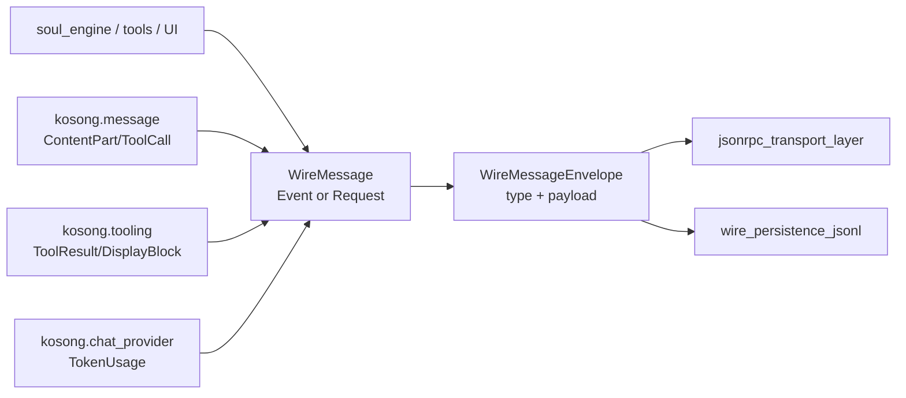
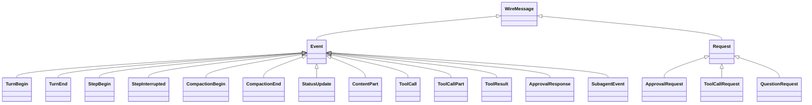
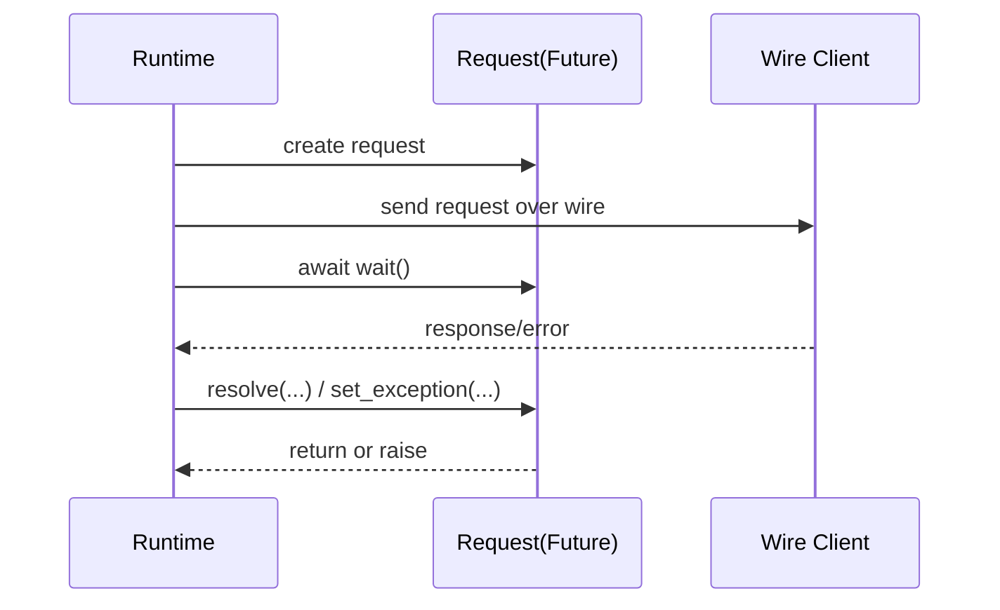
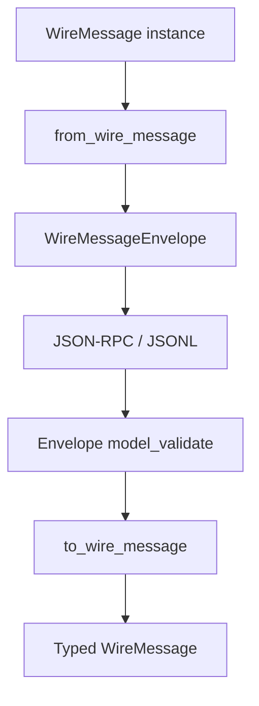
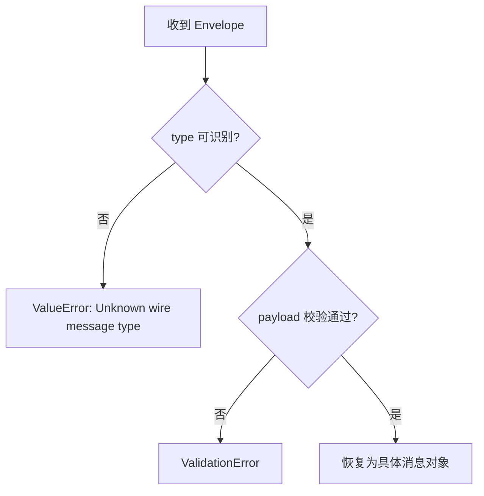
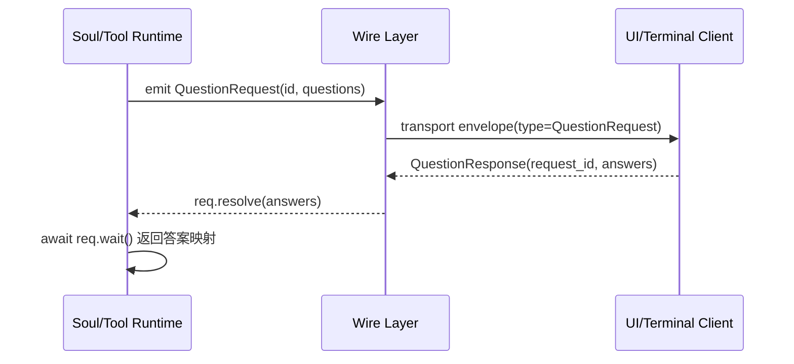

# wire_domain_types 模块文档

## 模块简介与存在价值

`wire_domain_types`（代码位于 `src/kimi_cli/wire/types.py`）是 `wire_protocol` 的“语义类型层”。它不关心 JSON-RPC 的 transport 字段（如 `id`、`method`、`result`）如何组织，而是专注回答一个更核心的问题：**Agent 运行时到底在交换什么业务语义消息**。

在 Kimi CLI 的运行链路中，`Soul`、工具系统、UI、回放系统会反复交换“回合开始”“步骤开始”“工具调用”“审批请求”“问答请求”等事件和请求。如果这些消息只是松散 dict，维护成本会非常高：字段不稳定、校验分散、版本兼容困难。本模块通过一组 Pydantic 模型把语义固定下来，并通过 `WireMessageEnvelope` 提供统一可持久化/可传输包装，从而在运行时、网络层与文件回放层之间建立稳定契约。

换句话说，`wire_domain_types` 是 Wire 协议中的“领域模型中枢”：上游业务逻辑可以直接操作强类型对象，下游传输与存储可以统一处理 envelope，不需要理解每一种业务消息的内部细节。

建议搭配阅读：

- [jsonrpc_transport_layer.md](jsonrpc_transport_layer.md)
- [wire_persistence_jsonl.md](wire_persistence_jsonl.md)
- [wire_protocol.md](wire_protocol.md)
- [ask_user_interaction.md](ask_user_interaction.md)

---

## 架构位置与依赖关系



这张图反映了本模块的分层边界：`WireMessage` 是“运行语义对象”，`WireMessageEnvelope` 是“边界包装对象”。前者用于业务处理，后者用于跨边界输送。通过这种解耦，传输层（JSON-RPC）和存储层（JSONL）可以复用同一套语义对象，而不互相耦合实现细节。

---

## 类型体系总览

模块定义三层联合类型：

1. `Event`：单向事件（通常不直接等待返回）。
2. `Request`：需要后续 resolve 的请求（内置 `Future` 等待机制）。
3. `WireMessage = Event | Request`：Wire 可交换消息全集。



这种设计让路由逻辑非常直接：接收到消息后先判断是 Event 还是 Request，再进入对应处理路径即可。

---

## 关键组件详解

## 1) `WireMessageEnvelope`

`WireMessageEnvelope` 是跨边界稳定容器，字段包括：

- `type: str`：消息类型名（类名）
- `payload: dict[str, JsonType]`：消息 JSON 载荷

它提供两个核心方法：

- `from_wire_message(msg: WireMessage) -> WireMessageEnvelope`
- `to_wire_message() -> WireMessage`

`from_wire_message` 内部通过 `_NAME_TO_WIRE_MESSAGE_TYPE` 反查类型名，并调用 `msg.model_dump(mode="json")` 生成可序列化 payload。`to_wire_message` 则根据 `type` 找到目标类并执行 `model_validate`。

### 错误行为

- `to_wire_message()` 在 `type` 未注册时抛 `ValueError`。
- `payload` 与目标类结构不匹配时会抛校验异常（Pydantic `ValidationError`）。

### 向后兼容

模块显式保留了 `ApprovalRequestResolved -> ApprovalResponse` 的兼容映射，保证旧版本 Wire 记录可恢复。

---

## 2) 控制流事件：回合与步骤边界

### `TurnBegin`

表示一个 agent turn 开始，必须先于该 turn 中其他事件发送。

- 字段：`user_input: str | list[ContentPart]`

它允许输入既可以是纯文本，也可以是多模态 `ContentPart` 列表，适配不同上游输入模式。

### `TurnEnd`

表示 turn 结束。若 turn 被中断，可能省略该事件。

### `StepBegin`

表示 step 开始。

- 字段：`n: int`（step 序号）

### `StepInterrupted`

表示 step 被用户或错误中断。

### `CompactionBegin` / `CompactionEnd`

表示上下文压缩过程的起止。根据注释约束，两者必须成对紧邻出现，并且发生在一个 step 生命周期内部。

这些模型本身字段很少，但语义很重：它们是 UI 时间线、回放器和状态机对齐的关键锚点。

---

## 3) 运行状态事件：`StatusUpdate`

`StatusUpdate` 用于增量发布运行状态，字段都允许为 `None`，表示“该字段无变更”。

- `context_usage: float | None`：上下文占用百分比
- `token_usage: TokenUsage | None`：当前 step 的 token 统计
- `message_id: str | None`：当前 step 消息 ID

因为它是增量语义，消费方不能把 `None` 当作“清空”；应该解释为“沿用上次值”。

---

## 4) 子代理事件封装：`SubagentEvent`

`SubagentEvent` 用于把子代理输出嵌入主代理事件流。

- `task_tool_call_id: str`：关联的 task 工具调用 ID
- `event: Event`：子代理产生的事件

该类最重要的实现是序列化/反序列化钩子：

- `field_serializer("event")`：序列化为 JSON 时，将 `event` 先包装成 `WireMessageEnvelope`。
- `field_validator("event", mode="before")`：反序列化时允许两类输入：
  - 已经是 `Event` 对象；
  - envelope 风格 dict（含 `type`/`payload`），再解包回 `Event`。

这避免了嵌套 Union 在 JSON 层面的歧义问题。

---

## 5) 审批流类型：`ApprovalRequest` / `ApprovalResponse`

### `ApprovalResponse`

审批结果事件。

- `request_id: str`
- `response: Literal["approve", "approve_for_session", "reject"]`

### `ApprovalRequest`

发给客户端的审批请求。

- `id: str`
- `tool_call_id: str`
- `sender: str`
- `action: str`
- `description: str`
- `display: list[DisplayBlock]`（默认空列表，为历史兼容）

`ApprovalRequest` 内部维护 `_future: asyncio.Future[ApprovalResponse.Kind] | None`，提供：

- `wait()`：异步等待审批结果
- `resolve(response)`：完成 future
- `resolved`：是否已完成

### 设计注意

注释强调这里复制了 soul 层的请求字段，而不是直接依赖 soul 类型，目的是避免 Wire 反向依赖 Soul，维持分层隔离。

---

## 6) 结构化提问类型：`QuestionOption` / `QuestionItem` / `QuestionRequest` / `QuestionResponse`

### `QuestionOption`

单个选项：

- `label: str`
- `description: str = ""`

### `QuestionItem`

单个问题：

- `question: str`
- `header: str = ""`
- `options: list[QuestionOption]`
- `multi_select: bool = False`

### `QuestionRequest`

问题请求（需要响应）：

- `id: str`
- `tool_call_id: str`
- `questions: list[QuestionItem]`

异步接口：

- `wait() -> dict[str, str]`
- `resolve(answers: dict[str, str])`
- `set_exception(exc: BaseException)`
- `resolved`

### `QuestionResponse`

问题响应事件：

- `request_id: str`
- `answers: dict[str, str]`

注释约定多选答案以逗号拼接存入字符串，这有利于跨端兼容，但消费端需要二次解析。

### `QuestionNotSupported`

当客户端不支持交互提问时抛出的异常类型，通常作为 `QuestionRequest.set_exception(...)` 的输入。

---

## 7) 工具代理请求：`ToolCallRequest`

`ToolCallRequest` 表示把工具执行委托给 Wire 客户端。

- `id: str`
- `name: str`
- `arguments: str | None`（JSON 字符串）

异步接口：

- `wait() -> ToolReturnValue`
- `resolve(result: ToolReturnValue)`
- `resolved`

辅助方法：

- `from_tool_call(tool_call: ToolCall) -> ToolCallRequest`

该方法把 `ToolCall.function.name/arguments` 投影到 request，便于从 LLM 产出的工具调用对象快速转发到客户端执行器。

---

## 8) 类型守卫与动态映射函数

### 类型守卫

- `is_event(msg) -> TypeGuard[Event]`
- `is_request(msg) -> TypeGuard[Request]`
- `is_wire_message(msg) -> TypeGuard[WireMessage]`

它们依赖 `flatten_union(...)` 在模块加载时展开联合类型，运行时以 `isinstance` 高效判断，并帮助类型检查器在分支里收窄类型。

### 映射表

- `_NAME_TO_WIRE_MESSAGE_TYPE: dict[str, type[WireMessage]]`

用于 envelope 编解码的核心索引。

---

## 请求-应答生命周期（内部机制）

三类 request（`ApprovalRequest`、`QuestionRequest`、`ToolCallRequest`）都采用一致模式：懒创建 Future + wait + resolve。



### 行为细节

- Future 是懒创建的，仅在首次 `wait/resolve/set_exception` 时创建。
- `resolve` 仅在 `future.done() == False` 时生效，重复 resolve 被静默忽略。
- `QuestionRequest` 支持 `set_exception`；`ApprovalRequest` 与 `ToolCallRequest` 当前不提供对应接口。

---

## 序列化与回放流程



这条链路说明了为什么本模块是回放一致性的关键：只要 envelope 的 `type/payload` 契约稳定，历史记录就能恢复为语义对象。

---

## 使用示例

### 示例 1：事件封装与反解

```python
from kimi_cli.wire.types import TurnBegin, WireMessageEnvelope

msg = TurnBegin(user_input="请总结最近变更")
env = WireMessageEnvelope.from_wire_message(msg)
restored = env.to_wire_message()
```

### 示例 2：发起结构化提问并等待答复

```python
from kimi_cli.wire.types import QuestionItem, QuestionOption, QuestionRequest

req = QuestionRequest(
    id="q-1",
    tool_call_id="tool-42",
    questions=[
        QuestionItem(
            question="选择部署环境",
            header="Deploy",
            options=[
                QuestionOption(label="staging", description="先验证"),
                QuestionOption(label="prod", description="直接上线"),
            ],
            multi_select=False,
        )
    ],
)

# send_to_client(req)
# answers = await req.wait()
```

### 示例 3：从 ToolCall 构建 ToolCallRequest

```python
from kimi_cli.wire.types import ToolCallRequest

# tool_call 来自 kosong.message.ToolCall
req = ToolCallRequest.from_tool_call(tool_call)
# send_to_client(req)
# result = await req.wait()
```

---

## 扩展指南：新增 Wire 消息类型时需要做什么

当你增加一个新事件或新请求类型时，建议按以下顺序操作：

1. 定义新的 `BaseModel`（确保 `model_dump(mode="json")` 可用）。
2. 把类型加入 `Event` 或 `Request` 联合。
3. 验证 `is_event/is_request` 和 envelope 往返是否工作正常。
4. 若需兼容旧名称，在 `_NAME_TO_WIRE_MESSAGE_TYPE` 增加别名。
5. 同步更新传输层与回放层文档与测试。

如果新增的是“需要等待响应”的请求类型，建议复用现有 future 模式，并明确是否需要 `set_exception`。

---

## 边界条件、异常与已知限制



需要重点关注以下约束：

- `QuestionItem`/`QuestionRequest` 注释中的“数量建议”（如问题数、选项数）并未在本文件完全硬校验，严格约束通常在上游工具参数层实现。
- 多选答案采用逗号拼接字符串，如果 `label` 自身含逗号，消费端会产生歧义。
- `resolve` 重复调用不会报错，可能掩盖竞态问题；若你在高并发场景下排查 bug，需要额外日志。
- Future 通过 `asyncio.get_event_loop()` 创建，跨事件循环使用请求对象可能导致运行时错误，应保证对象生命周期与所属 loop 一致。
- `SubagentEvent` 当前只在运行时校验 `event` 必须是 `Event`，并未进一步限制可嵌套的事件子集（代码里也留了 TODO）。

---

## 与其他模块的协作边界

本模块负责“类型契约”，不负责：

- JSON-RPC 消息帧组织（见 [jsonrpc_transport_layer.md](jsonrpc_transport_layer.md)）
- JSONL 文件记录结构（见 [wire_persistence_jsonl.md](wire_persistence_jsonl.md)）
- 具体 UI 提问交互流程（见 [ask_user_interaction.md](ask_user_interaction.md)）
- Soul 主循环和步骤调度（见 [soul_runtime.md](soul_runtime.md)）

这样的边界划分使得 `wire_domain_types` 可以保持轻量且稳定：它是协议语义层，而不是执行层。

---

## 总结

`wire_domain_types` 的核心价值在于三点：

1. 以强类型模型统一 Wire 语义消息全集。
2. 通过 `WireMessageEnvelope` 提供稳定边界格式，实现跨传输与跨存储一致性。
3. 以内置 Future 机制封装请求-应答控制流，减少外部状态管理复杂度。

对于维护者而言，最重要的工作不是“加字段”，而是守住协议兼容与语义边界：保证历史数据能回放、消息能被正确判型、请求能在异步路径中可靠收敛。


---

## 附录：本模块四个核心组件的逐字段深析

> 你在模块树中看到的核心组件是 `WireMessageEnvelope`、`QuestionResponse`、`QuestionItem`、`QuestionOption`。虽然它们在整体类型体系中只是一个子集，但它们恰好覆盖了**协议边界封装**与**结构化交互问答**两个高频场景。

### A. `WireMessageEnvelope`

`WireMessageEnvelope` 是 Wire 域模型跨边界时最关键的中间格式，其结构非常克制：

- `type: str`
- `payload: dict[str, JsonType]`

这两个字段组合起来，构成了“弱耦合但可恢复强类型”的协议策略：发送方只需要把消息对象序列化为 `{type, payload}`，接收方就可以利用 `type` 找到对应模型并执行 `model_validate` 恢复成具体 `WireMessage`。这使得 JSON-RPC 传输层和 JSONL 持久化层都不需要理解完整业务对象图。

在实现细节上，`from_wire_message()` 会遍历 `_NAME_TO_WIRE_MESSAGE_TYPE`，用 `issubclass(type(msg), typ)` 定位匹配类型，然后把 `msg.model_dump(mode="json")` 写入 payload；`to_wire_message()` 则反向执行：先按 `type` 查类，再对 payload 做模型校验。这个过程有两个直接副作用：第一，它把错误前置到解包阶段（未知类型或 payload 不合法会立刻失败）；第二，它天然提供了 schema 演进的兼容点（例如 `ApprovalRequestResolved` 的旧名映射）。

### B. `QuestionOption`

`QuestionOption` 是结构化问答里的最小原子，包含：

- `label: str`（用户可选择的值）
- `description: str = ""`（对该值的解释）

它的设计意图是把“展示文本”和“语义值”统一为一个简洁结构，避免上层把选项作为自由文本拼接。这里没有额外约束（如长度、字符集）是有意为之：约束通常应由调用方工具参数层处理，而 wire 层保持中立，以便兼容不同客户端渲染能力。

### C. `QuestionItem`

`QuestionItem` 表示一个完整问题，字段有：

- `question: str`：问题主文本，通常也会被用作答案映射 key
- `header: str = ""`：短标签（注释建议 <= 12 字符，用于 UI tag）
- `options: list[QuestionOption]`：候选项集合
- `multi_select: bool = False`：是否允许多选

这个模型的关键是它把“问题文本”和“可选范围”绑定在一起，使 UI 可以稳定渲染单选/多选交互。需要注意的是，注释中的“2–4 个选项”等约束是产品语义建议，并未在此处做强校验；因此如果你在服务端构造了 1 个或 10 个选项，模型本身仍可能通过，真正的失败点会后移到前端渲染或业务校验层。

### D. `QuestionResponse`

`QuestionResponse` 表示对某个 `QuestionRequest` 的终态应答，字段包括：

- `request_id: str`：对应请求 ID
- `answers: dict[str, str]`：`question -> answer` 映射

`answers` 的值在多选场景下采用逗号拼接（例如 `"A,B"`）这一协议约定，优点是序列化简单且对旧客户端友好；代价是当 `label` 自身包含逗号时会出现歧义，因此工程上通常会约束选项 label 不包含分隔符，或者在消费端做转义协议扩展。

---

## 附录：围绕 Question* 类型的典型交互流



这个过程说明 `QuestionOption`/`QuestionItem`/`QuestionResponse` 并不是孤立的数据模型，而是一个闭环协议：`QuestionOption` 定义可选值，`QuestionItem` 定义单题结构，`QuestionResponse` 负责回传结果，最终驱动 `QuestionRequest` 的 future 收敛。