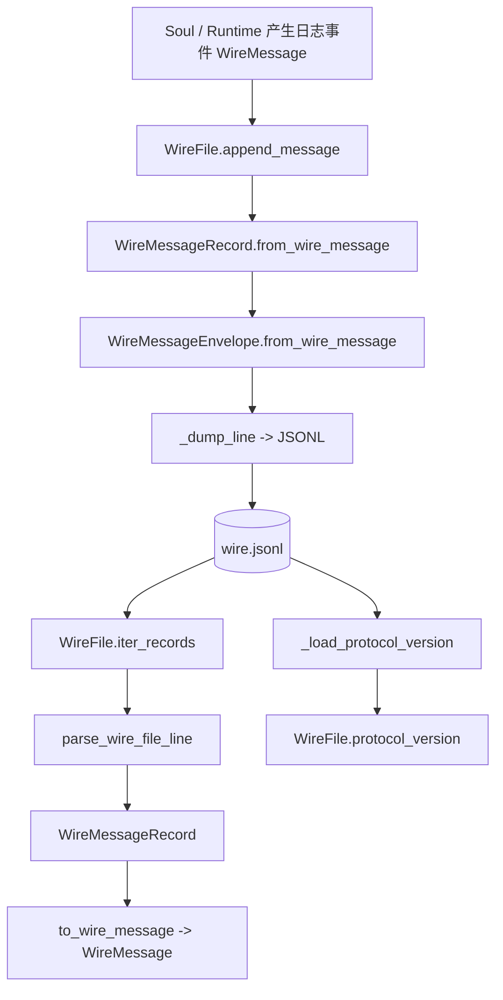
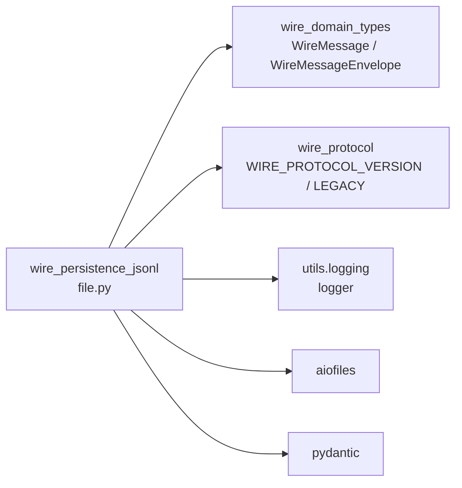
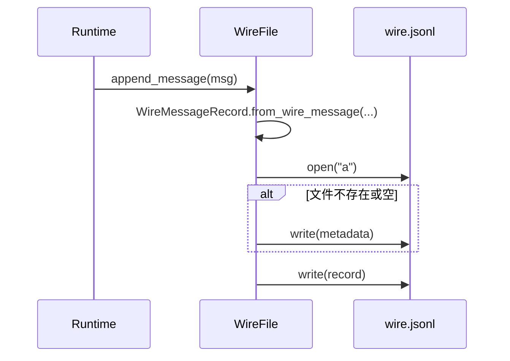
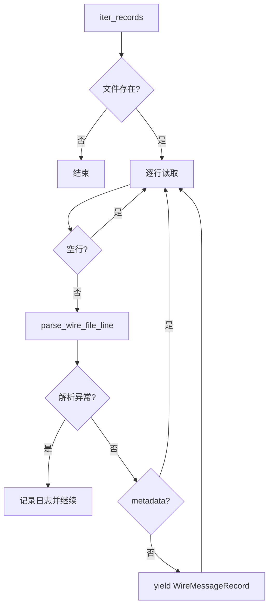
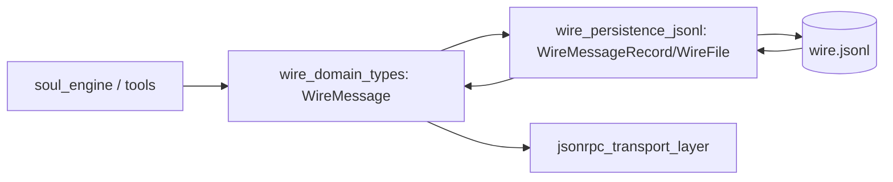

# wire_persistence_jsonl 模块文档

## 1. 模块定位与设计目标

`wire_persistence_jsonl`（实现位于 `src/kimi_cli/wire/file.py`）负责将运行时的 `WireMessage` 事件流持久化到本地 `JSONL` 文件，并在需要时进行回放读取。它是 `wire_protocol` 体系里的“离线存储层”：`wire_domain_types` 定义了消息语义，`jsonrpc_transport_layer` 负责在线传输，而本模块负责把这些消息稳定落盘，形成可重放、可审计、可迁移的会话轨迹。

这个模块存在的根本原因是：仅靠内存中的消息总线无法满足调试、崩溃恢复、历史回放和跨版本兼容需求。`JSONL`（每行一个 JSON 对象）格式天然适合“追加写入 + 流式读取”，非常契合 CLI/Agent 连续产生日志事件的场景。模块还通过首行元数据头（`metadata`）记录协议版本，从而在升级后仍能识别旧文件，降低演进带来的破坏性。

从系统协作看，`wire_persistence_jsonl` 主要依赖 `WireMessageEnvelope` 做消息封装与解封，并使用 `WIRE_PROTOCOL_VERSION` / `WIRE_PROTOCOL_LEGACY_VERSION` 做协议版本判定。建议结合阅读：[wire_domain_types.md](wire_domain_types.md)（消息模型与 envelope 机制）、[jsonrpc_transport_layer.md](jsonrpc_transport_layer.md)（线上传输层）。

---

## 2. 架构概览与组件关系



该架构可分为三层：

第一层是**领域对象层**，输入输出都是 `WireMessage`（运行时语义消息）。
第二层是**持久化记录层**，通过 `WireMessageRecord` 把消息包进可序列化结构（含 `timestamp` + `WireMessageEnvelope`）。
第三层是**文件层**，按 JSONL 逐行写入与读取，并在首行插入 `metadata` 记录协议版本。

这种分层使模块职责清晰：领域语义由 `wire.types` 维护，存储格式由本模块维护，二者通过 envelope 解耦。

---
## 2.1 依赖关系（模块视角）



从依赖方向看，本模块处于一个很“薄”的基础设施层：它不关心上层是 `soul_engine` 还是 `web_api` 在消费消息，只关心把 `WireMessage` 封装为 envelope 后稳定写入文件，再按同一契约读回。换句话说，它是 `wire_domain_types` 的持久化适配器，而不是业务规则中心。这种定位让它在架构中更容易复用，也更容易在将来替换底层存储介质（例如 SQLite）而不影响上游消息定义。

---


## 3. 数据格式设计（JSONL 结构）

一个典型 `wire.jsonl` 文件如下：

```json
{"type":"metadata","protocol_version":"1.3"}
{"timestamp":1730000000.12,"message":{"type":"TurnBegin","payload":{"user_input":"hi"}}}
{"timestamp":1730000000.45,"message":{"type":"StatusUpdate","payload":{"context_usage":12.5,"message_id":"msg_123"}}}
```

首行是 `WireFileMetadata`，后续各行是 `WireMessageRecord`。模块允许文件中出现空行；读取时会跳过空行和 metadata 行，只产出消息记录。

---

## 4. 核心组件详解

## 4.1 `WireMessageRecord`

`WireMessageRecord` 是本模块对外最关键的核心类型（也是你在模块树中看到的 core component）。它是一个 `pydantic.BaseModel`，字段如下：

- `timestamp: float`：消息写入时间戳（Unix time，秒级浮点）。
- `message: WireMessageEnvelope`：消息封装体。

### 关键方法

`from_wire_message(msg, *, timestamp)` 用于从运行时消息构造记录。内部会调用 `WireMessageEnvelope.from_wire_message(msg)`，因此它只接受合法的 `WireMessage` 类型。

`to_wire_message()` 则走反向路径，把记录里的 envelope 还原成具体的 `WireMessage`。如果 envelope 类型未知或 payload 不合法，异常会来自 envelope 的反序列化逻辑（通常是 `ValueError` 或校验异常）。

### 设计价值

这个模型将“传输/存储结构”与“运行时对象”之间的转换集中在一个地方，避免业务代码在各处手写 `model_dump / model_validate`。

---

## 4.2 `WireFileMetadata`

`WireFileMetadata` 是 JSONL 首行头信息模型，字段为：

- `type: Literal["metadata"] = "metadata"`
- `protocol_version: str`

它的 `model_config = ConfigDict(extra="ignore")` 允许忽略未知字段。这样做对向前兼容友好：未来如果 metadata 增加新字段，旧版本代码也能继续读取关键字段。

---

## 4.3 解析函数：`parse_wire_file_metadata` 与 `parse_wire_file_line`

`parse_wire_file_metadata(line)` 尝试把一行 JSON 解析为 metadata；失败（`ValidationError` / `ValueError`）时返回 `None`，而不是抛异常。这个“软失败”策略用于快速判断一行是不是 metadata。

`parse_wire_file_line(line)` 先尝试 metadata；若不是 metadata，再按 `WireMessageRecord` 解析。也就是说它的返回类型是联合：`WireFileMetadata | WireMessageRecord`。

这种顺序很重要：metadata 与 record 都是 JSON 对象，只有先做 metadata 判定，才能保证首行头被正确识别。

---

## 4.4 `WireFile`：文件生命周期与 I/O 门面

`WireFile` 是实际文件操作门面（`@dataclass(slots=True)`），字段：

- `path: Path`：目标 JSONL 文件路径。
- `protocol_version: str = WIRE_PROTOCOL_VERSION`：当前对象认为要写入的协议版本。

### `__post_init__`

构造时若文件已存在，会调用 `_load_protocol_version(path)` 读取首个非空行：

- 若读取到 metadata，采用文件内版本。
- 若首个非空行不是 metadata，视为旧格式，回退到 `WIRE_PROTOCOL_LEGACY_VERSION`（当前是 `1.1`）。
- 若文件不存在，则使用当前 `WIRE_PROTOCOL_VERSION`（当前是 `1.3`）。

这个逻辑体现了模块的兼容策略：**优先尊重文件事实，其次用 legacy 兜底，再次才用最新默认**。

### `is_empty()`

用于判定“是否存在实际消息记录”。它会忽略空行和 metadata 行，只要遇到第一条非 metadata 的有效行即返回 `False`。若读文件失败（`OSError`），会记录异常日志并返回 `False`（偏保守，避免把不可读文件误判为空）。

### `iter_records()`

异步流式读取记录：

1. 文件不存在时直接结束；
2. 用 `aiofiles` 按行读取；
3. 跳过空行；
4. 逐行 `parse_wire_file_line`；
5. 解析失败记录日志并继续下一行；
6. metadata 行跳过；
7. `yield WireMessageRecord`。

它的一个关键行为是“容错不中断”：即便中间某行损坏，后续可解析记录仍会继续产出。

### `append_message()`

便捷接口。传入 `WireMessage`，自动补 `timestamp`（默认 `time.time()`），先转 `WireMessageRecord` 后委托 `append_record()`。

### `append_record()`

执行追加写入流程：

1. 确保父目录存在（`mkdir(parents=True, exist_ok=True)`）；
2. 判断是否需要写 header（文件不存在或大小为 0）；
3. 以追加模式打开文件；
4. 必要时先写 metadata；
5. 再写 record。

写入格式统一通过 `_dump_line(model)`，确保每行完整 JSON 并附 `\n`。

---

## 5. 私有辅助函数

`_dump_line(model: BaseModel) -> str` 使用 `json.dumps(model.model_dump(mode="json"), ensure_ascii=False) + "\n"`。`ensure_ascii=False` 保证中文内容以 UTF-8 原文存储，便于人工阅读与 grep。

`_load_protocol_version(path)` 读取文件第一个非空行并尝试 metadata 解析：

- 成功返回 `protocol_version`；
- 首行非 metadata 返回 `None`（让上层判断为 legacy）；
- I/O 异常记录日志并返回 `None`。

---

## 6. 典型流程（写入、读取、版本判定）

### 6.1 写入流程



该流程强调“首写带头，后续纯追加”，减少随机写复杂度。

### 6.2 读取流程



读取策略是“最佳努力恢复”：坏行不致命，尤其适合长日志文件中的局部损坏场景。

---

## 7. 与其他模块的协作边界



`wire_persistence_jsonl` 不定义消息语义，只依赖 `WireMessageEnvelope` 完成通用封装。因此当你新增一种 `WireMessage`（在 `wire_domain_types`）时，本模块通常无需改动，只要 envelope 映射能识别新类型即可自动持久化。

---

## 8. 使用示例

### 8.1 追加写入消息

```python
from pathlib import Path
from kimi_cli.wire.file import WireFile
from kimi_cli.wire.types import TurnBegin

wf = WireFile(Path("./.kimi/wire.jsonl"))
await wf.append_message(TurnBegin(user_input="请帮我分析这个仓库"))
```

### 8.2 回放读取并还原为领域消息

```python
from pathlib import Path
from kimi_cli.wire.file import WireFile

wf = WireFile(Path("./.kimi/wire.jsonl"))

async for record in wf.iter_records():
    msg = record.to_wire_message()
    # 在这里做回放、统计或调试
    print(record.timestamp, type(msg).__name__)
```

### 8.3 判空与版本查看

```python
wf = WireFile(Path("./.kimi/wire.jsonl"))
print(wf.version)      # 例如 "1.3" 或 "1.1"
print(wf.is_empty())   # True/False
```

---

## 9. 可配置点与扩展建议

当前模块可显式配置的主要是 `WireFile(path, protocol_version=...)` 中的目标版本。实际运行中它会在已有文件场景被 `__post_init__` 覆盖为“文件版本或 legacy 版本”，所以这个参数更像“新建文件时的默认值”。

若要扩展模块能力，最常见路径有两类。第一类是增强 metadata（例如新增 `session_id`、`app_version`），由于 `extra="ignore"` 的存在，旧读者不会立即崩溃；但你仍需评估下游是否依赖这些新字段。第二类是增加压缩、轮转、索引等文件管理能力，这些更适合在 `WireFile` 外围做包装层，而不是破坏现有“每行独立 JSON”契约。

---

## 10. 边界条件、错误处理与限制

### 10.1 错误处理策略

模块整体采用“记录日志、尽量继续”的思路：

- 读取整文件失败：记录异常，读取流程结束；
- 单行解析失败：记录异常，跳过该行继续；
- `is_empty` 的 I/O 异常：记录异常并返回 `False`。

这保证了线上稳定性，但也意味着调用方如果需要严格一致性，应自行添加“坏行计数/失败即停”策略。

### 10.2 并发与原子性注意事项

`append_record()` 采用普通追加写，并未内建跨进程文件锁。多个进程并发写同一文件时，理论上可能出现行交错或竞争条件，尤其在网络文件系统中更明显。如果你的部署存在多写者，请在上层引入单写者约束或外部锁。

### 10.3 协议兼容性限制

当文件首个非空行不是 metadata 时，模块会将版本视为 `WIRE_PROTOCOL_LEGACY_VERSION`。这是一种启发式兼容，不代表它能自动修复所有历史差异；真正消息级兼容仍依赖 `WireMessageEnvelope` 与具体消息模型的兼容能力。

### 10.4 数据质量限制

模块不会在 `iter_records()` 阶段验证“时间戳单调递增”或“业务事件顺序正确”，它只保证结构可解析。回放语义正确性应由上层 runtime 检查。

---

## 11. 维护者速览

`wire_persistence_jsonl` 的核心价值不是“把对象写文件”这么简单，而是通过 metadata + envelope + 容错流式读取，建立了一条可演进的消息持久化通道。维护时建议优先守住三条不变量：

1. JSONL 逐行独立、可增量读取；
2. metadata 首行语义稳定且可向前兼容；
3. record 始终以 `WireMessageEnvelope` 作为消息边界。

只要这三条不被破坏，`soul_engine` 回放、调试审计、协议升级迁移都会保持较低风险。
