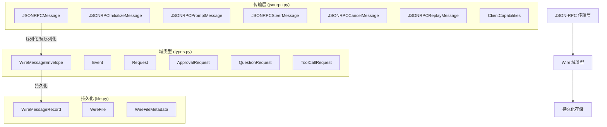

# Wire Protocol 模块文档

## 概述

Wire Protocol 模块是 Kimi CLI 系统的核心通信层，负责在不同组件之间建立标准化的消息传递机制。该模块定义了一套完整的 JSON-RPC 2.0 兼容协议，用于在客户端（如 UI Shell）和服务器端（如 Soul Engine）之间进行双向通信。Wire Protocol 的设计目标是提供一个灵活、可扩展且类型安全的通信框架，支持实时交互、状态同步、工具调用和用户输入处理等复杂场景。

该模块解决了传统命令行工具在交互性和可扩展性方面的局限性。通过将通信协议抽象化，Kimi CLI 能够支持多种客户端实现（如终端界面、Web 界面、IDE 插件等），同时保持后端逻辑的一致性。Wire Protocol 还提供了消息持久化能力，使得会话历史可以被完整记录和回放，这对于调试、审计和用户体验优化都具有重要意义。

## 架构概览

Wire Protocol 模块采用分层架构，主要包含三个核心子系统：

### 传输层 (JSON-RPC Transport Layer)

传输层基于 JSON-RPC 2.0 标准实现，定义了客户端和服务器之间的消息格式。它处理协议初始化、用户输入、控制指令（如取消、重放）等基础通信需求。传输层确保了消息的结构化和类型安全，同时提供了错误处理机制。

### 域类型 (Wire Domain Types)

域类型层定义了业务逻辑层面的消息结构，包括事件（Event）和请求（Request）两大类。事件用于通知状态变化和进度更新，而请求则用于需要响应的交互操作（如工具调用、用户确认）。这种分离使得协议既支持单向通知，也支持双向交互。

### 持久化存储 (Persistence Layer)

持久化层负责将通信消息以 JSONL 格式存储到文件中，支持协议版本管理和向后兼容。这使得会话历史可以被完整记录，并在需要时进行回放或分析。

## 子模块功能

### JSON-RPC 传输层

JSON-RPC 传输层实现了完整的 JSON-RPC 2.0 协议，支持初始化、提示、控制和错误处理等核心功能。该层定义了客户端和服务端之间的基本通信契约，确保了跨平台兼容性。详细信息请参见 [jsonrpc_transport_layer.md](jsonrpc_transport_layer.md)。

### Wire 域类型

Wire 域类型层定义了业务逻辑相关的消息结构，包括各种事件类型（如 TurnBegin、StepBegin、StatusUpdate）和请求类型（如 ApprovalRequest、QuestionRequest、ToolCallRequest）。这些类型构成了 Kimi CLI 交互模型的基础，支持复杂的多轮对话和工具集成。详细信息请参见 [wire_domain_types.md](wire_domain_types.md)。

### 持久化存储

持久化存储层提供了消息记录的文件存储能力，使用 JSONL 格式确保高效读写和流式处理。该层还处理协议版本管理，确保不同版本的客户端能够正确解析历史记录。详细信息请参见 [wire_persistence_jsonl.md](wire_persistence_jsonl.md)。

## 与其他模块的集成

Wire Protocol 模块与系统中的多个其他模块紧密集成，并共同构成“运行时语义 -> 传输协议 -> UI/存储”的完整闭环：

- **Soul Engine**（参见 [soul_engine.md](soul_engine.md)）: 作为主要的消息生产者，Soul Engine 会发出步骤事件、状态更新、审批/提问请求等语义消息，随后由 Wire 层封装并对外传输。
- **UI Shell**（参见 [ui_shell.md](ui_shell.md)）: 作为主要的消息消费者，UI Shell 接收 Wire Protocol 消息并渲染交互界面，同时将用户输入转换为 `initialize/prompt/steer/cancel` 等入站消息。
- **Tools 模块族**（参见 [tools_file.md](tools_file.md)、[tools_shell.md](tools_shell.md)、[tools_web.md](tools_web.md)、[tools_multiagent.md](tools_multiagent.md)、[tools_misc.md](tools_misc.md)）: 工具调用相关请求会通过 Wire 协议跨边界传递，执行结果再经事件回传。
- **Web API**（参见 [web_api.md](web_api.md) 与 [web_frontend_api.md](web_frontend_api.md)）: 在 Web 场景下，HTTP/REST 接口与前端 API Client 会与 Wire 语义层协作，实现会话控制、状态同步与回放。
- **配置与会话状态**（参见 [config_and_session.md](config_and_session.md)）: 会话持久化和运行配置决定了 Wire 消息的处理策略，例如是否允许交互式请求、循环控制和恢复策略。

这种集成模式使 Kimi CLI 能够在不同入口（CLI、Web、自动化调用）下复用同一套核心消息语义，同时保持协议边界清晰、可维护性高。

## 深入阅读与子模块文档索引

为了避免主文档与实现细节重复，本模块的实现级说明已拆分到以下子文档：

- 传输层与 JSON-RPC 报文模型： [jsonrpc_transport_layer.md](jsonrpc_transport_layer.md)
- 领域消息类型、Envelope 编解码与请求 Future 生命周期： [wire_domain_types.md](wire_domain_types.md)
- JSONL 持久化、协议版本头与容错回放： [wire_persistence_jsonl.md](wire_persistence_jsonl.md)

另外，若你正在排查端到端行为，建议结合这些上游/下游模块文档一起阅读：

- 运行时语义生产侧： [soul_engine.md](soul_engine.md)
- 终端交互消费侧： [ui_shell.md](ui_shell.md)
- 工具执行相关模块： [tools_file.md](tools_file.md)、[tools_shell.md](tools_shell.md)、[tools_web.md](tools_web.md)、[tools_multiagent.md](tools_multiagent.md)、[tools_misc.md](tools_misc.md)
- Web 会话与接口层： [web_api.md](web_api.md)、[web_frontend_api.md](web_frontend_api.md)
