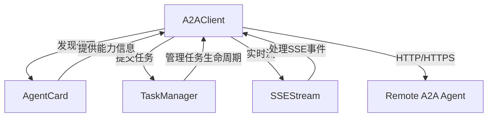
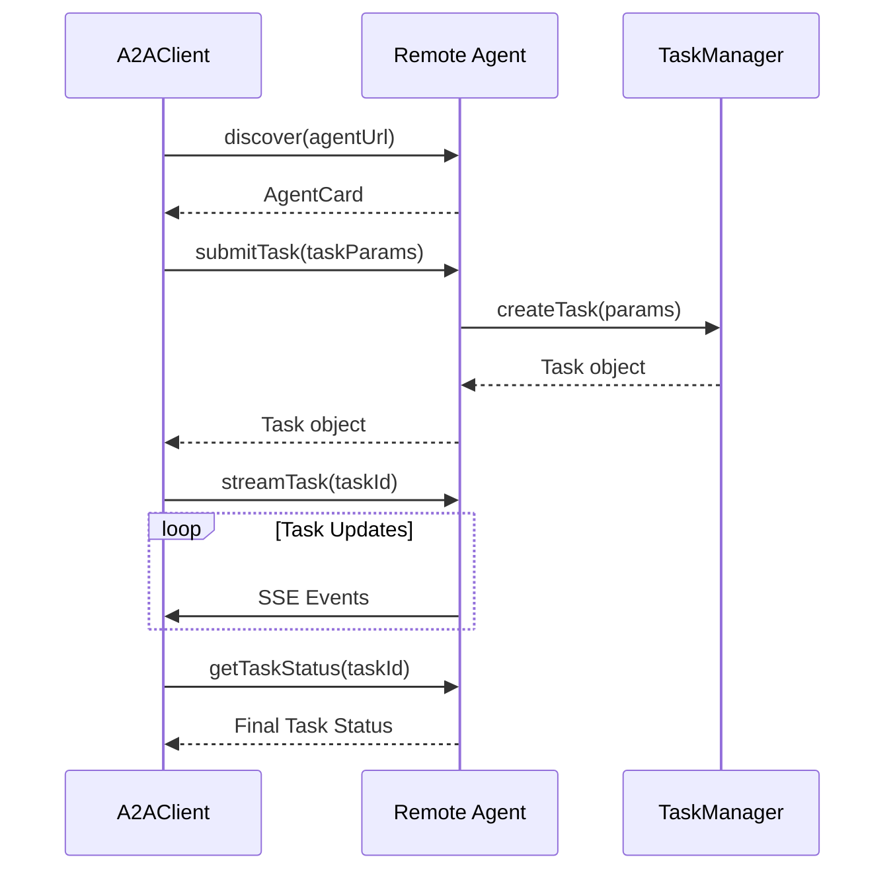

# A2A Protocol - A2AClient 模块文档

## 1. 概述

A2AClient 是 A2A (Agent-to-Agent) 协议的核心客户端组件，负责发现和与外部 A2A 代理进行通信。该模块提供了一组简单易用的 API，用于连接远程代理、提交任务、监控任务状态以及接收实时任务更新。

### 1.1 主要功能
- **代理发现**：通过标准的 `.well-known/agent.json` 端点获取远程代理的能力信息
- **任务管理**：支持任务提交、状态查询、取消等完整的任务生命周期管理
- **实时流**：通过 SSE (Server-Sent Events) 提供任务状态和进度的实时更新
- **灵活配置**：支持认证、超时控制、响应大小限制等配置选项

### 1.2 设计理念
A2AClient 遵循简单、可靠、可扩展的设计原则。它不依赖于复杂的框架，使用 Node.js 原生模块实现，确保在各种环境中都能正常工作。客户端的接口设计注重易用性和一致性，使开发者能够快速集成。

## 2. 架构与组件关系

A2AClient 是 A2A 协议家族的重要组成部分，与其他组件协同工作：



### 2.1 组件依赖关系
- **AgentCard**：定义了代理的能力和元数据结构，A2AClient 通过发现过程获取远程代理的 AgentCard
- **TaskManager**：在服务端管理任务，A2AClient 通过 HTTP 接口与其交互
- **SSEStream**：处理服务端的 SSE 流，A2AClient 中的 `streamTask` 方法实现了客户端的 SSE 解析

## 3. 核心组件详解

### 3.1 A2AClient 类

#### 构造函数
```javascript
constructor(opts)
```

**参数说明**：
- `opts.authToken` (string, 可选)：用于认证的 Bearer token
- `opts.timeoutMs` (number, 可选)：请求超时时间（毫秒），默认 30000ms
- `opts.maxResponseSize` (number, 可选)：最大响应体大小（字节），默认 10MB

**示例**：
```javascript
const { A2AClient } = require('./src/protocols/a2a/client');

// 创建基本客户端
const client = new A2AClient();

// 创建配置完整的客户端
const secureClient = new A2AClient({
  authToken: 'your-auth-token',
  timeoutMs: 60000,
  maxResponseSize: 50 * 1024 * 1024 // 50MB
});
```

#### 主要方法

##### 1. discover(agentUrl)
发现远程 A2A 代理并获取其代理卡片信息。

**参数**：
- `agentUrl` (string)：代理的基础 URL

**返回值**：
- `Promise<object>`：代理卡片 JSON 对象

**示例**：
```javascript
async function discoverAgent() {
  try {
    const agentCard = await client.discover('https://agent.example.com');
    console.log('代理名称:', agentCard.name);
    console.log('可用技能:', agentCard.skills);
  } catch (error) {
    console.error('发现代理失败:', error.message);
  }
}
```

##### 2. submitTask(agentUrl, taskParams)
向远程 A2A 代理提交任务。

**参数**：
- `agentUrl` (string)：代理的基础 URL
- `taskParams` (object)：任务参数
  - `skill` (string)：要调用的技能 ID
  - `input` (object, 可选)：任务输入数据
  - `metadata` (object, 可选)：任意元数据

**返回值**：
- `Promise<object>`：创建的任务对象

**示例**：
```javascript
async function submitAnalysisTask() {
  try {
    const task = await client.submitTask('https://agent.example.com', {
      skill: 'code-analysis',
      input: {
        repository: 'https://github.com/example/project',
        branch: 'main'
      },
      metadata: {
        priority: 'high',
        requester: 'user@example.com'
      }
    });
    console.log('任务已创建，ID:', task.id);
    return task;
  } catch (error) {
    console.error('提交任务失败:', error.message);
  }
}
```

##### 3. getTaskStatus(agentUrl, taskId)
获取远程代理上的任务状态。

**参数**：
- `agentUrl` (string)：代理的基础 URL
- `taskId` (string)：任务 ID

**返回值**：
- `Promise<object>`：任务状态对象

**示例**：
```javascript
async function checkTaskStatus(taskId) {
  try {
    const status = await client.getTaskStatus('https://agent.example.com', taskId);
    console.log('任务状态:', status.state);
    console.log('输出:', status.output);
    return status;
  } catch (error) {
    console.error('获取任务状态失败:', error.message);
  }
}
```

##### 4. cancelTask(agentUrl, taskId)
取消远程代理上的任务。

**参数**：
- `agentUrl` (string)：代理的基础 URL
- `taskId` (string)：任务 ID

**返回值**：
- `Promise<object>`：更新后的任务对象

**示例**：
```javascript
async function cancelRunningTask(taskId) {
  try {
    const canceledTask = await client.cancelTask('https://agent.example.com', taskId);
    console.log('任务已取消，当前状态:', canceledTask.state);
  } catch (error) {
    console.error('取消任务失败:', error.message);
  }
}
```

##### 5. streamTask(agentUrl, taskId)
通过 SSE 流式接收任务更新。

**参数**：
- `agentUrl` (string)：代理的基础 URL
- `taskId` (string)：任务 ID

**返回值**：
- `EventEmitter`：发出 'event'、'error'、'end' 事件

**示例**：
```javascript
function streamTaskUpdates(taskId) {
  const stream = client.streamTask('https://agent.example.com', taskId);
  
  stream.on('event', (event) => {
    console.log('收到事件:', event.event);
    console.log('事件数据:', event.data);
  });
  
  stream.on('error', (error) => {
    console.error('流错误:', error.message);
  });
  
  stream.on('end', () => {
    console.log('流已结束');
  });
  
  // 如果需要提前中止流
  // setTimeout(() => stream.abort(), 5000);
}
```

### 3.2 内部实现细节

#### _request 方法
这是 A2AClient 的核心内部方法，处理所有 HTTP 请求。

**功能特点**：
- 自动处理 HTTP 和 HTTPS 协议
- 支持 JSON 请求体和响应
- 实现超时控制和响应大小限制
- 自动添加认证头

**错误处理**：
- HTTP 状态码 >= 400 时拒绝 Promise
- 响应超过 `maxResponseSize` 时中止请求并拒绝
- 请求超时时拒绝 Promise 并销毁请求

#### _parseSSE 函数
解析 SSE (Server-Sent Events) 格式的文本数据。

**解析逻辑**：
- 提取 `event:` 和 `data:` 行
- 尝试将数据解析为 JSON
- 返回包含 event 和 data 属性的对象

## 4. 使用场景与最佳实践

### 4.1 典型工作流程



### 4.2 完整示例

```javascript
const { A2AClient } = require('./src/protocols/a2a/client');

async function completeWorkflow() {
  const client = new A2AClient({
    authToken: 'your-auth-token',
    timeoutMs: 60000
  });
  
  try {
    // 1. 发现代理
    console.log('正在发现代理...');
    const agentCard = await client.discover('https://agent.example.com');
    console.log('已发现代理:', agentCard.name);
    
    // 2. 检查所需技能是否可用
    const requiredSkill = agentCard.skills.find(s => s.id === 'data-processing');
    if (!requiredSkill) {
      throw new Error('代理不支持所需技能');
    }
    
    // 3. 提交任务
    console.log('正在提交任务...');
    const task = await client.submitTask('https://agent.example.com', {
      skill: 'data-processing',
      input: {
        dataset: 'sales-data-2023',
        analysisType: 'trend-analysis'
      },
      metadata: {
        project: 'analytics-dashboard'
      }
    });
    console.log('任务已创建，ID:', task.id);
    
    // 4. 设置流监控
    console.log('开始监控任务进度...');
    const stream = client.streamTask('https://agent.example.com', task.id);
    
    // 5. 等待任务完成
    await new Promise((resolve, reject) => {
      stream.on('event', (event) => {
        if (event.event === 'state' && event.data.to === 'completed') {
          resolve();
        } else if (event.event === 'state' && event.data.to === 'failed') {
          reject(new Error('任务执行失败'));
        } else if (event.event === 'progress') {
          console.log(`进度: ${event.data.progress || 'N/A'} - ${event.data.message}`);
        }
      });
      
      stream.on('error', reject);
    });
    
    // 6. 获取最终结果
    console.log('获取最终结果...');
    const finalTask = await client.getTaskStatus('https://agent.example.com', task.id);
    console.log('任务完成，结果:', finalTask.output);
    
    return finalTask;
    
  } catch (error) {
    console.error('工作流程失败:', error.message);
    throw error;
  }
}

// 执行完整工作流程
completeWorkflow().catch(console.error);
```

### 4.3 最佳实践

1. **错误处理**：始终使用 try-catch 或 Promise.catch() 处理可能的错误
2. **超时配置**：根据任务类型合理设置超时时间，长时间运行的任务应使用流式监控
3. **响应大小限制**：对于可能返回大量数据的任务，适当增加 `maxResponseSize`
4. **流式监控**：优先使用 `streamTask` 方法实时监控任务，而不是轮询 `getTaskStatus`
5. **资源清理**：使用完流后，确保在不需要时调用 `abort()` 方法释放资源
6. **认证安全**：妥善保管 authToken，避免在日志或错误消息中泄露

## 5. 配置与扩展

### 5.1 配置选项

| 配置项 | 类型 | 默认值 | 说明 |
|--------|------|--------|------|
| authToken | string | null | Bearer 认证令牌 |
| timeoutMs | number | 30000 | 请求超时时间（毫秒） |
| maxResponseSize | number | 10485760 | 最大响应大小（字节，默认10MB） |

### 5.2 扩展 A2AClient

虽然 A2AClient 类设计为直接使用，但也可以通过继承进行扩展：

```javascript
class CustomA2AClient extends A2AClient {
  constructor(opts) {
    super(opts);
    this._retryCount = opts.retryCount || 3;
  }
  
  async submitTaskWithRetry(agentUrl, taskParams) {
    let lastError;
    for (let i = 0; i < this._retryCount; i++) {
      try {
        return await this.submitTask(agentUrl, taskParams);
      } catch (error) {
        lastError = error;
        console.warn(`提交任务失败，重试 ${i + 1}/${this._retryCount}`);
        await new Promise(resolve => setTimeout(resolve, 1000 * (i + 1)));
      }
    }
    throw lastError;
  }
}
```

## 6. 注意事项与限制

### 6.1 已知限制

1. **协议支持**：仅支持 HTTP 和 HTTPS 协议
2. **流式传输**：SSE 流在某些网络环境下可能被防火墙或代理服务器阻止
3. **响应大小**：默认 10MB 的响应大小限制可能不适合所有场景
4. **任务队列**：客户端不管理任务队列，完全依赖远程代理的实现

### 6.2 错误条件

| 错误类型 | 说明 | 处理建议 |
|----------|------|----------|
| 网络错误 | 无法连接到远程代理 | 检查网络连接和代理 URL |
| 认证错误 | 401/403 状态码 | 验证 authToken 是否正确 |
| 超时错误 | 请求超过 timeoutMs | 增加超时时间或检查远程代理性能 |
| 响应过大 | 响应超过 maxResponseSize | 增加限制或使用流式接口 |
| 任务未找到 | 404 状态码 | 验证 taskId 是否正确 |

### 6.3 性能考虑

- 对于频繁使用的场景，建议复用 A2AClient 实例而不是每次创建新实例
- 流式监控比轮询更高效，特别是对于长时间运行的任务
- 合理设置超时时间可以避免资源浪费

## 7. 相关模块参考

- [A2A Protocol - AgentCard](A2A Protocol - AgentCard.md)：了解代理卡片的结构和功能
- [A2A Protocol - TaskManager](A2A Protocol - TaskManager.md)：了解服务端任务管理的实现
- [A2A Protocol - SSEStream](A2A Protocol - SSEStream.md)：了解服务端 SSE 流的实现

## 8. 总结

A2AClient 是一个功能完善、易于使用的 A2A 协议客户端，为 Agent-to-Agent 通信提供了可靠的基础设施。通过其简洁的 API，开发者可以快速实现代理发现、任务提交和监控等功能，为构建分布式多代理系统奠定基础。

该模块的设计注重可靠性和易用性，同时提供了足够的配置选项以适应不同的使用场景。通过遵循最佳实践并注意其限制，开发者可以充分发挥 A2AClient 的潜力，构建强大而灵活的代理协作系统。
