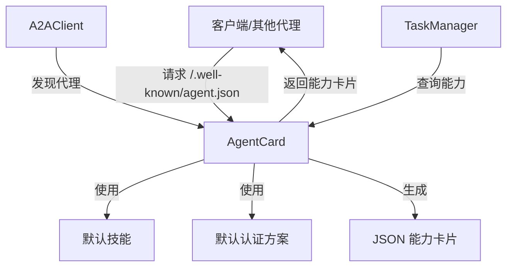

# A2A Protocol - AgentCard 模块文档

## 1. 模块概述

### 1.1 模块目的与设计理念

AgentCard 模块是 A2A（Agent-to-Agent）协议的核心组件之一，负责按照 A2A 规范公开代理的能力信息。该模块通过 `/.well-known/agent.json` 端点提供服务，允许其他代理或系统发现和了解当前代理的功能、技能和通信能力。

设计理念围绕着**能力发现**和**互操作性**展开，确保不同代理系统能够无缝交互。通过标准化的能力声明格式，AgentCard 使得代理之间可以自动协商通信方式和功能匹配，为多代理协作奠定基础。

### 1.2 在系统中的位置

AgentCard 模块位于 A2A 协议栈的底层，作为代理发现和初始通信的入口点。它与其他 A2A 协议组件（如 A2AClient、TaskManager 和 SSEStream）协同工作，共同构成完整的代理间通信基础设施。

## 2. 核心组件详解

### 2.1 AgentCard 类

#### 2.1.1 功能描述

AgentCard 类是该模块的核心，负责：
- 存储代理的基本信息和能力声明
- 生成符合 A2A 规范的 JSON 格式能力卡片
- 处理 HTTP 请求以提供能力发现服务
- 管理代理技能的动态添加和查询

#### 2.1.2 构造函数参数

| 参数 | 类型 | 必填 | 默认值 | 描述 |
|------|------|------|--------|------|
| opts.name | string | 否 | 'Loki Mode' | 代理名称 |
| opts.description | string | 否 | 'Multi-agent autonomous system by Autonomi' | 代理描述 |
| opts.url | string | 否 | 'http://localhost:8080' | 代理端点 URL |
| opts.version | string | 否 | '1.0.0' | 代理版本 |
| opts.skills | object[] | 否 | DEFAULT_SKILLS | 代理技能列表 |
| opts.authSchemes | string[] | 否 | DEFAULT_AUTH_SCHEMES | 支持的认证方案 |
| opts.streaming | boolean | 否 | true | 是否支持流式传输 |
| opts.id | string | 否 | 随机 UUID | 代理唯一标识符 |

#### 2.1.3 核心方法

##### toJSON()

**功能**：生成符合 A2A 规范的代理卡片 JSON 对象。

**返回值**：包含完整代理能力信息的对象，结构如下：
```javascript
{
  id: string,                    // 代理唯一标识符
  name: string,                  // 代理名称
  description: string,           // 代理描述
  url: string,                   // 代理端点 URL
  version: string,               // 代理版本
  capabilities: {                // 能力声明
    streaming: boolean,          // 是否支持流式传输
    pushNotifications: boolean,  // 是否支持推送通知
    stateTransitionHistory: boolean  // 是否支持状态转换历史
  },
  skills: Array<{                // 技能列表
    id: string,
    name: string,
    description: string
  }>,
  authentication: {              // 认证信息
    schemes: string[]            // 支持的认证方案
  },
  defaultInputModes: string[],   // 默认输入模式
  defaultOutputModes: string[]   // 默认输出模式
}
```

##### handleRequest(req, res)

**功能**：处理 HTTP 请求，提供代理卡片服务。

**参数**：
- `req`：HTTP 请求对象，必须包含 `url` 属性
- `res`：HTTP 响应对象

**返回值**：`boolean` - 如果请求被处理则返回 `true`，否则返回 `false`

**行为**：
- 仅处理 `GET` 或 `HEAD` 方法的 `/.well-known/agent.json` 请求
- 设置适当的 Content-Type 和缓存头（缓存 1 小时）
- 对于 HEAD 请求，仅返回响应头而不包含响应体

##### addSkill(skill)

**功能**：向代理卡片添加新技能。

**参数**：
- `skill`：技能对象，必须包含 `id` 和 `name` 属性，可选包含 `description`

**异常**：
- 如果技能缺少 `id` 或 `name`，抛出 `Error`

##### getSkills()

**功能**：获取当前代理的所有技能。

**返回值**：技能数组的副本（防止外部修改）

##### getName(), getUrl(), getId()

**功能**：分别获取代理的名称、URL 和唯一标识符。

**返回值**：相应的属性值

### 2.2 常量定义

#### DEFAULT_SKILLS

默认技能列表，包含四个预定义技能：
- `prd-to-product`：PRD 到产品，接受 PRD 并构建完全部署的产品
- `code-review`：代码审查，多审查者并行代码审查，防奉承
- `testing`：测试，全面的测试生成和执行
- `deployment`：部署，生产部署并验证

#### DEFAULT_AUTH_SCHEMES

默认支持的认证方案：
- `bearer`：Bearer Token 认证
- `api-key`：API Key 认证

## 3. 架构与组件关系

### 3.1 模块架构图



### 3.2 组件交互说明

AgentCard 模块在 A2A 协议生态系统中扮演着服务提供者的角色：

1. **服务发现入口**：当其他代理或系统希望与当前代理交互时，首先会请求 `/.well-known/agent.json` 端点获取能力卡片。

2. **能力协商基础**：获取到的能力卡片用于确定：
   - 代理支持哪些技能
   - 如何进行认证
   - 是否支持流式传输
   - 支持哪些输入/输出格式

3. **与其他 A2A 组件协作**：
   - A2AClient 使用 AgentCard 发现和理解远程代理的能力
   - TaskManager 在分配任务前查询 AgentCard 以确定代理是否适合执行特定任务
   - SSEStream 的使用取决于 AgentCard 中声明的 streaming 能力

## 4. 实际使用指南

### 4.1 基本使用示例

#### 创建和配置 AgentCard

```javascript
const { AgentCard } = require('./src/protocols/a2a/agent-card');

// 使用默认配置创建
const agentCard = new AgentCard();

// 自定义配置创建
const customAgentCard = new AgentCard({
  name: 'My Custom Agent',
  description: 'A specialized agent for specific tasks',
  url: 'https://api.example.com/agent',
  version: '2.1.0',
  skills: [
    { id: 'custom-task', name: 'Custom Task', description: 'Performs a custom task' }
  ],
  authSchemes: ['bearer'],
  streaming: true
});
```

#### 处理 HTTP 请求

```javascript
const http = require('http');
const { AgentCard } = require('./src/protocols/a2a/agent-card');

const agentCard = new AgentCard();

const server = http.createServer((req, res) => {
  // 让 AgentCard 处理能力发现请求
  if (agentCard.handleRequest(req, res)) {
    return; // 请求已处理
  }
  
  // 处理其他请求...
  res.writeHead(404);
  res.end();
});

server.listen(8080);
```

#### 动态添加技能

```javascript
const { AgentCard } = require('./src/protocols/a2a/agent-card');

const agentCard = new AgentCard();

// 添加新技能
agentCard.addSkill({
  id: 'data-analysis',
  name: 'Data Analysis',
  description: 'Performs advanced data analysis on provided datasets'
});

// 获取当前所有技能
const skills = agentCard.getSkills();
console.log('Agent skills:', skills);
```

### 4.2 集成到现有服务

#### Express 集成示例

```javascript
const express = require('express');
const { AgentCard } = require('./src/protocols/a2a/agent-card');

const app = express();
const agentCard = new AgentCard({
  url: 'https://api.example.com'
});

// 手动处理能力发现端点
app.get('/.well-known/agent.json', (req, res) => {
  res.json(agentCard.toJSON());
});

// 其他路由...
app.listen(3000);
```

## 5. 配置与扩展

### 5.1 配置选项

AgentCard 提供了多个配置选项，用于自定义代理的能力声明：

| 配置项 | 说明 | 使用场景 |
|--------|------|----------|
| name | 代理名称 | 区分不同代理，便于识别 |
| description | 代理描述 | 提供代理功能的详细说明 |
| url | 代理端点 URL | 其他代理通过此 URL 与当前代理通信 |
| version | 代理版本 | 版本控制和兼容性管理 |
| skills | 技能列表 | 声明代理能够执行的任务 |
| authSchemes | 认证方案 | 指定如何进行身份验证 |
| streaming | 流式传输支持 | 指示是否支持服务器发送事件 (SSE) |

### 5.2 扩展技能系统

虽然 AgentCard 类本身提供了基本的技能管理，但可以通过以下方式扩展：

```javascript
const { AgentCard, DEFAULT_SKILLS } = require('./src/protocols/a2a/agent-card');

class ExtendedAgentCard extends AgentCard {
  constructor(opts) {
    super(opts);
    this._skillMetadata = {}; // 存储额外的技能元数据
  }

  addSkillWithMetadata(skill, metadata) {
    this.addSkill(skill);
    this._skillMetadata[skill.id] = metadata;
  }

  getSkillMetadata(skillId) {
    return this._skillMetadata[skillId];
  }

  toJSON() {
    const base = super.toJSON();
    // 可以在此扩展生成的 JSON 结构
    return base;
  }
}
```

## 6. 注意事项与限制

### 6.1 安全考虑

1. **端点访问控制**：虽然 `/.well-known/agent.json` 通常是公开的，但在某些情况下可能需要限制访问，特别是当包含敏感的能力信息时。

2. **认证方案**：确保 `authSchemes` 中列出的认证方案实际上已在服务器端实现，不要声明未实现的认证方案。

3. **URL 验证**：在生产环境中，确保 `url` 参数指向正确的、可访问的端点，避免使用 `localhost`。

### 6.2 性能与缓存

1. **缓存策略**：`handleRequest` 方法设置了 1 小时的缓存时间（`Cache-Control: public, max-age=3600`）。如果能力卡片频繁更改，可能需要调整此值。

2. **静态 vs 动态**：如果代理能力在运行时不经常变化，可以考虑预生成 JSON 响应以提高性能。

### 6.3 兼容性与互操作性

1. **A2A 规范遵循**：确保对 `toJSON()` 输出结构的任何修改都符合 A2A 规范，以保持与其他实现的互操作性。

2. **技能 ID 唯一性**：添加技能时确保 `id` 的唯一性，避免重复的技能 ID 导致混淆。

3. **输入/输出模式**：当前实现固定了 `defaultInputModes` 和 `defaultOutputModes`，如果需要支持其他格式，需要修改 `toJSON()` 方法。

### 6.4 已知限制

1. **有限的能力声明**：当前实现仅支持一组固定的能力声明（streaming、pushNotifications、stateTransitionHistory）。

2. **技能结构简单**：技能对象仅包含 id、name 和 description，不支持更复杂的技能参数或依赖关系声明。

3. **无验证机制**：除了基本的技能 id 和 name 检查外，没有对输入参数进行全面验证。

## 7. 相关模块参考

- [A2A Protocol - A2AClient](A2A Protocol - A2AClient.md)：使用 AgentCard 发现和与其他代理通信
- [A2A Protocol - TaskManager](A2A Protocol - TaskManager.md)：基于 AgentCard 声明的能力分配任务
- [A2A Protocol - SSEStream](A2A Protocol - SSEStream.md)：实现 AgentCard 中声明的流式传输能力
