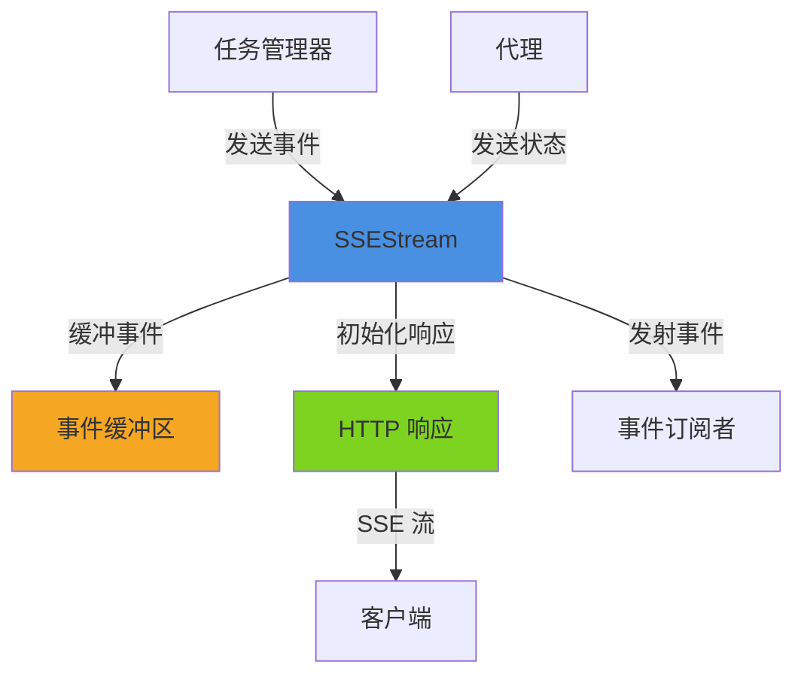
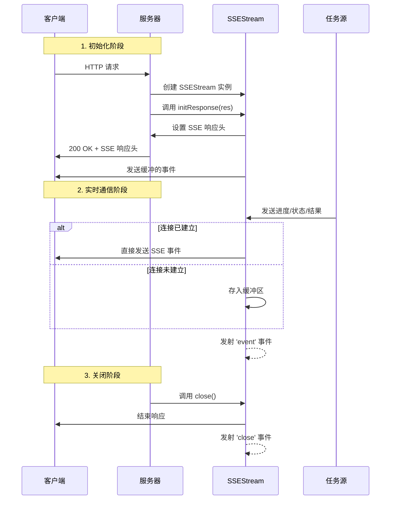

# A2A 协议 - SSEStream 模块文档

## 目录
1. [模块概述](#模块概述)
2. [核心组件](#核心组件)
3. [架构设计](#架构设计)
4. [使用指南](#使用指南)
5. [API 参考](#api-参考)
6. [事件类型](#事件类型)
7. [注意事项](#注意事项)

---

## 模块概述

### 什么是 SSEStream 模块

SSEStream 模块是 A2A（Agent-to-Agent）协议中的关键组件，提供了基于 Server-Sent Events (SSE) 技术的实时数据流传输能力。该模块专门设计用于在多代理协作环境中传输任务进度、状态变更和结果数据，确保代理之间能够高效、可靠地进行实时通信。

### 设计理念

SSEStream 的设计遵循以下核心理念：

1. **单向实时推送**：利用 SSE 协议的服务器到客户端单向推送特性，确保代理能够即时接收更新而无需轮询
2. **事件缓冲机制**：内置缓冲区处理连接建立前的事件，避免数据丢失
3. **类型化事件系统**：通过不同的事件类型区分各种数据流，便于接收方处理
4. **容错设计**：具备连接中断检测和优雅关闭机制
5. **轻量级实现**：不依赖复杂的外部库，基于 Node.js 原生功能构建

### 在系统中的位置

SSEStream 模块位于 A2A 协议的传输层，是连接代理、任务管理器和其他系统组件的重要桥梁。它与以下模块紧密协作：

- [A2A Protocol - A2AClient](A2A Protocol - A2AClient.md)：作为客户端接收 SSE 数据流
- [A2A Protocol - TaskManager](A2A Protocol - TaskManager.md)：使用 SSEStream 广播任务进度和状态变更
- [A2A Protocol - AgentCard](A2A Protocol - AgentCard.md)：可能通过 SSE 接收代理信息更新

---

## 核心组件

### SSEStream 类

`SSEStream` 是该模块的核心类，继承自 Node.js 的 `EventEmitter`，提供了完整的 SSE 流管理功能。

#### 主要特性

- 支持在 HTTP 响应上初始化 SSE 连接
- 事件缓冲和重放机制
- 多种预定义的事件发送方法
- 连接状态管理
- 优雅的关闭处理

#### 内部状态

| 状态变量 | 类型 | 描述 |
|---------|------|------|
| `_res` | object | HTTP 响应对象，用于写入 SSE 数据 |
| `_closed` | boolean | 流是否已关闭的标志 |
| `_buffer` | array | 事件缓冲区，存储在连接建立前发送的事件 |
| `_maxBufferSize` | number | 缓冲区最大容量，超过后会丢弃最早的事件 |

---

## 架构设计

### 数据流架构



### 工作流程



### 缓冲机制设计

SSEStream 实现了一个环形缓冲区，用于处理在 HTTP 响应初始化之前发送的事件：

1. 当 `_res` 为 null 时，所有事件被写入缓冲区
2. 缓冲区大小由 `_maxBufferSize` 控制（默认 1000）
3. 当缓冲区满时，最早的事件会被丢弃（FIFO）
4. 一旦调用 `initResponse()`，缓冲区中的所有事件会被立即发送，然后清空缓冲区

这种设计确保了即使在连接建立延迟的情况下，重要的事件也不会丢失（在缓冲区容量范围内）。

---

## 使用指南

### 基本用法

#### 创建 SSEStream 实例

```javascript
const { SSEStream } = require('./src/protocols/a2a/streaming');

// 创建基本实例
const stream = new SSEStream();

// 创建带自定义配置的实例
const stream = new SSEStream({
  maxBufferSize: 500  // 自定义缓冲区大小
});
```

#### 在 HTTP 服务器中使用

```javascript
const http = require('http');
const { SSEStream } = require('./src/protocols/a2a/streaming');

const server = http.createServer((req, res) => {
  if (req.url === '/events') {
    // 创建 SSEStream 实例
    const sse = new SSEStream();
    
    // 初始化响应
    sse.initResponse(res);
    
    // 发送一些示例事件
    sse.sendProgress('task-123', '任务开始', 0);
    
    // 模拟进度更新
    let progress = 0;
    const interval = setInterval(() => {
      progress += 10;
      if (progress <= 100) {
        sse.sendProgress('task-123', `处理中... ${progress}%`, progress);
      } else {
        clearInterval(interval);
        sse.sendStateChange('task-123', 'running', 'completed');
        sse.close();
      }
    }, 1000);
    
    // 处理客户端断开连接
    req.on('close', () => {
      clearInterval(interval);
      sse.close();
    });
  }
});

server.listen(3000);
```

#### 缓冲模式使用

```javascript
// 创建实例时不绑定响应
const sse = new SSEStream({ maxBufferSize: 200 });

// 在响应准备好之前就可以发送事件
sse.sendProgress('task-456', '初始化中...', 0);
sse.sendProgress('task-456', '加载数据...', 10);

// 稍后绑定响应
http.createServer((req, res) => {
  if (req.url === '/task-status') {
    // 初始化响应 - 这会自动发送缓冲的事件
    sse.initResponse(res);
    
    // 继续发送新事件
    sse.sendProgress('task-456', '处理完成', 100);
  }
}).listen(3000);
```

#### 监听内部事件

```javascript
const sse = new SSEStream();

// 监听所有发送的事件
sse.on('event', ({ event, data }) => {
  console.log(`发送事件: ${event}`, data);
  // 可以在这里添加日志记录或其他处理
});

// 监听流关闭事件
sse.on('close', () => {
  console.log('SSE 流已关闭');
  // 可以在这里进行清理工作
});
```

### 与 A2A 其他组件集成

#### 与 TaskManager 集成

```javascript
const { SSEStream } = require('./src/protocols/a2a/streaming');
const { TaskManager } = require('./src/protocols/a2a/task-manager');

const taskManager = new TaskManager();
const sseStreams = new Map();

// 当有新的 SSE 连接时
function handleSSEConnection(taskId, res) {
  const sse = new SSEStream();
  sse.initResponse(res);
  sseStreams.set(taskId, sse);
  
  // 发送当前任务状态
  const task = taskManager.getTask(taskId);
  sse.sendProgress(taskId, task.status, task.progress);
}

// 监听任务管理器的事件
taskManager.on('progress', (taskId, message, progress) => {
  const sse = sseStreams.get(taskId);
  if (sse && !sse.isClosed()) {
    sse.sendProgress(taskId, message, progress);
  }
});

taskManager.on('stateChange', (taskId, oldState, newState) => {
  const sse = sseStreams.get(taskId);
  if (sse && !sse.isClosed()) {
    sse.sendStateChange(taskId, oldState, newState);
  }
});

taskManager.on('artifact', (taskId, artifact) => {
  const sse = sseStreams.get(taskId);
  if (sse && !sse.isClosed()) {
    sse.sendArtifact(taskId, artifact);
  }
});
```

### 客户端使用示例

虽然 SSEStream 是服务器端组件，但了解如何在客户端消费这些事件也很重要：

```javascript
// 浏览器端 JavaScript
const eventSource = new EventSource('http://localhost:3000/events');

eventSource.addEventListener('progress', (event) => {
  const data = JSON.parse(event.data);
  console.log(`任务 ${data.taskId}: ${data.message} (${data.progress}%)`);
});

eventSource.addEventListener('state', (event) => {
  const data = JSON.parse(event.data);
  console.log(`任务 ${data.taskId} 状态变更: ${data.from} -> ${data.to}`);
});

eventSource.addEventListener('artifact', (event) => {
  const data = JSON.parse(event.data);
  console.log(`收到任务 ${data.taskId} 的产物:`, data.artifact);
});

eventSource.onerror = (error) => {
  console.error('SSE 连接错误:', error);
  eventSource.close();
};
```

---

## API 参考

### 构造函数

#### `new SSEStream([opts])`

创建一个新的 SSEStream 实例。

**参数：**
- `opts` (object, 可选) - 配置选项
  - `res` (object, 可选) - HTTP 响应对象
  - `maxBufferSize` (number, 可选) - 最大缓冲区大小，默认 1000

**返回值：** SSEStream 实例

**示例：**
```javascript
const sse = new SSEStream({
  res: httpResponse,
  maxBufferSize: 500
});
```

### 公共方法

#### `initResponse(res)`

初始化 SSE 响应头并刷新缓冲区中的事件。

**参数：**
- `res` (object) - HTTP 响应对象

**返回值：** 无

**副作用：**
- 设置 SSE 响应头
- 发送所有缓冲的事件
- 清空缓冲区

**示例：**
```javascript
http.createServer((req, res) => {
  const sse = new SSEStream();
  // ... 可能先发送一些事件到缓冲区
  sse.initResponse(res);
});
```

#### `sendEvent(event, data)`

发送一个自定义类型的 SSE 事件。

**参数：**
- `event` (string) - 事件类型名称
- `data` (*) - 事件数据，如果是对象会被 JSON 序列化

**返回值：** 无

**副作用：**
- 发送 SSE 事件到客户端（或缓冲）
- 发射 'event' 事件

**示例：**
```javascript
sse.sendEvent('custom-event', { 
  key: 'value',
  timestamp: Date.now()
});
```

#### `sendProgress(taskId, message, progress)`

发送任务进度更新事件。

**参数：**
- `taskId` (string) - 任务标识符
- `message` (string) - 进度消息
- `progress` (number, 可选) - 进度百分比 (0-100)

**返回值：** 无

**事件数据结构：**
```javascript
{
  taskId: string,
  message: string,
  progress: number | null,
  timestamp: string  // ISO 8601 格式
}
```

**示例：**
```javascript
sse.sendProgress('task-123', '正在处理数据...', 45);
```

#### `sendArtifact(taskId, artifact)`

发送任务产物事件。

**参数：**
- `taskId` (string) - 任务标识符
- `artifact` (*) - 任务产物数据

**返回值：** 无

**事件数据结构：**
```javascript
{
  taskId: string,
  artifact: *,
  timestamp: string  // ISO 8601 格式
}
```

**示例：**
```javascript
sse.sendArtifact('task-123', {
  type: 'report',
  content: '任务执行结果...',
  files: ['output.txt']
});
```

#### `sendStateChange(taskId, oldState, newState)`

发送任务状态变更事件。

**参数：**
- `taskId` (string) - 任务标识符
- `oldState` (string) - 旧状态
- `newState` (string) - 新状态

**返回值：** 无

**事件数据结构：**
```javascript
{
  taskId: string,
  from: string,
  to: string,
  timestamp: string  // ISO 8601 格式
}
```

**示例：**
```javascript
sse.sendStateChange('task-123', 'running', 'completed');
```

#### `close()`

关闭 SSE 流。

**参数：** 无

**返回值：** 无

**副作用：**
- 结束 HTTP 响应
- 标记流为关闭状态
- 发射 'close' 事件

**示例：**
```javascript
sse.close();
```

#### `isClosed()`

检查流是否已关闭。

**参数：** 无

**返回值：** boolean - 流已关闭返回 true，否则返回 false

**示例：**
```javascript
if (!sse.isClosed()) {
  sse.sendProgress('task-123', '继续处理...', 75);
}
```

#### `getBuffer()`

获取当前缓冲区的副本。

**参数：** 无

**返回值：** array - 缓冲的消息数组

**示例：**
```javascript
const bufferedMessages = sse.getBuffer();
console.log(`缓冲区中有 ${bufferedMessages.length} 条消息`);
```

### 事件

#### `'event'`

当任何事件通过 `sendEvent()` 发送时触发。

**事件数据：**
```javascript
{
  event: string,  // 事件类型
  data: *         // 事件数据
}
```

**示例：**
```javascript
sse.on('event', ({ event, data }) => {
  console.log(`发送了 ${event} 事件:`, data);
});
```

#### `'close'`

当流关闭时触发。

**示例：**
```javascript
sse.on('close', () => {
  console.log('SSE 流已关闭');
  // 执行清理操作
});
```

---

## 事件类型

### 预定义事件类型

SSEStream 提供了三种预定义的事件类型，用于常见的任务管理场景：

| 事件类型 | 用途 | 发送方法 |
|---------|------|---------|
| `progress` | 任务进度更新 | `sendProgress()` |
| `artifact` | 任务产物交付 | `sendArtifact()` |
| `state` | 任务状态变更 | `sendStateChange()` |

### 自定义事件类型

除了预定义事件，您还可以使用 `sendEvent()` 方法发送任意自定义事件类型：

```javascript
// 自定义警告事件
sse.sendEvent('warning', {
  taskId: 'task-123',
  level: 'high',
  message: '检测到潜在问题'
});

// 自定义日志事件
sse.sendEvent('log', {
  taskId: 'task-123',
  level: 'info',
  message: '步骤 3/5 完成',
  details: {...}
});
```

### 事件格式规范

所有 SSE 事件都遵循标准的 SSE 格式：

```
event: <事件类型>
data: <JSON 字符串或纯文本>

```

例如：

```
event: progress
data: {"taskId":"task-123","message":"处理中","progress":50,"timestamp":"2023-01-01T12:00:00.000Z"}

```

---

## 注意事项

### 缓冲区管理

1. **缓冲区溢出**：默认缓冲区大小为 1000 条消息，当缓冲区满时，最早的消息会被丢弃。对于关键任务，建议：
   - 适当增大缓冲区大小
   - 确保 `initResponse()` 尽快被调用
   - 实现外部的持久化日志机制

2. **内存使用**：长时间保持大量事件在缓冲区中会消耗内存。监控缓冲区大小：
   ```javascript
   const bufferSize = sse.getBuffer().length;
   if (bufferSize > 500) {
     console.warn('SSE 缓冲区过大，考虑尽快初始化响应');
   }
   ```

### 连接管理

1. **客户端断开处理**：总是监听 HTTP 请求的 'close' 事件：
   ```javascript
   req.on('close', () => {
     sse.close();
     // 清理相关资源
   });
   ```

2. **心跳机制**：SSE 协议本身不包含心跳机制，对于长时间运行的连接，建议定期发送注释或空事件来保持连接活跃：
   ```javascript
   setInterval(() => {
     if (!sse.isClosed()) {
       // 发送 SSE 注释（以冒号开头的行）
       sse._writeRaw(': keep-alive\n\n');
     }
   }, 30000);  // 每 30 秒发送一次
   ```

### 错误处理

1. **写入错误**：`_writeRaw()` 方法会捕获写入错误并自动关闭流，但不会抛出异常。建议监听 'close' 事件来处理这种情况：
   ```javascript
   sse.on('close', () => {
     if (!sse._closedIntentionally) {  // 你需要自己设置这个标志
       console.log('SSE 流因错误而关闭');
     }
   });
   ```

2. **数据序列化**：`sendEvent()` 会尝试对非字符串数据进行 JSON 序列化。确保要发送的对象可以被安全序列化：
   ```javascript
   // 避免循环引用
   const safeData = JSON.parse(JSON.stringify(unsafeData));
   sse.sendEvent('data', safeData);
   ```

### 性能考虑

1. **事件频率**：避免过高频率的事件发送，这可能会导致客户端处理困难或网络拥塞。考虑对高频事件进行节流或批处理。

2. **数据大小**：尽量保持单个事件的数据大小合理。对于大型产物，考虑分块发送或提供下载链接。

3. **多流管理**：在管理多个 SSEStream 实例时，确保正确清理不再需要的实例，避免内存泄漏：
   ```javascript
   const streams = new Map();
   
   function createStream(taskId, res) {
     const sse = new SSEStream();
     sse.initResponse(res);
     
     sse.on('close', () => {
       streams.delete(taskId);
     });
     
     streams.set(taskId, sse);
     return sse;
   }
   ```

### 浏览器兼容性

虽然 SSE 是标准 Web API，但在使用时仍需注意：
- 所有现代浏览器都支持 EventSource
- IE/Edge 早期版本不支持（需要 polyfill）
- 一些代理服务器可能会干扰 SSE 连接

---

## 相关模块

- [A2A Protocol - A2AClient](A2A Protocol - A2AClient.md) - A2A 客户端实现
- [A2A Protocol - TaskManager](A2A Protocol - TaskManager.md) - 任务管理组件
- [A2A Protocol - AgentCard](A2A Protocol - AgentCard.md) - 代理信息管理

---

*文档版本：1.0.0*  
*最后更新：2024年*
